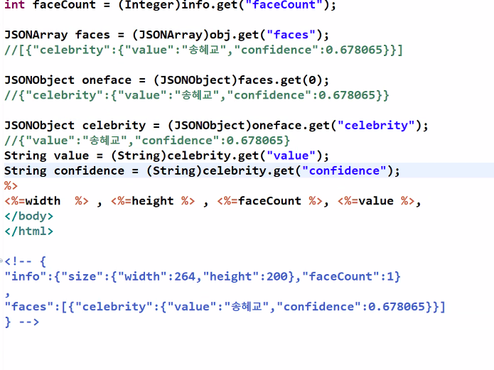
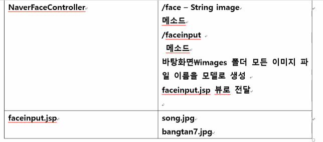
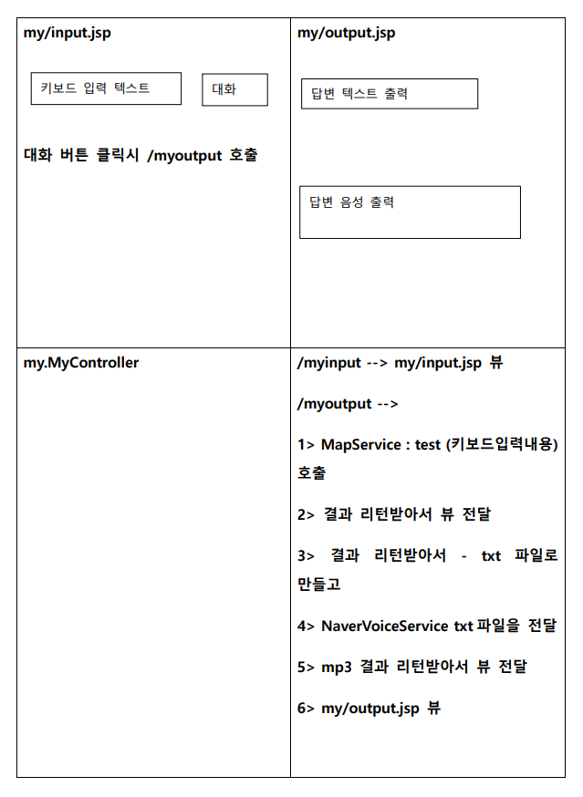
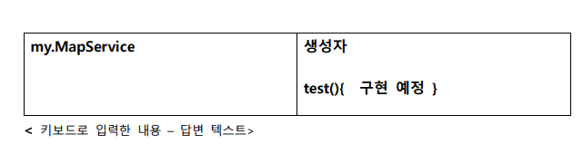

# Naver API

``` 
url : https://www.ncloud.com/nsa/kdth4
h-class16 몽환0!
```


```
kdigital
client id : 454frc6xdi
client secret : LqQmYOWxHCPdsJ1DFWhlCtKS5bmcLsCBCrgMLsak
```

* 네이버에서 제공하는 API

```java
사람1명
{
    "info":{"size":{"width":640,"height":640},
            "faceCount":1},
    "faces":[
        {"celebrity":{"value":"아이유","confidence":1.0}}
    ]
}

info변수
    info.size.width
    info.size.height
    info.faceCount
faces변수
    faces[0].celebrity
    faces[0].confience
    
사람2명
{"info":{"size":{"width":223,"height":226},"faceCount":2},"faces":[{"celebrity":{"value":"송중기","confidence":0.773768}},{"celebrity":{"value":"이연희","confidence":0.150873}}]}

사물
{"info":{"size":{"width":280,"height":180},"faceCount":0},"faces":[]}

2mb초과한 데이터
error!!!!!!! responseCode= 400
java.io.IOException: Server returned HTTP response code: 400 for URL: https://naveropenapi.apigw.ntruss.com/vision/v1/celebrity

```

* 볼 수 있는 오류

  | 오류 코드 | 오류 내용                                     |
  | --------- | --------------------------------------------- |
  | 400       | 2mb 초과 데이터<br />image파라미터 누락<br /> |
  | 401       | 접속 client key, secret 확인                  |
  | 404       | api url 확인                                  |


## 스프링부트

1. pom.xml

   jsp, jstl depencency 설정

2. application.properties

   server.port 설정

   view 위치와 확장자 설정

   DB를 사용한다면  설정

3. src/main/webapp/WEB-INF/views 폴더 생성

4. Application.java 실행해서 돌아가는지 확인

| 스프링     |                           |
| ---------- | ------------------------- |
| Controller | 요청 M-V 정의             |
| Service    | M - 1개 메소드에 1개 기능 |
| DAO        | M - DB접근하는 1개 메소드 |
| VO         |                           |
| JSP        | V                         |


| 데이터베이스가 필요없는 AI서비스 |                                                             |
| -------------------------------- | ----------------------------------------------------------- |
| NaverFaceController              | 요청 M-V정의                                                |
| NaverService 인터페이스          | APIExamFace.java에서 네이버 서버로부터 가져오는 json 데이터 |
| NaverFaceService                 |                                                             |
| JSP                              | V                                                           |

## 얼굴 인식 API 활용한 mvc

* NaveraiApplication

```java
@SpringBootApplication
@ComponentScan(basePackageClasses = NaverFaceController.class)
@ComponentScan//현재패키지 자동으로 인식해주는 거 안쓰면 숨겨져있지만 쓰는 순간 수동으로 다 해줘야됨
public class NaveraiApplication {

	public static void main(String[] args) {
		SpringApplication.run(NaveraiApplication.class, args);
		System.out.println("네이버 ai서비스 시작");
	}

}
```

* NaverFaceController

```java
@Controller
public class NaverFaceController {
	
	@Autowired
	NaverFaceService faceservice;
	
	@RequestMapping("/face") //get방식 C:/Users/Pang/Desktop/images (2)/images/ 뒤에 나오는 이미지 파일 입력
	public ModelAndView face(String image) {
		System.out.println("hi");
		ModelAndView mv = new ModelAndView();
		//NaverFaceService service = new NaverFaceService();
		String jsonModel = faceservice.test(image);
		mv.addObject("faceresult", jsonModel);
		mv.setViewName("/cfr/face");
		return mv;
	}
}
```

* NaverService.interface

```java
public interface NaverService {
	String test(String file);
}
```

* NaverFaceService

```java
@Service
public class NaverFaceService implements NaverService {

	@Override
	public String test(String file) {
        StringBuffer reqStr = new StringBuffer();
        StringBuffer response = new StringBuffer();
        String clientId = "454frc6xdi";//애플리케이션 클라이언트 아이디값";
        String clientSecret = "LqQmYOWxHCPdsJ1DFWhlCtKS5bmcLsCBCrgMLsak";//애플리케이션 클라이언트 시크릿값";
        try {
            String paramName = "image"; // 파라미터명은 image로 지정
            String imgFile = "C:/Users/Pang/Desktop/images (2)/images/" + file;
            File uploadFile = new File(imgFile);
            String apiURL = "https://naveropenapi.apigw.ntruss.com/vision/v1/celebrity"; // 유명인 얼굴 인식
            URL url = new URL(apiURL);
            HttpURLConnection con = (HttpURLConnection)url.openConnection();
            con.setUseCaches(false);
            con.setDoOutput(true);
            con.setDoInput(true);
            // multipart request
            String boundary = "---" + System.currentTimeMillis() + "---";
            con.setRequestProperty("Content-Type", "multipart/form-data; boundary=" + boundary);
            con.setRequestProperty("X-NCP-APIGW-API-KEY-ID", clientId);
            con.setRequestProperty("X-NCP-APIGW-API-KEY", clientSecret);
            OutputStream outputStream = con.getOutputStream();
            PrintWriter writer = new PrintWriter(new OutputStreamWriter(outputStream, "UTF-8"), true);
            String LINE_FEED = "\r\n";
            // file 추가
            String fileName = uploadFile.getName();
            writer.append("--" + boundary).append(LINE_FEED);
            writer.append("Content-Disposition: form-data; name=\"" + paramName + "\"; filename=\"" + fileName + "\"").append(LINE_FEED);
            writer.append("Content-Type: "  + URLConnection.guessContentTypeFromName(fileName)).append(LINE_FEED);
            writer.append(LINE_FEED);
            writer.flush();
            FileInputStream inputStream = new FileInputStream(uploadFile);
            byte[] buffer = new byte[4096];
            int bytesRead = -1;
            while ((bytesRead = inputStream.read(buffer)) != -1) {
                outputStream.write(buffer, 0, bytesRead);
            }
            outputStream.flush();
            inputStream.close();
            writer.append(LINE_FEED).flush();
            writer.append("--" + boundary + "--").append(LINE_FEED);
            writer.close();
            BufferedReader br = null;
            int responseCode = con.getResponseCode();
            if(responseCode==200) { // 정상 호출
                br = new BufferedReader(new InputStreamReader(con.getInputStream()));
            } else {  // 오류 발생
                System.out.println("error!!!!!!! responseCode= " + responseCode);
                br = new BufferedReader(new InputStreamReader(con.getInputStream()));
            }
            String inputLine;
            
            if(br != null) {
                //StringBuffer response = new StringBuffer();
                while ((inputLine = br.readLine()) != null) {
                    response.append(inputLine);
                }
                br.close();
                System.out.println(response.toString());
            } else {
                System.out.println("error !!!");
            }
        } catch (Exception e) {
            System.out.println(e);
            return e.toString();
        }
        return response.toString();
	}
```

* face.jsp

```jsp
<body>
<h4>${faceresult }</h4>
<h4><%=request.getAttribute("faceresult") %></h4>

<%
//String --> json 으로 parsing 하기
String faceresult = (String)request.getAttribute("faceresul");
JSONObject obj = new JSONObject(faceresult);
JSONObcect info = (JSONObject)obj.get("info");
JSONObject size = (JSONObeject)info.get("size");
int width = (Integet)size.get("width");
int height = (Integet)size.get("heigt");

int faceCount = (Integer)info.get("faceCount");
%>

<%=width %>, <%=hieght %>, <%=faveCountt%>
</body>
```



```xml
<!-- json parsing -->
<dependency>           
    <groupId>org.json</groupId>
    <artifactId>json</artifactId>
    <version>20201115</version>
</dependency>
```

* JSONArray
* JSONObject

{ "a" : "java", "b" : [ { "c" : "ccc", "d" : "DDD"} ] }





## 모든 이미지를 띄우고 확인

* faceinput.jsp

```jsp
<body>
<c:forEach items="${filelist }" var="onefile">
	<a href="/face?image=${onefile }"> ${onefile }</a><br>
	<br>
</c:forEach>
<%-- <a href="/face?<%=filelist.get[i]%>">"></a> --%>
</body>
```

* NaverFaceController

```java
	@RequestMapping("/faceinput")
	public ModelAndView faceinfut() {
		File f = new File("C:/Users/Pang/Desktop/images (2)/images/");
		String[] namelist = f.list(); //song.jpg 처럼 파일 이름들 가져옴 이 때 다른 폴더가있다면 조건도... jpg, tfif, png
		ModelAndView mv = new ModelAndView();
		mv.addObject("filelist", namelist);
		mv.setViewName("/cfr/faceinput");
		return mv;
	}
```


## img src를 내 컴퓨터로

* MyWebMVCConfig.java

```java
@Configuration
public class MyWebMVCConfig implements WebMvcConfigurer{

	@Override
	public void addResourceHandlers(ResourceHandlerRegistry registry) {
		registry.addResourceHandler("/naverimages/**").addResourceLocations("file:///C:/Users/Pang/Desktop/images (2)/images/");
	}	
}
```

## jstl 쓰는 경우는

* 표현태그로 쓰기 힘들때 간편하게 쓰고싶을때

```jsp
<%
if(...){
    
}
%>
    
```


```jsp
<%@taglib prefix="c" uri="http://java.sun.com/jsp/jstl/core" %>
<c:forEach items="${filelist }" var="onefile">
	<a href="/face?image=${onefile }"> ${onefile }</a><br>
	<br>
</c:forEach>
```


## 얼굴 인식 API2 활용한 mvc

```
{
"info":{"size":{"width":264,"height":200},"faceCount":1},
"faces":
[
{"roi":{"x":80,"y":45,"width":61,"height":61},
"landmark":null,
"gender":{"value":"female","confidence":0.999912},
"age":{"value":"24~28","confidence":0.856547},
"emotion":{"value":"neutral","confidence":0.999967},
"pose":{"value":"right_face","confidence":0.61542}}
]
}
```

## 좌표로 얼굴 표시

* 얼굴표시

  canvas 태그

  ```html
  <script>
  window.onload = function(){
  	var samplecanvas = document.getElementById("samplecanvas");
  	var samplecontext = samplecanvas.getContext("2d");
  	samplecontext.font="20px batang";
  	samplecontext.fillStyle="blue";
  	samplecontext.fillText("캔버스 위에 글씨를 씁니다", 100, 100);	
  	samplecontext.fillRect(200, 200, 100, 50);
  	
  	samplecontext.lineWidth = 3;
  	samplecontext.strokeStyle="green";
  	samplecontext.strokeRect(300, 300, 100, 50);
  	
  	samplecontext.beginPath();
  	//x 50 ,y 50 시작하여 x 종료지점 100, y 100
  	x=50
  	y=50
  	samplecontext.moveTo(x,y);
  	samplecontext.lineTo(x+50, y+50);
  	
  	
  	samplecontext.closePath();
  	samplecontext.lineWidth = 5;
  	samplecontext.strokeStyle='red';
  	samplecontext.stroke();
  	
  	let sampleimage = new Image();
  	sampleimage.src="http://localhost:9002/naverimages/song.jpg"
  	sampleimage.onload = function(){
  		samplecontext.drawImage(sampleimage, 0, 0, sampleimage.width, sampleimage.height );
  		let copyimage = samplecontext.getImageData(0,0, 50,50);
  		samplecontext.putImageData(copyimage, 300, 300);
  		
  		samplecontext.fillStyle = "blue";
  		samplecontext.fillRect(0,0,100,100);
  	}
  	
  }
  </script>
  </head>
  <body>
  <canvas id="samplecanvas" width="400" height="400" style="border:2px solid pink"></canvas>
  
  </body>
  ```

  face2

  ```jsp
  <%@page import="java.math.BigDecimal"%>
  <%@page import="org.json.JSONArray"%>
  <%@page import="org.json.JSONObject"%>
  <%@ page language="java" contentType="text/html; charset=UTF-8"
      pageEncoding="UTF-8"%>
  <!DOCTYPE html>
  <html>
  <head>
  <meta charset="UTF-8">
  <title>Insert title here</title>
  </head>
  <body>
  <%String image = request.getParameter("image"); %>
  <script>
  window.onload = function(){
  	var facecanvas = document.getElementById("facecanvas")
  	var facecontext = facecanvas.getContext("2d")
  	
  	let copycanvas = document.getElementById("copycanvas")
  	let copycontext = copycanvas.getContext("2d")
  		
  	let faceimage = new Image();
  	faceimage.src = "/naverimages/<%=image%>";
  	faceimage.onload =function(){
  		facecontext.drawImage(faceimage, 0, 0, faceimage.width, faceimage.height)
  		
  		<%
  		String faceresult2 = (String)request.getAttribute("faceresult2");
  		JSONObject obj = new JSONObject(faceresult2);
  		JSONArray faces = (JSONArray)obj.get("faces");
  		int a = 0;
  		for(int i = 0 ; i < faces.length() ; i++){
  			JSONObject oneface = (JSONObject)faces.get(i);
  			JSONObject roi = (JSONObject)oneface.get("roi");
  			int x = (Integer)roi.get("x");
  			int y = (Integer)roi.get("y");
  			int width = (Integer)roi.get("width");
  			int height = (Integer)roi.get("height");
  			//out.println("얼굴 위치 : (" + x + ", "+ y + ") 가로크기 : " + width + " 세로크기 : " + height + "<br>");
  			
  			JSONObject gender = (JSONObject)oneface.get("gender");
  			String gendervalue = (String)gender.get("value");
  			BigDecimal genderconfidence = (BigDecimal)gender.get("confidence");
  			
  			JSONObject age = (JSONObject)oneface.get("age");
  			String agevalue = (String)age.get("value");
  			BigDecimal ageconfidence = (BigDecimal)age.get("confidence");
  			
  			JSONObject emotion = (JSONObject)oneface.get("emotion");
  			String emovalue = (String)emotion.get("value");
  			BigDecimal emoconfidence = (BigDecimal)emotion.get("confidence");
  			
  			JSONObject pose = (JSONObject)oneface.get("pose");
  			String posevalue = (String)pose.get("value");
  			BigDecimal poseconfidence = (BigDecimal)pose.get("confidence");
  			
  			/* if(genderconfidence.doubleValue() >= 0.5 && ageconfidence.doubleValue() >= 0.5 && emoconfidence.doubleValue() >= 0.5 && poseconfidence.doubleValue() >= 0.5){
  			out.println("<h3>성별 " + gendervalue + genderconfidence); 
  			out.println("추청나이 " + agevalue + ageconfidence);
  			out.println("감정 " + emovalue + emoconfidence);
  			out.println("자세 " + posevalue + poseconfidence + "</h3>");
  			a =+ 1;
  			} */
  		%>
  			//자바스크립트 문장
  			var x = <%=x%>
  			var y = <%=y%>
  			var width = <%=width%>
  			var height = <%=height%>
  			
  			//본사진
  			facecontext.lineWidth = 3;
  			facecontext.strokeStyle = "pink"
  			facecontext.strokeRect(x, y, width, height)
  			//var(값, 선언 중복), let(같은이름변수 중복 선언 불가 for 안에 넣으면 안됨) 
  			var copyimage = facecontext.getImageData(x, y, width, height);
  			copycontext.putImageData(copyimage, x, y)
  		<%
  		}
  		//out.println("총 " + a + "명 있습니다.");
  		%>
  		
  	}
  }
  //<h4>${faceresult2 }</h4>
  
  
  
  </script>
  <canvas id="facecanvas" width=500 height=500 style="border:2px solid purple"></canvas>
  <canvas id="copycanvas" width=300 height=300 style="border:2px solid pink"></canvas>
  <%--  --%>
  </body>
  </html>
  
  ```

  

## 사물 탐지 API 활용한 mvc

```json
{
    "predictions": [{"num_detections": 6, "detection_classes": [1.0, 1.0, 1.0, 1.0, 1.0, 1.0], "detection_names": ["person", "person", "person", "person", "person", "person"],
                     "detection_scores": [0.996249, 0.9918, 0.983505, 0.982203, 0.663236, 0.518665],
                     "detection_boxes": [[0.124058, 0.0985503, 0.987019, 0.346438], 
                                         [0.210716, 0.215747, 0.995167, 0.486073], 
                                         [0.193967, 0.566847, 0.993421, 0.874073], 
                                         [0.342605, 0.439295, 0.986231, 0.638756], 
                                         [0.0406851, 0.344942, 0.431135, 0.583015],
                                         [0.0850018, 0.567567, 0.605374, 0.741739]]}]}

```

objectdection.jsp

```jsp
<body>
<!-- el json 형태 -->
${odresult }

<!-- jsp에서 string을 json변환 -->
<%-- <%
String odresult = (String)request.getAttribute("odresult");
JSONObject obj = new JSONObject(odresult);
JSONArray predictions = (JSONArray)obj.get("prideictions");

int num_detections = (Integer)predictions.get("num_detections");
for(int i = 0 ; i < num_detections ; i++){
	String detections_classes = (String)predictions.get("detection_classes");
	
}
%> --%>

<!-- java script에서 string을 json 변환 -->
<script src="/jquery-3.2.1.min.js"></script>
<script>
$(document).ready(function(){
	$("#names").text('<%=request.getAttribute("odresult")%>');
	<% String odresult = (String)request.getAttribute("odresult");
	String imagefile = request.getParameter("image");
	%>
	
	var json = JSON.parse('<%=odresult%>');
	$("#names").text(json.predictions[0].detection_names);
	for(var i = 0 ; i<json.predictions[0].num_detections ; i++){
		// json 데이터를 1. 실수로 변환 2. *100 3. 정수로 변환 4. % 5. 출력 
		$("#conf").append(parseInt(parseFloat(json.predictions[0].detection_scores[i]) * 100) + "%, ");
		//html태그, text(문자열), append(태그 이전내용추가)
	}
	
	//캔버스 이미지 표시
	let canvas = document.getElementById("objectcanvas");
	let context = canvas.getContext("2d");
	let image = new Image();
	image.src = "/naverimages/<%=imagefile%>";
	image.onload = function(){
		context.drawImage(image, 0, 0, image.width, image.height);
		var boxes = json.predictions[0].detection_boxes;
		var names = json.predictions[0].detection_names;
		for(var i = 0 ; i < json.predictions[0].num_detections ; i++){
			if(parseFloat(json.predictions[0].detection_scores[i]) >= 0.5){
				var y1 = boxes[i][0] * image.height ;
				var x1 = boxes[i][1] * image.width ;
				var x2 = boxes[i][3] * image.width ;
				var y2 = boxes[i][2] * image.height ;
				context.strokeStyle = "green";
				context.lineWidth=5;
				context.strokeRect(x1, y1, x2-x1, y2-y1)
				//사물 이름 출력				
				context.font="10px batang";
				context.fillStyle="red";
				context.fillText(names[i]+":"+parseInt(json.predictions[0].detection_scores[i]*100)+"%", x1+10, y1+10);
				//context.strokeRect(x1, y1, 100, -30);
			}
		}
	}
});

</script>

<div id="names" style="border:2px solid green"></div>
<div id="conf" style="border:2px solid blue"></div>
<canvas id="objectcanvas" width=1000 height=1000 style="border:2px solid pink"></canvas>
<!-- jsp에서 string을 json변환 -->
<%
JSONObject obj = new JSONObject(odresult);
JSONArray predictions = (JSONArray)obj.get("predictions");
JSONObject predict = (JSONObject)predictions.get(0);
out.println(predict.get("detection_names"));
%>
</body>
```


## 포즈 탐지 API 활용한 mvc

```json
{ "predictions": [ { "0": { "score": 0.8925939202308655, "x": 0.41935483870967744, "y": 0.19014084507042253 }, "1": { "score": 0.8796489834785461, "x": 0.49193548387096775, "y": 0.2676056338028169 }, "2": { "score": 0.7281489372253418, "x": 0.45161290322580644, "y": 0.2746478873239437 }, "3": { "score": 0.8822159171104431, "x": 0.3387096774193548, "y": 0.31690140845070425 }, "4": { "score": 0.7332707047462463, "x": 0.3225806451612903, "y": 0.22535211267605634 }, "5": { "score": 0.7157197594642639, "x": 0.532258064516129, "y": 0.2535211267605634 }, "6": { "score": 0.8861460089683533, "x": 0.6532258064516129, "y": 0.3028169014084507 }, "7": { "score": 0.7167596817016602, "x": 0.7419354838709677, "y": 0.39436619718309857 }, "8": { "score": 0.5962599515914917, "x": 0.5806451612903226, "y": 0.5 }, "9": { "score": 0.7547611594200134, "x": 0.6854838709677419, "y": 0.6830985915492958 }, "10": { "score": 0.7340120077133179, "x": 0.8548387096774194, "y": 0.823943661971831 }, "11": { "score": 0.5576349496841431, "x": 0.5483870967741935, "y": 0.49295774647887325 }, "12": { "score": 0.8563839197158813, "x": 0.3225806451612903, "y": 0.528169014084507 }, "13": { "score": 0.8043299913406372, "x": 0.3951612903225806, "y": 0.7253521126760564 }, "15": { "score": 0.8117127418518066, "x": 0.43548387096774194, "y": 0.16901408450704225 }, "17": { "score": 0.899573028087616, "x": 0.49193548387096775, "y": 0.176056338028169 } } ]}
```

```jsp
<body>
<!-- el json 형태 -->
${poseresult }


<% 
String poseresult = (String)request.getAttribute("poseresult");
String image = request.getParameter("image");

%>
<!-- java script에서 string을 json 변환 -->
<script src="/jquery-3.2.1.min.js"></script>
<script>
$(document).ready(function(){
	$('#result').text('<%=poseresult%>');
	var json = JSON.parse('<%=poseresult%>');
	
	var posecanvas = document.getElementById("posecanvas");
	var posecontext = posecanvas.getContext("2d");
	posecontext.fillStyle = "red";
	posecontext.font = "15px batang";

	
	var image = new Image();
	image.src="/naverimages/<%=image%>";
	
	image.onload = function(){
		posecanvas.width = image.width;
		posecanvas.height = image.height;
		posecontext.drawImage(image, 0, 0, image.width, image.height);
		
		var poseinforms=['','']
		for(var i = 0  ; i < json.predictions.length ; i++){
			var oneperson = json.predictions[i];
			//for(var j = 0 ; j < oneperson.length ; j++){
				for(var j in oneperson){
				var body = oneperson[j]
				var x = body.x * image.width
				var y = body.y * image.height
				posecontext.fillText(j+"번", x, y);//0~17 (0:코) 
				//posecontext.fillText(poseinforms[j], x, y)
				
				
			}
		}
	}
});

</script>

<div id="result" style="border:2px solid green"></div>
<canvas id="posecanvas" width=1000 height=1000 style="border:2px solid pink"></canvas>
<!-- jsp에서 string을 json변환 -->

</body>
```


## STT API 활용한 mvc


* speechinput.jsp

  ```jsp
  <% 
  String languages[] = {"Kor", "Jpn", "Chn", "Eng"};
  String languagenames[] = {"한국어", "일본어", "중국어", "영어"};
  %>
  <form action="/speech">
  	언어 선택 : <br>
  	<%for(int i = 0 ; i < languages.length ; i++) {%>
  		<input type=radio name="lang" value=<%=languages[i] %> > <%=languagenames[i] %>
  	<%} %>
  	<select name="image">
  		<%
  		String[] filelist = (String[])request.getAttribute("filelist");
  		//mp3만 출력
  		for(int i = 0 ; i < filelist.length ; i++){
  			String onefile = filelist[i];
  			String[] onefile_split = onefile.split("[.]"); // "."=>모든 1글자 가능이란 의미를 내포해서 [.]로 표현해야함
  			String fileext = onefile_split[onefile_split.length - 1];
  			if(fileext.equals("mp3")){
  		%>	
  				<option value="<%=onefile %>"> <%=onefile %></option>
  			<%}
  		} %>
  	</select>
  	<input type=submit value="텍스트로 변환">
  </form> 
  ```

* speech.jsp

  ```jsp
  <body>
  <div id="result">${speechresult }</div>
  <audio src="/naverimages/${param.image }" controls="controls"></audio>
  </body>
  ```

* NaverSpeechService

  ```java
  @Service
  public class NaverSpeechService implements NaverService {
         
  	@Override
  	public String test(String file) {
  		return test(file, "Kor");
  	}
  	public String test(String file, String language) {
  		StringBuffer response = new StringBuffer();
          
  //language를 받아서 api에서 쓰기 위해... 
  ```

* NaverSpeechController

  ```java
  @Controller
  public class NaverSpeechController {
  	
  	@Autowired
  	NaverSpeechService speechservice;
  	
  	@RequestMapping("/speech")
  	public ModelAndView face(String image, String lang) {
  		
  		String jsonModel = "";
  		if(lang ==null) {
  			jsonModel = speechservice.test(image);
  		}
  		else {
  			jsonModel = speechservice.test(image, lang);
  		}
  		ModelAndView mv = new ModelAndView();
  		mv.addObject("speechresult", jsonModel);
  		mv.setViewName("/stt_csr/speech");
  		return mv;
  	}
  	
  	@RequestMapping("/speechinput")
  	public ModelAndView faceinfut() {
  		File f = new File("C:/Users/Pang/Desktop/images (2)/images");
  		String[] namelist = f.list(); //song.jpg 처럼 파일 이름들 가져옴 이 때 다른 폴더가있다면 조건도... jpg, tfif, png
  		ModelAndView mv = new ModelAndView();
  		mv.addObject("filelist", namelist);
  		mv.setViewName("/stt_csr/speechinput");
  		return mv;
  	}
  }
  ```

### 파일 저장 

* 파일 저장(NaverSpeechController)

  ```java
  		//json내용 뽑아내기
  		JSONObject obj = new JSONObject(jsonModel);
  		String text = (String)obj.get("text");
  		
  		//Calendar cal = Calendar.getInstance();
  		//SimpleDateFormat sdf = new SimpleDateFormat("YYYYMMddHH:mm:ss");
  		//String date = sdf.format(cal.getTime());
  		//File f = new File("C:/Users/Pang/Desktop/images (2)/images/"+ date.substring(0, 8) +".txt");
  		//FileWriter fw = new FileWriter(f);
  		
  		SimpleDateFormat sdf = new SimpleDateFormat("YYYYMMddHHmmss");
  		String date = sdf.format(new Date());
  		FileWriter fw = new FileWriter("C:/Users/Pang/Desktop/images (2)/images/"+ date +".txt", true);
  		fw.write(text);
  		fw.close();
  ```

  

* text는 FileWriter mp3는 binary이므로 FileOutputStream

  ```java
  InputStream is = con.getInputStream();
  int read = 0;
  byte[] bytes = new byte[1024];
  // 랜덤한 이름으로 mp3 파일 생성
  String tempname = Long.valueOf(new Date().getTime()).toString();
  File f = new File(tempname + ".mp3");
  f.createNewFile();
  OutputStream outputStream = new FileOutputStream(f);
  while ((read =is.read(bytes)) != -1) {
      outputStream.write(bytes, 0, read);
  }
  is.close();
  ```

  

## TTS API 활용한 mvc

* voice.jsp

  ```jsp
  <body>
  <%=request.getAttribute("voiceresult") %>
  실행되었습니다.
  <audio src="/naverimages/<%=request.getAttribute("voiceresult") %>" controls="controls" ></audio>
  
  </body>
  ```

  

* voiceinput.jsp

  ```jsp
  <body>
  <% 
  String speakers[] = {"mijin", "jinho", "clara", "matt", "shinji", "meimei", "liangliang", "jose", "carmen", "nnaomi",
  		"nhajun", "ndain"};
  String speakerinforms[] = {
  		"미진 : 한국어, 여성 음색", 
  		"진호 : 한국어, 남성 음색",
  		"클라라 : 영어, 여성 음색",
  		"매트 : 영어, 남성 음색",
  		"신지 : 일본어, 남성 음색",
  		"메이메이 : 중국어, 여성 음색",
  		"량량 : 중국어, 남성 음색",
  		"호세 : 스페인어, 남성 음색",
  		"카르멘 : 스페인어, 여성 음색",
  		"나오미 : 일본어, 여성 음색",
  		"하준 : 한국어, 아동 음색(남)",
  		"다인 : 한국어, 아동 음색(여)",
  		};
  %>
  <form action="/voice">
  	언어 선택 : <br>
  	<%for(int i = 0 ; i < speakers.length ; i++) {%>
  		<input type=radio name="speaker" value=<%=speakers[i] %> > <%=speakerinforms[i] %><br>
  	<%} %>
  	<select name="text">
  		<%
  		String[] filelist = (String[])request.getAttribute("filelist");
  		//txt만 출력
  		for(int i = 0 ; i < filelist.length ; i++){
  			String onefile = filelist[i];
  			String[] onefile_split = onefile.split("[.]"); // "."=>모든 1글자 가능이란 의미를 내포해서 [.]로 표현해야함
  			String fileext = onefile_split[onefile_split.length - 1];
  			if(fileext.equals("txt")){
  		%>	
  				<option value="<%=onefile %>"> <%=onefile %></option>
  			<%}
  		} %>
  	</select>
  	<input type=submit value="음성으로 변환">
  </form> 
  </body>
  ```

  

* NaverVoiceService

  ```java
  @Service
  public class NaverVoiceService implements NaverService {
         
  	@Override
  	public String test(String file) {
  		return test(file, "mijin");
  	}
  	public String test(String file, String speaker) {
  	    	String clientId = "1ha8ur3dox";//애플리케이션 클라이언트 아이디값";
  	        String clientSecret = "jp0VCunkagZpYP8S9esAMFJIYQxnA5NtX17ft61A";//애플리케이션 클라이언트 시크릿값";
  	        String filename = "";
  	        StringBuffer response = new StringBuffer();
  	        try {
  	            
  	            String text = "";
  	            String textfile = "C:/Users/Pang/Desktop/images (2)/images/" + file;
  	            FileReader fr = new FileReader(textfile);
  	            //fr.read(); 1글자씩 읽어줌
  	            Scanner sfr = new Scanner(fr);
  	            while(sfr.hasNextLine() == true) {
  	            	text += sfr.nextLine(); //1줄 읽고 text에 저장
  	            	
  	            }
  	            text = URLEncoder.encode(text, "UTF-8"); // 13자
  	            
  	            String apiURL = "https://naveropenapi.apigw.ntruss.com/tts-premium/v1/tts";
  	            URL url = new URL(apiURL);
  	            HttpURLConnection con = (HttpURLConnection)url.openConnection();
  	            con.setRequestMethod("POST");
  	            con.setRequestProperty("X-NCP-APIGW-API-KEY-ID", clientId);
  	            con.setRequestProperty("X-NCP-APIGW-API-KEY", clientSecret);
  	            // post request
  	            String postParams = "speaker=" + speaker + "&volume=0&speed=0&pitch=0&format=mp3&text=" + text;
  	            con.setDoOutput(true);
  	            DataOutputStream wr = new DataOutputStream(con.getOutputStream());
  	            wr.writeBytes(postParams);
  	            wr.flush();
  	            wr.close();
  	            int responseCode = con.getResponseCode();
  	            BufferedReader br;
  	            if(responseCode==200) { // 정상 호출
  	                InputStream is = con.getInputStream();
  	                int read = 0;
  	                byte[] bytes = new byte[1024];
  	                // 랜덤한 이름으로 mp3 파일 생성
  	               // String tempname = Long.valueOf(new Date().getTime()).toString();
  	        		SimpleDateFormat sdf = new SimpleDateFormat("YYYYMMddHHmmss");
  	        		String tempname = sdf.format(new Date());
  	        		
  	                File f = new File("C:/Users/Pang/Desktop/images (2)/images/" + tempname + ".mp3");
  	                filename = tempname + ".mp3";
  	                f.createNewFile();
  	                OutputStream outputStream = new FileOutputStream(f);
  	                while ((read =is.read(bytes)) != -1) {
  	                    outputStream.write(bytes, 0, read);
  	                }
  	                is.close();
  	            } else {  // 오류 발생
  	                br = new BufferedReader(new InputStreamReader(con.getErrorStream()));
  	                String inputLine;
  	                
  	                while ((inputLine = br.readLine()) != null) {
  	                    response.append(inputLine);
  	                }
  	                br.close();
  	                System.out.println(response.toString());
  	            }
  	        } catch (Exception e) {
  	            System.out.println(e);
  	            return filename;
  	        }
  	        return filename;
  	    }
  	}
  ```

  

* NaverVoiceController

  ```java
  @Controller
  public class NaverVoiceController {
  	
  	@Autowired
  	NaverVoiceService voiceservice;
  	
  	@RequestMapping("/voice")
  	public ModelAndView face(String text, String speaker) throws Exception {
  		
  		String jsonModel = "";
  		
  		if(speaker ==null) {
  			jsonModel = voiceservice.test(text); 
  		} 
  		else { 
  			jsonModel = voiceservice.test(text, speaker); 
  		}
  		
  		ModelAndView mv = new ModelAndView();
  		mv.addObject("voiceresult", jsonModel);
  		mv.setViewName("/tts_voice/voice");
  		return mv;
  	}
  	
  	@RequestMapping("/voiceinput")
  	public ModelAndView faceinfut() {
  		File f = new File("C:/Users/Pang/Desktop/images (2)/images");
  		String[] namelist = f.list(); //song.jpg 처럼 파일 이름들 가져옴 이 때 다른 폴더가있다면 조건도... jpg, tfif, png
  		ModelAndView mv = new ModelAndView();
  		mv.addObject("filelist", namelist);
  		mv.setViewName("/tts_voice/voiceinput");
  		return mv;
  	}
  }
  ```

  

## 실습




