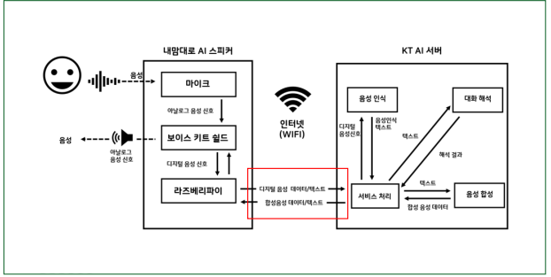

## 4차 산업혃명

IOT 빅데이터 인공지능으로 함축할 수 있음

## AMK

스피커 + 라즈비언(라즈베리파이 소형컴퓨터)

username - pi  password - raspberry

노트북 - 스프링서버 - 웹브라우저 - http://localhost/...

노트북 - 스프링서버 - amk - http://노트북 ip주소:port/file

노트북 ipconfig하면 ip주소가 192.168.137.1 // 모바일핫스팟 ip주소 192.168.137.49

home/pi/downloads/clientkey.json

이걸 user_auth.py 에 clientKey, id, url 복붙

터미널

pwd : 현재 폴더 경로

ls : 현재 디렉토리 안에 폴더

cd : 현재 디렉토리 안에 폴더로 이동

python3 ex1.py : python3폴더안에 ex1.py 실행

mkdir : 새로운 디렉토리 만듦

rm 파일/ rm -r 폴더 : 파일 또는 폴더 삭제

cp 원본 / 변경 : 파일 복사

* 1번째 예제 ex1_kwstest.py

  기가지니 호출어 듣고 => kt 서버에서 음성=>텍스트 변환=>벨소리로 반응

* 2번째 예제 ex2

  sound to text (STT)

* 3번째 예제, 4번째 예제

  text to sound (TTS)

  터미널에서 aplay testtts.wav로 파일 재생

* 5번째 예제, 6번째 예제

  문자로 질문하면 문자로 답변

  음성으로 질문하면 텍스트로 답변

* 7번째 예제, 8번째 예제

  기가지니로 호출하고 음성을 텍스트로 변환

  기가지니로 호출하고 음성 질문을 텍스트 답변

* 9번째 예제

  버튼 누르고 음성 질문을 텍스트로 답변

* 