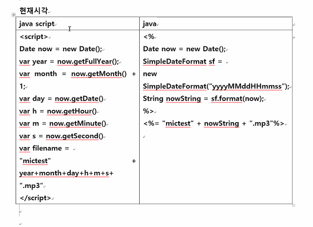

## 카메라 녹음기 웹

0. 웹브라우저에서 카메라 허용

1. 컴퓨터 하드웨어 표현 자바스크립트 객체

2. 사진 촬영 버튼 누르면 사진 저장

3. 바이너리 대용량 데이터 = BLOB - binary large object

미리보기 화면 - 렌즈

미리보기 화면 - video 태그

video 내부 이미지 캡쳐 canvas 태그에 그림

canvas 내부 이미리를 파일로 저장


```html
<body>
<canvas id="camera-output"></canvas>
<video id="camera-view" autoplay playsinline></video>
<button id="camera-btn">사진 촬영</button>
<!-- <a href="blob url"> 파일로 저장</a> -->
<a id="camera-save"></a>
<script>
//dom객체
var cameraOutput = document.getElementById("camera-output");
var cameraView = document.getElementById("camera-view");
var cameraBtn = document.getElementById("camera-btn");
var cameraSave = document.getElementById("camera-save");

var constraints = {video : {facingMode : "user"}, audio:false}
window.onload = cameraStart();

function cameraStart(){
	navigator.mediaDevices.getUserMedia(constraints)
	.then(function(stream){ cameraView.srcObject = stream; })
	.catch(function(err){ console.log("카메라에 문제가 있습니다.", err); }) //then이 시작되지 않았을 때 예외처리
	}

cameraBtn.onclick = function(){
	cameraOutput.width = cameraView.videoWidth;
	cameraOutput.height = cameraView.videoHeight;
	var cameraContext = cameraOutput.getContext("2d");//붓임
	cameraContext.drawImage(cameraView, 0, 0);//cameraView 내용을 그려라
	// 이미지 데이터 = blob 내장객체 ==> blob을 url 형태 변환 ==>파일 형태 저장 변경(image/png)
	// 음성 데이터 = blob 내장객체 ==> blob을 url 형태 변환 ==>파일 형태 저장 변경(audio/mp3)
	
	cameraOutput.toBlob(function(blob){
		var imageURL = URL.createObjectURL(blob);
		console.log(imageURL);
		cameraSave.href=imageURL;
		cameraSave.innerHTML = "png파일로저장"
		cameraSave.download = "mypic.png";//a태그 링크를 클릭하면 href내용을 다운로드하고 파일 형태로 얻음
	});//blob을 파일 형태로 저장
}
</script>
</body>
```


## 녹음기 웹

1. 컴퓨터 하드웨어 표현 자바스크립트 객체

2. 녹음시작 - 녹음시작 동작 - 저장, 녹음정지 - 녹음정지동작 - 저장 종료 - 파일로 저장 업로드

3. 바이너리 대용량 데이터 = BLOB - binary large object

```html
<body>
   <button id="record">녹음</button>
    <button id="stop">정지</button>
    <div id="sound-clips"></div>
    <script>
        const record = document.getElementById("record")
        const stop = document.getElementById("stop")
        const soundClips = document.getElementById("sound-clips")

        if (navigator.mediaDevices) {
           console.log('getUserMedia supported.')
            const constraints = { audio: true } //녹음기를 사용하겠다
            
       let chunks = []
       navigator.mediaDevices.getUserMedia(constraints)
           .then(function(stream) {
               const mediaRecorder = new MediaRecorder(stream)//녹음기
               record.onclick = function() {//녹음 버튼 클릭시에
                   mediaRecorder.start()// 음성 녹음 시작하라
                   console.log(mediaRecorder.state)
                   console.log("recorder started")
                   record.style.background = "red"
                   record.style.color = "black"
               }//record.onclick
               
               stop.onclick = function() {//정지 버튼 클릭시에
                   mediaRecorder.stop()//녹음 정지시켜라
                   console.log(mediaRecorder.state)
                   console.log("recorder stopped")
                   record.style.background = ""
                   record.style.color = ""
               }//stop.onclick
             
             //녹음 시작시킨 상태가 되면 chunks에 녹음 데이터를 저장하라 
             mediaRecorder.ondataavailable = function(e) {
               chunks.push(e.data)
             }  
               
			//녹음 정지시킨 상태가 되면 실행하라
            mediaRecorder.onstop = function(e) {
              console.log("data available after MediaRecorder.stop() called.")
	
               //1. audio 태그 재생한다 녹음내용 확인 
			   var audio = document.createElement('audio')//<audio src="mp파일명" 
			   audio.setAttribute("controls", '');
               audio.controls = true;
               soundClips.appendChild(audio);  //div 태그 내부 audio 태그 추가한다
               
               //2. chunk 배열에 녹음 내용이 들어가 있다. blob데이터를 가져온다
               const blob = new Blob(chunks, {'type' : "audio/mp3"});
               //3. url 만든다
               var mp3URL = URL.createObjectURL(blob);
               audio.src= mp3URL;
               
               //4. 다음 녹음을 위해 chunks 비워둔다
               chunks = []; //리셋해줘야 전 꺼 안 가져옴
               //5. 파일 저장한다
			   var a = document.createElement('a')//<audio src="mp파일명" 
			   soundClips.appendChild(a); //div 태그 내부 audio 태그 추가한다 다음에 a태그 추가한다
			  
			   a.href=mp3URL;
			   a.innerHTML = "MP3파일로 저장";
			   a.download = "mictest.mp3";
               
			   //6. 스프링 서버로 업로드
			   
            }//mediaRecorder.onstop
               
           })//then 
           .catch(function(err) {
               console.log('The following error occurred: ' + err)
           })
 	}
	</script>
</body>
```


## 파일에 시간 넣기



```html
    <script>
        var now = new Date();
        var year = now.getFullYear();
        var month = now.getMonth() + 1;
        var day = now.getDate(); //=> 1=>01 ('0'+naw.getDate()).slice(-2) 오른쪽부터 2자리 01
        var h = now.getHours();
        var m = now.getMinutes();
        var dateString = year +""+ month +""+ day +""+ h +""+ m;

        a.download = "mictest" + dateString + ".mp3";
	</script>
```

