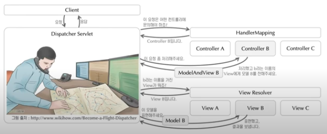

# Spring MVC 구조

* DispatcherServlet은 Spring MVC의 핵심으로써, 프론트 컨트롤러 역할을 담당한다
* 클라이언트의 요청을 받아 응답하는 과정 속에서 담당할 대상을 선택하고 역할을 분배하는 등의 작업을 수행한다.

**일반적인 Spring MVC 모습**

1. 클라이언트로부터 요청을 받으면 `Dispatcher Servlet`은 HandlerMapping 기법을 통해 어떤 Controller에게 사용자의 요청을 위임해야 할지를 판단해서 해당 Controller에게 그 요청을 위임한다.
   * HandlerMapping기법은 컨트롤러에 작성하는 `@RequestMapping`, `@PostMapping` 등을 확인해서 어떤 Controller가 적합한지 판단하는 기법이다.
2. Controller는 요청에 대해 처리한 결과인 `ModelAndView`를 `View`에게 전해달라고 `Dispatcher Servlet`에게 다시 보낸다.
3. Controller로부터 요청을 받으면 `Dispatcher Servlet`는 View Resolver를 통해 적합한 `View`를 찾아서 `Model`을 표현해달라고 보낸다.
4. `View`는 그 결과물인 JSP를 `Dispatcher Servlet`에게 보낸다.
5. 그 결과물을 클라이언트에게 보낸다.

**RESTful API 모습**

위 Spring MVC 과정에서 Controller의 응답으로 `ModelAndView`를 받지 않고 JSON 형태로 클라이언트에게 응답을 해주는 것이다.