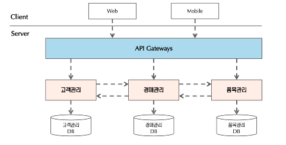

## 자바를 쓰는 이유 PHP에서 자바로 바꿔야 하는 이유

* 대용량 트래픽을 처리하기 위한 언어로 자바가 있다.
* 국내에 자바를 사용할 줄 아는 개발자가 많다.

## 마이크로서비스 아키텍처?

* 어느 한 서비스가 다운되면 그 서비스만 다운되어야 하는데 전체 서비스가 다운되어버리니 문제가 심각
* 대용량 트래픽 대응하기 위한 방법

기존 대규모 애플리케이션을 개발하는 방식이 하나의 애플리케이션의 개발 형태였다면 마이크로서비스는 소규모의 독립적인 구성요소로 구분하여 개발하는 방식이다.

하나의 마이크로서비스는 독립적으로 디자인, 개발, 배치, 관리되는 잘 정의된 비즈니스 기능을 제공합니다.

* 근래의 애플리케이션은 규모가 크고 내용이 복잡하기 때문에 어느 한 개인이 전체를 이해하고 개발할 수 없다.
* 개발에 참여하는 개발자들은 개발하고자 하는 서비스를 이해하고 개발할 수 있도록 모듈 단위로 분해하며 마이크로서비스 아키텍처는 서비스 단위로 모듈을 구분한다.

즉, 여러 기능(구매, 고객관리, 품목관리 등)들이 기능 하나하나 분리되어서 각 팀에서 관리하는 모습.

클라우드 네이티브한 상황에서(개별 환경에서) 각 기능들마다 서버를 가지고 돌아간다.

