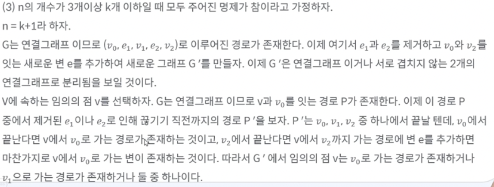
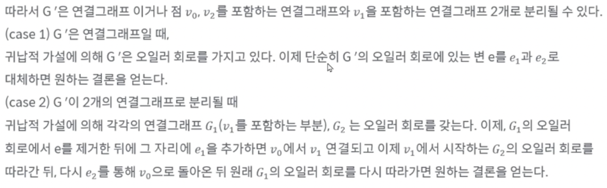

# 그래프론

## 그래프

* 그래프란 점(node)의 집합 V와 변(edge)의 집합 E로 이루어진 구조.

* G = (V, E)

  V = {a, b, c, d, e}

  E = {{a, b}, {a, d}, {a, e}, {c, d}}

* 노드와 변에서 말하는 인접(Adjacent), 근접(Incident)

  * 노드 u와 v를 연결한 변 e가 있을 때
  * 인접 : 노드 u와 v는 서로 인접해있다.
  * 근접 : 변 e는 노드 u와 v에 근접해있다.

## 예외사항들

* 루프 : 자기 자신과 인접한 경우.
* 다중 그래프 : 두 점 사이에 모서리가 여러 개 있는 그래프

=> 두 사항의 경우는 없다고 치고 하자

## 특수한 그래프

* 방향 그래프 : 변에 방향성이 있는 그래프
* 가중치 그래프 : 각 변드렝 가중치가 부여된 그래프

## 차수

* 차수 : 점 v에 근접하는 변의 개수
* 방향 그래프에서는 외차수, 내차수로 나뉨
  * 외차수 : 점 v를 출발점으로 하는 변의 수
  * 내차수 : 점 v를 도착점으로 하는 변의 수

## 길과 경로

* 길 : v0와 vn 간의 길이가 n인 길이란? n + 1개의 점들과 그 사이를 잇는 n개의 변들을 교대로 나타낸 것
* 경로 : 길이면서 같은 같은 변을 두 번 이상 포함하지 않는 길
* 회로 : 한 점에서 출발하여 자기 자신으로 돌아오는 경로

## 그래프의 종류

* 연결 그래프 : 임의의 점 사이에 경로가 있는 그래프

* 완전 그래프 : 모든 점 사이의 변이 모두 있는 그래프

* 이분 그래프 : 한 그래프에서 점들의 집합 V가 두 개의 집합으로 분리되며(V1과 V2의 교집합은 공집합, V1과 V2의 합칩합은 V), 그래프의 모든 변들은 V1의 점 하나와 V2의 점 하나로 이루어진 그래프

* 완전 이분 그래프 : 이분 그래프 이면서, V1 집합과 V2 집합이  모두 서로 연결되어 있는 그래프

  

  

## 부분 그래프

* 부분 그래프 : 한 그래프에서 부분만 뗀 그래프
* 오일러 경로 : 그래프의 모든 모서리를 꼭 한 번씩만 지나는 경로(한 붓 그리기)
* 오일러 회로 : 점 v에서 시작해서 모든 모서리를 꼭 한 번씩만 지나 v로 돌아오는 회로

## 오일러 회로

* 정리

  연결 그래프에서 오일러 회로를 가질 필요충분 조건은 모든 차수가 짝수인 것이다.

* 증명

  오일러 회로를 가질 때 모든 차수가 짝수임을 보이자

  각 점은 들어오는 변과 나가는 변이 있다.

  그래프 G의 변의 개수 n에 대한 수학적 귀납법을 이용하자

  1. n = 0

     점 하나

  2. n = 1

     변이 하나면 오일러 회로가 불가능

  3. n = 3

     변이 3개이고, 모든 차수가 짝수이려면 다음과 같은 경우밖에 없다. 따라서 성립

     

     

     

## 해밀턴 회로

* 정의

  그래프의 모든 점을 꼭 한 번씩만 지나는 회로

* 외판원 문제

  * 가중치 그래프의 해밀턴 회로 중에서 가장 가중치의 합이 작은 회로를 찾는 문제

* VRP(Vehicle Routing Problem)

  * 외판원 문제인데, 가중치 그래프에서 시간도 있고, 그래프를 도는데 여러명이 돌음. 효율적인 배송 방법을 찾는 문제

## 그래프 알고리즘

* 그래프는 노드와 엣지로 이루어져 있다.

  수학에서는 노드의 집합, 엣지의 집합이라고 표현하면 끝이나, 컴퓨터에서 집합을 설정할 때 표현하기 어렵다.

* 그래프를 표현하는 방법

  * 인접 리스트

    * 각 점에 인접하는 점들을 리스트로 표현

    * 컴퓨터에서 많이 쓰는 표현법

      | 노드 | 엣지 |
      | ---- | ---- |
      | A    | B, C |
      | B    | A, D |
      | C    | A, D |
      | D    | B, C |

      

  * 인접 행렬

    * 각 점들에서 해당하는 엣지가 있으면 1, 그렇지 않을 경우 0으로 표현해서 n X n 행렬로 나타내는 방법

    * 수학적으로 많이 쓰는 표현법

      |      | A    | B    | C    | D    |
      | ---- | ---- | ---- | ---- | ---- |
      | A    | 0    | 1    | 1    | 0    |
      | B    | 1    | 0    | 0    | 1    |
      | C    | 1    | 0    | 0    | 1    |
      | D    | 0    | 1    | 1    | 0    |

      
