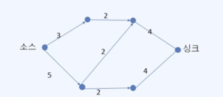
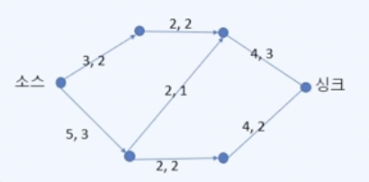
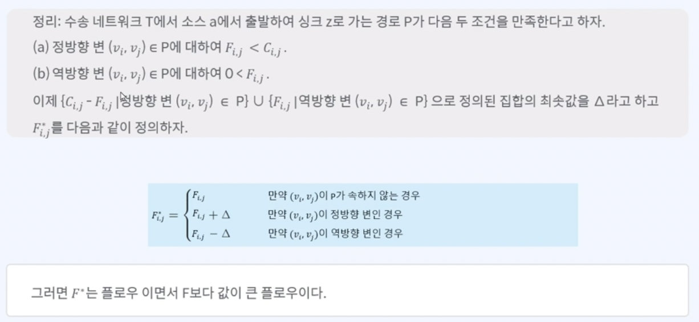
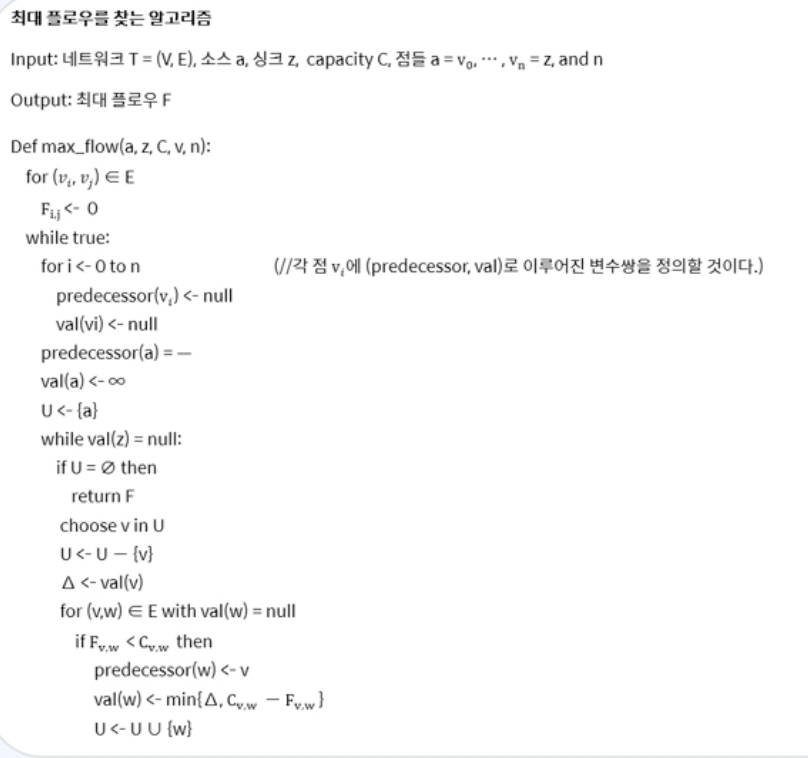
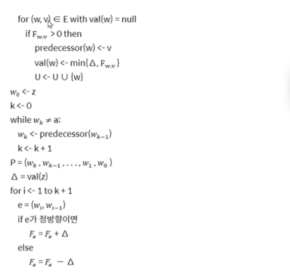
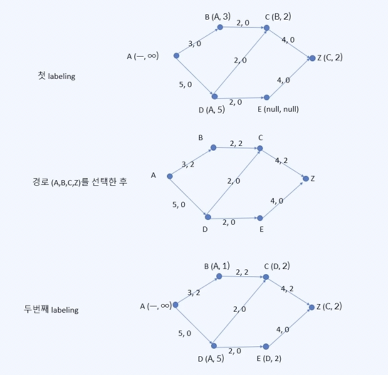

# 네트워크 모델

* 수송 네트워크

  * 가중치, 방향 그래프이면서 다음의 성질들을 만족하는 그래프이다.

  

  1. 소스라 불리는 점이 존재하여 여기로 도착하는 변은 존재하지 않는다.

  2. 싱크라 불리는 점이 존재하여 여기서 출발하는 변은 존재하지 않는다.

  3. 변 $(v_i, v_j)$에 해당되는 가중치 $C_(i,j)$ 는 $(v_i, v_j)$의 capacity라 불리우며 음이 아닌 실수이다.

     

* 정의: 플로우

  * G는 수송 네트워크이고, $C_(i,j)$ 는 $(v_i, v_j)$의 capacity(최대치)라 하자. 플로우 F란 $(v_i, v_j)$에 대응되는 음 아닌 실수로 다음을 만족하는 것이다.

  

  1. $F_(i,j)$ ≤ $C(i,j)$
  2. 소스도 싱크도 아닌 각각의 점 $v_i$에 대하여 $v_i$로 들어오는 플로우와 $v_i$에서 나가는 flow의 총합은 같다.

## 네트워크 모델 알고리즘

* 정의: 최대 플로우
  * 수송 네트워크 G에서 플로우 중에서 최댓값을 가지는 플로우 F를 최대 플로우라 한다.

* 정리: 

* 위 정리를 이용해 최대 플로우를 찾는 알고리즘

  

  
