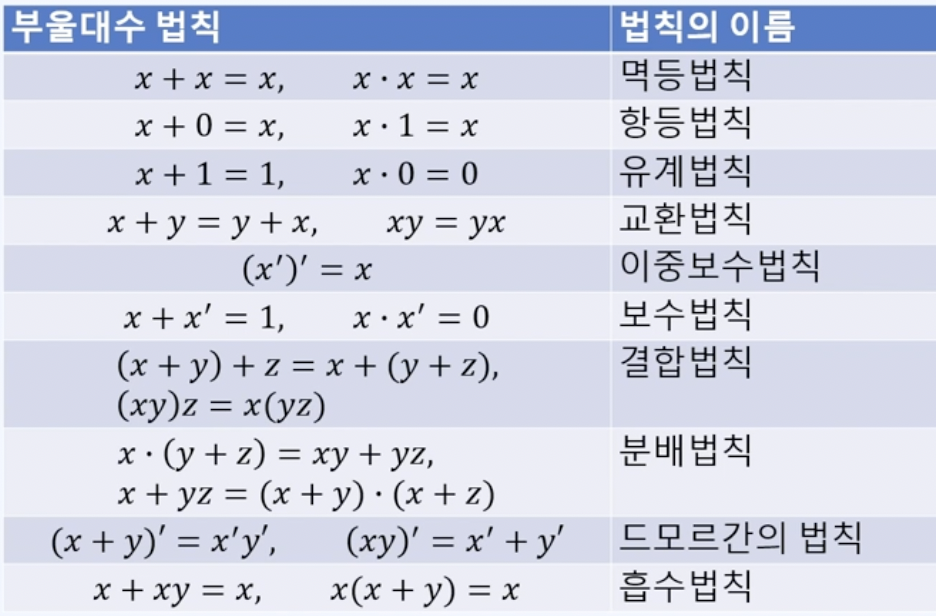
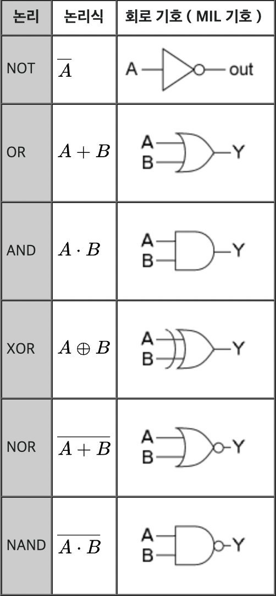
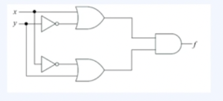
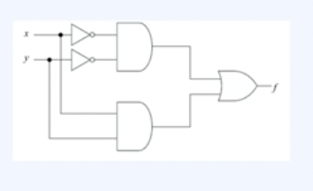

# 부울대수와 조합논리

* 부울 대수(Boolean Algebra)
  * 0 또는 1을 입력받아 0또는 1을 출력하는 회로의 논리 계산을 형식화한 것
* 부울 값
  * 0 또는 1의 값
* 부울 변수
  * 부울 값 0 또는 1을 받는 변수
* 부울 함수
  * n개의 부울 변수와 부울 연산자로 구성되는 식

* 부울 보수
  * 부울 변수의 값을 반전시키는 연산자
  * 부울 합(or): 변수 값을 더하는 연산자, 둘 중 하나라도 1이면 결과가 1 둘 다 0이면 결과가 0
  * 부울 곱(and): 변수 값을 곲하는 연산자, 둘 모두 1이면 결과가 1 아니면 결과가 0

* 드모르간의 법칙

| x    | y    | (x + y)' | x'y' |
| ---- | ---- | -------- | ---- |
| 0    | 1    | 0        | 0    |
| 0    | 0    | 1        | 1    |
| 1    | 1    | 0        | 0    |
| 1    | 0    | 0        | 0    |

| x    | y    | (xy)' | x' + y' |
| ---- | ---- | ----- | ------- |
| 0    | 1    | 1     | 1       |
| 0    | 0    | 1     | 1       |
| 1    | 1    | 0     | 0       |
| 1    | 0    | 1     | 1       |

## 논리 게이트

* 논리 게이트
  * 부울 대수를 물리적 장치로 구현하기 위해 사용하는 기호

* NOT 게이트: 부울 변수를 입력받아 보수를 출력함
* AND 게이트: 두 개의 입력을 받아 부울곱 연산 후 하나의 출력을 낸다.
* OR 게이트: 두 개의 입력을 받아 하나의 출력을 낸다.
* NAND 게이트: 두 개의 입력을 받아 부울 곱 연산 후 부울 보수한 결과를 출력
* NOR 게이트: 두 개의 입력을 받아 부울 합 연산 후 부울보수한 결과를 출력
* XOR 게이트: A'B + AB' // A와 B가 서로 다르면 1 같으면 0

* 문제) $f(x, y) = (x + y')(x' + y)$

1. 논리 회로로 주어진 부울 함수를 나타내라

1. 부울 대수법칙을 이용해 간략화하고 그 결과를 논리회로로 나타내라

   $f(x, y) = xy + x'y'$

