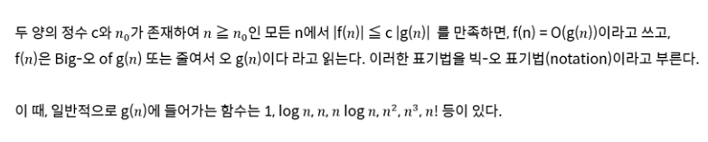

# 알고리즘

## 알고리즘이란?

* 주어진 문제에 대해 그 문제를 해결하기 위한 방법을 순차적으로 나열한 것

## 알고리즘 분석  기준

1. 정확도 (값이 얼마나 정확한가?)
2. 코드 복잡도 (코드가 인간이 보기에 얼마나 복잡하게 쓰여 있는가?)
3. 공간 복잡도 (RAM, 하드디스크 등의 하드웨어를 얼마나 사용하는가?)
4. 시간 복잡도 (주어진 입력자료에 대해 실행시간이 얼마나 긴 가?)

* 이 넷 모두 중요한 요소이지만 2, 4는 비교적 덜 중요하게 여겨진다.

## 시간 복잡도

* 시간 복잡도 표기법

  * 빅-오 표기법
    * 간단하게 말해서 비슷한 계산이 몇 번 일어나느냐?

  

  

