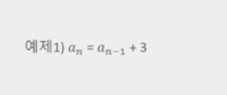
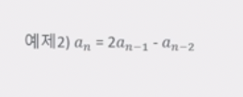
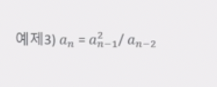
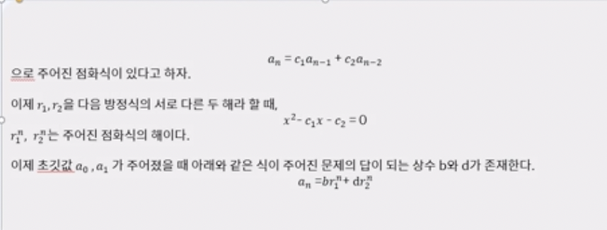
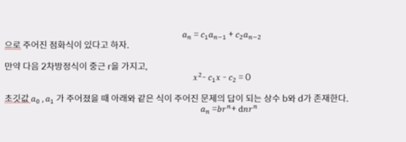
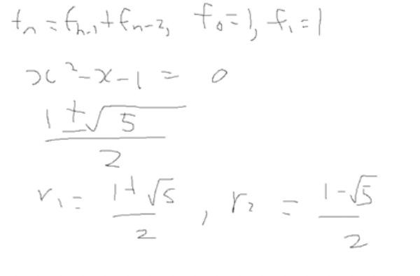
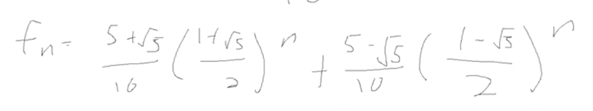
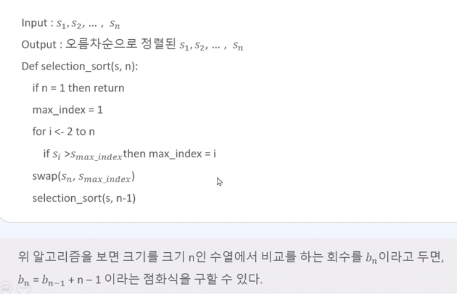
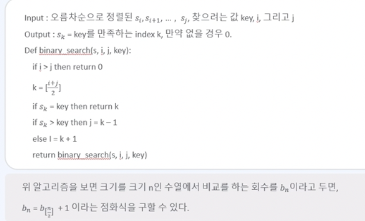
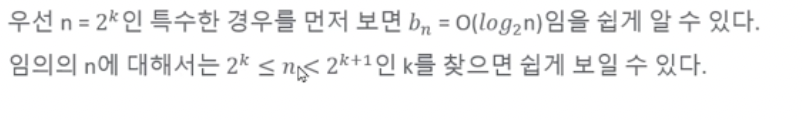

# 점화 관계

* 재귀함수의 특수한 경우로 수열 {an}이 있을 때, an을 a n-1, a n-2, ..., a1, a0에 관한 식으로 표현하는 것을 말한다.

## 점화 관계 예제

* 예제1
	* 이러한 문제를 풀 때 어떻게 하나?
	
	  an + an-1 + an-2 + ... + a1 = an-1 + ... + a0 + 3^n
	
	  an = a0 + 3^n
	
	  이렇게 푼다 

* 예제2
  * 이 문제 또한 위와 같다.
  * an - an-1 = an-1 - an-2
  * bn = bn-1
  * 치환해서 문제를 푼다.

* 예제3
  * 물론 이 문제도 같다.
  * log를 씌워서 위와 같이 풀던가, an-1로 양 변을 나눠서 bn을 설정하면 된다.

* 그러나 이런 문제들을 알고리즘에서 어떻게 사용할 것인가?
  * 보통 위와 같은 문제들은 재귀함수를 이용한다. 그렇게 만든 알고리즘의 시간 복잡도는 보통 O(N)

## 점화 관계식을 푸는 법

* 중근이 아닌 점화식

* 중근을 갖는 점화식

* 예제 2를 다시 보면 

  * an - 2an-1 + an-2 = 0
    x^2 - 2x + 1 = 0
    중근 r = 1
    an = b * 1 ^ n + d * n * 1^n
    an = b + d * n (a0 = 1, a1 = 2 이면)
    an = 1 + n 이다.

* 치환 필요없고, 재귀함수가 필요 없다. 즉, 이렇게 알고리즘을 풀면 O(1)이 되면서 시간복잡도를 크게 줄일 수 있다.

* 피보나치 수열을 확인해보자

  * an = an-1 + an-2

    an - an-1 - an-2 = 0

    x^2 - x - 1 = 0

    x의 해는? x = (1 + 루트5)/2 , (1 - 루트5)/2

    즉, an = b((1+루트5)/2)^n + d((1-루트5)/2)^n 임을 알 수 있다.

## 점화 관계를 푸는 것이 중요한 이유

* 재귀함수처럼 알고리즘을 푸는 것도 중요하지만, 가장 좋은 방법이 아니란 것을 알아야 한다.
* 사람이 풀고 나머지를 컴퓨터에 시킴으로서 알고리즘의 복잡도는 줄어들 수 있다.

## 알고리즘 응용

* 피보나치 수열 fn = fn-1 + fn-2, f1 = f2 = 1 점화 관계 푸는 방식을 이용하여 훨씬 빠른 알고리즘을 구현해보자.

  

  

* 선택정렬의 시간 복잡도가 O(n^2)임을 보이자

  

  bn = n^2 에 관한 식으로 풀 수 있고, 즉 시간 복잡도는 O(n^2)

* Binary search의 시간 복잡도가 O(log n)임을 보이자

  

  b2^k = b1 + k에 관한 식으로 풀 수 있고, 

  

  bn = b1 + log2 n임을 알 수 있다.

  즉, 시간 복잡도는 O(log n)