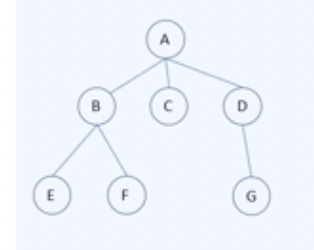
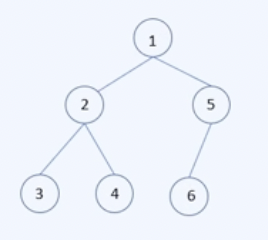
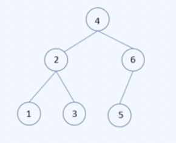
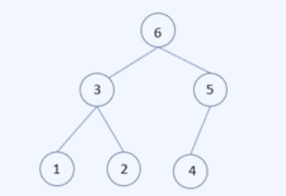

# 트리

* 트리 정의

  그래프에서 회로가 없는 연결 그래프

  

  한 점(루트) A로부터 거리에 따라 계층 구조로 나타낼 수 있다.

  * 부모 노드
    * 한 노드의 상위 계층에 있는 노드
  * 자식 노드
    * 한 노드 하위 계층에 있는 노드
  * 형제노드
    * 부모 노드가 같은 노드
  * 리프 노드
    * 자식 노드가 없는 노드
  * 중간 노드
    * 루트도 리프도 아닌 노드
  * 레벨
    * 루트 노드의 레벨은 0이고, 그로부터 거리를 레벨이라고 한다.
  * 높이 또는 깊이
    * 트리에서 최고로 높은 레벨의 값을 높이라고 한다.


## 신장 트리(spanning tree)

* 신장 트리

  * 그래프 G의 부분 그래프 중에서 G의 모든 점을 포함하는 트리 T를 신장트리라 한다.

  * 신장트리는 없을 수도 있다.

    

* 정리: 그래프 G가 신장트리를 가질 필요충분조건은 G가 연결그래프인 것이다.

* 증명

  * G가 신장트리를 가진다고 가정.

    신장트리는 연결그래프이므로, 연결그래프를 부분그래프로 가지는 G는 연결그래프이다.

  * G가 연결그래프라 가정하자.

    만약 G에 회로가 없다면 스스로가 트리이고, 신장 트리를 가진다.

    만약 G에 회로가 있다면, 이 회로에서 변 하나를 제거한다고 해도 여전히 연결 그래프일 것이다.

    이런식으로 연결그래프임을 유지하면서 계속 변을 제거하면서 회로가 없는 상태가 되게 만들면 그것은 신장트리가 된다.


### BFS를 사용한 신장 트리 찾기

```
Input: 연결 그래프 G=(V, E), V= v1, v2, ..., vn
Output: 신장트리 T

Def bfs(V, E):
	S <- [v1]
	V' <- {v1}
	E' <- 공집합
	while V' != V:
		for x in S:
			x와 근접한 모든 변 중 추가해도 회로를 만들지 않는 변이 존재한다면 E'에 추가하고 그 벼노가 근접한 모든 점을 V'에 추가한다.
    S <- 방금 추가된 모든 점들
  return (V', E')
```


### DFS를 사용한 신장 트리 찾기

~~~
Input: 연결 그래프 G=(V, E), V= v1, v2, ..., vn
Output: 신장트리 T

Def dfs(V, E):
	V' <- {v1}
	E' <- 공집합
	w <- v1
	while V' != V:
		while w에 근접한 변을 E'에 추가해도 회로를 만들지 않는 변이 존재한다면:
			w에 근접한 변 (w, u)를 E'에 추가하고 u를 V'에 추가한다.
			w <- u
    if w == v1:
    	return (V', E')
   	w <- T에서 w의 부모노드
~~~


## 이항 트리(이진트리, Binary Tree)

* 이진 트리 정의

  트리인 그래프 T에서 모든 노드의 자식 노드의 개수가 최대 2개인 트리

* 완전 이진 트리

  높이가 h일 때, 레벨 0부터 h - 2까지 모든 노드의 차수가 2이고 레벨 h에서는 왼쪽부터 노드가 채워져 있는 트리

* 포화 이진 트리

  높이가 h일 때, 레벨 0부터 h - 1까지 모든 노드의 차수가 2인 트리


* 이진 탐색 트리

  노드의 왼쪽 서브트리에는 그 노드의 값보다 작은 값을을 지닌 노드들로 이루어져있다.

  노드의 오른쪽 서브트리에는 그 노드의 값보다 큰 값들을 지닌 노드들로 이루어져있다.


## 트리 순회

* 순회 : 모든 노드의 데이터를 처리할 수 있도록 한 번씩 방문하는 방법
  * 항상 루트 노드에서 시작
  * 노드의 데이터를 읽기 전에 노드가 존재하는지 먼저 탐색
  * 형제 노드 중 왼쪽 노드를 항상 먼저 탐색


* 전위 순회: 부모 노드 - 왼쪽 자식 노드 - 오른쪽 자식 노드 순으로 탐색하는 순회 방식

  

* 중위 순회: 왼쪽 자식 노드 - 부모 노드 - 오른쪽 자식 노드 순으로 탐색하는 순회 방식

  

* 후위 순회: 왼쪽 자식 노드 - 오른쪽 자식 노드 - 부모 노드 순으로 탐색하는 순회 방식

  