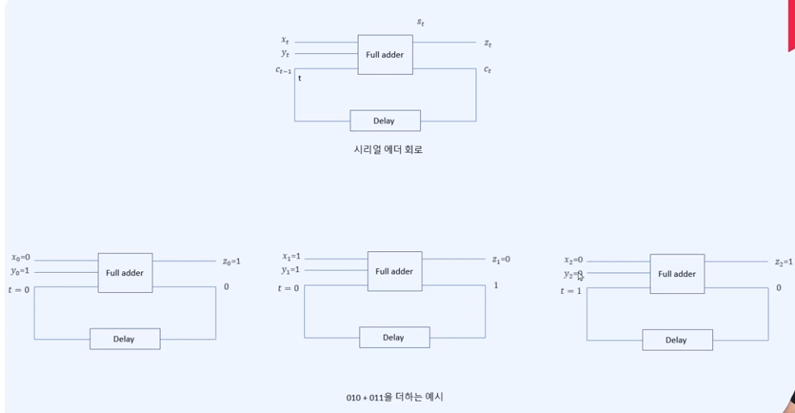

# 형식 언어와 오토마타

## 순차 논리와 유한 상태 기계

* 단위 시간 딜레이
  * t = 0, 1, ...에 따라 값이 변하는 변수 $x_t$가 있을 때, 단위시간 딜레이 $x_t$를 받아서 $x_(t-1)$을 출력한다.
* 시리얼 에더
  * 이진수 두 개를 입력으로 받아 그 합인 값을 출력하는 함수

* 유한 상태 기계 M은 기계의 추상적인 모델로 다음과 같이 정의된다.
  * 입력값의 유한집합 I
  * 출력값의 유한집합 O
  * 상태들의 유한집합S
  * 다음 상태 함수 f : S X I => S
  * 전이 함수 g : S X I => O
  * 시작 상태 σ ∈ S
* M = (I, O, S, f, g, σ)

