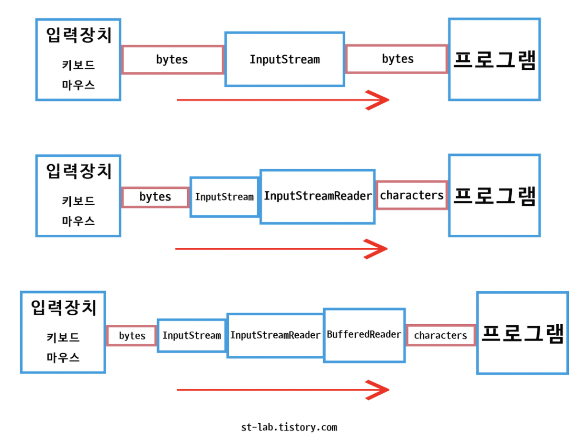

# 입력 스트림 종류

1. InputStream
2. InputStreamReader
3. BufferedReader

## 입력 스트림의 이해

* InputStream은 바이트 단위로 데이터를 처리한다. 그렇기 때문에 문자를 못 읽는다.
  * 한글 : 3Byte
  * 즉, InputStream으로 한글을 입력 받아도, 3Byte 중 앞 1Byte만 출력한다.
  * 그래서 InputStreamReader라는 중개자가 문자를 읽기 위해 일을 한다.
* InputStreamReader은 Char 단위로 데이터를 처리한다.

~~~java
public class Main {
	public static void main(String[] args) {
    
    InputStream inputStream = System.in; //System.in의 변수를 받아 InputStream으로...
    InputStreamReader sr = new InputStreamReader(inputStream);
    
    int a = sr.read();
    System.out.println(a); //자바는 메모리 상에서 문자열이 UTF-16으로 인코딩되어 처리된다. 그래서 결과 값은 UTF-16의 16진수 값이 나온다.
    System.out.println((Char)a); //char타입으로 변환해야 문자 데이터가 나온다.
  }  
}
~~~

### 그럼 Scanner는 무엇인가?

* Scanner는 받아온 InputStream 데이터를 InputStreamReader로 문자를 온전하게 받은 후 입력 메서드 타입에 맞게 변환하고, 수많은 정규식을 검사한다. 그래서 검사된 문자열을 리턴 받는다.
  * 정규식 검사와 불 필요한 타입 변환 때문에 속도가 느리고, 성능이 좋지 않다.

~~~java
import java.util.Scanner;

public class Main {
	public static void main(String[] args) {
    
    Scanner sc = new Scanner(System.in);
    int a = sc.nextInt();
    
    System.out.println(a); //char타입으로 처리된 데이터를 입력 메서드 타입에 맞게 정규식 검사와 타입 변환이 됨. String -> nextInt() -> Integer.parseInt(String)
  }  
}
~~~

### BufferReader는?

* Scanner와 다르게
  1. 버퍼가 있는 스트림이다.
     * 하나 하나 문자를 char로 보내는 것이 아닌, Buffer라는 입력받은 문자를 쌓아둔 뒤 한 번에 문자열처럼 보낸다.
  2. 별 다른 정규식 검사를 하지 않는다.
* readList() 메서드를 통해 데이터를 가져올 경우, 한 행을 전부 읽기 때문에 문자열을 분리해서 가져와야한다.
  1. StringTokenize 클래스 이용(성능면에서 좋음)
  2. split() 메서드 이용하는 방법

~~~java
import java.util.StringTokenizer;
import java.io.BufferedReader;
import java.io.InputStreamReader;
import java.io.IOException;

public class Main {
	public static void main(String[] args) throws IOException {
    
    InputStream inputStream = System.in;
    InputStreamReader sr = new InputStreamReader(inputStream);
    BufferedReader br = new BufferedReader(sr);
    //BufferedReader br = new BufferedReader(new InputStreamReader(System.in));
    String str = br.readLine(); //BufferedReader의 메서드 사용시 IOException 예외처리 해줘야함.
    StringTokenizer st = new StringTokenizer();
    
    int a = Integer.parseInt(st.nextToken());
    int b = Integer.parseInt(st.nextToken());
    
    System.out.println(a + b);
  }  
}
~~~

~~~java
import java.io.BufferedReader;
import java.io.InputStreamReader;
import java.io.IOException;

public class Main {
	public static void main(String[] args) throws IOException {
    
    InputStream inputStream = System.in;
    InputStreamReader sr = new InputStreamReader(inputStream);
    BufferedReader br = new BufferedReader(sr);
    //BufferedReader br = new BufferedReader(new InputStreamReader(System.in));
    String str = br.readLine(); //BufferedReader의 메서드 사용시 IOException 예외처리 해줘야함.
    String[] arr = str.split(" ");
    
    int a = Integer.parseInt(arr[0]);
    int b = Integer.parseInt(arr[1]);
    
    System.out.println(a + b);
  }  
}
~~~

