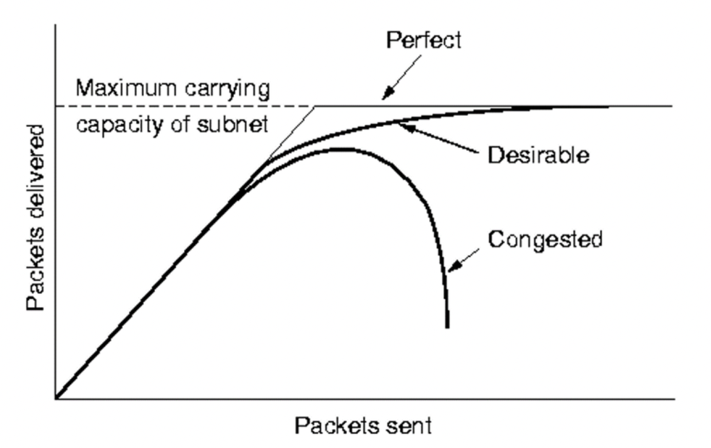

# 컴퓨터 네트워크

## 네트워크와 인터넷

* 네트워크
  * 종단 시스템(end system) : PC나 스마트폰 처럼 네트워크 송수신 주체
  * **프로토콜** : 두 이종 시스템을 연결하기 위한 규약
  * 통신을 목적으로 실제 물리적으로 **유선**으로 연결되어 있거나 **무선**으로 연결 됨

* 인터넷
  * 회사 혹은 소규모의 네트워크에서 전 세계 네트워크와 연결된 상태
  * http같은 여러 프로토콜을 통해 다양한 애플리케이션 서비스가 제공되고 있다.
  * 종단 시스템은 보통 ISP(Internet Service Provider)에 의해 연결된다.

* OSI 7계층
  * 네트워크 구성요소를 7개의 계층으로 역할을 나눈 표준 모델
  * 각 계층별 역할을 통해 통신 규격(프로토콜)을 만족
  * 일부 하위계층은 하드웨어에서 구현되며 상위계층은 소프트웨어로 구현

* TCP / IP (Transmission Control Protocol / Internet Protocol)
  * 리눅스 / 유닉스의 초기 운영체제에서 연결을 위해 만든 소프트 웨어 집합(사용되던 프로토콜)
  * OSI 7계층이 나오기 전 널리 사용되던 사실상 표준 역할
  * 각 계층별 역할에 따라 역할이 나누어짐

* IP 주소
  * 통신 자료를 최종적으로 전달하기 위해 필요한 송/수신 위치정보
  * 보통 IPv4의 주소를 사용하며 주소 부족을 위해 IPv6가 개발됨

* 라우터
  * 여러가지 네트워크를 묶어서 교통정리를 해주는 장비
* 게이트웨이
  * 하나의 네트워크를 벗어나 다른 네트워크에 접속하는 장비
  * 무선 네트워크를 유선 네트워크에 연결시켜 주는 공유기도 넓게보면 게이트웨이이며 라우터이다.

* 패킷 교환(Packet Switching)
  * 종단간에 전송되는 데이터를 **패킷**이라는 단위로 전달함
  * 패킷은 네트워크를 통해 일정한 순서없이 보내지며, 어떤 경로를 통해 이동되는지 네트워크의 상황에 따라 다르다.

### 통신을 위한 기본 동작

* 요청(Request)
* 인지(Indicate)
* 응답(Response)
* 확인(Confirm)

### 네트워크의 유형

* LAN (Local Area Network)

  * 소규모로 묶인 일정 그룹의 지역 네트워크(사무실, 학교 등)
  * 사설망등을 구축해서 연결

* WAN (Wide Area Network)

  * 원거리 통신망으로 넓은 범위 연결(국가, 대륙 등)

  

  LAN < WAN < Internet

### 네트워크 토폴로지

* Mesh Topology
  * 네트워크가 모두 연결되어 있어 가장 빠른 모습을 보여주나, 이걸 이어주는 것이 어려움

## 네트워크의 계층별 역할

 

### OSI 7계층

1. 물리계층(physical layer)

   * 개요

     * 물리적 매체를 통한 **비트 스트림**(비트를 보내는 과정) 전송에 요구되는 기능을 담당(기계적, 전기적, 전송매체) - **전기 신호 책임**
     * 물리적인 장치와 인터페이스가 전송을 위해 필요한 기능과 처리절차가 규정됨

   * 물리 층의 주요 기능

     * 인터페이스와 매체의 물리적인 특성 : 장치와 전송매체 간의 인터페이스 특성을 규정
     * 비트의 표현 : 비트(1, 0)를 전송하기 위해 전기적 또는 광학적인 신호로 부호화
     * 데이터 속도 : 신호가 유지되는 비트의 주기를 규정
     * 비트의 동기화 : 송신자와 수신자는 같은 클록을 사용

   * MAC(Medium Access Control) 필요

     * 자유경쟁

       * 두 종단이 동시에 데이터를 보내면 충돌이 일어나는데, 이 회선을 선착순으로 쓰는 것이 자유경쟁

       * Aloha, Slotted Aloha, CSMA, CSMA/CD 알고리즘을 통해 충돌을 피함

       * CSMA/CD(Carrier Sense Multiple Access / Collision Detection) 충돌을 감지한 다음에 일정시간 후에 다시 보내는 형태의 알고리즘 

         

         * IEEE 802.3
         * 충돌을 감지하면 잼 신호를 보내고, 일정시간 후 다시 신호 보냄
         * 16번까지 재시도

       

2. 데이터 링크 계층(data link layer)

   * 개요

     * **노드 대 노드 전달의 책임**

   * 기능

     * **프레임** 구성 : 물리 계층으로부터 받은 비트 스트림을 프레임단위로 나눔
     * 물리주소 MAC(Medium Access Control) 지정 : 송신자와 수신자의 물리 주소를 헤더에 추가
     * 흐름제어 : 수신자의 수신 데이터 전송률을 고려하여 데이터 전송하도록 제어
     * 오류제어 : 손상 또는 손실된 프레임을 발견/재전송, 트레일러를 통해 이루어짐
     * 접근제어 : 주어진 어느 한 순간에 하나의 장치만 동작하도록 제어

   * 노드 대 노드(Hop-to-Hop)의 전달 책임

     * 하나의 PC, 라우터 등등이 하나의 노드가 됨
     * **MAC주소**를 통해 다음 이동할 노드 위치를 찾음
     * 밑 그림을 보면 A와 F가 통신을 하기 위해
       1. A 노드에서 중간노드인 B노드로 이동
       2. F 노드와 통신하기 위해 찾은 중간 노드는 C 노드가 아닌 E 노드이므로
       3. E 노드로 이동
     * 노드와 노드끼리의 통신을 데이터 링크에서 책임지는 것 (Hop-to-Hop)의 전달 책임

     

     

   * 물리주소의 데이터 전달 과정

     * 물리주소 10인 노드는 물리주소 87인 노드에 프레임(물리주소가 헤더에 들어있는 데이터)을 보낸다.

     * 데이터 링크 수준에서 이 프레임은 헤더에 물리주소들(Source/Destination)을 가지고있다.

       여기서는 오직 이 주소들만 필요하다.

     * 헤더의 끝에는 이 수준에서 필요한 다른 정보가 있다.

       트레일러에는 보통 오류검출을 위한 추가 비트들이 포함되어 있다.

       

       

3. 네트워크 계층

   * 개요

     * 논리 주소를 통한 패킷을 발신지(source)-대-목적지(destination) 전달에 대한 책임을 가짐

   * 기능

     * 발신지-대-목적지 **패킷** 전달
     * 논리 주소지정(Logical addressing) (논리 주소가 가능해진다)
       - IPv4, IPv6
       - 상위 계층에서 받은 패킷에 발신지와 목적지의 논리주소를 헤더에 추가
     * 라우팅
       * 패킷이 최종 목적지에 전달될 수 있도록 **경로를 지정하거나 교환하는 기능**

     

     * 혼잡 제어

       * 혼잡 : 현재 서브넷에 많은 패킷이 들어올 때 수행능력이 감소하는 것

       * 트래픽이 너무 많아지면 라우터가 대처할 수 없게되며 패킷 손싱이 시작되고 사태가 점점 악화된다.

         

         

   * 네트워크 계층의 주요 프로토콜

     * ICMP(Internet Control Message Protocol)

       * 에러 발생 시 에러 발생 원인을 알려주거나 네트워크 상태를 진단해주는 기능
     * IGMP(Internet Group Management Protocol)
   
       * 호스트(컴퓨터)가 멀티태스트 그룹 구성원을 인접한 라우터에게 알리는 프로토콜
     * **IP**(Internet Protocol)

       * 네트워크 기기에서 논리적 식별을 위한 주소

         * IPv4 : 약 40억개의 주소 (모든 기기에 붙이기 부족한 수)

         * IPv6 : 2의 128제곱 개수의 주소 (모든 기기에 붙여도 남는 수)

   
     * ARP(Address Resolution Protocol)
       * 주소를 해석하기 위한 프로토콜
       * 논리적인 IP주소를 물리적인 MAC주소로 바꾼다.
       * 캐시를 통해 얻은 정보가 저장되고 보통 20분의 수명을 가진다.
       * 정보가 사라지면 다시 ARP를 통해 주소를 물어봄
     * RARP(Reserve ARP)
       * 역 주소 프로토콜
       * 저장 장치가 없는 네트워크 단말기등이 IP주소를 얻기위해 사용
   
   * 발신지 대 목적지 전달
   
     * 중간에 있는 라우터들은 3계층까지는 까본다. (IP주소 알기위해)
   
     
   
     
   
   * 네트워크 계층의 전달 흐름
   
     
   
     * 네트워크 주소가 A인 노드에서 네트워크 주소가 P인 노드에 데이터를 보내는 과정
     * 네트워크는 현재 3개로 보면 된다.
       * A-E-F
       * T-Ring-N
       * Z-M-P
     * 두 노드는 서로 다른 네트워크에 위치해 있기 때문에 서로 물리주소를 모른다.(Hop-to-Hop) 그래서 링크 주소(link address)만 사용할 수 있다.
       * Data
       * |Data-AP| 논리주소 담음
       * |T2- |Data-AP| -1020| 프레임
         *  목적지 P의 MAC주소를 모르기 때문에 최소한 라우터의 MAC주소를 담아서 라우터까지 이동
       * |T2- |Data-AP| -9933| 프레임
         * 95가 있는 네트워크로 이동하기 위해 33 MAC주소를 가진 라우터로 이동
       * |T2- |Data-AP| -6695| 프레임
         * 95가 있는 네트워크에 도착하면, 그 네트워크에 있는 라우터는 MAC주소를 교체해서 데이터 전달
       * 네트워크 계층에서 주소를 확인했는데 자신의 논리 주소와 일치하면 그 데이터를 열어보는 것
       
       
   
4. 전송 계층

   * 개요

     * 포트 번호를 이용한 전체 메시지의 **프로세스 대 프로세스 전달에 대한 책임**을 가짐
     * 프로세스 : 앱, 프로그램 등
     * 포트 번호 : 어떤 프로그램으로 이 데이터가 가야하는지 포트 번호를 붙임
     * 전체 메시지가 완전하게 바른 순서로 도착하는 것을 보장
       * 데이터는 잘라서 이동하기 때문에 도착했을 때 완전해야하는 것을 목표
     * 네트워크 층은 개별적인 패킷의 종단-대-종단 전송을 담당
     * 전송 계층은 세그먼트를 프로세스 대 프로세스 전송을 담당

     

     * 위 사진 설명
       * 어플리케이션 계층에서 보내진 데이터들을 세그먼트로 잘라서, 세그먼트들을 네트워크 계층에선 패킷으로 보내는 것
       * 최종 종단에서 이 세그먼트들(패킷들)이 순서대로 붙여져야 하므로 그 역할을 전송 계층이 하는 것이다.

   * 기능

     * **포트 주소** 지정(port addressing) : 포트 번호를 포함

       * 네트워크 계층은 각 패킷을 정확한 컴퓨터에, 

         전송 계층은 해당 컴퓨터의 정확한 프로세스에게 전달

     * 분할과 재조립(Segmentation and reassembly)

       * 전달 가능한 세그먼트 단위로 나눔
       * 각 세그먼트는 **순서번호**를 가지며 이를 통해 재 조립 또는 패킷의 손실 여부를 판단해서  데이터를 버리고 다시 보내도록 할 수 있음

     * 연결 제어

       * 비 연결 및 연결지향

     * 흐름 제어

     * 오류 제어

   

   * 전송 계층의 프로토콜

     * TCP(Transmission Control Protocol)
       * 연결형 서비스로 가상 회선 방식(종단간의 연결 방식으로 연결 보장)을 제공
       * **신뢰성을 보장**하며 3-way handshaking 과정을 통해 연결을 제공
       * 신뢰성을 보장하기 위해 종단간에 여러 메세지가 오고가고 그래서 속도는 느리다
       * 전이중(Full-Duplex), 점대점(Point to Point) 방식
     * UDP(User Datagram Protocol)
       * 비연결형 서비스로 데이터그램 방식을 제공
       * 신뢰성이 낮지만 바로 데이터를 보낼 수 있다
         * 영화같은 멀티미디어 경우 몇 개의 프레임이 안와도 보는 것에 지장이 없기 때문에 적합하다
       * TCP보다 속도가 빠르다(3-way handshaking 과정이 필요 없기 때문에)
     * SCTP(Stream Control Transmission Protocol)
       * SCTP는 UDP와 TCP의 특성을 결합
       * UDP나 TCP와 유사하며 다중 연결을 지원한다

     

   * 메세지의 프로세스 대 프로세스 전달에 대한 책임

     * 네트워크 층에서 Host 대 Host를 책임졌으면
     * 전송 층에서 프로세스 대 프로세스를 책임진다.
       * 포트 번호로!!

     

   * 전송 계층의 전달 예시

     * Transport layer - 포트번호
     * Network layer - IP 논리주소
     * Data link layer - MAC 물리주소

     

5. 응용 계층(Application layer)

   * 개요
     * 다양한 프로그램과 프로토콜이 이용됨
     * 사용자가 네트워크에 접근할 수 있도록 해줌
     * 사용자 인터페이스 제공
     * 전송계층에서 올라온 헤더에서 포트번호를 보고 어느 프로그램으로 데이터를 보낼지 정함
     * 서비스
       * 원격 로그인, 파일 액세스, 전송, 관리, 메일 서비스, Http www 웹

   

   * Application계층의 프로토콜 및 프로그램
     * FTP
     * Telnet
     * SMTP
     * DNS
     * HTTP
     * DHCP
     * Ping
     * Tcpdump
     * Tracerouter

## 각 계층과 프로토콜

* Application이 제어하는 곳
  * Application 
  * Presentation
  * Session
* OS가 제어하는 곳
  * Transport 
  * Network
  * Data-link
  * Physical
