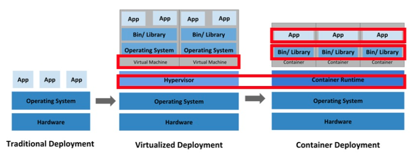
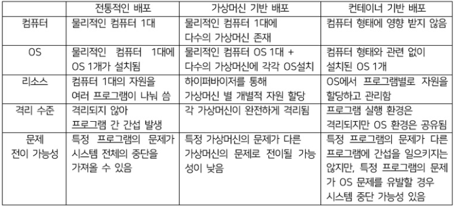

# 쿠버네티스와 컨테이너, 도커

* 애플리케이션 배포 환경의 변화

1. Traditional Deployment

   * 가상화 이전부터 쓰이던 방식

   * 물리적인 컴퓨터 한 대에 하나의 OS를 깔고 여러가지 프로그램을 설치하는 방식

     

2. Virtualized Deployment

   * 하이퍼바이저를 통해 가상 머신(가상 컴퓨터)를 만들어서 구동할 수 있도록 함

   * 각 가상머신에 CPU, 메모리, 저장 장치 등 개별적으로 할당시킬 수 있다.

   * 서버와 같이 다중화와 분산 처리가 중요한 시스템이라면 시스템 자원 상황에 따라 가상머신 개수를 늘리고 줄이면서 유연하게 처리가 가능하다.

     

   * 전통 방식보다 효율적이지만 가상머신이 완전한 컴퓨터이기 때문에 OS를 설치해주어야 하는 면에서는 무거운 편이다.

3. Container Deployment

   * 한 OS 위에 여러 컨테이너가 올라가 있다.
     * 컨테이너는 구동하려는 App을 실행할 수 있는 환경까지 감싸서 어디서든 쉽게 실행할 수 있도록 해 주는 기술
   * 한 OS 상에서 구동되지만 각 컨테이너끼리는 서로 간섭을 할 수 없다. **이를 OS 커널을 공유하는 가상화라고 표현한다.**
     * 컨테이너 : 앱이 구동되는 환경까지 감싸서 실행할 수 있도록 하는 격리 기술
     * 컨테이너 런타임 : 컨테이너를 다루는 도구, 컨테이너를 쉽게 내려받거나 공유하고 구동할 수 있도록 해주는 도구
     * 도커 : 컨테이너를 다루는 도구 중 하나(가장 유명한 것)
     * 쿠버네티스 : 컨테이너 런타임을 통해 컨테이너를 오케스트레이션 하는 도구
       * 컨테이너를 다루는 도구 - 컨테이너를 분산해서 배치, 문제가 생긴 컨테이너를 교체, 컨테이너가 사용할 환경 주입
     * 오케스트레이션 : 여러 서버에 걸친 컨테이너 및 사용하는 환경 설정을 관리하는 행위

