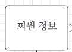
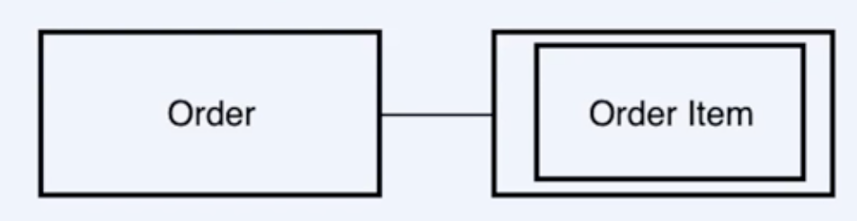
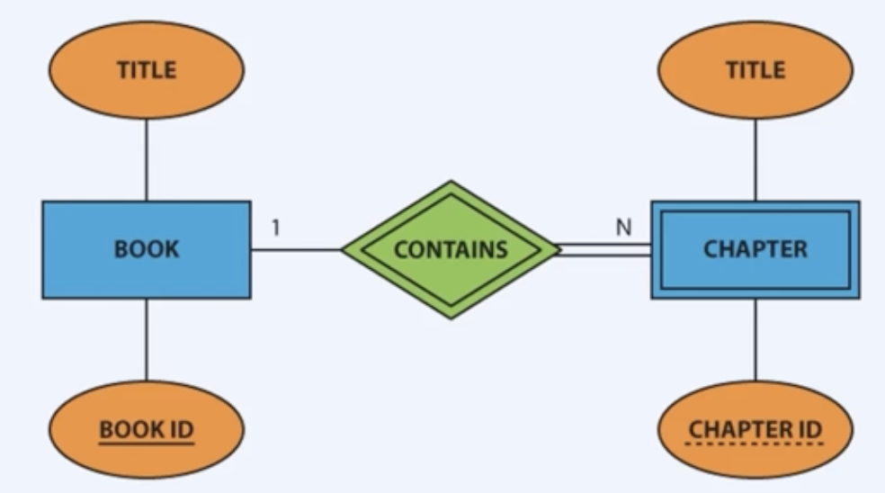
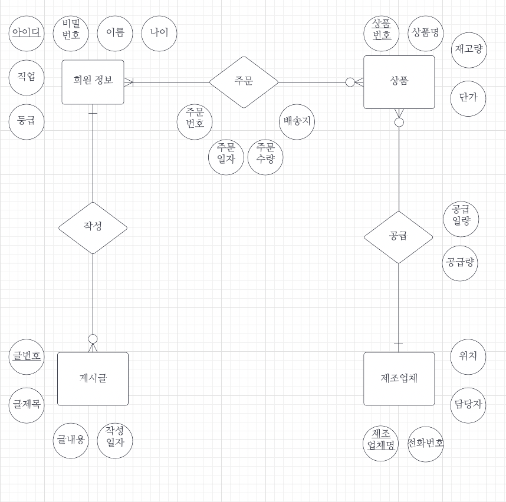

# 관계형 데이터 모델

* 관계형 데이터 모델은 실체(Entity), 속성(Attribute), 관계(Relationship)으로 구성된 ER Diagram으로 표현된다.

**Entity**

저장할 만한 가치가 있는 중요한 데이터를 가진 사람이나 사물 등
개체들의 집합을 Entity Type이라 하고 개체 이름을 포함하는 네모로 표현

* Entity :  
* Weak Entity : 
  포함된 속성만으로 고유하게 식별할 수 없는 개체
  다른 Entity에 의존하는 Entity
  예를들어 주문에 들어가는 주문 아이템은 주문이란 Entity 없이 존재할 수 없음

**Attribute**

속성 또는 특성
이름을 포함한 원으로 표현됨

* Attribute : 

* Key Attribute : 
  특정 Entity를 식별할 수 있는 고유한 값을 가진 Attribute
  이름에 underscore

* Multivalued Attribute : 

  하나의 Attribute가 여러 개의 값을 가질 수 있는 Attribute
  두 개의 원으로 표현

* Derived Attribute

  다른 Attribute 들로 부터 계싼되어져 나온 Attribute
  점선으로 된 원으로 표현

* Composite Attribute

  독립적인 Attribute들이 모여서 생성된 하나의 Attribute
  Attribute가 Attribute를 가지는 것으로 표현

**Relationship**

Entity간의 어떤 상호작용을 하는지 표현하는 notation
RelationShip 이름을 포함한 마름모로 표현

Relationship도 Attribute를 가질 수 있다.

* Weak (identifying) relationship : 
  weak entity와 parent-child 관계에서의 상호작용을 표현
  책이라는 Entity에서 챕터라는 weak Entity를 가진다면, weak relationship으로 부모 자식 관계를 표현함

**Cardinality (Degree of Relationship)**

관계를 맺는 두 Entity에 대해 한 개체가 얼마나 많은 다른 개체와 관련될 수 있는지 표현

**작성**

