# 데이터 모델 설계

## 소프트웨어 개발 과정

1. 계획 / 기획
2. 분석 및 Ideation
   * 개발자 Use case diagram 작성
   * 기획자 기획서 작성
3. UI / UX 설계
   * 디자이너 UI / UX 설계
4. DB 설계 (모델링)
   * 작성된 Use case diagram을 바탕으로 ERD 설계 (데이터베이스 모델링 설계)
5. S/W 및 인프라 설계
6. 구현
7. 테스트 및 통합
8. 오픈
9. 유지보수(운영)

## 데이터베이스 설계 단계

1. 요구사항 분석

   * 요구 사항에 대해 어떤 데이터들이 필요한지, 어떤 기능들이 필요한지 분석
   * 결과물 : 요구 사항 명세서

2. 개념적 설계

   * 요구 사항 분석 결과물을 개념적 스키마 설계

   * 개념적 데이터 모델을 이용해 개념적 구조로 표현

   * 요구 사항 명세서를 ERD로 표현

     Step 1 : 개체 추출, 각 개체의 주요 속성과 키 속성 선별

     * 개체 : 중요한 데이터
     * 요구 사항 명세서에서 **의미 있는 명사**를 찾는다.
     * 찾아낸 명사를 개체와 속성으로 분류

     Step 2 : 개체 간의 관계 결정

     * 개체 간의 의미 있는 연관성 추출
     * 요구 사항 명세서에 있는 의미 있게 표현 할 동사를 찾는다.
     * 찾아낸 관계에 대해 매핑 Cardinality와 참여 특성을 결정
     
     Step 3 : E-R Diagram 작성

3. 논리적 설계

   * 관계 모델을 통해 개념적 모델을 논리적으로 표현
   * 결과물 : 릴레이션 스키마

4. 물리적 설계

   * DBMS로 구현이 가능한 물리적인 구조를 설계
   * 저장 레코드 타입 및 인덱스 타입 등 설계
   * 결과물 : 물리적 스키마 

### 1. 요구 사항 분석

요구 사항 명세서 작성 : 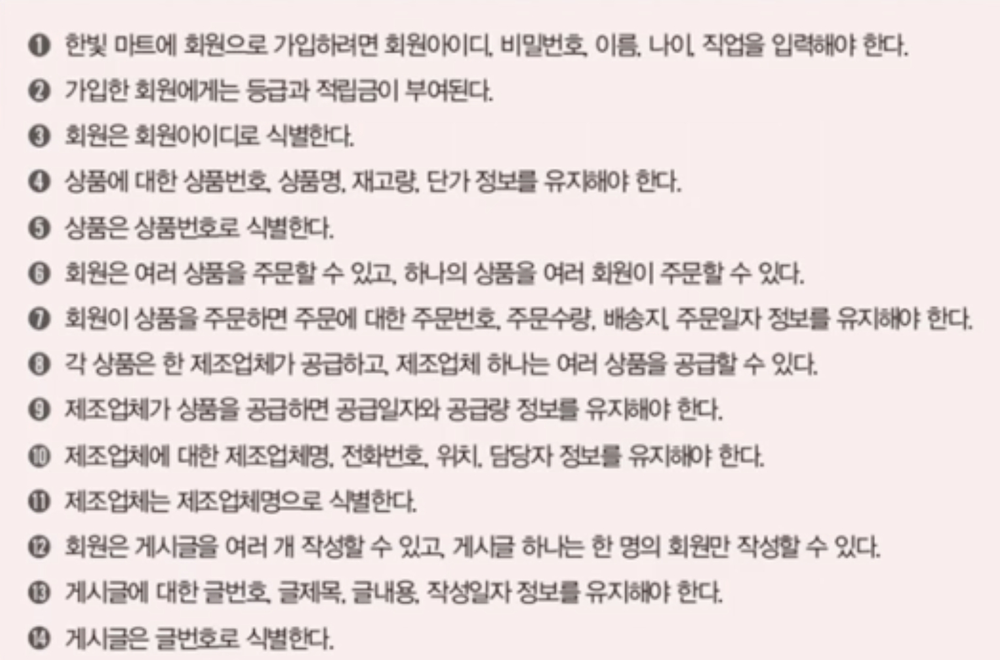

### 2. 개념적 설계

1. 요구사항 명세서에서 의미 있는 명사 찾기(개체 추출)

   > 한빛 마트에 **회원**으로 가입하려면 **회원아이디, 비밀번호, 이름, 나이, 직업**을 입력해야 한다.
   >
   > 가입한 회원에게는 **등급**과 **적립금**이 부여된다.
   >
   > 회원은 회원아이디로 식별한다.
   >
   > 상품에 대한 **상품번호, 상품명, 재고량, 단가** 정보를 유지해야 한다.
   >
   > 상품은 상품번호로 식별한다.
   >
   > 회원은 여러 상품을 주문할 수 있고, 하나의 상품을 여러 회원이 주문할 수 있다.
   >
   > 회원이 상품을 주문하면 주문에 대한 **주문번호, 주문수량, 배송지, 주문일자** 정보를 유지해야 한다.
   >
   > 각 상품은 한 **제조업체**가 공급하고, 제조업체 하나는 여러 상품을 공급할 수 있다.
   >
   > 제조업체가 상품을 공급하면 **공급일자**와 **공급량** 정보를 유지해야 한다.
   >
   > 제조업체에 대한 **제조업체명, 전화번호, 위치, 담당자** 정보를 유지해야 한다.
   >
   > 제조업체는 제조업체명으로 식별한다.
   >
   > 회원은 **게시글**을 여러개 작성할 수 있고, 게시글 하나는 한 명의 회원만 작성할 수 있다.
   >
   > 게시글에 대한 **글번호, 글제목, 글내용, 작성일자** 정보를 유지해야 한다.
   >
   > 게시글은 글번호로 식별한다.

요구 사항 명세서를 바탕으로 개체 추출

| 개체     | 식별자     | 속성                                     |
| -------- | ---------- | ---------------------------------------- |
| 회원     | 회원아이디 | 비밀번호, 이름, 나이, 직업, 등급, 적립급 |
| 상품     | 상품번호   | 상품명, 재고량, 단가                     |
| 제조업체 | 제조업체명 | 전화번호, 위치, 담당자                   |
| 게시글   | 글번호     | 글제목, 글내용, 작성일자                 |

 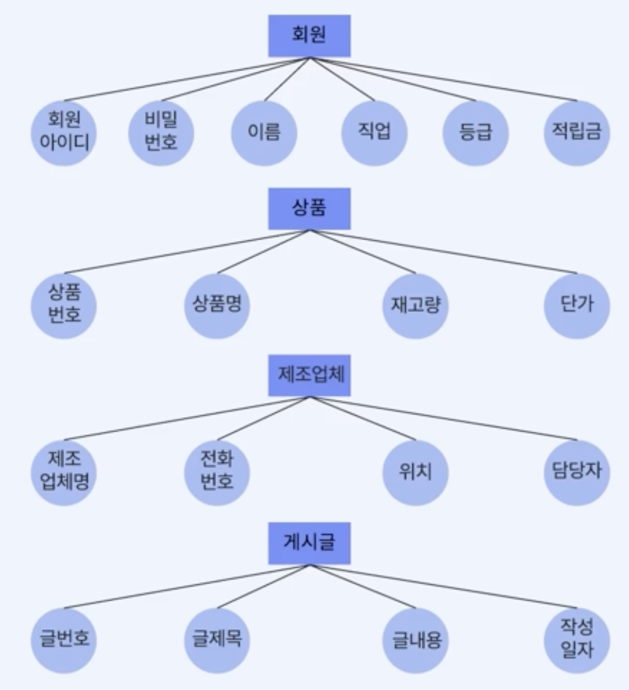

2. 개체 간의 의미 있는 연관성 추출(관계 추출)

   >한빛 마트에 **회원**으로 가입하려면 **회원아이디, 비밀번호, 이름, 나이, 직업**을 입력해야 한다.
   >
   >가입한 회원에게는 **등급**과 **적립금**이 부여된다.
   >
   >회원은 회원아이디로 식별한다.
   >
   >상품에 대한 **상품번호, 상품명, 재고량, 단가** 정보를 유지해야 한다.
   >
   >상품은 상품번호로 식별한다.
   >
   >**##**회원은 여러 상품을 주문할 수 있고, 하나의 상품을 여러 회원이 주문할 수 있다.
   >
   >회원이 상품을 주문하면 주문에 대한 **주문번호, 주문수량, 배송지, 주문일자** 정보를 유지해야 한다.
   >
   >**##**각 상품은 한 **제조업체**가 공급하고, 제조업체 하나는 여러 상품을 공급할 수 있다.
   >
   >제조업체가 상품을 공급하면 **공급일자**와 **공급량** 정보를 유지해야 한다.
   >
   >제조업체에 대한 **제조업체명, 전화번호, 위치, 담당자** 정보를 유지해야 한다.
   >
   >제조업체는 제조업체명으로 식별한다.
   >
   >**##**회원은 **게시글**을 여러개 작성할 수 있고, 게시글 하나는 한 명의 회원만 작성할 수 있다.
   >
   >게시글에 대한 **글번호, 글제목, 글내용, 작성일자** 정보를 유지해야 한다.
   >
   >게시글은 글번호로 식별한다.

* 개념적 데이터 모델링

  * 관계 추출
    * 주문
      * 개체 : 회원(선택), 상품(선택)
      * Cardinality : m : n
      * 속성 : 주문번호, 주문수량, 배송지, 주문일자
    * 공급
      * 개체 : 상품(필수), 제조업체(선택)
      * Cardinality : 1 : n
      * 속성 : 공급일자, 공급량
    * 작성
      * 개체 : 회원(선택), 게시글(필수)
      * Cardinality : 1 : n
      * 속성 : X

요구 사항 명세서를 바탕으로 관계 추출

| 개체1    | 개체2  | 식별/비식별 | 최대 카디널리티 | 최소 카디널리티 |
| -------- | ------ | ----------- | --------------- | --------------- |
| 회원     | 상품   |             | M:N             |                 |
| 제조업체 | 상품   |             | 1:N             |                 |
| 회원     | 게시글 |             | 1:N             |                 |

3. Entity Relation Diagram 작성

  ⬜️ : Entity	 => Table

  ⚪️ : Attribute => Column

  🔸 : Relation => PK, FK

  ​		Tuple 	=> Row

  Cadinality 표현 방법 : 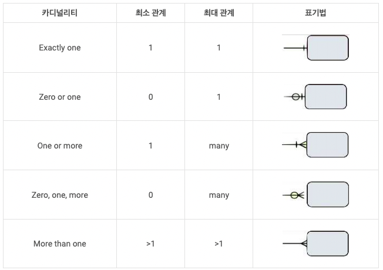

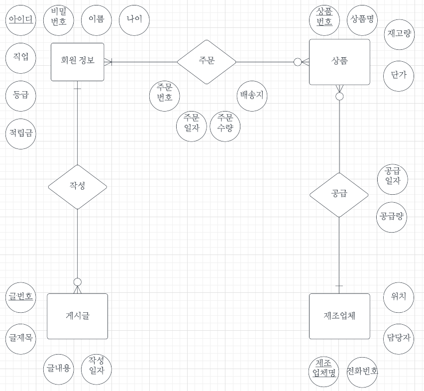

### 3. 논리적 설계

관계 모델을 통해 개념적 모델을 논리적으로 표현
개념적 스키마 -> 논리적 스키마

* ER 다이어그램과 관계 데이터 모델의 차이점
  * ER 모델은 Entity와 Relationship을 구분하지만 관계 데이터 모델은 모두 릴레이션으로 표현
  * ER 모델은 Multivalued Attribute, Composite Attribute를 표현하지만 관계 데이터 모델은 허용하지 않음
  * ER 모델은 Cardinality, participation constraint도 관계 데이터 모델에서는 그에 맞는 표현으로 변경이 필요

**릴레이션 스키마 변환 규칙**

규칙 1. 모든 개체는 릴레이션으로 변환한다.
규칙 2. n:m 관계는 릴레이션으로 표현한다.
규칙 3. 1:n 관계는 외래키로 표현한다.
규칙 4. 1:1 관계는 외래키로 표현한다.
규칙 5. Multivalued Attribute는 릴레이션으로 표현한다.

**규칙 1. 모든 Entity(개체)는 릴레이션으로 변환한다**

Entity name -> Relation name
Entity attribute -> Relation attribute
Entity key attribute -> Relation primary key
Compose attribute(복합속성)이 있는 경우는 Compose attribute의 attribute를 Relation의 attribute로 변경

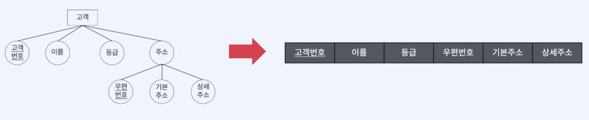

**규칙 2. n:m Relationship(관계)는 릴레이션으로 표현한다**

Relationship name -> Relation name
Relationship attribute -> Relation attribute
관계에 참여하는 기본 키를 관계 릴레이션에 포함시키고 외래키로 지정한다.

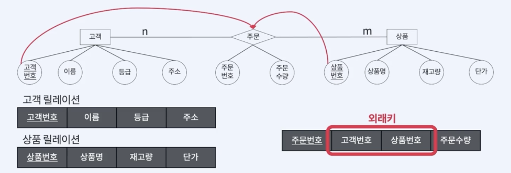

**규칙 3. 1:n Relationship(관계)는 외래키로 표현한다**

1:n 관계에서 1측 Entity 릴레이션의 기본키를 n측 Entity 릴레이션에 포함시킨다. 이 때 외래키로 지정한다.
Relationship에 있던 attribute들도 n측 릴레이션에 포함시킨다.

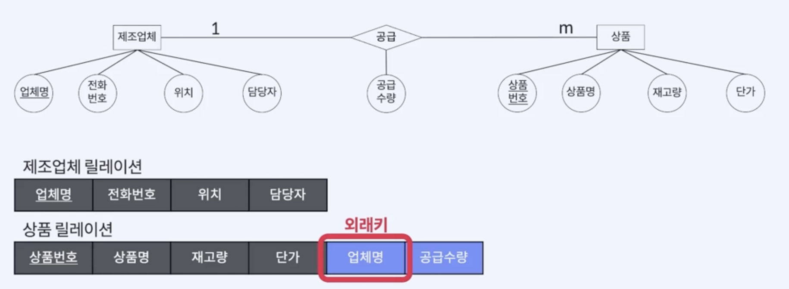

추가로, Weak Entity - Weak Relationship이 참여하는 일대다 관계는 parent entity의 기본키를 외래키로 지정한다.

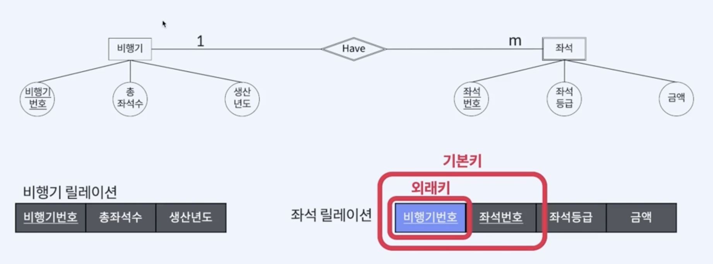

**규칙 4. 1:1 Relationship(관계)는 외래키로 표현한다.**

1:1 관계도 1:n 관계과 마찬가지로 릴레이션이 아닌 외래키로 표현한다.
데이터 중복을 피하기 위해 참여 특성에 따라 다르게 처리한다.

* **규칙 4-1** : 일반적인 일대일 관계는 외래키를 서로 주고 받는다.

  * 관계에 참여하는 개체 릴레이션들이 서로 기본키를 외래키로 지정

  * 관계의 속성들도 모든 개체 릴레이션에 포함
  * **데이터 중복 발생이 가능하기 때문에 왼쪽 모습을 선호**

	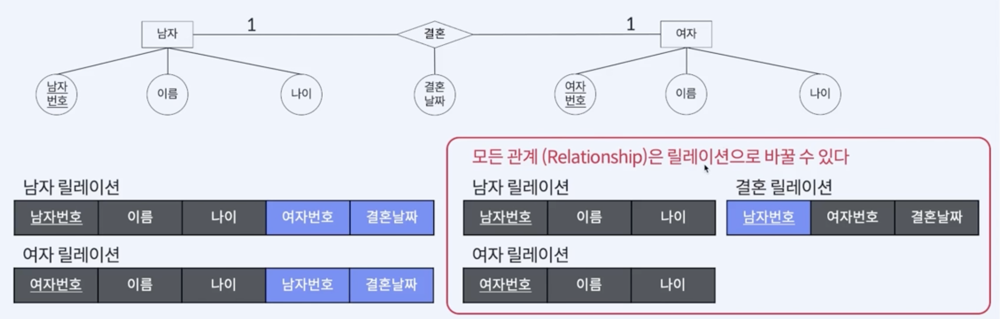

* **규칙 4-2** : 필수적으로 참여하는 개체 릴레이션만 외래키를 받는다.

  * 일대일 관계에 필수적으로 참여하는 개체가 있는경우, 필수 참여 개체의 릴레이션만 외래키를 받는다.
  * 관계의 속성들은 필수적으로 참여하는 개체의 릴레이션에 포함

  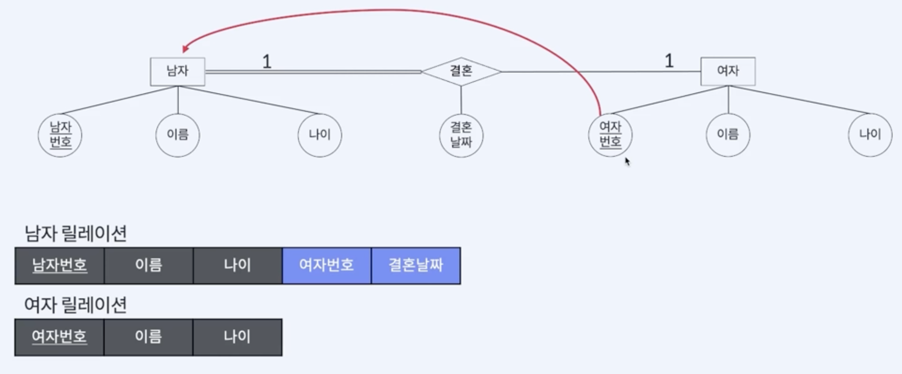
  
  

* **규칙 4-3** : 모든 개체가 일대일 관계에 필수적으로 참여하면 릴레이션 하나로 합친다. 

  * 관계에 참여하는 개체 릴레이션들을 하나으 릴레이션으로 합친다.
  * 관계 이름을 릴레이션 이름으로 사용, 참여하는 두 개체의 속성들을 다 포함
  * **두 개체 릴레이션 키 속성을 조합하여 기본키로 지정.** 
  * 관계의 속성들은 필수적으로 참여하는 개체의 릴레이션에 포함

  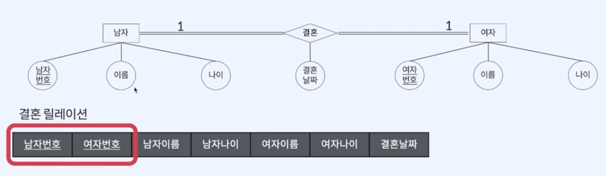

**규칙 5. Multivalued Attribute은 릴레이션으로 변환한다**

다중 값 속성은 릴레이션에서 허용하지 않기 때문에, 이 속성을 가지고 있던 개체의 기본키를 외래키로 포함시킨다.
다중 값 속성으로 만들어진 새로운 릴레이션의 기본키는 다중값 속성과 외래키를 조합하여 지정

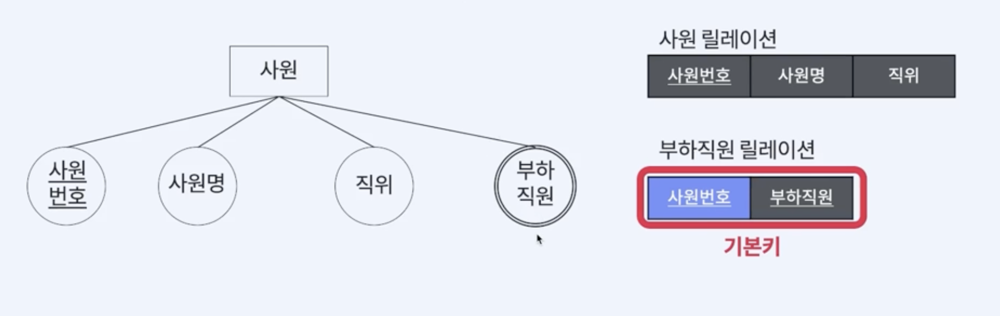

**릴레이션 작성**

회원정보 릴레이션

| <u>아이디</u> | 비밀번호 | 이름 | 나이 | 직업 | 등급 | 적립금 |
| ------------- | -------- | ---- | ---- | ---- | ---- | ------ |

상품 릴레이션 1:n

| <u>상품번호</u> | 상품명 | 재고량 | 단가 | <u>제조업체명</u> | 공급일자 | 공급량 |
| --------------- | ------ | ------ | ---- | ----------------- | -------- | ------ |

주문 릴레이션 m:n 

| <u>주문번호</u> | <u>아이디</u> | <u>상품번호</u> | 주문일자 | 주문수량 | 배송지 |
| --------------- | ------------- | --------------- | -------- | -------- | ------ |

게시글 릴레이션 1:n 

| <u>글번호</u> | 글제목 | 글내용 | 작성일자 | <u>아이디</u> |
| ------------- | ------ | ------ | -------- | ------------- |

제조업체 릴레이션

| <u>제조업체명</u> | 담당자 | 전화번호 | 위치 |
| ----------------- | ------ | -------- | ---- |

**테이블 작성**

회원정보 릴레이션

~~~sql
CREATE TABLE 회원정보 (
  아이디 varchar(20) primary key,
  비밀번호 varchar(20) not null,
  이름 varchar(10) not null,
  나이 int,
  직업 varchar(20),
  등급 varchar(8) not null default 'bronze',
  적립금 int not null default 0,
  CHECK(등급 in ('bronze', 'silver', 'gold', 'vip'))
);
~~~

상품 릴레이션

~~~sql
CREATE TABLE 상품 (
  상품번호 int primary key,
  상품명 varchar(20) not null,
  재고량 int,
  단가 int,
  제조업체명 varchar(20),
  공급일자 date,
  공급량 int not null,
  FOREIGN KEY (제조업체명) REFERENCES 제조업체(제조업체명)
);
~~~

주문 릴레이션

~~~sql
CREATE TABLE 주문 (
  주문번호 int primary key,
  아이디 varchar(20) not null,
  상품번호 int not null,
  주문일자 date not null,
  주문수량 int not null,
  배송지 varchar(50) not null,
  CHECK(주문수량 > 0),
  FOREIGN KEY(아이디) REFERENCES 회원정보(아이디),
  FOREIGN KEY(상품번호) REFERENCES 상품(상품번호)
);
~~~

게시글 릴레이션

~~~sql
CREATE TABLE 게시글 (
  글번호 int primary key,
  글제목 varchar(256) not null,
  글내용 TEXT,
  작성일자 date,
  아이디 varchar(20),
  FOREIGN KEY(아이디) REFERENCES 회원정보(아이디)
  ON DELETE SET NULL
  ON UPDATE CASCADE
);
~~~

제조업체 릴레이션

~~~sql
CREATE TABLE 제조업체 (
  제조업체명 varchar(20) primary key,
  담당자 varchar(20) not null,
  전화번호 varchar(11) not null,
  위치 varchar(256)
);
~~~

