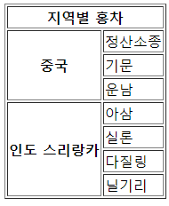

# HTML

* url : ubiform resource location

  웹에서 표준으로 정한 서버 식별방법 

* 프로토콜 : tcp, http, ftp, telnet, jdbc 모든 컴퓨터의 통신 약속/서버와 클라이언트의 규칙, 약속


## 태그, 속성, 요소

```html
<h1  title  ="header"> hello </h1>
태그 속성이름 속성값
```


## 태그


### 특수문자

| &nbsp | 공백 |
| ----- | ---- |
| &lt   | <    |
| &gt   | >    |
| &amp  | &    |


### a 태그

#### 외부 페이지

```html
<head>
</head>
<body>
<a href="http://www.naver.com">네이버</a>
</body>
```

#### 내부 페이지

```html
<head>
    
</head>
<body>
<a href="#alpha">Alpha로 이동</a>
    
<h1 id="alpha">Alpha</h1>
<p>Alpha에 대한 내용</p>
</body>
```


### 목록태그

#### ordered list

```html
<ol>
  <li>1번</li>
  <li>2번</li>
  <li>3번</li>
</ol>
```

#### unordered list

```html
<ul>
  <li>1번</li>
  <li>2번</li>
  <li>3번</li>
</ul>
```


### 테이블태그

* th 표의 제목 셀 // tr 행 // td 열

```html
<head>
</head>
<body>
	<table border="1">
		<th></th><th>월</th><th>화</th><th>수</th><th>목</th><th>금</th>
		<tr><td>1교시</td><td>영어</td><td>국어</td><td>수학</td><td>과학</td><td>사회</td></tr>
		<tr><td>2교시</td><td>영어</td><td>국어</td><td>수학</td><td>과학</td><td>사회</td></tr>
	</table>
</body>
```

* colsapn 행 차지 // rowspan 열 차지

```html
<head>
</head>
<body>
	<table border="1">
		<tr><th colspan="2">지역별 홍차</th></tr>
        <tr><th rowspan="3">중국</th><td>정산소종</td></tr>
        <tr><td>기문</td></tr>
        <tr><td>운남</td></tr>
        <tr><th rowspan="4">인도 스리랑카</th><td>아삼</td></tr>
        <tr><td>실론</td></tr>
        <tr><td>다질링</td></tr>
        <tr><td>닐기리</td></tr>
	</table>
</body>
```




### 미디어 태그

#### img 태그

* 속성

  src / alt / width / height

  ```html
  
  ```

  http://localhost:9090 => / 임을 알고

  /htmltest/images/americano.jpg => 절대경로

  images/americano.jpg => 상대경로

#### audio, video 태그

* 속성

  src, preload, autoplay, loop, controls, width, height

```html
<video conrols="controls">
	<source src="google.mp4" type="video/mp4">
</video>
```


#### 입력 양식 태그

* input 태그의 타입

| text, password  | 키보드 입력(화면 감추어서)                             |
| --------------- | ------------------------------------------------------ |
| checkbox, radio | 화면에 출력 다중/단일 마우스 선택                      |
| hidden          | action 속성 지정 파일 특정값 전송, value 필수          |
| file, image     | 파일 선택창 열림                                       |
| submit          | 클릭 버튼 / 기능 action 속성 지정파일로 전송           |
| reset           | 클릭 버튼 / 입력취소, 전송취소                         |
| button          | 클릭 버튼 / 내장기능 없음 사용자 정의 동작(javascript) |
| html5 추가 타입 | 브라우저마다 다르거나 미지원함 특정 값으로 변경해줌    |
| color           | 16진수로 넘어감 R G B                                  |
| date            | yyyy-mm-dd                                             |
| email           |                                                        |
| number          |                                                        |
| range           | 0 ~ 100 사이 값, max값 min값 설정가능                  |

* form 속성

| action | 전송 위치 action="http://www.naver.com"                      |
| ------ | ------------------------------------------------------------ |
| method | 전송 방식 get, post<br />get은 누르면 주소에 데이터를 입력해서 전달<br />post는 데이터를 별도로 전송 |

* form  태그에 들어가는 입력양식

| input                            | 1줄씩 입력                                                   |
| -------------------------------- | ------------------------------------------------------------ |
| select                           | option, optinfroup 이용해서 목록 만듦 / <select multiple="multiple" |
| textarea                         | clos 너비/rows 높이 => 너비=글자/높이=줄  / 키보드 여러줄 입력 |
| select<br />optgroup<br />option | 선택 양식 생성<br />옵션 그룹화<br />옵션 생성               |


```html
<head>
</head>
<body>
	<form action="전송위치" method="전송방식">
        <input type="submit" name="search" value="눌러줭">
    </form>
</body>
```

#### label 태그

* label 태그 for 속성에 input태그의 id 속성을 입력하면 그 input 태그에 자동으로 포커스가 간다.

```html
<form>
    <table>
        <tr>
             <td><label for="name">이름</label></td>
		    <td><input id="name" type="text"></td>
        </tr>
    	<tr>
        	<td>성별</td>
            <td>
            <input id="man" type="radio" name="gender" value="m"> 
                								//radio에서 name을 같게 해야 하나만 선택된다
            <label for="man">남자</label>
            <input id="woman" type="radio" name="gender" value="w">
            <label for="woman">여자</label>
	        </td>
        </tr>
    </table>
    <input type="submit" value="가입">
</form>
```


### 공간분할태그

* div - 블록 형식의 공간
* span - 인라인 형식의 공간

| 블록 형식 태그 | 인라인 형식 태그 |
| -------------- | ---------------- |
| div            | span             |
| h1 ~ h6        | a                |
| p              | input            |
| 목록 태그      | 글자 형식 태그   |
| 테이블 태그    | 입력 양식 태그   |


### 시맨틱 태그

```html
<body>
    <header> //머리말
    	<h1>제목</h1>
    </header>
    <nav> //하이퍼링크들을 모아 둔 내비게이션
    	<ul>
            <li><a href="#">메뉴1</a></li>
            <li><a href="#">메뉴2</a></li>
            <li><a href="#">메뉴3</a></li>
        </ul>
    </nav>
    <section> //문서의 장이나 절에 해당하는 내용
    	<article> //본문과 독립적인 콘텐츠 영역
        	<h1>안녕하세요</h1>
            <p>안녕하세요</p>
        </article>
    </section>
    <footer> //꼬리말
    	<address>서울특별시 강서구 마곡동</address>
    </footer>
</body>
```


