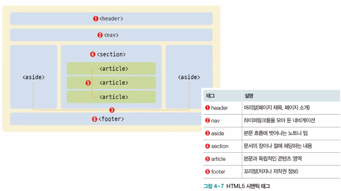
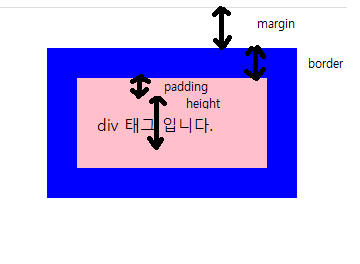

# Web

* url : uniform resource location

  웹에서 표준으로 정한 서버 식별 방법

  http://ip.port/a.html / http://70.1.2.100:1521/a.html => ip.port 번호를 이름으로 http://www.google.com/a.html

  프로토콜 - tcp, http, ftp, telnet, jdbc 인터넷 모든 컴퓨터 약속 통신 방식 / 서버와 클라이언트의 규칙, 약속

  


## HTML

* 웹 클라이언트 기술 = (웹 브라우저 실행 - 웹서버 요청시 다운로드) =  웹 표준 2.0
* html5 + css + javascript

### 구성요소 (태그 + 요소)

```html
<h1> 안녕하세요 </h1> 
 <!-- 이미지 표시기능 -->
부가적 설명.src 속성 이미지이름 
alt 속성 = 이미지 표시 불가능한 경우 대체 문자열
```


### 글자 태그

```html
<h1>제목1</h1>

<hr> <!-- 수평선 -->
&nbsp; <!-- 공백 -->
<p>
단락 &nbsp;&nbsp;&nbsp;단락<br>
2번재 줄 <br>
3번 째 줄 <br>
</p>
```

## 게시판 메뉴

```html
orderd list
<ol 속성 = "값">
	<li>뉴스게시판</li> //자동 줄바꿈 기능 있음
	<li>경제게시판</li>
	<li>코로나게시판</li>
    unorderd list
		<ul type = "square">
		    <li>오늘현황</li>
    		<li>총 발생현황</li>
    		<li>접종 현황</li>
		</ul>
</ol>
```

## 테이블 태그

```html
<table border = 1>
	<tr> <td> 자바 </td> <td> 웹 </td> <td> ai </td> </tr>
    <tr> <td> 85 </td> <td> 100 </td> <td> 90 </td></tr>
    <tr> <td colspan = 3> 총점</td> <td> 
        평균 </td> <td> colspan=2 1등 점수 </td></tr> <!--html은 연산, 변수 없음 -->
    <!-- 자바 넣을 수 잇다고 함 <% ? %> -->
</table>

<table border = 2>
	<caption>카페 메뉴</caption>
	<tr><td rowspan = 3>커피</td><td>아메리카노</td></tr>
	<tr><td>카페라떼</td></tr>
	<tr><td>바닐라라떼</td></tr>
	<tr><td rowspan = 2>에이드</td><td>레몬에이드</td></tr>
	<tr><td >자몽에이드</td></tr>
	<tr><td rowspan = 3>디저트</td></tr>
	<tr><td>샌드위치</td></tr>
</table>
```

## 미디어 태그

```html
img
audio, video
video
```

## 경로

* http://localhost:9090 => / 임을 알고

  /htmltest/images/americano.jpg => 절대경로

  images/americano.jpg => 상대경로

## 입력 양식 태그

* name="role" => 변수인데 html에서 쓰는게 아닌 action으로 연결된 곳에 쓰일 변수임
* type = "hidden" value가 꼭 있어야함. 사용자에게 입력 받는게 아닌  붙어서 받는 내용

### input 태그의 타입

| text, password  | 키보드 입력(화면 감추어서)                             |
| --------------- | ------------------------------------------------------ |
| checkbox, radio | 화면에 출력 다중/단일 마우스 선택                      |
| hidden          | action 속성 지정 파일 특정값 전송, value 필수          |
| file, image     | 파일 선택창 열림                                       |
| submit          | 클릭 버튼 / 기능 action 속성 지정파일로 전송           |
| reset           | 클릭 버튼 / 입력취소, 전송취소                         |
| button          | 클릭 버튼 / 내장기능 없음 사용자 정의 동작(javascript) |
| html5 추가 타입 | 브라우저마다 다르거나 미지원함 특정 값으로 변경해줌    |
| color           | 16진수로 넘어감 R G B                                  |
| date            | yyyy-mm-dd                                             |
| email           |                                                        |
| number          |                                                        |
| range           | 0 ~ 100 사이 값, max값 min값 설정가능                  |

### form  태그에 들어가는 입력양식

| input    | 1줄씩 입력                                                   |
| -------- | ------------------------------------------------------------ |
| select   | option, optinfroup 이용해서 목록 만듦 / <select multiple="multiple" |
| textarea | clos 너비/rows 높이 => 너비=글자/높이=줄  / 키보드 여러줄 입력 |
|          |                                                              |

## 공간 분할 태그

* 기능 - 표현하는 건 없음 ㅡ 그러나 다른 태그들을 그룹지어서 의미있는 공간을 차지하도록 만듦
* div 블록형식 공간분할, span 인라인형식 공간분할
* 시맨틱 태그 - html5가 되면서 추가된 의미있는 태그
  * div와 span으로 충분히 만들 수 있다.



* html5 - video, audio, header, footer, section, aside, article

```html
<div id="pink">
    <a>
	    <h1>
        
    	</h1>
	</a>
</div>
<div>
   	<a>
		<h1>
        
    	</h1>
	</a>
</div>
```

## CSS - Cascading Style Sheet

* cascade - 폭포처럼 떨어진다. => 태그에 효과들이 내부에 다 전달된다.

```html
<head>
<title>브라우저 탭 제목</title>    
	<style>
        #pink {color : red;} <!--pink라는 아이디에 적용해라-->
    </style>
</head>
<body>
    
</body>
```

* css 적용 방법

  1. inline 방식 정의 : 특정 태그에만 정의할 때<태그 style="css속성명:값;"> 

     ```html
     <h1 style="color:red;"> </h1>
     ```

  2. 현재 파일 head 태그 내부에 style 태그 정의 방식

     ```html
     <head>
         <style type="text/css">
             h1 {color:blue;}
         </style>
     </head>
     ```

  3. 외부  css 파일을 만들어서 연결하는 방식

     ```html
     <head>
         <link href="share.css" type=text/css rel="stylesheet">
     </head>
     ```

  * css 문법

    어떤 스타일을 어떤 값으로 어떤 태그에게 적용

    ```html
    <style type="text/css">
        태그명 {color:red; background-color:green;}
    </style>
    ```

  * css 선택 중복 우선순위

    #id > tag > .class > *

## css 선택자

* css 적용 대상 태그 선택하는 - 선택자

  li, a => li a 모두

  ol li => 공백 : 포함 태그(자식의 자식의 자식... 모두) //ol 안에 있는 li 태그 

  ol > li => 부등호 : 포함 태그(내 자식만)

  li:first-child {color : lime;}

  li:last-child {color : red;}

  input[type=text] {color : red;}

## css 속성

```html
<div>
    <p>
        안녕하세요
    </p>
</div>
```

margin값(웹브라우저로부터 여백) + border값(선 굵기) + padding + 내용물 크기

* 박스 속성

  margin, border, padding, width, height



* margin

  margin : auto => 좌우 가운데로 정렬

* border

  border : solid 30px blue; = border-width: 30px / border-color : blue; / border-style : solid;

  border-radius : 10px;

  width, color, sytle, radius

* 네 방향 속성 지정하기

  margin: 0 30px 0 30px // 위 오른쪽 아래 왼쪽

  

## 가시 속성

* display : block;

## 배경 속성

