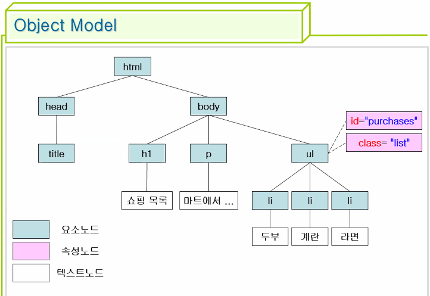
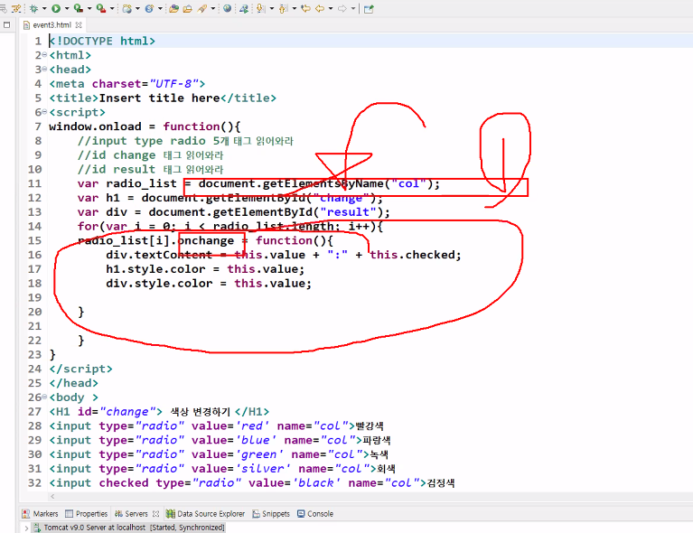

# 자바스크립트

* 기본용어

  표현식 - 값을 만들어내는 코드

  키워드 - 자바 유사

  식별자 - 자바 유사 (_, $, 숫자 문자들, 숫자 시작 불가능, 키워드 사용 불가능)

  주석 - 자바와 동일 //, /* */

  변수 - 자바와 다름

  연산자 - 자바 유사

* 문법이 자바 언어와 닮아서 java script

* html 태그에 동작 추가 언어

  script 태그 안에 자바 스크립트 문장 쓰면 됨 or script 태그 안에 src="a.js"

### 연산자

| 산술         | + - * / => 정수와 실수를 비교하지 않음<br />% ++ --    |
| ------------ | ------------------------------------------------------ |
| 비교         | > >= < <= == !=<br />===(값과 타입 둘다 동일한지 비교) |
| 논리         | && \|\| !                                              |
| 대입         | =                                                      |
| 조건삼항비교 | ?:<br />a?b:c => a true시 b, a false시 c               |

### 자료형

| 숫자   | 정수 실수 표현 가능 |
| ------ | ------------------- |
| 논리값 | true / false        |
| 문자열 | 'aaaaa', "aaaaa"    |

### 변수

| 숫자            | 정수, 실수 따로 두지 않음 |
| --------------- | ------------------------- |
| 논리값          | true/false                |
| 문자열          | ' ' , " "                 |
| 함수            | 자바의 메소드             |
| 객체(배열 포함) | 자바의 객체               |
| undefined       |                           |

* 변수 선언

  var i; / 자바와 달리 타입을 미리 선언해주지만 자바스크립트는 아님

  var / let / const

  var => 선언 후 선언을 하면서 수정 가능

  let => 선언은 1번만 가능하고 수정 가능

  const => 1번 선언후 값 수정이 안됨

  parseInt()


```javascript
var s1 = 100;
var s2 = "100";

document.write(s1 == s2);  => true
document.write(s1 === s2); => false
```


## 창?

```javascript
var input = prompt("입력하는 창");

var input2 = confirm("true, false 나오는 창")
```


* Nan = not a number // 숫자가 아니어서 계산을 못하는 상황

  ```javascript
  if( !isNaN(input1) ) {
      input1 = parseInt(input1);
  }
  ```


## 자바스크립트의 배열

* 자바의 ArrayList처럼 동적인 길이를 갖고있다.
* 여러개 자료형(타입이란 말이 없음) 저장이 가능하다
* 문법 차이가 있다.

```javascript
var a1 = [1, 3.14, 'java', true, undefined, null]; //배열 선언 생성 초기화
var length = a1.length; =>6
a1[0] => 1
a1[5] => null
a1[6] = "추가합니다"; => 이렇게 추가 할 수 있음.
a1[0] = 100; => 수정할 수 있음
```

### 편리한 반복문

```javascript
a1.join(",");
=> a1 배열의 0 ~ 마지막 인덱스의 데이터를 각 분리해서 가져다줌
```

```javascript
var a1 = [1, 3.14, true, "javascript", [1,2,3], undefined, null];

a1[a1.length-1] = "수정";
a1[4][0] = 10; =>이렇게 배열 안에 배열을 바꿀 수 있다.
a1[10] = "10번 인덱스" => 이렇게 하면 a1[7] a1[8] a1[9]는 undefined로 바뀐다!!
```


## 자바와 같은 키워드

* switch-case
* while
* do-while
* break
* continue


* 자바스크립트로 구현하기

  ```javascript
  for(var i = 1 ; i < 6 ; i++){
  		document.write("<tr>");
  		document.write("<td>" + i + "</td><td><a href=''>제목</a>" + i + "</td><td>작성자" + i + "						</td><td>" + i*10 + "</td>");
  		document.write("</tr>");
  }
  ```


## 자바스크립트 함수

* 자바의 메소드와 유사 / 기능 유사

  * 자바스크립트의 함수

    function 함수명(i , j , k) {

    ...

    return xxx;

    }

* return 값이 없으면 호출해도 undefined로 뜬다.

| 무명 함수<br />var r1 = (function (i,j,k){<br />return xxx;})(1, 2 , 3); <br />=> 1, 2, 3 바로 호출이 됨 |
| ------------------------------------------------------------ |
| 무명함수 응용<br />var contents = function(i,j,k){<br />retun xxx;}<br />=> 함수 내용을 정의<br />=> contents(1,2,3); => 실행을 할 수 있다. |


### 자바스크립트는 함수를 읽고 그 후 변수를 읽는다

| 유명 함수 선언한 것에 무명함수로 유명함수의 함수명과 같은 변수 이름으로 주면 무명함수로 바뀐다 |
| ------------------------------------------------------------ |
| function f1(){<br/>	return 100;<br/>}<br/><br/>var f1 = function(){<br/>	return 200;<br/>}<br />document.write(f1) => 200; |


### 함수를 매개변후로 전달

```javascript
function test () {alert("테스트 함수 실행"); }

function f2(f) {
    f();
}

f2(test);
```


* 자바스크립트 라이브러리

  객체 window.메소드명() => 메소드명() 가능

  window.document.write()

  window.alert()

  window.parseInt()

  window.callback

  * callback 함수

  window.setTimeout(함수)

  * setTimeout(f, t) {t 시간 경과 후에 f 함수 내용을 실행}
  * f(); => 즉각 실행
  * callback 함수를 갖는 대표적

콜백?

```javascript
function now() {
    var t = new Date().toLocaleTimeString();
    document.getElementById("here").innerHTML = t;//setter
}
//alert(document.getElementById("here").innerHTML);//getter

var id = setInterval(now, 1000); //1초마다 1번씩 시각 표시

function stop() {
    clearInterval(id);
}

setTimeout(stop, 5000);
setTimeout(function ({clearInterval(id);} , 5000);
```


## 객체

window(내장객체)

window.포함객체

window.함수

* Date 내장객체

  new Date()

  Date.toLocaleTimeString();

  Date.toLocaleDateString();

* "abcd".indexOf('b') => -1 or 0 or 1 가져오겠지
* "abcd".subString(1, 2) => "ab" 
* "a,aa,a".split(",") => [a, aa, a]

var array = "a,aa,a".split(",");

```javascript
var 배열변수명 = []; - 이건 배열
var 객체변수명 = {}; - 이건 객체

자바스크립트에서 객체 만드는 방법
var 객체변수명 = {id:1 , name:"이자바", test:function(){....}}

객체에서 변수, 함수 호출방법
객체면수명.id
```

```javascript
	var emp2 = {
			id:200,
			name:'박대리',
			salary:56000.00,
			print:function(){
				document.write("<h3>"+this.id+":"+this.name+":"+this.salary+"</h3>");
                			//id랑 name은 전역변수가 아니기에 객체 내부 변수라고 말 해야됨
			},
			getBonus:function(){
				return this.salary*0.5;
			}
	}
    emp2.print();
    document.write((emp2.name + "의 보너스 = " + emp2.getBonus());
```


* 함수에서도 무명함수가 있듯이 객체도 무명객체가 있음

  서버가 클라이언트한테 데이터 보내서 

* java script object notation => json 타입 데이터로 규칙을 추가함

  String 타입은 다 " " 로 묶어라 그래야 다른 프로그램에서 이해하니까

  ```javascript
  {
  "id":200,
  "name":"박대리",
  "salary":56000.00,
  "print": "100:xxx:"
  }
  ```
  
  

## 자바스크립트의 생성자 

```javascript
	function Employee(id, name, salary){
		this.id = id; //객체의 id 변수에 초기값
		this.name = name;
		this.salary = salary;
		this.print = function(){
			document.write("<h3>"+this.id+":"+this.name+":"+this.salary+"</h3>");
		}
	}
	
	var emp3 = new Employee(300, '최과장', 66000.5);
	var emp4 = new Employee(400, '이과장', 66000.5);
	var emp5 = new Employee(500, '김부장', 76000.5);

	emp3.print();
	emp4.print();
	emp5.print();

	document.write( emp1.constructor + "<br>"); //생성자로 만든게 아니라서 그냥 객체다 라고 나옴
	document.write( typeof emp3 + "<br>");
	document.write( emp3.constructor + "<br>");
	document.write( (emp3.constructor == Employee)+ "<br>");
```


## 문서 객체 모델

1. document object model - DOM
2. HTML 태그를 자바스크립트 객체 변환 타입
3. html태그 정적 구성 - 자바스크립트 



```javascript
<script type="text/javascript">
function action(){

//태그 읽어와라 dom으로시작
var h1_first = document.getElementById("first"); //위 h1을 객체모양으로 설계
h1_first.innerHTML = "Process - 3";
h1_first.style.color = "red";
h1_first.style.border = "1px solid green"; //문서를 조작하는 방법

var a = document.getElementById("third");
alert(a.href);
a.href="";

alert(h1_first.href); //안보인다 h1의 href가 없으니까 href는 a꺼임
}

//setTimeout(action, 1000); //1. 시간을 지연해서 실행 순서를 바꾸는 방법
window.onload = action; //2. 윈도우 로딩이 완료되면(</html>이 끝나면) 함수를 실행해라
</script>

<h1 id="first"> Process - 1</h1>
<h1> Process - 2</h1>
<a id="third" href="http://www.naver.com"> 네이버로 이동</a>
```

태그를 얻어오기

```javascript
<body>
<h1 id="test1">Process - 1</h1>
<h1 class="test2">Process - 2</h1>
<a id="test1" href="">링크1</a><br>
<a class="test2" href="b.html">링크2</a><br>
<a class="test2" href="c.jsp">링크3</a><br>
<script>
	var one_tag = document.getElementById("test1");<!-- 1.같은 html 파일 내부 id 중복x 
    													그러나 실제 실행은 가능함
													2. 1개 태그밖에 리턴이 안됨-->
	alert(one_tag.tagName);
	var array = document.getElementsByTagName("h1"); //태그는 1개라도 배열로 얻어짐
	alert(array[0].innerHTML);
	var array2 = document.getElementsByClassName("test2"); //클래스도 얻을 수 있다.
	alert(array2[0].innerHTML;)
	
	//a href 속성 c.jsp 인 태그를 선택하는 방법
	//a[href=c.jsp]
	var one_tag2 = document.querySelector("a[href='c.jsp']"); //정교하게 css선택
	alert(one_tag2.innerHTML);
	
	var array3 = document.querySelectorAll("a[href*=html]")
	alert(array3.length);
	alert(array3[0].innerHTML);
	alert(array3[1].innerHTML);

	//a태그와 h1 태그 선택
	var array4 = document.querySelectorAll("a", "h1");
	var array5 = document.querySelectorAll("a #test1"); //a태그에서 포함중인것중에 id가 test1인것
	var array6 = document.querySelectorAll("a#test1"); //a태그이면서 id가 test1인것
</script>
```


* 이미지들 읽어오기 document.getElementByTagName("img");

  ```javascript
  <body>
  <h1> 링크 목록은 다음과 같습니다. </h1>
  <a href="americano.html"> americano 주문페이지  링크 </a><br>
  <a href="blackcoffee.html"> blackcoffee 주문페이지  링크 </a><br>
  <a href="cafelatte.html"> cafelatte 주문페이지  링크  </a><br>
  <a href="coffee.html"> coffee 주문페이지  링크  </a><br>
  <a href="drinks.html"> drinks  주문페이지  링크 </a><br>
  
  
  
  
  
  
  
  <div id="result">여기에 결과가 출력됩니다.</div>
  <script>
  /* 1. 1초 후 이미지들 가로 세로 150px 변경
  2. id result 태그 내부에 
  ul / li americano.html - americano.jpg 5줄 출력 이런 5개가 되야댐 a태그 갯수만큼
  		a href 속성값 - img src속성 파일 이름 */
  		function action(){
  			var img_list = document.getElementsByTagName("img");
  			var a_list = document.getElementsByTagName("a");
  			var div = document.getElementById("result");
  			div.innerHTML = "<ul>";
  			for(var i = 0 ; i < img_list.length ; i++){
  				/* img_list[i].style.width = "150px"
  				img_list[i].style.height = "150px"; */
  				img_list[i].width = 150;
  				img_list[i].height = 150;
  				
  				var href_list = a_list[i].href.split("/");
  				var src_list = img_list[i].src.split("/");
  				div.innerHTML += "<li>" + href_list[href_list.length-1] + " - " + src_list[src_list.length-1] + "</li>"
  			}
  			div.innerHTML += "</ul>";
  		}
  		setTimeout(action, 1000);
  		
  		
  		
  		/* var img_src = document.querySelectorAll("img src");
  		var a_href = document.querySelectorAll("a href");
  		document.write(img_src[0]);
  		
  		id_ac.innerHTML = a_href[0] + "-" + img_src[0].substring(18)
  		 */
  </script>
  ```

  

## 이벤트 

* 키보드나 마우스 동작

  * 마우스 이벤트 - 모든 html 태그 가능
  * 키보드 이벤트 - input type = text/password 이런 경우만 가능
  * 포커스 이벤트 - 모든 html 태그 가능
  * 구조 변화 이벤트 - input type = checkbox / radio, select option
  * 터치 이벤트 - 터치하는 기계에 따라 종속적

  

* 이벤트발생객체.on이벤트종류 = 이벤트핸들러함수

  window.onload = action;

  window로딩 완료되면 함수 실행해라

  자바스크립트객체.onkeypressed = function(){};

  자바스크립트객체.onchange = function(){};

  자바스크립트객체.onsubmit = function(){};

  document.getElementById("aa").onclick = 함수;

  

  

  

```html
<!DOCTYPE html>
<html>
<head>
<meta charset="UTF-8">
<title>Insert title here</title>

<script>
window.onload = function (){
	var div_test = document.getElementById("test");
	div_test.onclick = function(){
		this.style.color = "pink";
	}
	div_test.onmouseover = function(){
		this.style.color = "red";
	}
	div_test.onmouseout = function(){
		this.style.color = "blue";
	}
	
	var phone = document.querySelector("input[type=text]");
	//var phone = document.getElementsByName("phone");
	phone.onkeyup = function(e){ //매개변수 선언 - keyup 이벤트 처리하는 객체 의미
		//0 ~ 9 => 48~57
		if(e.keyCode >= 48 && e.keyCode <= 57){
			document.getElementById("result").innerHTML = "적합";
		}
		else{
			document.getElementById("result").innerHTML = e.keyCode + "부적합";
		}
	}
	var form = document.getElementsByTagName("form")[0];
	form.onsubmit = function(event){
		event.preventDefault(); // submit에 
		document.getElementById("result").innerHTML = "전송하는 기본 동작을 취소했습니다";
	}
	var a = document.querySelector("div > a")//div a =>div이면서 a/ div > a div바로 밑 자식태그a
	a.onclick = function(ev){
		ev.preventDeault();
	}
	
	var radio_list = document.querySelectorAll("input[type=radio]");
	for(var i = 0 ; i < radio_list.length ; i++){
		radio_list[i].onchange = function(){
		document.getElementById("result").innerHTML =this.value;
		}
	}
}

</script>
</head>
<body>

<div><a href="a.html">a.html로 이동</a></div>
<a href="c.html">c.html로 이동</a>

<div id="test">여기를 클릭하면 핑크로 변합니다.</div>
<form action="b.jsp">
	폰번호:<input type=text name="phone"><br><!-- 원하는 형태의 경고문구 만들기 onkeyxxx -->
	<div id="result"></div>
	<input type=radio name="title" value="사원"> 사원
	<input type=radio name="title" value="사원"> 대리
	<input type=radio name="title" value="사원"> 과장
	<input type=radio name="title" value="사원"> 부장
	<input type=submit value="전송">
	
</form>
</body>
</html>
```

```html
<!DOCTYPE html>
<html>
<head>
<meta charset="UTF-8">
<title>Insert title here</title>
<script>
	window.onload = function(){
		var col = document.querySelectorAll("input[type=radio]")
		var div = document.getElementById("result");
		var change = document.getElementById("change");
		for(var i = 0 ; i < col.length ; i++){
			col[i].onchange = function(){
				change.style.color = this.value;
				col[i].style.color = this.value;
				div.textContent = this.value + ": " + this.checked;
				div.style.color = this.value;
			}
		}
		
		
	}
</script>
</head>
<body >
<H1 id="change"> 색상 변경하기 </H1>
<input type="radio" value='red' name="col">빨강색
<input type="radio" value='blue' name="col">파랑색
<input type="radio" value='green' name="col">녹색
<input type="radio" value='silver' name="col">회색
<input checked type="radio" value='black' name="col">검정색

<div id='result'> </div>

</body>

</html>
```


