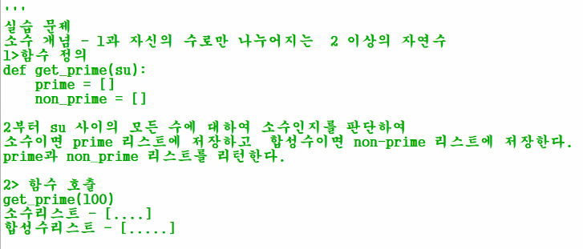

# Python 정리

## 단일 데이터

* 자바와 달리 변수 이름만 선언 불가

  * d; (x) // d = Null (o)

* 자바스크립트와 달리 자동형변환 없음

  str, int, float

  ```python
  d1 = 'python'
  d2 = 200
  d1 + d2 (x)
  d1 + str(d2) (o)
  ```

## 다중 데이터

* list

  ```python
  list = [1, 3.14, '리스트', True, [1,2,3]]
  print(list) => 리스트 그대로 나옴
  list[2]
  list[1:5]
  list+list
  list*3
  len(list) => 리스트 길이
  
  list[5] = "새로 추가"
  list[5] = "기존 변경"
  list.append("마지막에 추가")
  list.insert(2, "정해진 위치에 추가")
  list.pop() => 마지막 데이터 삭제
  list.pop(2) => 2번째 요소 삭제
  list.remove(1) => 첫번째로 나오는 1이라는 데이터를 삭제
  list.remove(True)
  del list[0] => 특정 인덱스 값 삭제
  ```

* tuple

  ```python
  tuple1 = (1, 2, 3, 4, 5) => 튜플은 수정이 불가
  tuple2 = 1, 2, 3, 4, 5
  tuple3 = 1,
  t1, t2, t3, t4, t5 = tuple1 => 변수 설정해서 값 받아오기
  ```

* dictionary

  ```python
  dic1 = {"id":1, "pw":2, "title":"파이썬", "finish":True}
  => key와 value로 이루어짐
  
  dic1['pw'] = 1234 => vlaue 변경
  dic1['pww'] = 1234 => key가 존재하지 않아 키 밸류 추가
  print(dic1['pw']) => value 호출
  
  dic1.keys() => dict_keys(['','',''])
  dic1.values() => dict_values(['','',''])
  dic.items() => dict_items([,],[,],[,])
  => 리스트가 아님
  ```

* 내장 함수

  ```python
  dir(__builtins__) => 내장함수 목록
  dri(dir(list1)) => list1에 적용 가능한 내장함수 목록
  keyword.kwlist => 파이썬 키워드 목록
  ```

  

## 메소드

* subString 함수 없이 사용 가능

  ```python
  d1 = 'python'
  d1[0] => p
  d1[0:3] => pyth
  d1[2:] => thon
  d1[:3] => pyth
  ```

* in, find, count

  ```python
  d1 = 'multicampus'
  'cam' in d1 => True d1안에 'cam'이 있니?
  list = ['a','b','c','d']
  list in [0] => False list 안에 [0]리스트가 있니?
  
  d1.find('cam') => 5 5번째부터 보인다
  d1.count('cam') => 1 'cam'은 한 번 보인다
  ```

* sort, reverse

  ```python
  list =[1,2,6,4,3]
  list.sort() => 오름차순 정렬
  list.sort(reverse=True) => 내림차순 정렬
  list.reverse() => 리스트 요소 순서를 반대로 뒤집는다
  ```

  

* len

  ```python
  d1 = 'python'
  len(d1) => 문자 개수는 6개 
  ```

* upper, split

  ```python
  d1 = 'python'
  d1.upper() => PYTHON
  d2 = 'p-y-thon'
  d2.split("-") => ['p', 'y', 'thon']
  ```

* isnumeric

  ```python
  d1 = '21341'
  d1.isnumeric() => True 숫자로만 이루어진 문자열
  ```

* format

  ```python
  중괄호 안에 데이터 넣어주기
  "{0} {1}".format("나는", 303) => "나는 303"
  "{}".format("나는", 303) => "나는"
  ```

* input

  ```python
  키보드 입력
  print("숫자 1개를 입력하시오 : ")
  first = input()
  type(first) => str
  ```

  

## 논리 연산자

* not, and, or

  ```python
  not None => True
  not 'ab' => False #비어있는 문자열을 부정하면 True
  ```

* bool()

  ```python
  bool(0) => False #0이 아닌 수는 True
  bool('') => False #모든 리스트 형태들은 비어있으면 Flase
  ```

  

## 조건문

* 들여쓰기로 구역 구별
* import 모듈을 써야 모듈 사용 가능(파이썬이 제공하는 라이브러리)

```python
if 10 < 5 :
    print("크다")
    print ("크다2")
else :
    print("else 수행")
print("if문 상관없이 출력된다")
```


```python
import random
score = random.randint(1,100)
score = random.randrange(1,101)#같은 표현
if 100 >= score and score >= 80 :
    print("이수")
elif score >= 60 :
    print("재시험")
elif score >= 40 :
    print("재수강")
else :
    print("재입과")
print(score, "수고하셨습니다.")
```


```python
print("짝 홀수 판단할 숫자를 입력하세요")
key_num = input()
if key_num.isnumeric() :
    key_num = int(key_num)
    if key_num % 2 ==0 :
        print(key_num, " : 짝수")
    else :
        print(key_num, " : 홀수")
else :
    print(key_num, "의 타입은", type(key_num), "입니다. 숫자만 입력하세요")
```


## 반복문

* for 유한 횟수

```python
num=input();
for i in (1,2,3,4,5,6,7,8,9,10) : #튜플 데이터
    print(i)
    print("번 째 반복중")

num=input();
for i in [1,2,3,4,5,6,7,8,9,10] : #리스트 데이터
    print(i)
    print("번 째 반복중")

num=input();
for i in {1,2,3,4,5,6,7,8,9,10} : #딕셔너리 데이터 (key를 안쓰면 key와 value는 같은 값)
    print(i)
    print("번 째 반복중")
```


* while 횟수를 모를 때

```python
mynum = random.randint(1,100);
while True :
    print("숫자 입력해주세요")
    yournum = int(input())
    if yournum > mynum :
        print(yournum, "보다 작습니다.")
    elif yournum == mynum :
        print("잘했어!")
        break
    else :
        print(yournum, "보다 큽니다.")
```

* range(start, value, end)

```python
print(list(range(1, 11, 1))) #1부터 11이전값까지 1씩 증가
print(list(range(11))) #0부터 11이전까지 1씩 증가

for i in range(11):
    print(i)
    
list2 = ["python", "multi", 100, True]
print(list2)

for i in list2:
    print(i)

for i in range( len(list2) ): #range(4)이니까 0 1 2 3
    print(i, list2[i])
```

* continue와 튜플

```python
dic2 = {"k1":1, "k2":2, "k3":3, "k4":4, "k5":5}

print(type(("k1",1)))
k, v = ("k1", 1)

for k, v in dic2.items() :
    if k=='k3' :
        continue
    print(k, " 키의 값은 ", v, " 이다.")
```

 

## 함수

* 정의, 호출 방법

  ```python
  def hello():
      print("hello")
      
  hello()
  ```

* 매개변수 있는 함수

  ```python
  def message(message):
      print(message)
      
  message("hello")
  ```

  ```python
  def message_ntimes(message, n):
      for i in range(1, n+1) :
          print(message)
          
  message_ntimes("파이썬", 10)
  ```

* 기본 매개변수를 둔 함수

  ```python
  def message_ntimes(message, n=5):
      for i in range(1, n+1) :
          print(message)
          
  message_ntimes("파이썬", 10) => n을 전달 안하면 n=5
  ```

* 가변 매개변수가 있는 함수

  ```python
  def message(*message, n=5):
      for i in range(1, n+1):
          for j in message:
              print(j)
              
  message("파이썬", "자바", "sql")
  ```

  * 가변 매개변수 있는 함수 정의
    * 매개변수 앞에 * 하나면 튜플 * 두개면 딕셔너리가 된다.

  ```python
  def dynamic_message(*message, n=5):
      for i in range(1, n+1):
          for j in message :
              print(j)
              
  dynamic_message("파이썬", "자바", "sql")
  ```

  ```python
  def playerteam(**player):
      for k in player.keys():
          print('{0} 플레이어는 {1}팀이다'.format(k, player[k]))
  playerteam(박지성="한국", 이에마스="일본")
  ```

  

  * 리턴값 있는 함수

    리턴 값이 없으면 함수를 호출해서 변수에 넣을 수 없다.

    ```python
    def no_return():
        print("노 리턴")
    r = no_return() => None
    ```

  ```python
  def return():
  	print("리턴")
      result = 10 + 10
      return result, "리턴값"
  r= return => (20, "리턴값")
  type(r3) => 튜플
  
  r = return3()
  print(r[0], r[1])
  
  first, second = return3()
  print(first, second); => 20 "리턴값"
  ```

  


* 지역변수, 전역변수

```python
def var_test():
    b = 10
    print(b)
    
var_test()
print(b) => 오류 b는 지역변수니까
```

```python
global_b = "전역변수"

print(glober_b)
```

* 자바와 다르게 함수를 호출해서 전역 변수라고 값을 바꾸려해도 지역변수로 선언이 되어 값이 변경 안됨 

```python
glober_var = "전역변수"
def var_test():
    local = 10
    print(local) => 10
    global global_var #global이 this. 이랑 같은거임 이걸 선언해줘야 지역변수로 선언 안됨
    global_var = "전역변수 수정"
    
print(global_var) => 전역변수 수정 / global이 없으면 함수에서 값이 변경이 안됨
```

* 소수와 합성수 리스트 만드는 함수 만들기 실습



```python
prime =[];
non_prime = [];
a = 0
def get_prime(su):
    for i in range(2, su):
        for j in range(2, i):
            if (i % j) == 0 :
                global non_prime
                non_prime.append(i)
                global a
                a = 0
                break
            else :
                a += 1
                if a == (i-2) :
                    global prime
                    prime.append(i)
                    a = 0


get_prime(28)
print(non_prime)
print(prime)
```

* 방법2

  ```python
  def get_prime(su):
      prime=[]
      non_prime=[]
  
      for i in range(2, su+1):
          cnt = 0
          for j in range(1,i):
              if i % j == 0 :
                  cnt += 1
          if cnt == 1:
              prime.append(i);
          else :
              non_prime.append(i);
      return prime, non_prime;
  
  prime_list, non_prime_list = get_prime(100)
  print("소수리스트 - ", prime_list)
  print("합성수리스트 - ", non_prime_list)
  
  ```


* 자바스크립트와 파이썬은 함수를 변수로 취급한다

  ```python
  def call_func(func):
      func()
      
  def f1():
      print("출력")
      
  call_func(f1())
  ```

### 람다

* 리턴값이 하나일 때 람다써도 됨

```python
def f2(msg):
	return msg

f2("람다")
print( (lambda msg : msg)("람다") )
print( (lambda : "람다")() )
```


## 모듈

* import 방법

  ```python
  #기본 모듈호출
  import math
  print(math.trunc(3.54))
  
  #특정함수만 호출
  from math import trunc
  print(trunc(3.54)) => math. 을 안써도 됨
  
  #모든함수
  from math import * => 모든 함수에 대해서 math. 안써도 됨
  print(trunc(3.54))
  print(sin(50))
  
  #별칭
  import math as mt
  print(mt.trunc(3.54))
  ```

  

* random

  ```python
  import random
  
  random.randint(1, 100)
  random.randrange(1, 101)
  
  import random as ra
  ran_list = ["abc", "ABC", "가나다", 123]
  
  print(ra.choice(ran_list)); => 랜덤 하나 리스트
  print(ra.sample(ran_list, 3)); => 랜덤 3개 리스트
  ```

  

* time

  ```python
  import time
  
  time.sleep(3) => 3초 후 
  sec = time.time() => 현재시간을 초 단위로
  now = time.localtime(sec) => 현재시간을 년 단위로
  print(now) => time.struct_time(tm_year=2021, ... )
  print(now.tm_year, now.tm_mon, now.tm_mday) => 2021 9 16
  ```

* sys

  ```python
  import sys
  
  print(sys.builtin_module_names)
  print(sys.path)
  print(sys.version)
  
  for i in sys.argv: => 명령행 매개변수 #0번은 내 파일 위치가 나옴
      print(i)
  ```

* os

  ```python
  import os
  
  print(os.name)
  print(os.getcwd()) => 현재 파일 위치
  print(os.listdir()) => 현재 폴더에 파일 목록
  ```

* math 모듈

  ```python
  import math
  
  print(round(3.54)) => 반올림은 함수로 되어있어서 import가 필요없지만
  print(math.trunc(3.54)) => 버림의 경우 모듈에 있어서 import 필수
  ```

  

##  모듈 설치 

* 필요시 cmd창에서 모듈 설치

  ```cmd
  pip list #다운로드한 pip list 보여줌
  pip3 install ... #pip3 install 모듈명
  ```


## html 정보 모듈

* beautifulsoup4

  ```python
  import urllib.request as req
  from bs4 import BeautifulSoup as bs
  #파이썬으로 웹 서버 접속, 응답
  response = req.urlopen("http://www.naver.com") #접속과 응답
  print(response) #이걸론 응답 객체유형이름만 나옴 <http.client...
  
  #html 내용 받기 위해
  soup = bs(response, "html.parser")
  contents = soup.prettify()
  print(contents) #그 페이지의 html 내용이 나옴
  
  #태그만 찾아서 내용 얻기
  print(soup.find('h1')) #최초 h1 한개만 리턴 <h1>... </h1>
  print(soup.select('h1'))
  print(soup.findAll('h1')) #모든 h1 리스트 [<h1>...</h1>, ...]
  
  print(soup.find('h1').string) #태그 제거
  
  #태그의 요소 내용 얻기
  print(soup.find('img')['src'])
  print(soup.select_one('img')['src'])
  print(soup.select_one('form')['action']) #브라우저에 보여지지 않는 것을 가져올 수 있음
  
  print(soup.findAll('img')['src']) #이렇게는 못받아옴
  #반복문으로 받아오기
  img_list = soup.findAll("img")
  for img in img_list:
      print(img['src'])
  ```

  

* 날씨

  ```python
  import urllib.request as req
  from bs4 import BeautifulSoup as bs
  
  weather = req.urlopen("http://www.kma.go.kr/weather/forecast/mid-term-rss3.jsp?stnId=108")
  weather_bs = bs(weather, "html.parser")
  
  city_list = weather_bs.findAll("city")
  for s in city_list:
      print(s.string) => 서울 인천 ...
  print("총 도시 수는", len(city_list), "개 입니다")
  ```

  

* 실습

  ```python
  weather = req.urlopen("http://www.kma.go.kr/weather/forecast/mid-term-rss3.jsp?stnId=108")
  weather_bs = bs(weather, "html.parser")
  contents = weather_bs.prettyfy() => html 내용 보여줌
  #location (/도시 city/시간 tmef/날씨 wf/최고기온 tmx/최저기온 tmn/)
  # location 태그 내부에 city태그 = l.find('city')
  # img태그 안에 src요소 ('img')['src']
  #그래서 location list를 써야함
  loca_list = weather_bs.findAll("location")
  for l in loca_list:
      print("============================")
      print("도시 : ", l.find('city').string)
      print("시간 : ", l.find('tmef').string)
      print("날씨상태 : ", l.find('wf').string)
      print("최고기온 : ", l.find('tmx').string)
      print("최저기온 : ", l.find('tmn').string)
      print("============================")
      
      => 혹시 첫번째 데이터가 아닌 다른 데이터를 쓰고 싶다면
          print("도시 : ", l.findAll('city')[1].string)
  
  ```

  

## 그래프 모듈

* matplotlib

  ```python
  import matplotlib.pyplot as plt
  a = [1, 2, 3, 4, 5]
  b = [2, 4, 6, 8, 10]
  c = []
  import random
  for i in range(1, 6, 1):
      c.append(random.randint(1,10))
  
  #선그래프
  plt.savefig("graph.png") => 경로 없으면 현재파일과 같은 폴더
  plt.plot(a,c)
  plt.title("graph") => 제목
  plt.xlabel("x(a)") => x 레이블 이름
  plt.ylabel("y(c)") => y 레이블 이름
  plt.show() => 그래프 창이 뜨면서 그래프 보여줌
  
  #점 그래프
  plt.plot(a,b,"ro") => 점그래프
  
  #선 색상 변경
  plt.plot(a,c, "r") => "r" 빨간 선, "b" 파란 선
  
  #
  plt.plot(a,b,'b-o') => 점과 선 둘다
  plt.plot(a,b,'b--') => 점선
  #히스토그램(빈도수 그래프)
  plt.hist(c)
  plt.show()
  
  #그래프 겹치기 plt.show() 전에 plot을 여러 개 하면 겹쳐짐
  #그러나 데이터들이 str이면 값이 뒤죽박죽이기에 int로 형변환 해야한다.
  plt.subplots()
  plt.plot(a, b)
  plt.plot(b, a)
  plt.hist(c)
  plt.show()
  
  #그래프 동시에 보기
  plt.subplot(2,2,1) => 2*2 1번째영역
  plt.plot(a, b)
  plt.subplot(2,2,2)
  plt.plot(b, a)
  plt.subplot(2,2,3)
  plt.hist(c)
  
  plt.subplot(2,2,4)
  plt.plot(a,b)
  plt.title("그래프") => 글씨 폰트 바꿔야됨 한글 안보임
  plt.xlabel("a리스트")
  plt.ylabel("b리스트")
  
  plt.show()
  ```


* 실습

  ```python
  import urllib.request as req
  from bs4 import BeautifulSoup as bs
  weather = req.urlopen("http://www.kma.go.kr/weather/forecast/mid-term-rss3.jsp?stnId=108")
  weather_bs = bs(weather, "html.parser")
  
  loca_list = weather_bs.findAll("location")
  
  def inlist():
      city_list = []
      tmx_list = []
      tmn_list = []
      for loca in loca_list:
          city_list.append(loca.find('city').string)
          tmx_list.append(int(loca.find('tmx').string))
          tmn_list.append(int(loca.find('tmn').string))
      return city_list, tmx_list, tmn_list
  
  city_list, tmx_list, tmn_list = inlist()
  
  import matplotlib.pyplot as plt
  import matplotlib.font_manager as fm
  
  plt.rcParams["font.family"] = "D2Coding"
  
  plt.plot(city_list, tmx_list, "r", linestyle='-', marker='o')
  plt.plot(city_list, tmn_list, "b", linestyle='-', marker='o')
  plt.title("각 도시 최저 최고온도") #제목
  plt.legend(['최고온도', '최저온도']) 
  
  plt.rc("axes", labelsize=20)
  plt.xlabel("도시 이름")
  
  plt.rc("axes", labelsize=10)
  plt.ylabel("온도")
  
  plt.show()
  
  ```

  

