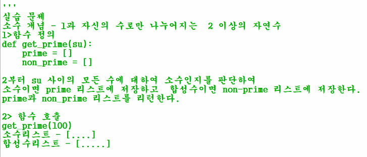

# Python

## 정수, 실수, 문자열, 논리값 - 단일 데이터 저장 구조
a = 100
print(a)
print(type(a))

b = 100.9
print(type(b))

c = True
print(c)
print(type(c))

d1 = 'python'
d2 = "과정"
print(type(d1) , '-', type(d2))

* 자바와 달리 변수 이름만 선언하고는 사용 못함

  e = None 값이 없는 상태를 선언해서 쓸 수 있음

* 자바스크립트와 달리 자동형변환이 없음

  ```python
  d1='python'
  d3=200
  print(d1 + str(d3)) => int, str, float
  ```

* subString 함수가 없이 간단함 

* [ 시작 : 종료 ] 인덱스 연산자 

  ```python
  d1='python'
  print(d1[0])
  print(d1[0:3])
  print(d1[:3])
  print(d1[2:])
  ```

* 내부 단어 포함 True/False

  ```python
  d7='multicampus'
  print('cam' in d7) => True
  print(d7.find('cam')) => 5번째 부터 보임
  print(d7.count('cam')) => 1번 발견됨
  ```

* 문자 갯수

  ```python
  print(len(d7))
  ```

* 프린터 콤마 결합

  ```python
  print(d1, d2, sep=' ') => 공백빼고 데이터 결합
  ```

* 대문자로 출력

  ```python
  print(d7.upper()) => 
  ```

* isnumeric

  ```python
  print("10101010".isnumeric()) => 숫자로만 이루어진 문자열 true false
  ```

  

* split

  ```python
  print("java-sql-html-python".split("-"))
  ```

* format

* 중괄호 안에 데이터 넣어주기

  ```python
  print("{0} {1} 호에 있습니다.".format("삼성캠퍼스", 507))
  ```

  ```python
  print("multicampus {}호에 있습니다.".format("삼성캠퍼스", 507)) => 앞에 하나만
  ```

* input() 키보드 입력

  ```python
  print("숫자 1개를 입력하시오 : ")
  first = input()
  
  print("숫자 또 1개를 입력하시오 : ")
  second = input()
  
  print(int(first) + int(second))
  ```

## 리스트 튜플 딕셔너리 - 여러 데이터 저장 구조

* list

  ```python
  list1 = [1, 3.14, '리스트', True, [1,2,3]];
  print(list1)
  print(list1[2])
  print(list1[1:5]) => 2번 인덱스부터 5번 인덱스 전까지
  print(list1 + list1) => list1 두번 출력
  print(list1 * 3) => list1 세번 반복
  print('리스트' in list1) => True
  print(len(list1)) => 5
  print(list1[4][0]) => 1
  
  list1[5] = "새로추가"
  list1.append("마지막에 추가")
  list1.insert(2, "정해진 위치에 추가")
  list1[3] = "존재하는 인덱스 수정"
  
  list1.pop() => 마지막 데이터 삭제
  list1.remove(1) => 첫번째로 나오는 1이라는 데이터를 삭제 list.remove(True)
  del list1[0] => 특정 인덱스에있는 값 삭제
  ```

  

* tuple

  ```python
  tuple1 = (1, 2, 3, 4, 5); => 수정이 불가함
  print(tuple1)
  print(tuple1[0])
  
  t1, t2, t3, t4, t5=tuple1;
  print(t1, t2, t3, t4, t5) => 값이 잘 나옴
  ```

* dictionary

  ```python
  dic1 = {"id":1, "pw":3.14, "title":'리스트', "finish":True} => key와 val
  
  dic1['pw']=1234 => 값 변경
  dic1['contents']='리스트내용입니다.' => 키가 존재하지 않아 키 밸류 추가
  print(dic1)
  print(dic1.keys()) #[id, pw, ...] 리스트
  print(dic1.values()) #[1, 3.14 ...] 리스트
  print(dic1.items()) #[(id, 1), (pw,3.14)...] 리스트 형태
  ```

  * 반복문 없이도 출력이 가능하다

  


```python
 print(dir(__builtins__)) #내장함수 목록
```

```python
list2 = [1,2,3,4,5]
print(dir(list2)) #리스트에 적용하는 내장함수 목록
```

```python
str1 = "멀티"
print(dir(str1)) #문자열 타입에 적용하는 내장함수 목록
```

```python
import keyword 
print(keyword.kwlist) #파이썬 키워드 목록
```

* 문자열 리스트 in, [0], [0:2]
* 논리 and or not => 항상 bool 값 리턴
* bool(0) / bool(3) => 숫자를 bool 값으로 리턴 0이면false 0이 아니면 true
* bool(None) => none도 false

## 조건문

* 들여쓰기 해야 인식

```python
if 10 > 5 : print("크다"); print ("크다2");

if 10 < 5 :
    print("크다")
    print ("크다2")
else :
    print("else 수행")
print("if문 상관없이 출력된다")
```

```python
import random
score = random.randint(1,100)
score = random.randrange(1,101)#같은 표현
if 100 >= score >= 80 :
    print("이수")
elif score >= 60 :
    print("재시험")
elif score >= 40 :
    print("재수강")
else :
    print("재입과")
print(score, "수고하셨습니다.")
```

* import 모듈(파이썬이 제공하는 라이브러리)

  

```python
print("짝 홀수 판단할 숫자를 입력하세요")
key_num = input()
if key_num.isnumeric() :
    key_num = int(key_num)
    if key_num % 2 ==0 :
        print(key_num, " : 짝수")
    else :
        print(key_num, " : 홀수")
else :
    print(key_num, "의 타입은", type(key_num), "입니다. 숫자만 입력하세요")
```


## 반복문

* for, while
* for 유한 횟수

```python
num=input();
for i in (1,2,3,4,5,6,7,8,9,10) : #튜플 데이터
    print(i)
    print("번 째 반복중")

num=input();
for i in [1,2,3,4,5,6,7,8,9,10] : #리스트 데이터
    print(i)
    print("번 째 반복중")

num=input();
for i in {1,2,3,4,5,6,7,8,9,10} : #딕셔너리 데이터 (key를 안쓰면 key와 value는 같은 값)
    print(i)
    print("번 째 반복중")
```


* while 횟수를 모를 때

```python
mynum = random.randint(1,100);
while True :
    print("숫자 입력해주세요")
    yournum = int(input())
    if yournum > mynum :
        print(yournum, "보다 작습니다.")
    elif yournum == mynum :
        print("잘했어!")
        break
    else :
        print(yournum, "보다 큽니다.")
```

* range(start, value, end)

```python
print(list(range(1, 11, 1))) #1부터 11이전값까지 1씩 증가
print(list(range(11))) #0부터 11이전까지 1씩 증가

for i in range(11):
    print(i)
    
list2 = ["python", "multi", 100, True]
print(list2)

for i in list2:
    print(i)

for i in range( len(list2) ): #range(4)이니까 0 1 2 3
    print(i, list2[i])
```

* continue와 튜플

```python
dic2 = {"k1":1, "k2":2, "k3":3, "k4":4, "k5":5}

print(type(("k1",1)))
k, v = ("k1", 1)

for k, v in dic2.items() :
    if k=='k3' :
        continue
    print(k, " 키의 값은 ", v, " 이다.")
```


## 함수

* 정의

```python
def hello_3times(): 
    print("hello")
    print("hello")
    print("hello")
    
hello_3times()
```

* 매개변수 있는 함수

```python
def message_3times(message): 
    print(message)
    print(message)
    print(message)
    
message_3times("파이썬")
```

```python
def message_ntimes(message, n):
    for i in range(1, n+1) :
        print(message)
        
message_ntimes("파이썬", 10)
```

* 기본 매개변수 있는 함수 정의

```python
def message_defaulttimes(message, n=5):
    for i in range(1, n):
    	print(message)
        
message_defaulttimese(message="파이썬") => n을 전달 안해도 n=5
message_defaulttimese("파이썬", 3) => n을 전달  n=3

```

* 가변 매개변수 있는 함수 정의

```python
def dynamic_message(*message, n=5):
    for i in range(1, n+1):
        for j in message :
            print(j)
            
dynamic_message("파이썬", "자바", "sql")
```


* 리턴값 있는 함수

  리턴 값이 없으면 함수를 호출해서 변수에 넣을 수 없다.

  ```python
  def no_return():
      print("노 리턴")
  r = no_return() => None
  ```

```python
def return():
	print("리턴")
    result = 10 + 10
    return result, "리턴값"
r= return => (20, "리턴값")
type(r3) => 튜플

r = return3()
print(r[0], r[1])

first, second = return3()
print(first, second); => 20 "리턴값"
```


* 지역변수, 전역변수

```python
def var_test():
    b = 10
    print(b)
    
var_test()
print(b) => 오류 b는 지역변수니까
```

```python
global_b = "전역변수"

print(glober_b)
```

* 자바와 다르게 함수를 호출해서 전역 변수라고 값을 바꾸려해도 지역변수로 선언이 되어 값이 변경 안됨 

```python
glober_var = "전역변수"
def var_test():
    local = 10
    print(local) => 10
    global global_var #global이 this. 이랑 같은거임 이걸 선언해줘야 지역변수로 선언 안됨
    global_var = "전역변수 수정"
    
print(global_var) => 전역변수 수정 / global이 없으면 함수에서 값이 변경이 안됨
```


* 실습



```python
prime =[];
non_prime = [];
a = 0
def get_prime(su):
    for i in range(2, su):
        for j in range(2, i):
            if (i % j) == 0 :
                global non_prime
                non_prime.append(i)
                global a
                a = 0
                break
            else :
                a += 1
                if a == (i-2) :
                    global prime
                    prime.append(i)
                    a = 0


get_prime(28)
print(non_prime)
print(prime)
```

* 방법2

  ```python
  def get_prime(su):
      prime=[]
      non_prime=[]
  
      for i in range(2, su+1):
          cnt = 0
          for j in range(1,i):
              if i % j == 0 :
                  cnt += 1
          if cnt == 1:
              prime.append(i);
          else :
              non_prime.append(i);
      return prime, non_prime;
  
  prime_list, non_prime_list = get_prime(100)
  print("소수리스트 - ", prime_list)
  print("합성수리스트 - ", non_prime_list)
  
  ```


* 자바스크립트와 파이썬은 함수를 변수로 취급한다 = 함수를 일급객체로 취급한다.

  ```python
  def f1():
      print("출력")
      
  def call_function(func):
      func(); => 함수여야 한다.
      
  call_function(f1) => 
  ```

* 사용자 호출 시점 변경 함수 // 3 초 후에 출력

  ```python
  def call_func(func):
  	import time
  	time.sleep(3) => set time과 같은 모듈
  	func();
  ```

* 리턴 값 하나면 람다식을 쓰는 것이 편할 걸

  ```python
  def f2(msg):
      return msg * 3
  
  print( f2("람다") ) => 람다람다람다
  
  print( (lambda msg : msg * 3) ("람다") ) #람다식 정의
  print( (lambda x,y : x+y ) (1, 2) )
  print( (lambda : "파이썬") () )
  ```


## 모듈

* 여러개 함수를 모아서 파이썬 py파일을 모아눈 것 = 모듈 = *.py
* *.py 파일을 여러개 모은 것 = 패키지
* 필요시 모듈을 설치하거나 개인이 구현

모듈 선언

```python
import primetest => 내가 만든 primetest.py
a, b = primetest.get_prime(50)
print("소수", a)
print("합성수", b)
```

* sys 모듈

  ```python
  import sys
  
  print(sys.builtin_module_names)
  print(sys.path)
  print(sys.version)
  
  for i in sys.argv: => 명령행 매개변수 #0번은 내 파일 위치가 나옴
      print(i)
  ```

* os모듈

  ```python
  import os
  
  print(os.name)
  print(os.getcwd())
  print(os.listdir())
  ```

* time 모듈

  ```python
  import time
  time.sleep(3)
  sec = time.time() #현재시간 초단위로 보여줌
  now = time.localtime(sec) #현재시간 년 단위
  print(sec, now) => tm_year=2021, tm_mon=9, tm_mday=16, tm_hour=10
  print(sec, now.tm_year, now.tm_mon, now.tm_mday) => 2021 9 16
  ```

* math 모듈

  ```python
  import math
  print(round(3.54)) => 반올림은 함수로 되어있어서 import가 필요없지만
  print(math.trunc(3.54)) => 버림의 경우 모듈에 있어서 import 필수
  ```

  

* import 방법

  ```python
  #모듈명
  import math
  print(math.trunc(3.54))
  
  #특정함수
  from math import trunc
  print(trunc(3.54))
  
  #모든함수
  from math import *
  print(trunc(3.54))
  print(sin(50))
  
  #별칭
  import math as mt
  ```

  

* random

  ```python
  import random as ra
  ran_list = ["abc", "ABC", "가나다", 123]
  
  print(ra.choice(ran_list));
  print(ra.sample(ran_list, 3));
  ```

  

### 모듈 설치

* 필요시 모듈 별도 설치

* spring 기본 라이브러리 + ajax, upload, mybatis 라이브러리 추가한것처럼

  mvnrepository에서 모아서 관리 pom.xml 작성해서 다운로드

* 필요한 라이브러리 이름 다운로드 - pip3
* pip3 install 모듈명 - cmd

```cmd
pip list
#다운로드 한 pip list 보여줌
pip3 install beautifulsoup4

```

### html 받아오는 모듈

* beautifulsoup4 모듈 설치

```cmd
pip list
#다운로드 한 pip list 보여줌
pip3 install beautifulsoup4

```
```python
import urllib.request as req
from bs4 import BeautifulSoup as bs
#파이썬 웹 서버 접속, 응답
response = req.urlopen("http://localhost:9002/helloboot/") #접속하고 응답받음
print(response) #이걸론 응답 객체유형이름만 나옴 <http.client.HTTPResponse object at 0x000001F96E81BF10>

#접속 응답받은 것 내용보기 html내용을 볼 수 있음
soup = bs(response, "html.parser")
contents = soup.prettify()
print(contents)

#h1 태그만 내용 찾기
print(soup.find("h1")) => 최초 h1 한 개만 리턴 <h1>hello boot</h1>
print(soup.select("h1"))
print(soup.findAll("h1")) => 리스트 형태로 가져옴 [<h1> ... </h1>, <h1> ... </h1> ]

print(soup.find("h1").string) => hello boot

print(soup.find("img")['src']) => 이미지 파일의 이름만 가져와라
print(soup.select_one("img")['src'])
print(soup.select_one("form")['action']) => 이렇게 브라우저에 보여지지 않는 것도 알 수 있음

print(soup.findAll("img")['src']) => 반복문 써서 가져와야댐
img_list = soup.findAll("img")
for img in img_list:
    print(img['src'])

#반복문으로 findAll 가져오기
h1_list = soup.findAll("h1")
for h1 in h1_list:
    print(h1.string)
```

* 웨더

  ```python
  import urllib.request as req
  from bs4 import BeautifulSoup as bs
  
  weather = req.urlopen("p://www.kma.go.kr/weather/forecast/mid-term-rss3.jsp?stnId=108")
  weather_bs = bs(weather, "html.parser")
  city_list = weather_bs.findAll("city")
  for s in city_list:
      print(s.string) => 서울 인천 ...
  print("총 도시 수는", len(city_list), "개 입니다")
  
  ```

* 실습


```python
weather = req.urlopen("http://www.kma.go.kr/weather/forecast/mid-term-rss3.jsp?stnId=108")
weather_bs = bs(weather, "html.parser")
contents = weather_bs.prettyfy() => html 내용 보여줌
#location (/도시 city/시간 tmef/날씨 wf/최고기온 tmx/최저기온 tmn/)
# location 태그 내부에 city태그 = l.find('city')
# img태그 안에 src요소 ('img')['src']
#그래서 location list를 써야함
loca_list = weather_bs.findAll("location")
for l in loca_list:
    print("============================")
    print("도시 : ", l.find('city').string)
    print("시간 : ", l.find('tmef').string)
    print("날씨상태 : ", l.find('wf').string)
    print("최고기온 : ", l.find('tmx').string)
    print("최저기온 : ", l.find('tmn').string)
    print("============================")
    
    => 혹시 첫번째 데이터가 아닌 다른 데이터를 쓰고 싶다면
        print("도시 : ", l.findAll('city')[1].string)

```

### matplotlib -  그래프 그리기

* matplotlib모듈 설치

```cmd
pip3 install matplotlib
```

```python
import matplotlib.pyplot as plt
a = [1, 2, 3, 4, 5]
b = [2, 4, 6, 8, 10]
c = []
import random
for i in range(1, 6, 1):
    c.append(random.randint(1,10))

#선그래프
plt.savefig("graph.png") => 경로 없으면 현재파일과 같은 폴더
plt.plot(a,c, "r")
plt.title("graph") => 제목
plt.xlabel("x(a)") => x 레이블 이름
plt.ylabel("y(c)") => y 레이블 이름
plt.show() => 그래프 창이 뜨면서 그래프 보여줌

#점 그래프
plt.plot(a,b,"ro") => 점그래프

#선 색상 변경
plt.plot(a,c, "r") => "r" 빨간 선, "b" 파란 선

#
plt.plot(a,b,'b-o') => 점과 선 둘다
plt.plot(a,b,'b--') => 점선
#히스토그램(빈도수 그래프)
plt.hist(c)
plt.show()

#그래프 겹치기
plt.subplots()
plt.plot(a, b)
plt.plot(b, a)
plt.hist(c)
plt.show()

#그래프 동시에 보기
plt.subplot(2,2,1) => 2*2 1번째영역
plt.plot(a, b)
plt.subplot(2,2,2)
plt.plot(b, a)
plt.subplot(2,2,3)
plt.hist(c)

plt.subplot(2,2,4)
plt.plot(a,b)
plt.title("그래프") => 글씨 폰트 바꿔야됨 한글 안보임
plt.xlabel("a리스트")
plt.ylabel("b리스트")
plt.savefig('savefig_default.png') #이미지 파일로 저장
plt.show()
```


### 컴퓨터 글꼴 확인

```python
#컴 글꼴
import matplotlib.font_manager as fm
font_list=[]
for f in fm.fontManager.ttflist:
    font_list.append(f.name)

font_list.sort() #sort는 정렬 상태 변경

for fname in font_list:
    print(fname) #알파벳 정렬 순서대로 나올 것
```

### 그래프 글꼴 바꾸기

```python
plt.rcParams["font.family"] = "D2Coding"; #한글 설정
plt.rcParams["font.size"] = 20
plt.rcParams["figure.figsize"] = (10, 6)
plt.rcParams["xtick.labelsize"] = 10 #x축 제목 글씨 크기
plt.rcParams["axes.labelsize"] = 8 #x축 데이터 글씨크기

plt.rc('font', size=20)        # 기본 폰트 크기
plt.rc('axes', labelsize=20)   # x,y축 label 폰트 크기
plt.rc('xtick', labelsize=50)  # x축 눈금 폰트 크기 
plt.rc('ytick', labelsize=20)  # y축 눈금 폰트 크기
plt.rc('legend', fontsize=20)  # 범례 폰트 크기
plt.rc('figure', titlesize=50) # figure title 폰트 크기

#그래프 모양 바꾸기
#plt.rcParams["lines.linestyle"] = "-.";
```

* 실습

```python
import urllib.request as req
from bs4 import BeautifulSoup as bs
weather = req.urlopen("http://www.kma.go.kr/weather/forecast/mid-term-rss3.jsp?stnId=108")
weather_bs = bs(weather, "html.parser")
loca_list = weather_bs.findAll("location")
import matplotlib.pyplot as plt
import matplotlib.font_manager as fm
def inlist():
    city_list = []
    tmx_list = []
    tmn_list = []
    for loca in loca_list:
        city_list.append(loca.find('city').string)
        tmx_list.append(int(loca.find('tmx').string))
        tmn_list.append(int(loca.find('tmn').string))
    return city_list, tmx_list, tmn_list

city_list, tmx_list, tmn_list = inlist()
########################
#정수 변경 2
for tmx in range(0, len(tmx_list)+1, 1):
    tmx_list[tmx] = int(tmx_list[tmx])
########################
#정수변경3
tmx_list = list(map(int, tmx_list)) #map(함수, 적용함수)
tmn_list = list(map(int, tmn_list))
########################

plt.rcParams["font.family"] = "D2Coding"

plt.plot(city_list, tmx_list, "r", linestyle='-', marker='o')
plt.plot(city_list, tmn_list, "b", linestyle='-', marker='o')
plt.title("각 도시 최저 최고온도")
plt.legend(['최고온도', '최저온도'])

plt.rc("axes", labelsize=20)
plt.xlabel("도시 이름")

plt.rc("axes", labelsize=10)
plt.ylabel("온도")

plt.show()

```


### requests 모듈

* get

```python
import requests
#http://localhost:9002/helloboot
fromserver = requests.get("http://localhost:9002/hellopython")
print(fromserver.status_code)
fromserver = requests.get("http://localhost:9002/hellopython?name=pythontest")
print(fromserver.status_code)

if fromserver.status_code == 200 :
    print(fromserver.text)
    print(fromserver.json) #@ResponseBody만 선언되었을 때 가능
    print(fromserver.encoding)
    print(fromserver.headers['content-type'])#produces 가져옴
```

* post

```python
fromserver = requests.post("http://localhost:9002/hellopython", data={'name':'pythontest'})

print(fromserver.status_code)

if fromserver.status_code == 200 :
    print(fromserver.text)
    print(fromserver.json) #@ResponseBody만 선언되었을 때 가능
    print(fromserver.encoding)
    print(fromserver.headers['content-type'])#produces 가져옴
```


* PythonController

```java
@Controller
public class PythonController {
	
	@ResponseBody
	@RequestMapping(value="/hellopython", method=RequestMethod.GET, produces ="application/json;charset=utf-8")
	//default							없으면 get, post둘다		produces ="text/html"
	public ArrayList<String> hello2(String name){
		ArrayList<String> list = new ArrayList<String>();
		if(name.equals("pythontest")) {
			list.add("자바 프로그램");
			list.add("sql 프로그램");
			list.add("web server 프로그램");
			list.add("web client 프로그램");
			list.add("spring 프로그램");
		}
		else {
			list.add("===============");
		}
		return list;
	}
}
```


### 업로드 웹서버와 연결

```python
#파이썬 테이블, 그래프 그림 이미지 저장
data_dict={'name':'전송자', 'description':'설명'}

file1 = open('day3.py', 'rt', encoding='utf-8')
file2 = open('city_weather.png', 'rb')
#절대경로로 쓸 수 있음 C:/kdigital2/python397/소스/city_weather.png
files_dict={'file1':file1, 'file2':file2}
fromserver = requests.post(
    "http://localhost:9002/fileupload", data=data_dict, files=files_dict)
print(fromserver.text)
```

* 파이썬 => 스프링서버 => 마이바티스 => 오라클db


### 사용자 생성 모듈

* import xxx란 것은

  우선 xxx.py를 실행한 후에 기존 코드를 실행해라 라는 의미

* sub.py

```python
pi = 3.141592

#원의 반지름 입력 - 정수 변환
def radius_input():
    r = input("반지름 : ")
    return int(r)

#원의 면적
def get_area(r):
    return r * r * pi

#원의 둘레
def get_circum(r):
    return r * 2 * pi

#sub.py 실행시에만 실행 시작
#다른 py import 실행시에는 실행 x
if __name__ == "__main__" :
    print("현재모듈명 : ", __name__)
    r = sub.radius_input()
    print(r = sub.radius_input())
    print(sub.get_area(r))
    print(sub.get_circum(r)) 

```

* main.py

  ```python
  import sub
  #sub.py 실행 문장이 먼저 실행됨
  
  print("현재모듈명 : ", __name__)
  r = sub.radius_input()
  print(r = sub.radius_input())
  print(sub.get_area(r))
  print(sub.get_circum(r)) 
  ```

  

## 예외처리

```python
try :
    #문제가 없을 경우 실행할 코드
except :
    #문제가 생겼을 경우 실행할 코드
```

* NameError
* IndexError

```python
try:
    money = input("대출금액 상환개월 수 입력하세요 : ")# 10000 12
    data = money.split()
    loan = int(data[0])
    month = int(data[1])
    print(loan, month)
    monthly_return = loan / month
    #파이썬에서 정의되지 않은 예외를 정의
    if month <= 0 :
        raise ValueError("개월 수는 음수나 0 입력이 불가합니다.")
except ValueError as ve:
    #print("숫자를 입력하세요")
    print(ve) #위 에러 내용으로
except IndexError:
    print("ex)10000 12 처럼 양식을 맞춰 입력하세요")
except :
    pass #현재 미구현
else :
    #예외없이 정상 시행시 실행
    print(loan, '금액', month,'개월동안' , monthly_return ,'원 씩 달에 갚을 예정')
finally :
    #예외 발생 여부 무관 항상 실행
    print("영업 시간 종료")
```


## 파일 입출력

* 입력 - 'r'
  출력 - 'w'
  이미지 파일 입력 - 'rb'
  텍스트 출력 - 'w', 'wt'
  현재 py 모듈 파일과 같은 경로에 존재해야함
  C:/kdigital2/python397/소스/day3.py

* 프린트의 숨겨진 기능 print(line, sep= " ", end="\n")
* 'wt' 파일이 없으면 생성하고 내용 입력, 
  파일이 있으면 내용 삭제하고 내용입력
  'at' 파일이 없으면 파일 생성하고 내용 입력 , 파일이 있으면 내용 추가

```python
try:
    file = open("C:/kdigital2/mymodules/main.py", "rt", encoding="utf-8")
    print(file.read())
except FileNotFoundError:
    print("파일 경로 파일 명 확인하세요~")
file.close();
```

```python
#파일 라인 단위 읽어서 1번 라인 -- xxx 리스트 저장
file = open("C:/kdigital2/mymodules/sub.py", "rt", encoding="utf-8")

for line in file: #라인 반복하면서 \n이 계속 출력
    #print(line) 공백이 너무 많음 print(line, sep= " ", end="\n")
    print(line, sep= " ", end="")
file.close()
```

```python
#파일 라인 단위 읽어서 1번 라인 -- xxx 리스트 저장
file = open("C:/kdigital2/mymodules/sub.py", "rt", encoding="utf-8")

file_list = []
index = 1
for line in file: #라인 반복하면서 \n이 계속 출력
    #print(line) 공백이 너무 많음 print(line, sep= " ", end="\n")
    file_list.append(str(index) + "번라인 - " + line)
    index += 1
file.close()

for line in file_list:
    print(line)
```

```python
#이미지 파일은 안보인다 
file = open("C:/kdigital2/python397/소스/city_weather.png", "rb")
print(file.read())

```


```python
#파일이 없으면 생성 'wt'
#파일이 있으면 기존 내용 추가 'at'
file = open('C:/kdigital2/mymodules/a.txt', 'at')
file.write('새로운 파일을 생성합니다. \n두번 째 줄입니다. \n')
file.close()

# sub.py 파일 입력 - 라인번호 추가 - file_list 저장 - sub_copy.py
file = open('C:/kdigital2/mymodules/sub_copy.py', 'wt', encoding='utf-8')
file.writelines(file_list)
file.close()
```


```python
# sub.py 파일 입력 - 라인번호 추가 - file_list 저장 내용 가운데 print단어 포함 라인만 -sub_copy_print.py
file = open('C:/kdigital2/mymodules/sub_copy_print.py', 'wt', encoding='utf-8')
for line in file_list:
    #line.find('print') >=0
    if 'print' in line:
        file.writelines(line)
file.close()
```


* 실습

  


* 나

```python
file = open("c:/kdigital2/python397/소스/usedcars.csv", "rt")
file_list = []
index = 2
for line in file:
    file_list.append(line)
file_list.pop(0)
file.close()

mileage_list = []
for i in range(0, len(file_list)):
    info_list = file_list[i].split(",")
    
    mileage_list.append(int(info_list[3]))
    mileage = int(info_list[3])
    if mileage >= 100000:
        file_list[i] += '폐차직전'
    elif mileage >= 50000:
        file_list[i] += ('심각한 중고')
    elif mileage >= 10000:
        file_list[i] += ('양호한 중고')
    else :
        file_list[i] += ('새차같은 중고')

status_list = []
for i in range(0,len(file_list)):
    info_list = file_list[i].split("\n")
    status_list.append(info_list[1])

print("폐차직전 - ", status_list.count("폐차직전"), "대")
print("심각한 중고 - ", status_list.count("심각한 중고"), "대")
print("양호한 중고 - ", status_list.count("양호한 중고"), "대")
print("새차같은 중고 - ", status_list.count("새차같은 중고"), "대")

import matplotlib.pyplot as plt
plt.rcParams["font.family"] = "D2Coding"
x = range(1, len(mileage_list)+1)
y = mileage_list

plt.title("차량 상태값")
plt.rc("axes", labelsize=20)
plt.xlabel("차 번호")

plt.rc("axes", labelsize=20)
plt.ylabel("mileage")
plt.plot(x, y)
plt.show()

```

* 강사님

```python
file = open("usedcars.csv", "rt") #텍스트를 포함하고 있기 때문에 'rt' 'r'만써도됨

carstate = [] #차량상태만 저장 리스트
mileage_list = [] #마일리지 저장 리스트
carstate_cnt = [] # 차량 상태 수
for line in file:
    line_list = line.split(',')
    mileage = line_list[3]
    if mileage.isdigit() and int(mileage) >= 100000:
        line_list.append("폐차직전")
    elif mileage.isdigit() and int(mileage) >= 50000:
        line_list.append("심각한중고")
    elif mileage.isdigit() and int(mileage) >= 10000:
        line_list.append("양호한중고")
    elif mileage.isdigit() and int(mileage) < 10000:
        line_list.append("새차같은중고")
    else:
        line_list.append("차량상태")
    print(line_list)
    carstate.append(line_list[6])
    mileage_list.append(line_list[3])
file.close();

carstate_value = ['폐차직전', '심각한중고', '양호한중고', '새차같은중고', '차량상태']
for one_state in carstate_value:
    print(one_state, " : " , carstate.count(one_state))
    carstate_cnt.append(carstate.count(one_state))
print("폐차직전 - ", carstate.count("폐차직전"), "대")
print("심각한중고 - ", carstate.count("심각한중고"), "대")
print("양호한중고 - ", carstate.count("양호한중고"), "대")
print("새차같은중고 - ", carstate.count("새차같은중고"), "대")

import matplotlib.pyplot as plt
plt.rcParams["font.family"] = "D2Coding"
plt.hist(carstate)
plt.show()

```

