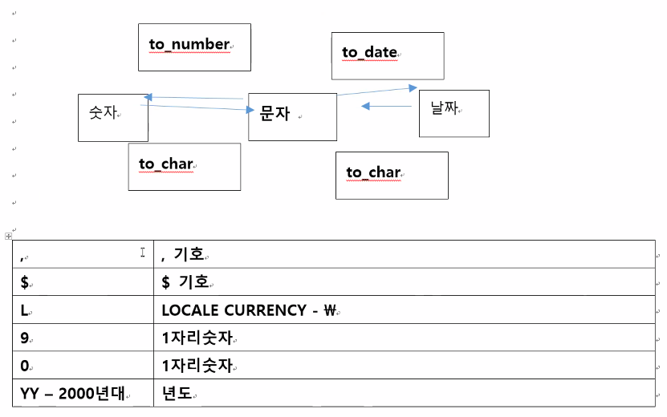
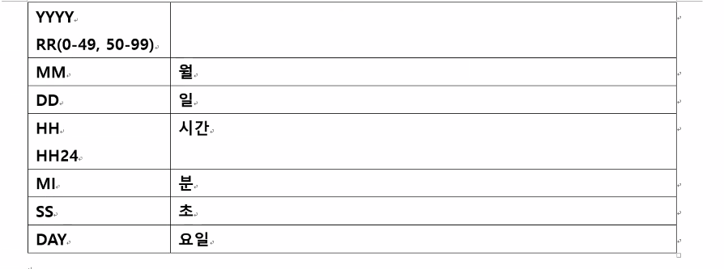

# SQL Day2

## ORACLE의 데이터 형식

* set linesize 140;

* set pagesize 140;

* 숫자 / 날짜 / 문자 / 이진수-대용량 동영상 이미지 음향

  | 숫자 | number(38자리)<br />정수 number(5) number(5, 0)<br />실수 number(10, 2) => 정수 8자리 / 소수점이하 2자리 |
  | ---- | ------------------------------------------------------------ |
  | 날짜 | 오라클의 date 타입 형식은 rr/mm/dd <br />년 월 일 시 분 초 요일 |
  | 문자 | varchar2(100)<br />char(2) - 2byte 문자                      |
  |      | char(10) - 10byte - ([java)(6byte)<br />'java' => 4byte<br />varchar2(10) - 10byte <br />(java) 4byte로 동적 변경됨<br />'가나다' - 9byte(한글 1개당 3byte)<br />varchar2(4000) => 최대크기는 4000byte 한글은 1333글자 |

  * length => 글자 개수
  * lengthb => 글자1개 바이트 차지

| 집계함수   | sum avg max min count |                                                              |
| ---------- | --------------------- | ------------------------------------------------------------ |
| 단일행함수 | 문자형함수            | length<br />lenghtb<br />upper / lower / initcap<br />trim / ltrim / rtrim<br />lpad / rpad<br />instr('java', 'a') => 2<br />substr('java', 2, 1) => a |
|            | 숫자함수              | ABS => 절대값<br />round(4.745, 1) => 정한 소수점 기준으로 반올림<br />mod => 나머지 값 구함<br />trunc(123.324, 2) => 정한 소수점 기준으로 버림 |
|            | 날짜함수              | sysdate - 오늘날짜<br />months_between(최근날짜, 오래전 날짜)<br />add_months(날짜, 개월 숫자) |
| 변환함수   | 타입변환함수          | to_char - 날짜와 숫자를 문자로<br />to_number - 문자에서 숫자로<br />to_date - 문자에서 날짜로 |
|            | null변환함수          | nvl(컬럼명, null값의 대체값)                                 |

### 문자형함수

* 'A' - ASCII CODE

  select ASCII ('A') from dual;

  * dual - 1행 가상 테이블로 select 결과 저장 임시 테이블

* asciistr('가')

  select asciistr('가') from dual;

  한글 유니코드 값 16진수로 나옴

#### || || 사용법

* employees 테이블에서 first_name salary 조회할 때
  xxxx사원은 급여 xxxx를 받습니다.

  select first_name || ' 사원은 급여 ' || salary || '를 받습니다 '  from employees

  || => 문자열 결합

  ``` sql
  select first_name ||'사원은 급여'|| salary ||'를 받습니다'
  from employees;
  1. from 앞 || 제거
  2. 변수들 사이 , 제거
  ```
  
  
  
* concate연산자

  결합 문자는 2개밖에 안들어감

  select concat(concat(concat(first_name, ' 사원은 급여 ' ) , salary)  '를 받습니다 ')  from employees;

* instr - 특정 문자열 찾은 위치 리턴 / 몰라도 이 기능을 만드는법은 많다.

  select first_name from employees

  where instr(first_name, 'ex') >= 1; => 0개 아닌 사람 

  같음 where first_name like '%ex%';

  select first_name, instr(first_name, 'ex') from employees; => 107명 다나옴

  

* lower 

  select first_name from employees

  where lower(first_name) = lower('NeeNa');

* upper

* initcap

  첫 문자만 대문자로 만들 경우

  select first_name from employees

  where first_name = initcap('Neena');

* substr

  substr('Neena', 1, 2) => 1번째 문자열부터 2개만 'Ne'

  instr('Neena', 'Ne') => 1

* 02년도 입사자 입사일 조회

  where hire_date >= '02/01/01' and hire_date <= '02/12/31';

  where hire_date like '02%';

  where substr(hire_date, 1, 2) = '02';

  where instr(hire_date, 02) = 1;

  

* 02월 입사자 조회 생각해봥~

  

* lpad, ltrim

  lpad('문자열' , 늘일길이 , '채울 문자열') => 오른쪽 정렬, 왼쪽 정렬에 쓰임

  문자열을 길이로 늘리고 빈곳을 문자열로 채우는 것

### 숫자형함수

* round - 반올림
* trunc - 버림
* mod - 나머지 값 구하기

* 급여 평균 

  select round(avg(salary)) from employees;

* 사번이 짝수인 사원

  select employee_id from employees

  where mod(employee_id , 2) = 0;

### 날짜형 함수

* 간단한 연산 가능

  select sysdate = 오늘 날짜   / +1 내일 / -1 어제 => 일 단위 계산

* 월 단위 계산

  select add_months(sysdate, 3) "3개월 후" from dual; => 3개월 후

  * 별칭 넣을 때 숫자로 시작하거나 공백이 있다면 이중 따옴표 사용!

* 오늘 날짜와 입사일과의 경과 시간 조회

  select sysdate - hire_date from employees;

  select 24*(sysdate - hire_date) from employees;

* 오늘 날짜와 입사일과의 경과개월수 조회

  months_between()

### 변환함수

* commission_pct 받는 사원 

  where commission_pct is not null

#### nvl 사용법

* 모든 사원 commission_pct 조회하되 null사원은 0

  select nvl(commission_pct, 0) from employees

* 사원 이름, 부서코드 조회하되 부서없는 사원의 부서코드는 '배치이전'

  null - 숫자, 날짜, 문자컬럼

  select first_name, nvl(department_id, -1) from employees; 

  => 부서코드가 숫자타입이어서 바꾸는것도 숫자가 돼야함

  select first_name, nvl(to_char(department_id), '배치이전') from employees;

  => 타입을 변환해서 타입을 동일하게 맞추면 됨!

* select 1000 from dual;    //      $1,000 이렇게 출력하게 만들고 싶어

  => select to_char(1000, '$9,999') from dual;    // '9,999' 하면 숫자 세개당~

* select '$1,000' + 2000 from dual;    // 덧셈하고 싶어!!

  select to_number('$1,000' , '$9,999')  + 2000 from dual  // $빼고 , 빼라!

* select sysdate, to_char(sysdate, 'yyyy-mm-dd -day hh24:mi:ss') from dual





* 02년도 입사자

  select hire_date from employees

  where to_char(hire_date, 'yy') = '02'; => 02년

  where to_char(hire_date, 'dd') = '02'; => 02월

## 조인

* 두개 이상의 테이블을 묶어서 하나의 결과 집합으로 만들어 내는 것

  * select 컬럼명들

    from 테이블명 1, 2

    where 테이블명1, 2 컬럼값 "동일" 조건

### 종류

* inner join - 조건 만족 범위 내부 레코드 조인
* outer join - 조건 만족 범위 외부 레코드 조인

#### inner join // null이 있으면 보여주지마

* 사원 이름, 부서 이름 조회

select first_name, e.department_id, department_name

from departments d, employees e

where d.department_id = e.department_id; 

​                 null이 없음    =  킴벌리 null => 그래서 킴벌리가 안나옴

#### outer join // null이 있어도 보여줘

* 사원 이름, 부서 이름 조회하되 부서코드 null인 사원 포함 조회

select first_name, e.department_id, department_name

from departments d, employees e

where d.department_id(+) = e.department_id;

​        d에 null이 없어도 오른쪽에 null이 있으면 보여주라

* 사원 이름, 부서 이름 조회하되 부서코드 null인 사원은 '없음' 조회

select first_name, nvl(to_char(e.department_id), '없음'), nvl(department_name, '없음')

from departments d, employees e

where d.department_id(+) = e.department_id;

=> join시에 1개 테이블에 존재하는 값이 다른 테이블에는 존재하지 않는 경우가 있다.

​	존재하지 않은 쪽에 (+) 를 넣어서 처리

* 사원 이름, 부서 이름조회 하되 해당 부서 소속 사원이 없을 때 사원 이름 ()

select nvl(first_name, '부서원 없음')e.department_id, department_name,

from departments d, employees e

where d.department_id = e.department_id(+);

 => departments 테이블에는 10 20 30 ... 270이 있는데

270번 부서에 속한 부서원이 없다. 


* 사원 이름, 부서코드 조회

  select first_name, department_id

  from employees;

* 사원 이름, 부서이름 조회 => 부서 이름은 departments테이블에 있음

  select first_name from employees

   		department_id from departments

  => select first_name, department_name from departments, employees;

  => select first_name, employees.department_id, department_name from departments, employees;

  department_id는 employees에도 있고, departments에도 있음! 그래서 employees. 를 통해 정해줌

  더 간결하게 => select first_name, e.department_id, department_name from departments d, employees e;

  

* 근데 위 처럼 넣으면 부서코드가 모두 섞여서 나옴 107개가 아닌 2889개가 나옴

| employees                             | departments                             |
| ------------------------------------- | --------------------------------------- |
| william 10<br />peter 20<br />king 30 | 10 인사부<br />20 총무부<br />30 교육부 |

select first_name, e.department_id, department_name

from departments d, employees e

where d.department_id = e.department_id; => 오라클 독자적인 문법 / Oracle join 문법

=>

select first_name, e.department_id, department_name

from departments d inner join employees e

on d.department_id = e.department_id;  => 모든 db 표준 문법 / ansi join 문법


departments 테이블 : 10, 20, ... 270

270번 부서 속한 부서원 없더 = employees 테이블 부서코드 270 없다.

상사에 대한 정보가 자신 테이블에 포함


* employees 에서 모든 사원의 상사 이름 급여 조회

| employees                                  |                                            |
| ------------------------------------------ | ------------------------------------------ |
| employee_id    first_name    manager_id    | employee_id    first_name    manager_id    |
| 200               김사원               150 | 200               김사원               150 |
| 150               최대리               100 | 150               최대리               100 |
| 100              박과장                90  | 100              박과장                90  |

select me.first_name, me.manager_id, manager.first_name 상사이름, manager.salary

from employees me, employees manager

where me.manager_id = manager.employee_id


* 상사 없는 사원 포함 모든 사원의 상사 이름 급여 조회

select me.first_name 사원이름, me.manager_id, manager.first_name 상사이름, manager.salary

from employees me, employees manager

where me.manager_id = manager.employee_id(+); 

​			null 존재				null 존재 x // 그러나 null값도 포함하고 싶다 할 때 null이 존재하지 않는 곳에 (+)

==> 사원 부서명 조회하되 부서없는 사원 포함

where me.manager_id(+) = manager.employee_id; 

​			null 존재				null 존재 x 

==> 우리 회사 모든 부서명, 부서원 사원 조회하되 부서원 없는 부서도 포함


* employees 에서 jennifer 사원의 상사 이름 급여 조회

  select me.first_name 사원이름, me.manager_id, manager.first_name 상사이름, manager.salary

  from employees me, employees manager

  where me.manager_id = manager.employee_id

  and me.first_name = 'Jennifer';

----오라클 독자적 방법----

----표준 join - 안시 방법----

inner join : , => , 들을 => inner join / where => on 

outer join : (+) => left / rigter outer join   / where => on

## sub querry

6장에 

* Jennifer의 급여 조회

  select first_name, salary from employees

  where first_name = 'Jennifer';

* where 절에 서브쿼리

  Neena와 같은 부서원의 급여 조회

  select first_name, salary

  from employees

  where department_id = 

  (select department_id from employees where first_name= 'Neena');

  

* select salary, sum(salary) from employees; => error

  ​            107개     1개

  select salary, (select sum(salary) from employees) from employees; => 이게 왜 됨?

  ​			107개        서브쿼리가 되면 먼저 진행이 됨 그러고 고정값이 됨. 그래서 복사가 된다.

### 단일행 서브쿼리의 동일 비교는 "=", "in" 다중행 서브쿼리의 동일 비교는 "in"

* Neena와 같은 부서원의 급여 조회

  단일행 서브 쿼리

  select first_name, salary

  from employees

  where department_id = 

  (select department_id from employees where first_name= 'Neena');

* Jennifer와 같은 부서원의 급여 조회

  다중행 서브 쿼리

  select first_name, department_id, salary

  from employees

  where department_id = (select department_id from employees where first_name= 'Jennifer');

   내 department_id가 10번인지 50번인지 그걸 써줘야함!

  where department_id in (10, 50) 서브쿼리가 아니었으면 이렇게 가능

  => where department_id **in** (select department_id from employees where first_name= 'Jennifer');
  
  * in ( )  뒤 결과에 해당되는 조건이 있다면~~
  * 다중행 서브쿼리에서 = any( ) 와 같음

### 단일행 서브쿼리의 대소비교는 > >= < <= 다중행 서브쿼리의 동일 비교는 > any  , > all

* Neena의 급여보다 많이 받는 사원을 조회

  select first_name, salary from employees

  where salary > (select salary from employees where first_name = 'Neena');

* Jennifer의 급여보다 많이 받는 사원을 조회 (제니퍼가 2명 나옴)

  select first_name, salary from employees

  where salary > (select salary from employees where first_name = 'Jennifer');

  ​						10000보다 커야하는건지 20000보다 커야하는건지 어케?

  => where salary > any (select salary from employees where first_name = 'Jennifer');

  * < any(3600, 4000)  => 서브쿼리 결과중 하나만이라도 작으면 됨 3600 아래도 나온다는 뜻
  * < all (3600, 4000) => 서브쿼리 결과 모두 만족하며 작아야됨 


예제1

1. 이름이 'adam' 인 직원의 급여와 입사일을 조회하시오.

   select first_name, salary, hire_date from employees

   where upper(first_name) = upper('adam');


2. 나라 명이 'united states of america' 인 나라의 국가 코드를 조회하시오.

   select country_id from countries
   where upper(country_name ) = upper('united states of america');


3. 'Adam의 입사일은 05/11/2 이고, 급여는 7,000\입니다.' 의 형식으로 직원
    정보를 조회하시오.

  select first_name || '의 입사일은' || to_char(hire_date, 'yy-mm-fmdd')|| '이고, 급여는'|| to_char(salary, '99,999L') || '입니다.' as 직원정보 from employees;

  => fm  의미없는 0은 무시

직원정보

Adam의 입사일은 05/11/2 이고, 급여는 7,000 입니다. 
......

4. 이름이 5글자 이하인 직원들의 이름, 급여, 입사일을 조회하시오.

   select first_name, salary, hire_date from employees

   where length(first_name) <= 5; 

   왜앙댕 => count랑 length랑 차이 알아둬라

5. 06년도에 입사한 직원의 이름, 입사일을 조회하시오.

   select first_name, hire_date from employees

   where hire_date like '06%'

   where hire_date >= '06/01/01' and hire_date <= '06/12/31'

   where instr(hire_date, '06') = 1

   where substr(hire_date, 1, 2) = '06'

   where to_char(hire_date, 'yy') = '06'

6. 6월에 입사한 직원의 이름, 입사월 조회

   select first_name, to_char(hire_date, 'mm') ||'월'

   from employees

   where hire_date like '___06%';

   where to_char(hire_date, 'mm') = '06'

   where instr(hire_date, '06') = 4 // 06년도 06월인경우 조회에 포함되지 않는 ...

   where instr(hire_date, '06', 3) = 4  => 3번째부터 찾아라 라는 걸 할 수 있음

   where substr(hire_date, 4, 2) = '06'

7. 10년 이상 장기 근속한 직원들의 이름, 입사일, 급여, 근무년차를 조회하시오.

   select first_name, hire_date, salary, round((sysdate - hire_date) / 365) from employees

   where ((sysdate - hire_date) / 365) >= 10;

8. employees 테이블에서 
    직종이(job_id) 'st_clerk'인 사원 중에서 급여가 1500 이상인 사원의
    first_name, job_id, salary 를 조회하시오. 단 이름은 모두 대문자로 출력하시오.

  select upper(first_name), job_id, salary from employees

  where job_id = 'st_clerk' and salary >= 1500;

  왜앙댕 => , 가 아니고 and로!!

9. 급여가 20000 이상인 직종(job_id)의
    job_id, min_salary 조회하시오.
    단, salary는 10자리로 출력하되 공백은 '0'으로 표시하시오.

  select job_id, rpad(salary, 10, 0) from employees

  group by job_id

  having salary >= 20000;

  왜 앙댕?

select job_id, rpad(salary, 10 , '0') from employees where salary >= 20000; 
select job_id, to_char(min_salary, '0000000000') from jobs where min_salary >= 20000;

10. 직원의 이름, 급여, 직원의 관리자 이름을 조회하시오. 단, 관리자가 없는 직원은
    '<관리자 없음>'이 출력되도록 합니다.

    select first_name, salary, nvl(to_char(manager_id), '<관리자 없음>') from employees;

예제2

1. 80번부서의 평균급여보다 많은 급여를 받는 직원의 이름, 부서id, 급여를 조회하시오.

   select first_name, department_id, salary from employees where salary >= (select avg(salary) from employees where department_id = 80);

2. 'South San Francisco'에 근무하는 직원의 최대급여보다 급여를 많이 받는 직원의 이름, 급여, 부서명, 부서id를 조회하시오.
	select first_name, salary, department_name, department_id from employees
	where salary >
    ((select max_salary from jobs where )  and country_id = (select country_id from countries where country_name = 'South San Francisco'))
3. 각 직급별(job_title) 인원수를 조회하되 사용되지 않은 직급이 있다면 해당 직급도
    출력결과에 포함시키시오. 그리고 직급별 인원수가 3명 이상인 직급만 출력결과에 포함시키시오.

4. 월별 입사자 수를 조회하되, 입사자 수가 5명 이상인 월만 출력하시오.


5. 년도별 입사자 수를 조회하시오. 
단, 입사자수가 많은 년도부터 출력되도록 합니다.

6. 'Southlake'에서 근무하는 직원의 이름, 급여, 직책(job_title)을 조회하시오.


7. 직원의 이름, 급여, 직원의 관리자 이름을 조회하시오. 단, 관리자가 없는 직원은
   '<관리자 없음>'이 출력되도록 해야 한다.


8. 각 부서 이름별로 최대급여와 최소급여를 조회하시오. 단, 최대/최소급여가 동일한
   부서는 출력결과에서 제외시킨다.


9. 자신의 관리자보다 많은 급여를 받는 직원의 이름과 급여를 조회하시오.