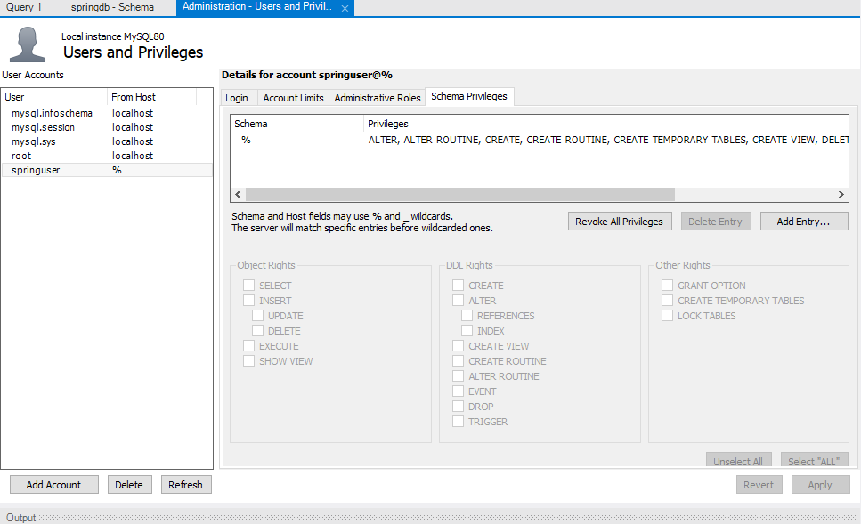
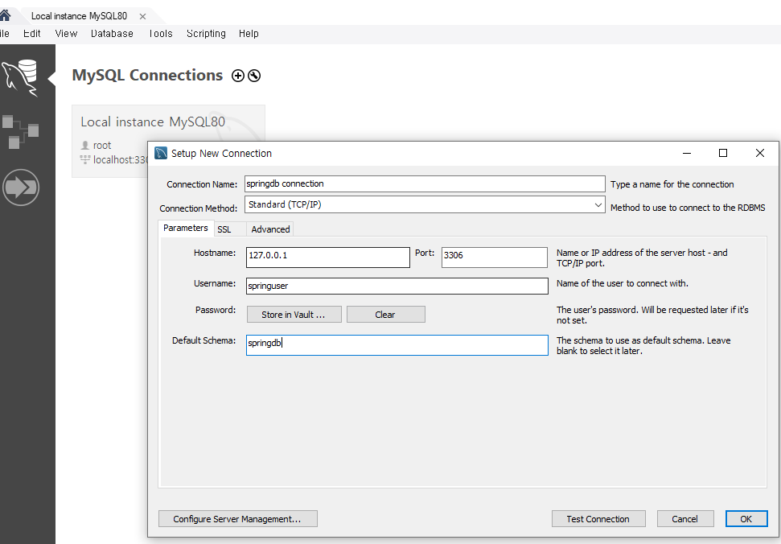
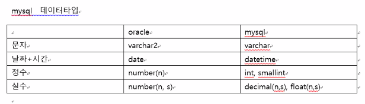

# MySQL

* 오라클  db의 관리자는 system이었고 이름은 xe였다.
* MySQL db의 관리자는 root/root1234 이고 이름은 MYSQL80이다.

## workbench 사용

1. DB 생성(schema 생성)
2. user 생성
3. springuser에게 springdb 접근 권한을 생성
4. 


## mysql 명령어

```mysql
select * from tab; => oracle에서 전체 테이블
show tables => mysql에서 전체 테이블 
```

## mysql 데이터타입




## mysql 함수

* oracle

``` oracle
sequence
create sequence board_seq(
starat width 1,
increment by 1,
maxvalue 100
);

날짜 변경 함수
to_date('문자', '날짜형식')
to_date('16-11-2007', dd-MM-yyyy)
```

* mysql

```mysql
sequence가 따로 없음
create table sample
(
    col1 int auto_increment,
)

날짜 변경 함수
str_to_date('17-06-2003', '%d-%m-%Y')
```


## 스프링 부트랑 연결

1. xxxApplication.java 확인

   ```java
   @SpringBootApplication
   @ComponentScan(basePackageClasses = EmpMybatisController.class)
   @MapperScan(basePackageClasses = EmpDAO.class)
   @ComponentScan
   public class NaverserverApplication {
   
   	public static void main(String[] args) {
   		SpringApplication.run(NaverserverApplication.class, args);
   	}
   ```

2. application.properties

   ```xml
   server.port=9003
   
   #view resolver
   spring.mvc.view.prefix=/WEB-INF/views/
   spring.mvc.view.suffix=.jsp
   
   #서버 자동 재시작 가능
   spring.devtools.livereload.enabled=true
   #jsp변경 바로 적용
   server.servlet.jsp.init-parameters.development=true
   
   #mybatis oracle
   spring.datasource.driver-class-name=oracle.jdbc.OracleDriver
   spring.datasource.url=jdbc:oracle:thin:@localhost:1521:xe
   spring.datasource.username=hr
   spring.datasource.password=hr
   
   #mybatis mysql
   #spring.datasource.driver-class-name=com.mysql.cj.jdbc.Driver
   #spring.datasource.url=jdbc:mysql://127.0.0.1:3306/springdb
   #spring.datasource.username=springuser
   #spring.datasource.password=springuser1234
   
   mybatis.config-locations=classpath:mybatis/mybatis-config.xml
   ```

   

3. pom.xml 확인

   ```xml
   mysql, jdbc, mybatis
   <!-- for jsp -->
   <dependency>
       <groupId>org.apache.tomcat.embed</groupId>
       <artifactId>tomcat-embed-jasper</artifactId>
       <scope>provided</scope>
   </dependency>
   <!-- for jsp jstl -->
   <dependency>
       <groupId>javax.servlet</groupId>
       <artifactId>jstl</artifactId>
   </dependency>
   <!--for tomcat restart -->
   <dependency>
       <groupId>org.springframework.boot</groupId>
       <artifactId>spring-boot-devtools</artifactId>
       <optional>true</optional>
   </dependency>
   <!--  json parsing --> 
   <dependency>           
       <groupId>org.json</groupId>
       <artifactId>json</artifactId>
       <version>20201115</version>
   </dependency>
   ```

   

4. src/main/resources/xxx/mappers 확인 (xxx는 패키지 이름)

   1. mappers/sql-mapping.xml

      ```xml
      <?xml version="1.0" encoding="UTF-8" ?>
      <!DOCTYPE mapper PUBLIC "-//mybatis.org//DTD Mapper 3.0//EN"
        "http://mybatis.org/dtd/mybatis-3-mapper.dtd">
      
       <mapper namespace="mybatis.EmpDAO">
       
       <select id="emplist" resultType="empVO">
       	select * from employees
       </select>
       
       <select id="empone" resultType="empVO" parameterType="int">
       	select * from employees where employee_id=#{id}
       </select>
       
       <insert id="insertemp" parameterType="empVO">
       	insert into employees(employee_id, first_name, last_name, email, phone_number, job_id, hire_date)
       	values(#{employee_id}, #{first_name}, #{last_name}, #{email}, #{phone_number}, #{job_id}, sysdate)
       </insert>
       
       <update id="updateemp" parameterType="empVO">
       update employees
       set last_name = #{last_name} , department_id= #{department_id}
       where employee_id = #{employee_id}
       </update>
       
       <delete id="deleteemp" parameterType="String">
       delete employees where first_name like #{name}
       </delete>
       
       <select id="cnt" resultType="int">
       select count(*) from employees
       </select>
       
       <select  id="empdeptlist" resultType="empVO" parameterType="int[]">
      	select * from employees where department_id in 
      	<foreach collection="array" item="d_list" open="(" close=")" separator=",">
      		#{d_list}
      	</foreach>
      </select>
      
       </mapper>
      ```

      

   2. xxx/mybatis-config.xml

      ```xml
      <?xml version="1.0" encoding="UTF-8" ?>
      <!DOCTYPE configuration
        PUBLIC "-//mybatis.org//DTD Config 3.0//EN"
        "http://mybatis.org/dtd/mybatis-3-config.dtd">
        <!-- mybatis db 연결정보 세팅 파일 -->
      <configuration>
      
      <!-- 1. sql 실행 결과 Resultset으로 받았었는데 EmpVO로 결과를 매핑할 것이다. -->
      <typeAliases>
      <typeAlias type="mybatis.EmpVO" alias="empVO"/>
      </typeAliases>
      
      <!-- 2. DataSource 설정은 spring-mybatis가 가져감 -->
      
      <!-- 3. sql 정의 매퍼 설정은 spring-mybatis가 가져감-->
      
      
      </configuration>
      
      ```

      

5. spring-mybatis.xml

   ```xml
   <?xml version="1.0" encoding="UTF-8"?>
   <beans xmlns="http://www.springframework.org/schema/beans"
   	xmlns:xsi="http://www.w3.org/2001/XMLSchema-instance"
   	xmlns:context="http://www.springframework.org/schema/context"
   	xsi:schemaLocation="http://www.springframework.org/schema/beans http://www.springframework.org/schema/beans/spring-beans.xsd
   		http://www.springframework.org/schema/context http://www.springframework.org/schema/context/spring-context-4.3.xsd">
   
   <!-- 스프링은 모든 객체를 사용할 때 ioc, di, @, <bean 을 이용해서 객체를 만들 수 있음 -->
   <!-- 1.DATASOURCE 설정을 mybatis-config.xml로 -->
   
   <bean id="dataSource" class="org.springframework.jdbc.datasource.DriverManagerDataSource">
   	<property name="driverClassName" value="oracle.jdbc.driver.OracleDriver"/>
   	<property name="url" value="jdbc:oracle:thin:@localhost:1521:xe"/>
   	<property name="username" value="hr"/>
   	<property name="password" value="hr"/>
   </bean>
   <!-- 2.config파일, sql매핑파일 -->
   <bean id="sqlSessionFactory" class="org.mybatis.spring.SqlSessionFactoryBean">
   	<property name="dataSource" ref="dataSource"/>
   	<property name="configLocation" value="classpath:spring/mybatis/mybatis-config.xml"/>
   	<property name="mapperLocations" value="classpath:spring/mybatis/*-mapping.xml"/>
   </bean>
   
   <!-- 3.SqlSessionTemplate(스프링에서 제공) SqlSession객체(mybatis에서 제공)를 통해 sql생성 -->
   <bean id="sqlSession" class="org.mybatis.spring.SqlSessionTemplate">
   	<constructor-arg ref="sqlSessionFactory"></constructor-arg>
   </bean>
   
   <!-- 4.DAO, VO, SERVICE @쓸 수 있게 / @Component, @Service, @Repository, @Autowired 
   controller 시작 전에 설정 읽어오는 것 그래서 @Controller는 다른곳에 씀/  mvc 관련 어노테이션은 인식못함 
   무조건 servlet-context에서 써야함 -->
   <context:component-scan base-package="spring.mybatis" />
   </beans>
   
   ```

   

