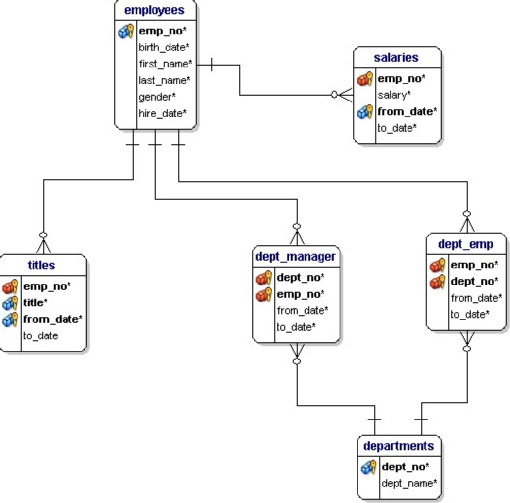

# SQL

**SQL 분류**

* DML (Data Manipulation Language)
  * 데이터 조작 언어
  * 선택, 삽입, 수정, 삭제 하는데 사용되는 언어
  * DML 구문이 사용되는 대상은 테이블의 행
  * 트랜잭션이 발생하는 SQL도 DML
* DDL (Data Definition Language)
  * 데이터 정의 언어
  * 데이터베이스, 테이블 뷰, 인덱스 등 데이터베이스 개체를 생성, 삭제, 변경하는데 사용되는 언어 (CREATE, DROP, ALTER)
  * Rollback, Commit 사용 불가, 즉 DDL문 실행시 바로 적용
* DCL (Data Control Language)
  * 데이터 제어 언어
  * 사용자에게 어떤 권한을 부여하거나 빼앗을 때 사용되는 언어 (GRANT, REVOKE, )

* show

  ~~~sql
  show databases;
  ~~~

* use

  ~~~sql
  use '데이터베이스명';
  ~~~

* describe '테이블명'

  * 테이블 속성정보 확인, 키 설정 null 설정 등 확인가능

  ~~~sql
  describe city;
  desc city;
  ~~~

* **select**

  * 작성 순서

  ~~~sql
  select 컬럼명, 연산식, 별칭, distinct(중복제거), ||, 함수
  	from 테이블명
  	where 조회 데이터 조건식
  	group by 집계함수 적용기준 컬럼명
  	having 집계함수 조건식
  	order by 정렬순서
  ~~~

  * 실행 순서

    from => where => group by => having => select => order by

  * 예시

    ~~~sql
    #함수, 중복제거, 별칭 등
    select * from employees; #전체조회
    select emp_no, salary from salaries; #두 컬럼 조회
    select emp_no, salary*10 from salaries; #결과 값 연산
    select emp_no 번호, salary 연봉 from salaries; #별칭 적용 (as 별칭명)
    select distinct emp_no from salaries; #결과 값 중복 제거
    select upper(first_name) from employees; #결과 값 대문자로 변경
    
    #between, 대소비교
    select emp_no, salary from salaries where salary >= 80000; #조건 대소비교
    select emp_no, salary from salaries where salary >= 80000 and salary <= 90000;
    select emp_no, salary from salaries where salary between 80000 and 90000;
    select emp_no, salary from salaries where (emp_no - 10000 = 10 or emp_no - 10000 = 20) and salary between 80000 and 90000;
    
    #like 사용
    select emp_no, first_name from employees where first_name = 'ex'; #이름이 ex인 사람
    select emp_no, first_name from employees where first_name like '%e'; #이름의 마지막이 e인 사람
    select emp_no, first_name from employees where first_name like '%e%' #이름에 e가 들어가는 사람
    select emp_no, first_name from employees where first_name like 'e%'; #이름 첫글자가 e인 사람
    select emp_no, first_name from employees where first_name like '_e%'; #두번째 글자가 e인 사람
    select emp_no, first_name from employees where first_name like '%e%e%'#e가 두번 들어가는 사람
    
    #날짜 비교
    select emp_no, hire_date from employees 
    	where hire_date between '1990-01-01' and '1991-01-01';
    select emp_no, hire_date from employees 
    	where hire_date between '1990/01/01' and '1991/01/01';	
    select emp_no, hire_date from employees 
    	where hire_date between '90-01-01' and '91-01-01';
    select emp_no, hire_date from employees 
    	where hire_date like '_____01%'; #1월만 조회
    select emp_no, hire_date from employees 
    	where hire_date like '%01___'; #1월만 조회
    
    #order by
    select emp_no, hire_date from employees order by hire_date desc; #입사일 내림차순
    
    select emp_no, hire_date
    from employees 
    order by hire_date desc, emp_no; #입사일 내림차순 같으면 번호 오름차순
    
    select emp_no, hire_date from employees order by 2 desc; #두번째 파라미터 내림차순 (입사일)
    select emp_no 번호, hire_date 입사일 from employees order by 입사일 desc; #별칭 사용가능
    
    #rownum
    #첫 사용시 초기화
    set @rownum := 0;
    #초기화 쿼리 없으면 조회마다 값 증가
    select @rownum := @rownum + 1 as rn;
    #from 절에서 초기화 (별칭 무조건 넣어야 함)
    select @rownum := @rownum + 1 as rn
    from employees e, (select @rownum:=0) rn_e; 
    #where 절에서 초기화
    select @rownum := @rownum + 1 as rn
    from employees e
    where (@rownum := 0) = 0;
    #페이징으로 쓸 수 있는 sql
    select board_id, board_name, board_views
    from
    	(
      select @rownum:=@rownum+1 as rn, b.*
      from board b
      where (@rownum:=0) = 0
      order by board_creation_date
      ) a
    where rn berween 10 and 20;
    
    ~~~

    