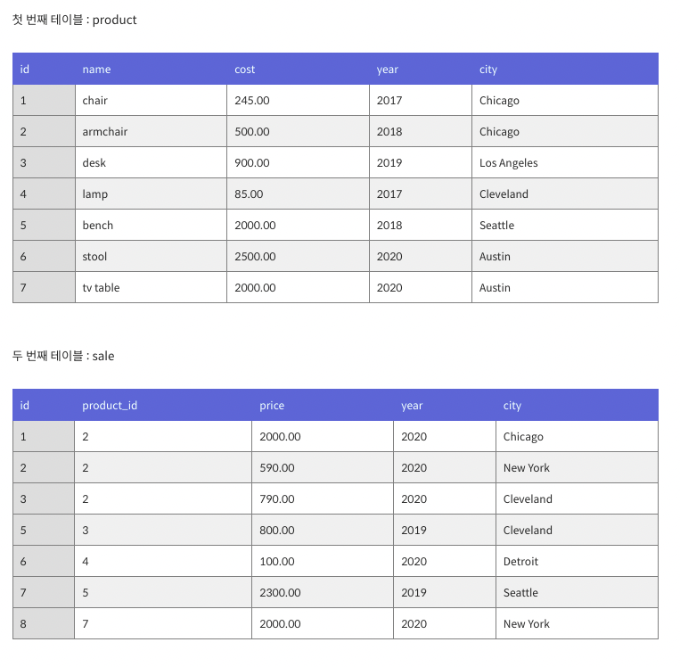

# SQL

**SQL 분류**

* DML (Data Manipulation Language)
  * 데이터 조작 언어
  * 선택, 삽입, 수정, 삭제 하는데 사용되는 언어
  * DML 구문이 사용되는 대상은 테이블의 행
  * 트랜잭션이 발생하는 SQL도 DML
* DDL (Data Definition Language)
  * 데이터 정의 언어
  * 데이터베이스, 테이블 뷰, 인덱스 등 데이터베이스 개체를 생성, 삭제, 변경하는데 사용되는 언어 (CREATE, DROP, ALTER)
  * Rollback, Commit 사용 불가, 즉 DDL문 실행시 바로 적용
* DCL (Data Control Language)
  * 데이터 제어 언어
  * 사용자에게 어떤 권한을 부여하거나 빼앗을 때 사용되는 언어 (GRANT, REVOKE, )

* show

  ~~~sql
  show databases;
  ~~~

* use

  ~~~sql
  use '데이터베이스명';
  ~~~

* describe '테이블명'

  * 테이블 속성정보 확인, 키 설정 null 설정 등 확인가능

  ~~~sql
  describe city;
  desc city;
  ~~~

* **select**

  * 작성 순서

  ~~~sql
  select 컬럼명, 연산식, 별칭, distinct(중복제거), ||, 함수
  	from 테이블명
  	where 조회 데이터 조건식
  	group by 집계함수 적용기준 컬럼명
  	having 집계함수 조건식
  	order by 정렬순서
  ~~~

  * 실행 순서

    from => where => group by => having => select => order by

  * select

    
  
  * where
  
    
  
  * 서브쿼리
  
    * 서브쿼리가 조인에 비해 직관적이라서 이해하기 쉽지만, 때로는 조인이 훨씬 효과적이다.
  
    * 조인은 쿼리문이 복잡해지더라도 서브 쿼리에 비해 읽어내기 수월하다.
  
    * 내부 쿼리가 단일한 값을 반환한다면 조인으로도 충분히 구현할 수 있다.
  
      
  
      ~~~sql
      #2000원에 팔린 제품의 이름과 가격을 추출
      #속도 테이블 둘 0.00080 > 조인 0.0010 > 내부쿼리 0.0012
      #테이블 둘
      select name, cost
      from product p, sale s
      where p.id=s.product_id and s.price=2000;
      #내부쿼리 - 외부쿼리의 id와 내부쿼리의 product_id가 같은지 확인하기 위해 비교할 때마다 내부쿼리가 실행된다.
      select name, cost
      from product
      where id=
      	(select product_id
        from sale
        where price=2000 and product.id=product_id #여기서 id가 같다를 안해주면 행이 여러개 나와서 
         																					 #id=( ... )가 1:n개 매칭이 된다. 즉 오류!
        );
      #조인
      select name, cost
      from product p
      inner join sale s
      	on p.id=s.product_id;
      where s.price=2000;
      
      #in 연산자 안에 서브쿼리가 있다면 조인으로 바꿀 수 있다!
      select name, cost
      from product
      where id in(select product_id from sale);
      #join으로 변경한다면, 혹시나 있을 중복값이 나오기 때문에 distinct!
      select distinct name, cost
      from product p
      inner join sale s
      	on p.id=s.product_id;
      	
      #not in 또한 내부에 서브쿼리가 있다면 조인으로 바꾸기
      select name, cost
      from product
      where id not in(select product_id from sale);
      
      #어? 왜 !=, <>을 쓰지 않나요?
      #같지 않다라는 조건연산자는 null을 처리할 수 없다.
      #즉, 왼쪽 테이블 내용 모두 가져온 후 같다는 조건을 설정하고 null인것만 밖으로 빼내면 같지 않다가 된다.
      select distinct name, cost
      from product p
      left join sals s
      	on p.id=s.product_id
      where s.product_id is null;
      ~~~
  
      
  
  * inner join, outer join
  
    

  * 예시
  
    ~~~sql
    #함수, 중복제거, 별칭 등
    select * from employees; #전체조회
    select emp_no, salary from salaries; #두 컬럼 조회
    select emp_no, salary*10 from salaries; #결과 값 연산
    select emp_no 번호, salary 연봉 from salaries; #별칭 적용 (as 별칭명)
    select distinct emp_no from salaries; #결과 값 중복 제거
    select upper(first_name) from employees; #결과 값 대문자로 변경
    
    #between, 대소비교
    select emp_no, salary from salaries where salary >= 80000; #조건 대소비교
    select emp_no, salary from salaries where salary >= 80000 and salary <= 90000;
    select emp_no, salary from salaries where salary between 80000 and 90000;
    select emp_no, salary from salaries where (emp_no - 10000 = 10 or emp_no - 10000 = 20) and salary between 80000 and 90000;
    
    #like 사용
    select emp_no, first_name from employees where first_name = 'ex'; #이름이 ex인 사람
    select emp_no, first_name from employees where first_name like '%e'; #이름의 마지막이 e인 사람
    select emp_no, first_name from employees where first_name like '%e%' #이름에 e가 들어가는 사람
    select emp_no, first_name from employees where first_name like 'e%'; #이름 첫글자가 e인 사람
    select emp_no, first_name from employees where first_name like '_e%'; #두번째 글자가 e인 사람
    select emp_no, first_name from employees where first_name like '%e%e%'#e가 두번 들어가는 사람
    
    #날짜 비교
    select emp_no, hire_date from employees 
    	where hire_date between '1990-01-01' and '1991-01-01';
    select emp_no, hire_date from employees 
    	where hire_date between '1990/01/01' and '1991/01/01';	
    select emp_no, hire_date from employees 
    	where hire_date between '90-01-01' and '91-01-01';
    select emp_no, hire_date from employees 
    	where hire_date like '_____01%'; #1월만 조회
    select emp_no, hire_date from employees 
    	where hire_date like '%01___'; #1월만 조회
    
    #order by
    select emp_no, hire_date from employees order by hire_date desc; #입사일 내림차순
    
    select emp_no, hire_date
    from employees 
    order by hire_date desc, emp_no; #입사일 내림차순 같으면 번호 오름차순
    
    select emp_no, hire_date from employees order by 2 desc; #두번째 파라미터 내림차순 (입사일)
    select emp_no 번호, hire_date 입사일 from employees order by 입사일 desc; #별칭 사용가능
    
    #rownum
    #첫 사용시 초기화
    set @rownum := 0;
    #초기화 쿼리 없으면 조회마다 값 증가
    select @rownum := @rownum + 1 as rn;
    #from 절에서 초기화 (별칭 무조건 넣어야 함)
    select @rownum := @rownum + 1 as rn
    from employees e, (select @rownum:=0) rn_e; 
    #where 절에서 초기화
    select @rownum := @rownum + 1 as rn
    from employees e
    where (@rownum := 0) = 0;
    #페이징으로 쓸 수 있는 sql
    select board_id, board_name, board_views
    from
    	(
      select @rownum:=@rownum+1 as rn, b.*
      from board b
      where (@rownum:=0) = 0
      order by board_creation_date
      ) a
    where rn berween 10 and 20;
    
    #group by 
    select emp_no, sum(salary)
    from
    (
    select emp_no, salary
    from salaries
    ) b
    group by emp_no
    
    #having = group by의 조건식
    select emp_no, sum(salary)
    from
    (
    select emp_no, salary
    from salaries
    ) b
    group by emp_no
    having emp_no >= 10500;
    #서브쿼리
    select e.enumber, ename, pcount
    from temployee e, tproduction p
    where e.enumber = p.enumber;
    #중복되는 ename 때문에 sum(pcount) 하고싶다면
    select ename, sum(pcount)
    from temployee e, tproduction p
    where e.enumber=p.enumber
    group by ename;
    
    #inner join - 조건 만족 범위 내부 레코드 조인
    select e.enumber, ename, pcount
    from temployee e, tproduction p
    where e.enumber = p.enumber;
    #이 sql의 서브쿼리와 inner join 결과는 같다 on 절의 조건이 일치하는 결과만 출력!
    select e.enumber, ename, pcount
    from temployee e
    	inner join tproduction p
    	on e.enumber=p.enumber
    order by pcount;
    #outer join - 조건 만족 범위 외부 레코드 조인
    select e.enumber, ename, pcount
    from temployee e, tproduction p
    where e.enumber = p.enumber;
    #이것과 outer join은 다르다.
    #left join은 from 테이블에 있는 것들을 다 포함한 후에 on절에 조건에 맞는 것도 가져옴
    #즉, temployee에 존재하지만 tproduction에 존재하지 않으면 p.enumber는 null로 출력됨
    select e.enumber, ename, pcount
    from temployee e
    	left outer join tproduction p
    	on e.enumber=p.enumber
    order by pcount;
    
    
    ~~~
    
    