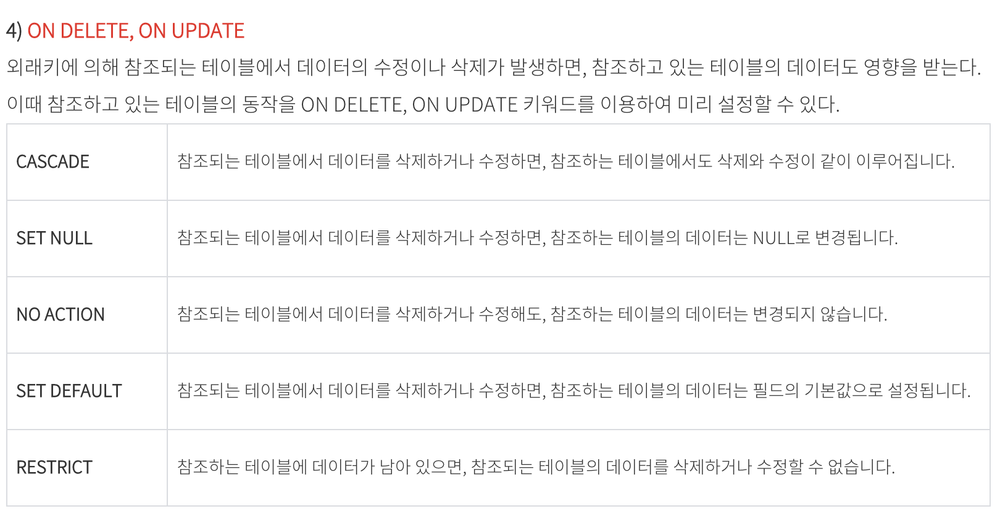
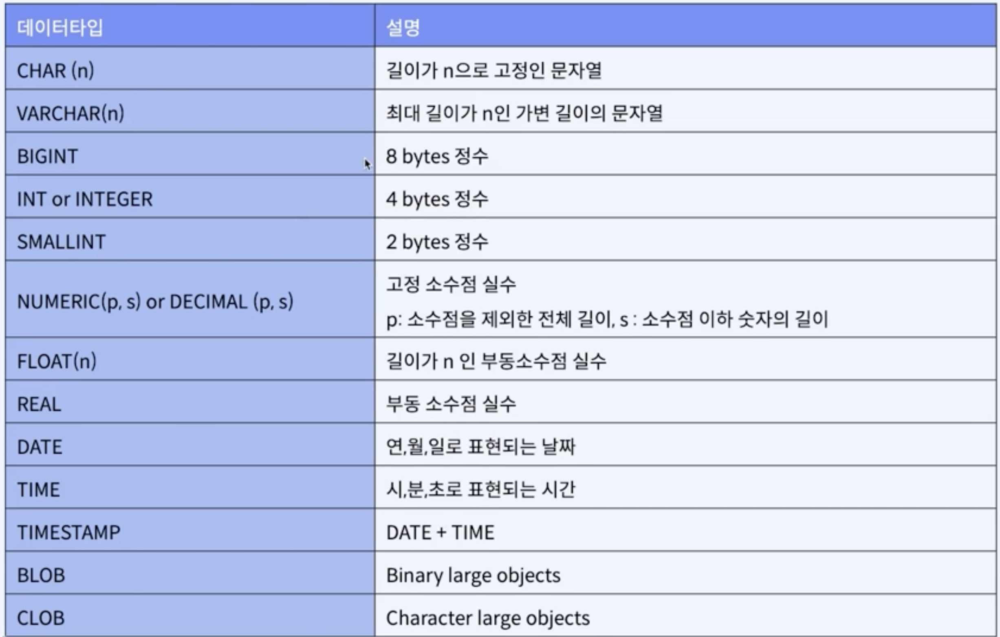
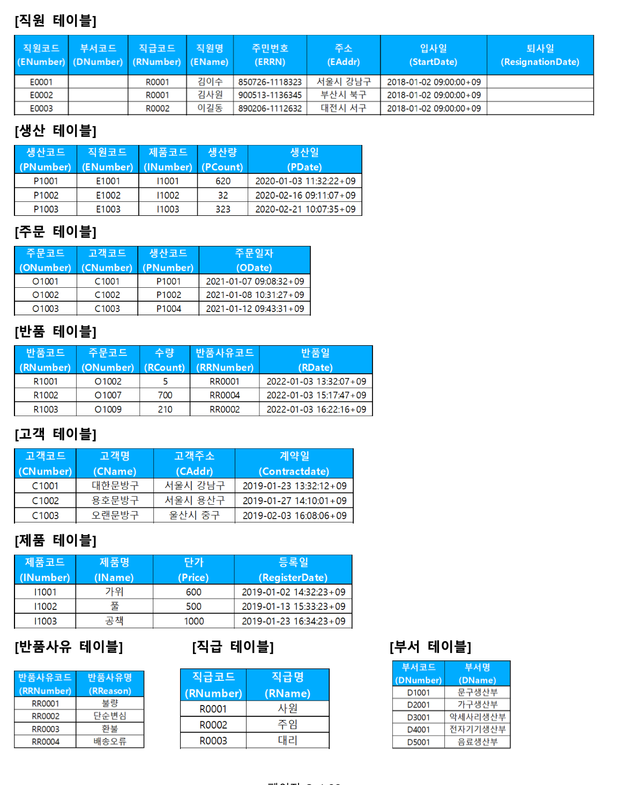

# sql

**테이블 생성**

~~~sql
CREATE table 테이블 명 (
  컬럼명 타입 조건,
  ...
  
  조건 or 함수
  check
  foreign key ... references ...
  on update/delete cascade // set null ...
  )
~~~

**데이터 타입**

char - 고정길이
varchar - 가변길이

bigint - 8bytes 정수 - 0부터 $2^{64}-1$까지 
int or integer - 4bytes 정수 - 0부터 약43억까지
smallint - 2bytes 정수 - 0부터 

* int형이 bigint보다 10% 이상의 디스크 용량을 절약할 수 있다고 한다. 수십억개의 데이터를 가지지 않을 것이라면 속도 등 효율성의 측면에서 int형이 좋다.

* 그러나 db 양이 작다면 어느것을 사용해도 속도나 디스크 용량에 큰 영향을 치지 않을 것이다.

* 만약 DB 규모가 큰 어플리케이션을 개발한다면 서버 운영 효율이 좀 낮아지더라고 bigint형으로 설정하는 것이 유리할 수 있다. db의 양이 int를 초과할 때 업그레이드 하는 것이 간단한 문제가 아니다.

* 밑은 테이블의 데이터 형을 변경하는 명령이지만, 다른 테이블에서 외래키로 참조하고 있다면, 에러가 발생한다.

  * 외래키를 DROP하고

  > ALTER TABLE MEMBER_TB MODIFY member_id unsigned not null auto_increment;

예시

~~~sql
CREATE TABLE MEMBER_TB (
	member_id varchar(20) primary key,
  ps varchar(20) not null,
  name varchar(20) not null,
  phone varchar(11) not null,
  grade varchar(10) not null default 'bronze',
  point int not null default 0,
  check (grade in ('bronze', 'silver'))
);

CREATE TABLE PRODUCT_TB (
	product_id bigint unsigned not null auto_increment,
  product_name varchar(20) not null,
  primary key(product_id)
);

CREATE TABLE ORDER_TB (
	order_id int primary key,
  member_id varchar(20) not null,
  product_id int not null,
  KEY FK_MEMBER_ID (member_id),
  KEY FK_PRODUCT_ID (product_id),
  CONSTRAINT FK_MEMBER_ID FOREIGN KEY (member_id) REFERENCES MEMBER_TB(member_id) ON UPDATE CASCADE,
  CONSTRAINT FK_PRODUCT_ID FOREIGN KEY (product_id) REFERENCES PRODUCT_TB(product_id) ON UPDATE CASCADE
);
~~~

**사용할 테이블**

**기본 검색 및 정렬**

~~~sql
select cname, caddr
from tcustomer as tcu
where caddr = '부산시 남구'
order by cname asc;
~~~

