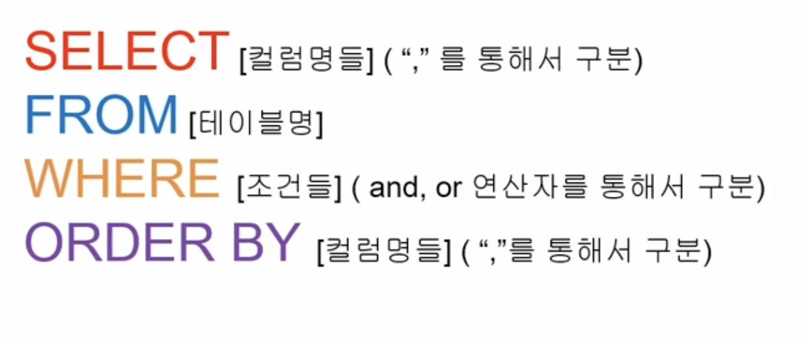

# sql

**테이블 생성**

~~~sql
CREATE table 테이블 명 (
  컬럼명 타입 조건,
  ...
  
  조건 or 함수
  check
  foreign key ... references ...
  on update/delete cascade // set null ...
  )
~~~

**데이터 타입**

char - 고정길이
varchar - 가변길이

bigint - 8bytes 정수 - 0부터 $2^{64}-1$까지 
int or integer - 4bytes 정수 - 0부터 약43억까지
smallint - 2bytes 정수 - 0부터 

예시

~~~sql
CREATE TABLE MEMBER_TB (
	member_id varchar(20) primary key,
  ps varchar(20) not null,
  name varchar(20) not null,
  phone varchar(11) not null,
  grade varchar(10) not null default 'bronze',
  point int not null default 0,
  check (grade in ('bronze', 'silver'))
);

CREATE TABLE PRODUCT_TB (
	product_id bigint unsigned not null auto_increment,
  product_name varchar(20) not null,
  primary key(product_id)
);

CREATE TABLE ORDER_TB (
	order_id int primary key,
  member_id varchar(20) not null,
  product_id int not null,
  KEY FK_MEMBER_ID (member_id),
  KEY FK_PRODUCT_ID (product_id),
  CONSTRAINT FK_MEMBER_ID FOREIGN KEY (member_id) REFERENCES MEMBER_TB(member_id) ON UPDATE CASCADE,
  CONSTRAINT FK_PRODUCT_ID FOREIGN KEY (product_id) REFERENCES PRODUCT_TB(product_id) ON UPDATE CASCADE
);
~~~

**사용할 테이블**

**기본 검색 및 정렬**

~~~sql
select cname, caddr
from tcustomer as tcu
where caddr = '부산시 남구'
order by cname asc;
~~~

* 작성 순서

  1. select 컬럼명, 연산식, 별칭, distinct, ||, 함수
  2. from 테이블명
  3. where 조회 데이터 조건식
  4. group by 집계함수 적용 기준 컬럼명
  5. having 집계함수 조건식
  6. order by 정렬순서 / 컬럼명(index, 별칭) + asc/desc + nulls first/last

* 실행 순서

  from => where => group by => having => select => order by

* 
