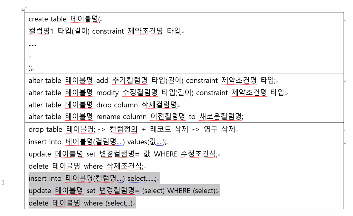
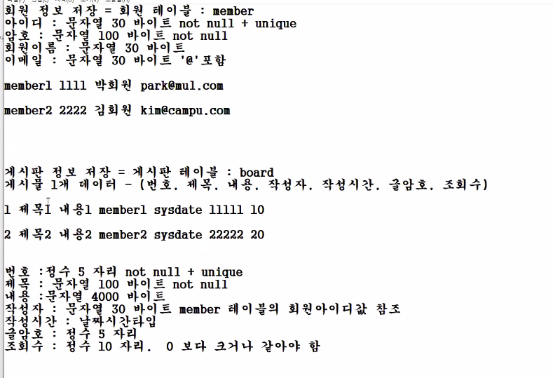

# SQL Day3

6장 select / 6.5절 DML

7장 데이터타입, 함수, join, subquery

8장 테이블 DDL

## 8장 테이블과 뷰

## 4장 데이터베이스 모델링 111p

* 프로젝트를 구현 순서

1. 업무 분석
2. 프로젝트 설계 - 어디는 자바 쓰고 DB 내용 저장하고, AI => DB모델링, 테이블 정의
3. 구현
4. 각각 구현 한 거 통합
5. 테스트
6. 배포

회원 / 상품 이 있으면 이 관계를 테이블에 정의

회원테이블 / 상품테이블

1. 회원+상품+구매 모두 있는 테이블을 만듦

   구매하지 않은 회원의 null 컬럼이 많다

   모든 회원 / 구매한 회원 으로 나눔

테이블 설계할 때 고려해야할 사항

* null 컬럼이 많은가?
* 중복 레코드가 여러개인가?

* DDL을 만드는 테이블 문법

  이름 - 숫자시작 불가능, 예약어 사용 불가능, _ 특수문자 이것만, 30문자 길이 제한

  타입 - number(5, 2), varchar2(byte), date('rr/mm/dd')

  create table 테이블명 (

  컬럼명1 타입(길이),

  컬럼명2 타입(길이),

  컬럼명3 타입(길이)

  );

* emp테이블 만들기

  create table emp ( id number(5),

  name varchar2(20),

  dept_id number(5),

  salary number(12, 2)

  );

* alter table 테이블명 add 컬럼명1 타입(길이); // 테이블 구조 변경(컬럼추가, 컬럼타입수정, 컬럼삭제)

  * indate 추가하고 싶음 // date는 길이가 정해져있지 않음

  * alter table emp add indate date; //타입이 없어서 안써도 됨

  * alter table emp drop column indate;  // drop은 삭제

  * alter table emp modify name varchar2(30); // 컬럼의 타입이나 길이 수정

  * alter table emp rename column indate to hiredate; // 컬럼 이름 변경

  * emp 테이블에 데이터가 삽입되지 않은 상태라면 수정이 가능하지만

    삽입된 상태라면 컬럼 길이를 줄이는건 불가능하다.

    타입 수정 불가능 하다.

* drop table 테이블명;

  * drop table emp; 테이블 영구 삭제

테이블 이름들 보는 명령어 select tname from tab

테이블 구조 보는 명령어 desc emp 

DDL - data definition language - 테이블 대상

DML - 테이블 레코드 대상

| 삽입                                                         | 수정                                                         | 삭제                                                         |
| ------------------------------------------------------------ | ------------------------------------------------------------ | ------------------------------------------------------------ |
| insert into 테이블 명 values (컬럼1값, 컬럼 2값,...) ===> 모든 컬럼 값 구성 insert into 테이블명(컬럼1, 컬럼2 ) values(컬럼 1 값, 컬럼 2값) ===> 특정 지정 컬럼 값 구성 (지정되지 않는 컬럼값 null) | update 테이블명 set 컬럼명1 = 변경 값 => 테이블 모든 레코드의 컬럼명1 변경 update 테이블명 set 컬럼명1 = 변경 값 where 변경 조건식;  => 테이블 변경 조건에 맞는 레코드의 컬럼명1 변경 | delete 테이블명; => 테이블 모든 레코드 삭제 (drop table 테이블 명) 이거랑 같지만 다른 것도 있음 delete는 삭제 조건식이 있음 delete 테이블명 where 삭제 조건식 |

emp 테이블 모든 컬럼 값 삽입

ID NAME DEPT_ID SALARY TITLE HIREDATE

100 김사원 신입사원 20 1234567890.11 '21/08/16'

insert into emp values( 100, '김사원', 20, 1234567890.11, '신입사원', '21/08/16' );

insert into emp values( 200, '박대리', 20, 1234567899.11, '3년차대리', '18/08/16' );

insert into emp values( 101, '최신입', 10, 1234567890.11, '신입사원', sysdate );

insert into emp values( 201, '이대리',  null, null, '1년차대리',  '2020/12/12' );

=> insert into emp(id, title, name , hiredate) values (201, '1년차대리', '이대리,'2020/12/12'); 자동 null삽입

202 박과장 null null 1년차과장 '01-01-2010'

insert into emp(id, title, name , hiredate) values (202, '1년차과장', '박과장', to_date('01-01-2010' , 'mm-dd-yyyy'));

* 날짜형식 -> 2010/01/01 날짜형식 인정(자동형변환)

​					01-01-2010 날짜형식 인정x (명시적 형변환 해야함.)

​					to_date('01-01-2010' , 'mm-dd-yyyy')

emp 테이블에서 오늘 입사 사원 이름, 입사일 조회 => 사실 hiredate는 년월일요일일시분초로 구성돼있음

select name, hiredate from emp where hiredate = sysdate;

=> select name, hiredate from emp where to_char(hiredate, 'rr/mm/dd') = to_char(sysdate, 'rr/mm/dd'); 

select to_char(hiredate, 'rr/mm/dd HH24:MI:SS'), to_char(sysdate, 'rr/mm/dd' HH24:MI:SS) from emp; 

- 박과장의 급여 900000 넣어주기

  update emp

  set salary = 900000

  where name = '박과장'

* 신입사원 급여 800000 넣어주기

  update emp 

  set salary = 800000

  where title = '신입사원'

* 대리 급여 850000 넣어주기

  update emp
  set salary = 850000

  where title like '%대리'

  where title = '1년차대리' or title = '3년차대리';

  where title in ('1년차대리', '3년차대리')

commit??은 뭐지??

### SubQuerry - 다른 sql 문장 포함

insert - subquery

* employees 테이블의 레코드 몇 개를 본사해서 emp 테이블에 

  insert to emp values(...) => 1개 레코드 저장

  insert into emp select * from employees where firest_name like'%ex%'; => 모든 레코드 저장\

insert into emp select employee_id, first_name, department_id , salary, job_id, hire_date from employees where salary >= 15000      emp 순서랑 employees 순서 맞추기

### update - subquery

* Steven의 title을 '사장' 으로 변경

  update emp set title = '사장' where name = 'Steven'

* Steven의 title을 박과장 title로 변경

  update emp set title = (select title from emp where name = '박과장') where name = 'Steven'

* Steven과 같은 title을 가진 사원의 급여를 2배 인상

  update emp set salary = 2*salary where title = (select title from emp where name = 'Steven')

* 김사원과 같은 title을 가진 사원의 급여를 이대리의 급여로 인상

  update emp set salary = (select salary from emp where name = '이대리') where title = (select title from emp where name = '김사원')

* 여기서 commit을 왜한거지?

delete

* 니나 삭제

  delete emp where name = 'Neena';

* 니나와 같은 급여를 받는 사원 삭제

  delete emp where salary = (select salary from emp where name='Neena');

영구 삭제 / 취소 복구 선택 => rollback

### 자동으로 증가하는 시퀀스

​	insert 레코드 저장할 때 숫자 1 증가 ( 1부터 시작 / 1씩 증가 / 100 종료)

​	100 사번 저장

​	101 사번 그 다음 레코드 저장

​	102 사번 그 다음 레코드 저장

* 오라클 자동 증가 숫자값 생성 - sequence

  1. 정의

     테이블 정의 / 시퀀스 정의 / 사용자 정의 할 때 - create 사용

     create table/ create sequence

     create sequece 시퀀스명; 1부터 시작 - 1씩 증가 - 

     start with 시작값

     increment by 증가치

     maxvalue 종료값

     => create sequence emp_id_seq start with 308 increment by 1 maxvalue 999

     select emp_id_seq.nextval from dual

     select emp_id_seq.nextval from dual

     select emp_id_seq.nextval from dual

     select emp_id_seq.currval from dual 마지막 값 보여줌

     

  2. 레코드 저장할 때 활용

     insert into emp values(emp_id_seq.nextval , '서부장', 20, 1000000, '고참부장', '05/01/01'); 303

     insert into emp values(emp_id_seq.nextval , '박부장', 20, 1000000, '고참부장', '05/01/01'); 304

     insert into emp values(emp_id_seq.nextval , '김부장', 20, 1000000, '고참부장', '05/01/01'); 305

     select emp_id_seq.nextval from dual 306

     insert into emp values(emp_id_seq.nextval , '최부장', 20, 1000000, '고참부장', '05/01/01'); 307

  3. 시퀀스 없이 유사한 효과

     insert into emp values(1+(select max(id) from emp) , '이부장', 20, 1000000, '고참부장', '05/01/01');

### 복사 

* create table copy_emp as select * from emp;
* 

DML

1. 데이터 조작

2. subquery 사용

3. 영구 저장 수정 삭제 이후 영구 반영 / 취소 복구 선택

   ​											commit /  rollback

4. Transaction Control Language - TCL

   Transaction - 논리적 1개 업무지만 단일 업무가 여러개로 구성된 것

   ​					- all or nothing ( 모든 일이 다 되거나 아무것도 안되거나)

   ​					- commit / rollback

   계좌 테이블

   create table account(code number(5), balance number(8, 2))

   insert into account values(12345, 10000);

   insert into account values(54321, 5000);

   계좌 이체 

   12345 계좌 주인이 54321 계좌로 이체 - 5000

   2-1 12345 계좌에서 5000 출금

   update account set balance = balance - 5000 where code = 12345;

   2-2 54321 계과로 5000 입금 

   update account set balance = balance + 5000 where code = 54321;

   

update account set balance = balance - 1000 where code = 12345;

update account set balance = balance + '1000 where code = 54321;

rollback

하면 오류난거 뛰어넘고 앞으로 감

트랜잭션 정리

1. sql 실행 시작 - 자동으로 트랜잭션이 시작됨

2. ddl-create ... 실행하면 자동으로 commit 처리됨 - 트랜잭션 종료

3. 1. dml-insert delete update 실행해도 자동으로 commit은 안됨 그러나 commit 하면 트랜잭션 종료
   2. dml-insert delete update 실행해도 자동으로 commit은 안됨 그러나 rollback 하면 취소하고 원상복구 됨 트랜잭션 종료

4. dml - insert delete update 실행 - 트랜잭션 시작

5. | conn hr/hr                                               | conn hr/hr                                         |
   | -------------------------------------------------------- | -------------------------------------------------- |
   | delete emp where id = 305; -트랜잭션 시작                |                                                    |
   |                                                          | select * from emp; => delete 반영 이전             |
   | commit                                                   |                                                    |
   |                                                          | select * from emp; => delete 반영됨                |
   | delete emp where id = 205;                               |                                                    |
   | rollback                                                 |                                                    |
   |                                                          | select * from emp; => delete 미반영                |
   | update emp set salary = 7000000 where title ='신입사원'; |                                                    |
   |                                                          | update emp set dept_id = 30 where name = '김사원'; |

   

grant 명령

connect system/system

create user test identified by test; => test/test 생성

grant resource, connect to test; => db접근 권한, conn권한

revoke resource, connect from test; => db접근 권한, conn권한 뺏음

grant select on emp to test;

select * from hr.emp; => 다른계정 테이블 조회

제약조건

숫자 중복 해결 방법 - 자동 증가 시퀀스

급여가 마이너스이던가 이름이 null이거나 데이터 상태에 모순에 방지

데이터 제약조건 - integrity constraints

제약조건 종류

| not null    | 컬럼값이 비어있으면 안된다.                            |
| ----------- | ------------------------------------------------------ |
| unique      | 컬럼값 중복되면 안된다 조건지정                        |
| primary key | not null + unique 조건 지정(레코드 식별자)             |
| check       | 사용자 정의 조건 지정                                  |
| foreign key | 다른 테이블의 컬럼에 미리 포함된 값들만 사용 조건 지정 |

### 제약조건 문법

create table 테이블명(컬럼명1 타입(길이)  ???????)

| not null    | id number(5) constraint 제약조건명(enp_id_nn) not null null 불가 |
| ----------- | ------------------------------------------------------------ |
| unique      | id number(5) constraint 제약조건명(enp_id_uk) unique 컬럼값 중복되면 안된다. null도 마찬가지 |
| primary key | id number(5) constraint 제약조건명(enp_id_pk) primary key not null + unique null 불가, 컬럼값 중복x |
| check       | id number(5) constraint 제약조건명(enp_id_ck) check ( id >= 1000 and id <= 2000)  |
| foreign key | id number(5) constraint 제약조건명(enp_id_fk) references dept(dept_id) 다른 테이블에서 primary key여야하고 그 컬럼에 없는 값은 사용불가 참조할테이블(참조할테이블의primary key) |

1. create table 테이블명(컬럼명1 타입(길이)  ???????) //컬럼명 뒤

2. create table 테이블명(컬럼명1 타입(길이) , 컬럼명2 타입(길이), ....)  //컬럼 나열하고 그 후에 컬럼명 붙이면서 

   constraint emp_id_pk primary key(컬럼명1) 

3.  alter table add 컬럼 1개 추가

   alter table add constraint emp_id_pk primary key(컬럼명1)

### 테이블 만들기

| c_emp테이블                                             | c_dept 테이블                    |
| ------------------------------------------------------- | -------------------------------- |
| emp_id 5자리 정수 중복x null                            | dept_id 5자리 정수 중복x, null x |
| name 30자리 문자열 nullx                                | dept_name 30자리 문자열, nullx   |
| salary 소수점이하 2(전체10) 1000이상                    | city 20자리 문자열               |
| indate 날짜                                             |                                  |
| title 30자리 문자열 사원 대리 과장 부장 임원중 1개 가능 |                                  |
| dept_id 5자리 정수 c_dept 테이블에 존재하는 부서만 가능 |                                  |

create table c_emp(

emp_id number(5) constraint c_emp_id_pk primary key,

name varchar2(30) constraint c_emp_name_nn not null,

salary number(10, 2) constraint c_emp_sal_ck check (salary >= 1000),

indate date,

title varchar2(30) constraint c_emp_title_ck check (title in ('사원', '대리', '과장', '부장', '임원')),

dept_id number(5) constraint c_emp_dept_id_fk references c_dept(dept_id) 

)

create table c_dept

(dept_id number(5) constraint c_dept_id_pk primary key,

dept_name varchar2(30) constraint c_dept_name_ck check (dept_name like '%부서'),

city varchar2(20)

);

DESC C_EMP

제약조건 정의는  테이블 생성 DDL 정의할 때

C_DEPT 

* 제약조건 정의 테이블 생성 DDL정의
* C_Dept, C_EMP 테이블에 DML 적용 효과
* insert into c_dept values(10, '인사부서', '제주시'); => 오류
* insert into c_dept values(20, '교육부서', '부산시');
* insert into c_dept values(null, '전산부서', '서울시'); => 오류

* insert into c_emp values(100, '박사원', 20000, sysdate, '사원', 10)
* insert into c_emp values(200, null, )
* insert into c_emp values(200, '김대리', 5000, sysdate, '대리', 1000)
* insert into c_dept values(1000, '신생부서', '서울시'); =>이걸로 1000번 부서 만듦 그럼 위 대리 들갈 수 있음

c_emp 테이블의 dept_id 컬럼이 c_dept 테이블의 dept_id 컬럼값 참조함

자식                                              부모 테이블

1. 부모테이블은 자식테이블보다 먼저 정의된다.

2. 부모테이블에서 값 삭제시 

3. 자식 테이블에서 dept_id = 30 값 참조중이라면 삭제 불가능

   update c_emp set dept_id = 20 where dept_id=10; 

   

* 계정의 모든 테이블 이름 조회

  select tname from tab;

  select name from user_tables;

* 제약조건 지정 조회

  select * from user_constraints

  select * from user_sequence

  desc user_constraints => constraint_name, constraint_type, search_condition

  

### 제약조건 확인

select constraint_name, constraint_type, search_condition from user_constraints where table_name='C_DEPT';

1, 2, 6, 7 , 8 장 3일간 진행됐당~

회원가입정보 영구 저장 => 파일 형태, db 형태

예제

1. 회원테이블 만들기

   create table member(
   id varchar2(30) constraint member_id_pk primary key,
   pw varchar2(100) constraint member_pw_nn not null,
   name varchar2(30),
   mail varcahar2(30) constraint member_mail_ck check (mail like '%@%')
   )

2. 회원 만들기

   insert into member values('member1', '1111', '박회원', 'park@mul.com')

   insert into member values('member2', '2222', '김회원', 'kim@campus.com')

3. 게시판 만들기

   create table board(
   num number(5) constraint board_num_pk primary key,
   title varchar2(100) constraint board_title_nn not null,
   content varchar2(4000),
   writer varchar2(30) constraint board_writer_fk references member(id),
   time date,
   write_pw number(5),
   views number(10) constraint board_veiws_ck check (views >= 0))

4. 게시물 만들기

   insert into board values(1, '제목1', '내용1', 'member1', sysdate, 11111, 10);

   insert into board values(2, '제목2', '내용2', 'member2', sysdate, 22222, 20);

===============

1. 3번 게시물 만들기

   create sequence board_num_seq start with 3 increment by 1 maxvalue 99999;

   insert into member values('kitri', '3333', '신회원', 'shin@ti.com');

   insert into board values(board_num_seq.currval, '키트리', 'sql수업중입니다', 'kitri', sysdate, 3333, 0);

2. 3번 게시물 조회하는 sql

   select * from board where num = 3;

3. 3번 게시물의 조회수를 1증가시키는 sql

   update board set views = views+1 where num = 3;

4. 3번 게시물 제목, 내용, 작성시간 수정하는 sql

   update board set title = '변경_키트리', content = '변경_sql수업중입니다', time = sysdate where writer ='kitri' and write_pw = 3333;
   
5. 게시물 등록 sql

   create sequence board_title_seq start with 3 increment by 1 maxvalue 99999;

   create sequence board_content_seq start with 3 increment by 1 maxvalue 99999;

   create sequence board_write_pw_seq start with 3333 increment by 1111 maxvalue 99999;

   1. insert into board values(board_num_seq.nextval, board_title_seq.nextval'번째' , board_content_seq.nextval'번째게시물등록', 'db', sysdate, board_write_pw_seq.nextval, 0);
   2. 

