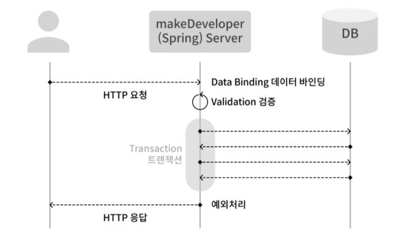

## 개발자 키우기 주요 기능 CRUD

### 개발자 생성하기

Post 메서드를 활용하여 개발자를 생성

validation 이용

### 개발자 목록과 특정 개발자 상세 내용 확인

Get 메서드를 활용하여 개발자의 정보를 확인

DTO의 개념과 역할에 대해 배우기

### 개발자 정보ㅈ 수정

PUT 메서드를 활용하여 개발자의 정보를 수정합니다.

### 개발자 삭제

DELETE 메서드를 활용하여 개발자의 정보를 삭제(분리 보관) 합니다.

트랜잭션에 대해 배우기

