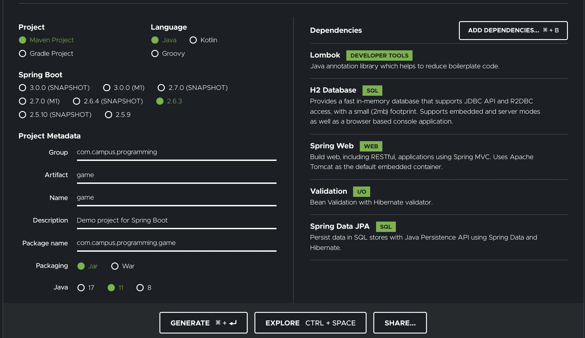
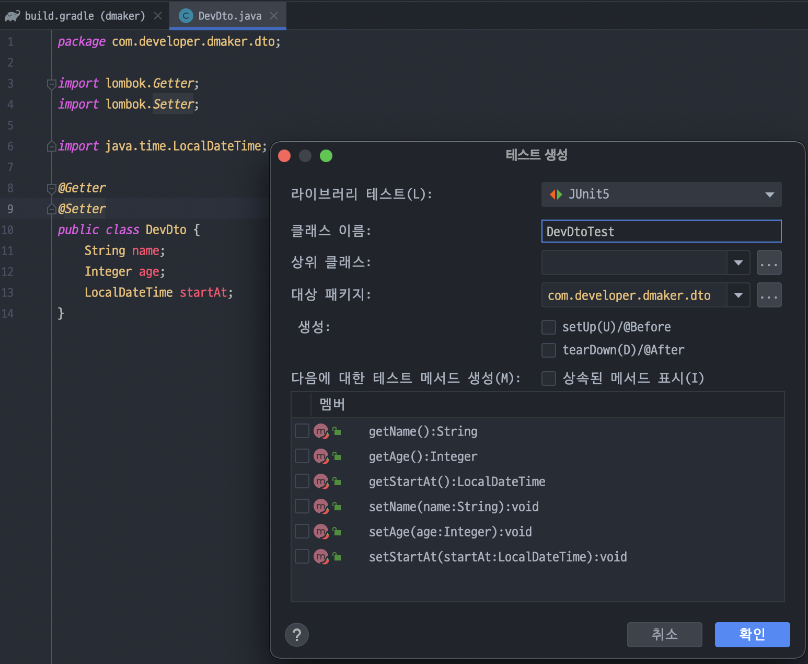
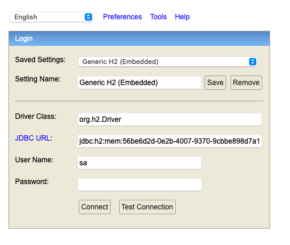
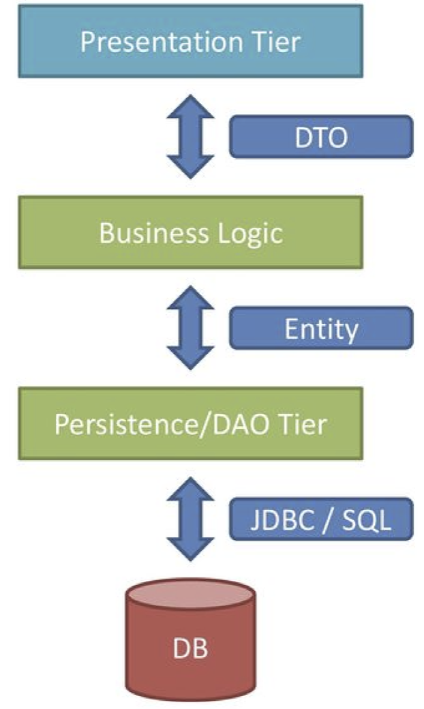

## Spring starter 프로젝트 만들기

* https://start.spring.io/

* 인텔리제이 유료판이 아니어도 spring Initialization 사이트를 통해 프로젝트를 만들 수 있다.

  

## 테스트 파일 만들기

* Shift + Command + T
* 테스트를 위해 만드는 클래스라고 생각하면 된다.




## H2 Database

인메모리 DB

* Entity 클래스를 통해서 JPA가 테이블을 관리
* Repository 인터페이스를 통해, CRUD관리
  * Repository<T, ID>
  * CrudRepository<T, ID>
  * PagingAndSortingRepository<T, ID>
  * JpaRepository<T, ID>
* Service로 Repository를 구체화
* Controller로 Service 메서드 호출

> 진행 방향
>
> 1. h2 데이터베이스를 쓰기위해 Entity라는 특수한 클래스를 만듦
>
> 2. Entity를 영속하기 위한 Repository란 인터페이스를 만듦
>
> 3. service에서 Repository 호출
>
> 4. controller에서 service를 통해 Repository를 호출했을 때 entity객체를 repository에서 save를 해서 영속시키도록 하면
>
> 5. h2 database에 저장이 되고, 저장된 데이터를 콘솔로 확인할 수 있다.

* localhost:8080/h2-console 을 통해 데이터베이스 콘솔 들어갈 수 있음

* 추가 설정이 필요한데, application.properties를 application.yml로 바꾸고, 밑 입력하면 콘솔에 데이터베이스 JDBC URL이 뜸

* 이 주소는 메모리에 저장되며, 스프링 실행할 때마다 변경됨

  ```yml
  spring:
    h2:
      console:
        enabled: true
  ```

  

  * localhost:8080/h2-console 로 들어가서 콘솔에 뜬 JDBC URL을 입력하면 데이터베이스에 진입 가능
    * JDBC란? 자바에서 DB프로그래밍을 하기위해 사용되는 API

### JPA를 왜 사용할까?

신규 컬럼 하나만 추가되어도 DTO, DAO 등 수정 작업이 많아져 유지보수가 불편해진다.

* 즉 JPA를 사용하면, 데이터베이스 중심 설계에서 객체 중심 설계로 변경됨으로서 유지보수가 간결해진다.

### ORM

* ORM이란?
  * Object-Relational Mapping(객체와 관계형데이터베이스 매핑)
  * 객체가 테이블이 되도록 매핑시켜주는 프레임워크
  * SQL 쿼리가 아닌 메서드로 데이터를 조작할 수 있다.
  * 그래서 프로그램 복잡도를 줄이고 자바 객체와 쿼리를 분리할 수 있으며, 트랜잭션 처리나 기타 데이터 베이스 관련 작업을 좀 더 편리하게 할 수 있다.
    * 기존 쿼리 : select * from member
    * ORM 메서드 : member.findAll()

### JPA

* JPA란?
  * Java Persistence API(자바 ORM 기술에 대한 자바 API 규격)
  * ORM을 사용하기 위한 인터페이스를 모아둔 것
    * 구현체로 Hibernate, EclipseLink, DataNucleus 등이 있다.
* Persistence : 지속됨, 영속성
  * 영속성은 파일 시스템, 객체 데이터베이스 등을 활용하여 구현한다.
  * 영속성을 가지지 않는 데이터는 단지 메모리에서만 존재하기 때문에 프로그램을 종료하면 모두 잃어버리게 되는 특징을 가지고 있다.
  * persistent object : 영속성이 필요한 객체
  * ephemeral object : 영속성이 불필요한 객체



### Entity

JPA에서 Entity에 정의된 프로퍼티들을 통해 테이블을 생성

~~~java
@Entity
@Getter
@Setter
@Builder
@NoArgsConstructor
@AllArgsConstructor
@EntityListeners(AuditingEntityListener.class)
public class Developer {
  
  @ID //PK 설정
  @GeneratedValue(strategy = GenerationType.IDENTITY)
  private Long id;
  
  @Enumerated(EnumType.STRING) //Enum class
  private DeveloperLevel developerlevel;
}
~~~

| 어노테이션                                          | 특징                                                         |                                                     |
| --------------------------------------------------- | ------------------------------------------------------------ | --------------------------------------------------- |
| @Entity                                             | entity 클래스 명명                                           |                                                     |
| @EntityListeners(AuditingEntityListener.class)      | ?                                                            |                                                     |
| @ID                                                 | 필드를 PK로 설정                                             |                                                     |
| @GeneratedValue(strategy = GenerationType.IDENTITY) | auto_increment를 설정하는 어노테이션, 자동으로 데이터값 증가 | strategy는 IDENTITY, SEQUENCE, TABLE, AUTO 등 있다. |
| @Enumerated(EnumType.STRING)                        | enum class라고 명하고,                                       |                                                     |


### Enum class

상수를 정의할 때 final, static 같은 것과 int, String 같은 타입들을 쓴다. 기존의 상수를 정의하던 방법을을 enum을 이용해 같은 효과를 낼 수 있다.

~~~java
public class EnumExample {
  //기존에 상수를 정의하는 방법
  public static final String MALE = "MALE";
  
  public static void main(String[] args) {
    String gender1;
    gender1 = MALE;
    //이 상태에서 같은 타입의 원하지 않는 상수 값이 할당 될 때
    gender1 = "FEMALE";
    //개발자는 원하지 않은 값을 받아서 오류가 있다 생각하지만, 프로그래밍 상으로는 문제 없기에 에러가 나지 않는다.
    
    Gender gender2;
    gender2 = Gender.MALE;
    //이 상태에서 gender2는 Gender 타입의 상수만 받을 수 있기 때문에 String 타입으로 값이 할당되면 컴파일 에러가 생긴다.
    gender2 = "FEMALE"; //오류
    gender2 = Gender.valueOf("FEMALE"); // O
    gender2 = Gender.FEMALE; // O
    
  }
}

enum Gender {
  MALE,
  FEMALE;
}
~~~

* enum class는 사실 이 모습과 같다.

  ~~~java
  class Gender {
    public static final Gender MALE = new Gender();
    public static final Gender FEMALE = new Gender();
  }
  ~~~


* Entity에서 쓴 Enum class

  ~~~java
  public Enum DeveloperLevel {
    //이렇게 프로퍼티?에 String 상수 값(연관시킬 문자)을 넣어주려면
    NEW("신입"),
    JUNIOR("주니어"),
    SENIOR("시니어");
    //밑에와 같은 String 선언이 필요하고
    private final String description;
    
    //밑에와 같은 생성자가 필요하다.
    DeveloperLevel(String description) {
      this.description = description;
    }
    //값을 메서드를 통해 받고 싶다면 Getter도 넣으면 된다.
  }
  ~~~

  


## 어노테이션

| 어노테이션               | 특징                                                         |      |
| ------------------------ | ------------------------------------------------------------ | ---- |
| 롬복 라이브러리          |                                                              |      |
| @NoArgsConstructor       | 빈 생성자 생성                                               |      |
| @AllArgsConstructor      | 모든 프로퍼티가 있는 생성자 생성                             |      |
| @RequiredArgsConstructor | 필요한 프로퍼티를 넣어주는 생성자<br />@NonNull 프로퍼티를 통해 Null이면 안되는 프로퍼티만 넣어서 생성자를 만듦 |      |
| @Builder                 | setter로 프로퍼티 값을 넣으면서 값이 바뀌지 않도록 하는데 좋음<br />보통 final로 설정 |      |
| @UtilityClass            | 사용자가 정의한 메서드를 만든 클래스를 의미하는 어노테이션   |      |
|                          |                                                              |      |
| @Controller              | Conponent 중 하나                                            |      |
| @ResponseBody            | json으로 응답을 주고 받을 것이라고 의미하는 어노테이션       |      |
| @RestController          | Controller와 RespnseBody 둘 합친 어노테이션                  |      |
| @GetMapping              | Get /main HTTP/1.1이라고 데이터가 들어오면 이쪽으로 매핑     |      |


### @Builder

~~~java
final DTO dto = DTO.Builder();
	.name("Pang")
  .Build();
~~~


### @GetMapping

* HTTP 메시지 응답이 밑에와 같은 모습이라면 매핑 위치에 데이터가 입력됨

  Get /developers HTTP/1.1

~~~java
@GetMapping("/developers")
public List<String> getAllDevelopers() {
  log.info("Get /developer HTTP/1.1"); //콘솔에 입력되는 로그내용
  return Arrays.asList("snow", "Elsa", "Olaf"); //매핑 위치에 전송되는 데이터 내용
}
~~~


### Validation

DTO에서 유효성 검사를 위해 사용된다.

~~~java
public class CreateDeveloper {

    @Getter
    @Setter
    @AllArgsConstructor
    @NoArgsConstructor
    @Builder
    @ToString
    public static class Request {
        //validation @NotNull, @Min, @Max, @Size
        @NotNull
        private DeveloperLevel developerLevel;
        @NotNull
        private DeveloperSkillType developerSkillType;
        @NotNull
        @Min(0)
        @Max(20)
        private Integer experienceYears;

        @NotNull
        @Size(min = 3, max = 50, message = "memberId size must 3~50")
        private String memberId;
        @NotNull
        @Size(min = 3, max = 20, message = "memberId size must 3~20")
        private String name;

        @Min(18)
        private Integer age;
    }

    @Getter
    @Setter
    @AllArgsConstructor
    @NoArgsConstructor
    @Builder
    public static class Repose {
        private DeveloperLevel developerLevel;
        private DeveloperSkillType developerSkillType;
        private Integer experienceYears;
        private String memberId;
    }
}
~~~


* DTO 에서 유효성 검사 설정 하였으면 컨트롤러에서 받아올 때 어노테이션 설정 해야함

~~~java
@PostMapping("/create-developer")
    public List<String> createDevelopers(
      //@Valid로 유효성 검사 하라는 의미  
      @Valid @RequestBody CreateDeveloper.Request request
    ) {
        log.info("request : {}", request);

        dMakerService.createDeveloper(request);

        return List.of("Olaf");

    }
~~~

