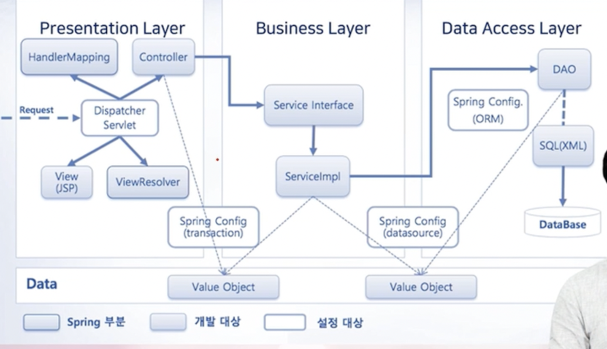

# 스프링

* 공부해야할 것
  * 스프링 프레임워크
  * 스프링 데이터
  * 스프링 시큐리티
  * 스프링 배치
  * 스프링 인터그레이션
  * 스프링 소셜

## 스프링과 메이븐

* Maven은 표준적으로 사용하는 빌드 툴

* XML 설정 파일을 사용

  

* groovy라는 언어로 설정하는 Gradle이 등장

## DI 설정

컨테이너가 생성할 빈 객체를 지정하고 그 빈을 주입하는 방법을 알아볼 수 있다.

1. XML을 이용해 DI를 위한 빈 설정

   * Spring Context ... xml 파일을 작성해서 bean을 설정할 수 있다.

     ~~~xml
     <?xml version="1.0" encoding="UTF-8"?>
     
     <beans xmlns="http://www.springframework.org/schema/beans"
           	...
            >
       //프로퍼티로 빈 생성 방법
     	<bean id="빈 식별자" class="빈 생성할 객체의 클래스 이름">
       	<property name="프로퍼티이름">
           <value>프로퍼티 값</value>
         </property>
       </bean>
       
       //생성자로 빈 생성 방법
       <bean id="빈 식별자2" class="빈 생성할 객체의 클래스 이름2">
         <constructor-arg><value>인자값</value></constructor-arg>
         <constructor-arg><ref bean="다른 빈 식별자" /></constructor-arg>
       </bean>
       
       //사용할 빈
       <bean id="빈 식별자3" class="빈 생성할 객체의 클래스 이름3">
         <constructor-arg value="전달할 파라미터 1" />
         <constructor-arg value="전달할 파라미터 2" />
       </bean>
     </beans>
     ~~~

     

     

2. 자바 코드를 이용한 빈 설정

   * 어노테이션으로 빈 설정 파일 생성

     ~~~java
     @Configuration
     public class config {
     
       @Bean
       public User user1() {
         return new User("id", "pw");
       }
     }
     ~~~

   * xml과 자바 설정을 같이 사용하고 싶다면

     ~~~java
     @Configuration
     @ImportResource("classpath:config.xml")
     public class config {
       
       @Bean
       ...
     }
     ~~~

3. `@Autowired`, `@Resource`, `@Qualifier`

   * `@Autowired`를 통해 빈을 자동으로 주입받을 수 있다. 그러나 인터페이스를 구현한 구현체가 여러개라면 자동으로 주입받는 것을 명시해줘야한다.

     * `@Qualifier`과 `@Resource`는 서로 같은 역할이라 생각하면 편할듯

       ~~~java
       public class Controller {
         
         @Autowired
         @Quialifier("testService1")
         private TestService testService;
         
         @Resource(name = "testService1")
         private TestService testService;
       }
       ~~~

4. 웹 개발에서 컴포넌트 자동등록 방법 (spring-context.xml에 component scan 베이스 패키지 지정 필수)

   * `@Component`

     * `@Controller`
     * `@Service`
     * `@Repository`

   * 컴포넌트 등록 패키지 지정방법

     ~~~xml
     <context:component-scan base-package="패키지 명" />
     ~~~

     

## Layer 

## Presentation Layer

#### MVC 패턴

* model / controller / view
  * model
    * 데이터 저장, 처리
    * Service, DAO 클래스가 해당된다.
    * Domain 객체라고 불리는 VO 또한 모델이다!
  * controller
    * User Interface 화면
  * view
    * 사용자 요청 처리
    * 모델과 화면을 서로 연결
  
* 과거에는 웹 개발에 MVC 패턴을 적용하지 않았는데, 그 모습을 모델1이라 불렀고, MVC패턴을 적용함으로서 모델2라고 부른다.
  
* Model2 아키텍처(MVC)와 Front Controller 패턴
  
  * MVC 패턴의 Controller가 복잡하기 때문에 Front Controller 패턴 아키텍처 형태로 프로세스를 진행함
  
    * 클라이언트 -> 프론트 Controller (Servlet 또는 JSP로 개발) -> 애플리케이션 Controller -> 뷰
  
    * 스프링에서는 프론트 Controller를 내장시켜서 적절한 application controller를 불러냄 
  
      * 기존에는 Servlet을 직접 개발하고 사용해왔다!
      * 그러나 요즘은 `@Controller`를 이용해서 내용을 작성하다보니 Controller 작성 부분이 쉬워졌다
  
      1. Front Controller는 클라이언트가 보낸 요청을 받아서 공통적인 작업을 먼저 수행
      2. Front Controller는 적절한 세부 Controller(우리가 개발하는 컨트롤러)에게 작업을 위임
      3. 각각의 애플리케이션 Conreoller는 클라이언트에게 보낼 뷰를 선택해서 최종 결과를 생성하는 작업
      4. Front Controller 패턴은 인증이나 권한 체크처럼 모든 요청에 대하여 공통적으로 처리해야 하는 로직이 있을 경우 전체적으로 클라이언트 요청을 중앙 집중적으로 관리하고자 할 경우에 사용 

### Business Layer

### Data Access Layer

#### Spring MVC의 특징

* Spring MVC는 모델2 아키텍처와 Front Controller 패턴을 프레임워크 차원에서 제공

  * 스프링의 FrontController는 DispatcherServlet이라는 클래스임
  * DispatcherServlet이라는 클래스를 계층 맨 앞단에 놓고 서버로 들어오는 모든 요청을 받아서 처리하도록 구성
  * 예외가 발생했을 때 일관된 방식으로 처리하는 것도 Front Controller 역할임

* Spring MVC의 주요 구성 요소

  

  

  

  

  1. 클라이언트의 Request
  2. Dispatcher Servlet
  3. Handler Mapping - 어느 컨트롤러를 요청할지 mapping 함
  4. Controller - ModelAndView를 결정해서 Dispatcher Servlet에게 Response함
  5. View Resolver - Dispatcher Servlet은 보여줄 View를 View Resolver를 통해 확보하고
  6. View - 확보한 View인 JSP 파일을 보여주게 된다

* Dispatcher Servlet 설정을 위한 아주 중요한 Web.xml

  ~~~xml
  ...
  
  <servlet>
  	<servlet-name>dispatcherServlet</servlet-name>
    <servlet-class>
    	org.springframework.web.servlet.DispatcherServlet
    </servlet-class>
    <init-param>
    	<param-name>contextConfigLocation</param-name>
      <param-value>
      	/WEB-INF/config/spring/servlet-context.xml
      </param-value>
    </init-param>
  </servlet>
  
  <servlet-mapping>
  	<servlet-name>dispatcherServlet</servlet-name>
    <url-pattern>/</url-pattern>
  </servlet-mapping>
  
  //post 방식으로 보낼 때 데이터 깨지지 않게 하기위한 인코딩 방식
  <filter>
  	<filter-name>encodingFilter</filter-name>
    <filter-class>
    	org.springframework.web.filter.CharacterEncodingFilter
    </filter-class>
    <init-param>
    	<param-name>encoding</param-name>
      <param-value>UTF-8</param-value>
    </init-param>
  </filter>
  
  <filter-mapping>
  	<filter-name>encodingFilter</filter-name>
    <url-pattern>/*</url-pattern>
  </filter-mapping>
  ~~~

* servlet-context.xml 

  * Dispatcher Servlet이 Front Controller 역할을 하게 설정을 하면 해야할 설정 파일

  ~~~xml
  //기본적인 빈 설정 파일임
  <?xml version="1.0" encoding="UTF-8"?>
  <beans xmlns="http://www.springframework.org/schema/beans">
        ...
  	<context:component-scan base-package="kr.co.acomp.hello" />
    <mvc:annotation-driven/>
    
    <bean id="viewResolver" class="org.springframework.web.servlet.view.InternalResourceViewResolver">
    	<property name="prefix" value="/WEB-INF/views/"></property>
      <property name="suffix" value=".jsp"></property>
    </bean>
    
  </beans>
  ~~~

#### Controller