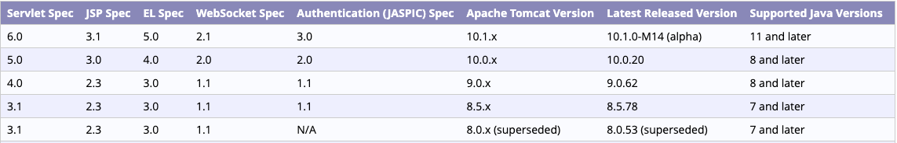

# 만든 소프트웨어에 Spring 입히기

## Spring 빈 등록하기

스프링 사용이 아닌 프로젝트에서 정렬을 해주는 프로그램을 만들었다.
이제는 Spring을 적용시키면 어떻게 달라지는지 확인할 것이다.

1. 그래들에 스프링프레임워크를 추가해보자.

   dependencies에 

   > implementation 'org.springframework:spring-contex:5.3.8'
   > testImplementation 'org.springframework:spring-test:5.3.8'

   ~~~gradle
   dependencies {
       implementation 'org.springframework:spring-context:5.3.8'
   
       testImplementation 'org.springframework:spring-test:5.3.8'
   }
   ~~~

   

2. 스프링 사용을 위해 bean 등록을 해서 가져오자.

   Main.class

   ~~~java
   public class Main {
       public static void main(String[] args) {
           ApplicationContext context = new AnnotationConfigApplicationContext(Config.class);
   
           System.out.println("[result]" + sortService.doSort(Arrays.asList(args)));
       }
   }
   ~~~

   

3. config 패키지에 Config.class를 만들자

   스프링의 설정 전용 클래스이다. 스프링이 시작될 때 @Configuration 에 들어가서 어떤 설정이 잡혀있는지 확인하고 그 설정을 가져온다.

   > @ComponentScan(root)
   > 루트 이하의 모든 스프링 빈들을 스캔할 것이다.
   >
   > @Configuration
   > 스프링 설정 파일이다.

   ~~~java
   @ComponentScan("com.pang.springpractice")
   @Configuration
   public class Config {
   
   }
   ~~~

4. 우리가 만든 클래스들에 빈을 등록하자

   인터페이스는 할 필요가 없다.

   `@Component`

   > @Component
   >
   > BubbleSort.class, JavaSort.class

   `@Service`

   Service 어노테이션은 Component 어노테이션과 하는 일은 같지만 Service 빈이라고 명해주는 것이다.

   > @Service
   >
   > SortService.class

   

5. 빈까지 등록 완료했기 때문에 메인에서는 빈을 불러올 수 있다.

   getBean() 메서드를 사용하면 new 키워드 상관없이 빈을 꺼내올 수 있다.

   ~~~java
   public class Main {
       public static void main(String[] args) {
           ApplicationContext context = new AnnotationConfigApplicationContext(Config.class);
           SortService sortService = context.getBean(SortService.class);
   
           System.out.println("[result]" + sortService.doSort(Arrays.asList(args)));
       }
   }
   ~~~

   

## Web 붙이기

1. 그래들에 의존성 추가하자

   1. web을 붙이기 위해서 spring-webmvc 의존성이 필요한데, 이 의존성은 spring-context 의존성을 모두 포함하고 있다. 제거해도 무방하다.

   ~~~java
   //implementation 'org.springframework:spring-context:5.3.8'
   
   //위 의존성을 모두 포함하고 있기 때문에 제거한다.
   implementation 'org.springframework:spring-webmvc:5.3.8'
   ~~~

   

   2. 스프링 웹을 만들면 웹 애플리케이션 서버에서 올려야하는데, 톰캣을 사용할 것이다. 그 톰캣을 사용하기 위해 servlet-api 의존성이 필요하다.

   ~~~java
   // https://mvnrepository.com/artifact/javax.servlet/javax.servlet-api
   compileOnly group: 'javax.servlet', name: 'javax.servlet-api', version: '4.0.1'
   ~~~

   평소에 쓰는 방식으로 쓰고 싶다면,

   ~~~java
   compileOnly 'javax.servlet:javax.servlet-api:4.0.1'
   ~~~

   
   

2. 톰캣 다운하고 설정하기

   우리가 사용하는 servlet-api 버전이 4.0버전이므로 톰캣의 버전은 9.0버전이 필요하다.

   

   실행/디버그 구성이라는 설정에 들어가서 artifact로 톰캣 서버 로컬을 가져온다.

   

   애플리케이션 서버가 등록되어있지 않다면 다운로드한 톰캣 폴더를 설정해준다.
   

3. 배포를 위한 설정 하기

   배포를 하기위해서는 jar가 아닌 war여야 한다.

   그래들에서 플러그인에 war를 추가해주면 그래들 war명령이 빌드에 추가된다.

   ~~~java
   plugins {
       id 'java'
       id 'war'
   }
   ~~~

   

그래들 빌드에서 clean 명령을 누르고 build 명령을 누르면 프로젝트에 build 폴더가 생성되고, libs 폴더에 war파일이 생성된다.

그 후 실행/디버그 구성 설정으로 들어가서 배포에 war를 설정해준다. application context 루트 명은 간단하게 / 로 설정한다.

## Spring Web MVC 사용하기

https://docs.spring.io/spring-framework/docs/current/reference/html/web.html#spring-web
이 링크에는 spring.io 스프링의 공식 홈페이지에서 제공하는 스프링 web mvc 사용법에 대해 나와있다.

밑 코드는 사용법에 나와있는 코드이다.
DispatcherServlet을 초기화하고 자바 설정에 대한 예제이다.
우리도 똑같이 web 패키지를 만들고 이 클래스를 넣어주자.

~~~java
public class MyWebApplicationInitializer implements WebApplicationInitializer {

    @Override
    public void onStartup(ServletContext servletContext) {

        // Load Spring web application configuration
        AnnotationConfigWebApplicationContext context = new AnnotationConfigWebApplicationContext();
        context.register(AppConfig.class);

        // Create and register the DispatcherServlet
        DispatcherServlet servlet = new DispatcherServlet(context);
        ServletRegistration.Dynamic registration = servletContext.addServlet("app", servlet);
        registration.setLoadOnStartup(1);
        registration.addMapping("/app/*");
    }
}
~~~

