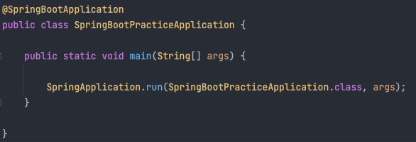
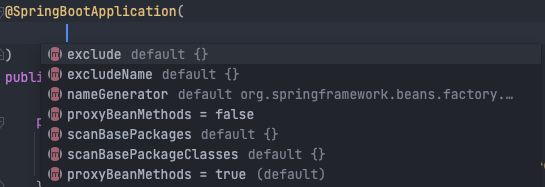
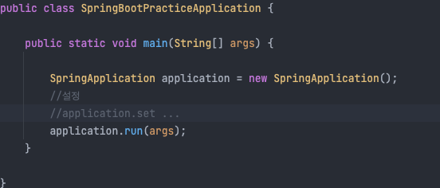

# @SpringbootApplication

* 스프링부트를 시작하면 @SpringBootApplication 어노테이션이 있는 클래스가 보이고 그 안에 메인 메서드가 보인다.

  이 어노테이션 안에는 @EnableAutoConfiguration, @ComponentScan, @SpringBootConfiguration 이 세가지가 들어있는 것이다.
  
  * @SpringBootconfiguration - 스프링 부트용 @Configuration
  * @EnableAutoConfiguration - 사전에 정의한 라이브러리 빈을 등록
  * @ComponentScan - 각종 스프링 빈 어노테이션을 베이스 패키지에서부터 스캔하여 스프링 빈으로 스프링 IoC컨테이너에 등록
  
* @SpringBootApplication 의 속성

  

* SpringApplication을 빼낼 수 있다.

  * new로 만들면 스프링이 시작되기 전에 여러 설정들을 넣을 수 있다.

  

