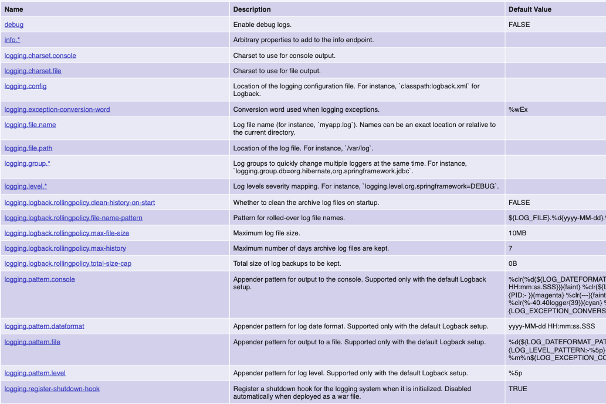
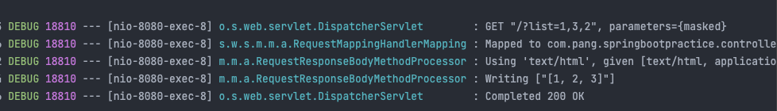
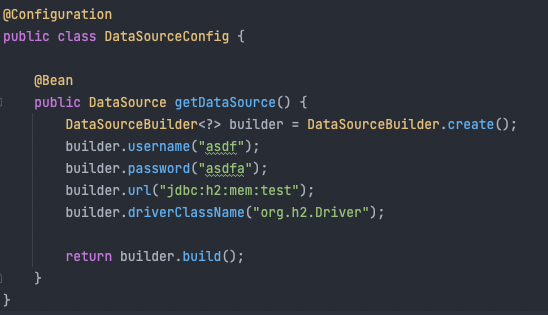

## Spring Boot Properties

* **기존에 자바 config로 만들던 설정들을 application.properties에서 설정할 수 있다.**

* 스프링 부트의 기본 기능 전체를 튜닝하는 부트 전용 설정 프로퍼티

* 이름을 application으로 properties나 yml로 저장하면 스프링이 시작할 때 이 파일을 찾아서 설정을 입력해준다.
  application.properties, application.yml

* 부트의 기능 거의 대부분을 제어 가능하다.
  * 기본값이 세팅되어 있어서 아무 것도 쓰지 않아도 작동한다.

https://docs.spring.io/spring-boot/docs/current/reference/html/application-properties.html

이 곳에 Application-properties 관련 내용이 써있다.

## Core Properties : Logging

### debug = true

* false가 기본값
* 스프링부트 시작시 어떤 것이 동작하는지 로그에 DEBUG로 보여준다.
* 또한 서버 요청시 사용자가 어떤 파라미터로 요청했고 응답 값이 무엇이고, http 응답 또한 보여준다.

### DataSource

data JPA를 사용하기 위한 config로 이런 형식으로 클래스를 만들었다.

그러나 application.properties로 밑 처럼 작성할 수 있다.

~~~properties
spring.datasource.driver-class-name="org.H2.Driver"
spring.datasource.username=asdfs
spring.datasource.password=asdfs
~~~

즉, 자바코드로 작성하던 것을 간단하게 peoperties에 작성해서 사용할 수 있도록 스프링 부트가 지원해준다.

## 그 밖에...

* 캐쉬 설정

* JSON 설정

* DATA 설정

* DATA Migration 설정

* 웹 설정

* 서버 설정

  등등...

