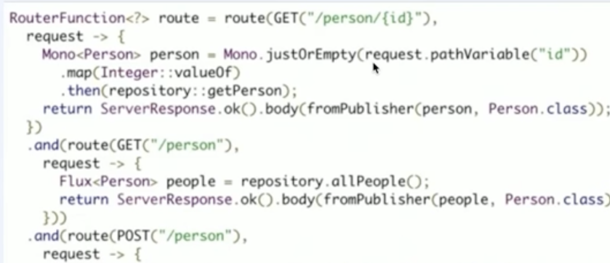

# 스프링 부트 버전별 변천사

## Spring boot version 1 -> 2

* Java 8이 최소사양
* Java 9 공식 최초 지원 - 부트 1.x는 미지원
* Spring Framework 5
* 써드파티 라이브러리 업그레이드
  * Tomcat 8.5
    * 임베디드 톰캣을 말함
  * Flyway 5
  * Hibernate 5.2
  * Thymeleaf 3
  * Elasticsearch 5.6
  * Gradle 4
    * 지금은 Gradle 6을 사용중임
  * Jetty 9.4
  * Mockito 2.x

* Reactive Spring

  * 무엇을 위해 존재하는가?
    * 비동기 non-blocking 알고리즘을 이용해 
    * **한정된 자원으로 다수 요청에도 빠르고 예측 가능한 응답 성능을 실현**
  * 누가 써야하나?
    * 큰 성능을 보장하는 것은 아니다. 아직 사용자 수도 적은 경우 Spring Web MVC가 더 낫다.
    * 더 많은 사용자가 생기고, 서버 부하가 발견되면 Reactive Spring을 고려해 볼 필요가 있다.
  * 리액티브 지원 모듈
    * Spring WebFlux
    * Reactive Spring Data
    * Reactive Spring Security
    * Embedded Netty Server

* Functional APIs

  

  * Java 8 이용에 따른 함수형 메서드 작성 가능토록
  * WebFlux.fn
  * WebMvc.fn (Spring Framework 5.2)
  * 스프링 기술과 애노테이션에서 분리된 코드
    * 자바 코드 레벨에서 분석 가능
    * 독립적인 유닛 테스트 가능
    * 스프링 컨테이너에서 독립

* Kotlin 지원

* Configuration properties

  * 프로퍼티를 쓸 때 : Relaxed binding 여전히 지원

    > Relaxed binding
    > my.foo.hello-world, my.foo.helloWorld, my.foo.hello_world
    > 이 셋 모두 my.foo.helloworld로 읽음

  * 프로퍼티를 읽을 때 : 밑 방식으로만 양식이 통일되었다.
    * 엘리먼트 구분 : "."
    * 영어 소문자 + 숫자
    * 단어 구분자로 "-" 사용 가능
  * 환경변수에서 컬렉션 데이터의 인덱스 표현 가능
    * MY_VAR_! = a -> my.var[1] = "a"
  * 더 편리한 자료형 인식
    * ex) java.time.Duration -> "1s", "2m", "5d"도 읽어준다.
  * Origin 지원 : 스프링 부트가 읽은 프로퍼티의 위치를 기억하고, 에러가 나면 알려줌
    * ex) "origin": "class path resource [application.properties]:1:27"

* Gradle 플러그인

  * 최소 버전 : 4.x
  * dependency management 기능을 사용하려면 플러그인을 명시해야함
    * 그래들 파일에 들어가보면 플러그인에 io.spring.dependency-management가 있는 것을 볼 수 있다.

* Actuator 변경점

  * 보안성 강화 : 1.5에서 기본으로 보여주던 endpoint를 더이상 보여주지 않음
  * @Endpoints : 환경에 상관없이 커스텀 endpoint를 구현할 수 있다.

* Spring Security

  * OAuth 2.0 통합
  * 커스텀 설정이 더 쉬워짐
  * WebSecurityConfigurerAdapter 순서 문제를 해결함
  * 보안이 중요한 기능들은 명시적으로 작성하게끔 변경

## Spring Boot 2.1 ~ 2.3

### Spring Boot 2.1

* 성능 향상
* Spring Data JPA : bootstrap-mode 지원
* JDK 11 + Spring Framework 5.1 지원
* 주요 버전 업그레이드
  * Tomcat 9
  * Hibernate 5.3
  * JUnit 5.2
* Deprecations from 2.0
* New Spring Actuator Endpoints
  * /actuator/caches 추가
* Logging Refinements
* JUnit 5지원
* Bean Overriding
  * 사용자가 모르게 빈이 오버라이드 되지 않도록 설정됨. 빈이 오버라이드 되면 BeanDefinitionOverrideException이 발생됨

### Spring Boot 2.2

* 성능 향상

  * 새 속성 추가 : proxyBeanMethods=false

    > 라이트 모드
    >
    > 빈이 등록되는 기본 동작은 Configuration에다가 빈 어노테이션을 붙여서 빈을 등록하고 어떤 라이브러리를 통해 proxy bean이 등록되는 구조다.
    > 그러나 라이트 모드는 proxy bean을 만들지 않고 new로 factory 메서드로 동작하게 하는 모드이다.

* Java 13 + Spring Framework 5.2

* 주요 버전 업그레이드

* Deprecations from 2.1

* Jakarta EE

* Junit 5

* Gradle 4.10

### Spring Boot 2.3

* 새 버전 배포 주기 계획 발표
  * 6개월 주기로 배포 예정
* Java 14, Gradle 5.6x ~ 6.3지원, developmentOnly가 Gradle 설정에서 자동 생성됨
* 주요 버전 업그레이드 (R2DBC 지원)
* 도커 지원
* Validation Starter를 web starter에서 제외
* Graceful shutdown
* Jackson 2.11
* Actuator 향상점
* 기본 에러 페이지 내용 변화
* @ActiveProfiles에 여러 개의 프로파일 설정하기 

~~~java
7
0110100
0110001
1110101
0000111
0100000
0111110
0111000
~~~

