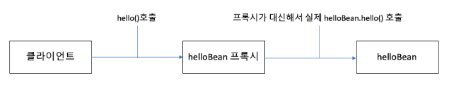

# 프록시

프록시의 사전적 정의는 '대리인'
즉, 어떤 객체를 사용하려고 할 때, 해당 객체에 직접 요청하는 것이 아닌 중간에 가짜 프록시 객체를 두어서 프록시 객체가 대신해서 요청을 받아 실제 객체를 호출해 주도록 하는 것이다.

* 프록시 모드를 설정하게 되면, 의존성 주입을 통해 주입되는 빈은 실제 빈이 아닌 해당 빈을 상속받은 가짜 프록시 객체이다.
* 스프링은 CGLIB라는 라이브러리를 사용해서 프록시 객체를 주입해준다.
* 프록시 객체 내부에는 실제 빈을 요청하는 로직이 들어있어, 클라이언트 요청이 오면 그 때 실제 빈을 호출해준다.
* 프록시 객체는 원래 빈을 상속받아서 만들어지기 때문에 클라이언트 입장에서는 실제 빈을 사용하는 것과 똑같은 방법으로 사용하면 된다.
* @Scope 어노테이션의 proxyMode 옵션으로 설정할 수 있다.

~~~java
@Component
@Scope(proxyMode = ScopedProxyMode.TARGET_CLASS)
public class HelloBean {
  public void hello() {}
}

@Service
public class HelloService {
  @Autowired HelloBean helloBean; // 실제 HelloBean 객체가 아닌 가짜 프록시 객체
  
  public void method() {
    helloBean.hello(); // 요청이 생기면 프록시 객체는 실제 HelloBean의 메서드를 호출해준다.
  }
}
~~~

## 실제 빈과 프록시 빈의 객체 차이 모습

~~~java
@Component 
@Scope(proxyMode = ScopedProxyMode.TARGET_CLASS) 
public class HelloBean {
  public void printRealBean() { 
    System.out.println("RealHelloBean: " + this.getClass().getSimpleName()); 
  } 
} 

@Service 
public class HelloService { 
  @Autowired HelloBean helloBean; 
  public void printProxyBean() {
    System.out.println("ProxyHelloBean: " + helloBean.getClass().getSimpleName()); 
    //ProxyHelloBean: HelloBean$$EnhancerBySpringCGLIB$$35c7aa62

    helloBean.printRealBean(); 
    //RealHelloBean: HelloBean
  } 
}
~~~

