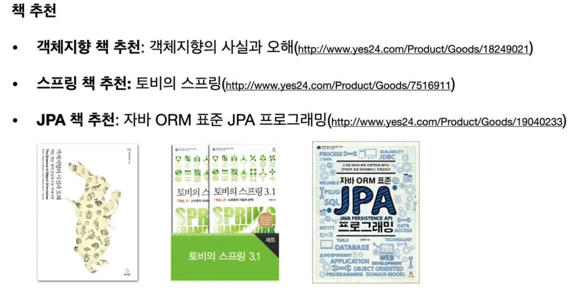

# 스프링 핵심 원리 - 기본편

## 객체 지향이란?

* 단순하게 생각해보면, 역할과 구현을 분리하는 것
  * 역할 - 인터페이스
  * 구현 - 구현 클래스, 구현 객체
* 다형성을 가질 수 있다.
  * 클라이언트를 변경하지 않고 서버의 구현 기능을 유연하게 변경할 수 있다.
  * 확장 가능한 설계 방식
* 결국엔 인터페이스를 안정적으로 잘 설계하는 것이 중요하다.

## 좋은 객체 지향 설계 5가지 원칙 SOLID

### 1. SRP - Single responsibility principle 단일 책임 원칙

* 한 클래스는 하나의 책임만 가져야 한다.
* 그러나 어느정도 조절하는 편(자주 깨진다.)

### 2. OCP - Open/closed principle 개방-폐쇄 원칙

* 소프트웨어 요소는 확장에는 열려 있으나 변경에는 닫혀 있어야 한다.
  * 변경에는 닫혀있다?? 구현 객체를 변경하려면 클라이언트 코드를 변경해야 한다. 그러면 OCP 원칙을 지킬 수 없는 것
  * 그래서 스프링 프레임워크가 필요한 것
  * 스프링 프레임워크의 DI와 IoC 컨테이너가 OCP 원칙을 지킬 수 있도록 해준다.

### 3. LSP - Liskov substitution principle 리스코프 치환 원칙

* 프로그램의 정확성을 깨뜨리지 않으면서 프로그램의 객체를 하위 타입의 인스턴스로 바꿀 수 있다.
  * 하위 클래스는 인터페이스 규약을 다 지켜야 한다는 것
  * 즉, 한 객체를 구현한 구현체끼리는 결국 똑같은 기능을 해주어야 한다.

### 4. ISP - Interface segregation principle 인터페이스 분리 원칙

* 특정 클라이언트를 위한 인터페이스 여러 개가 범용 인터페이스 하나보다 낫다.
  * 자동차 인터페이스 => 운전 인터페이스, 정비 인터페이스로 분리
  * 사용자 클라이언트 => 운전자 클라이언트, 정비사 클라이언트로 분리
* 적당한 크기로 인터페이스 크기를 잘라서 명확하고 대체 가능성 있게 만드는 것

### DIP - Dependency inversion principle 의존관계 역전 원칙

* 프로그래머는 추상화에 의존해야지 구체화에 의존하면 안된다.

  * 구현체에 의존하게되면 변경이 어려워진다.

* 그래서 우리는 Service에서 Repository를 선택할 때 아래와 같이 구현 클래스를 직접 선택해서 가져오지 않는다. DI를 통해 주입시켜 

  ~~~java
  MemberRepository repository = new MemoryMemberRepository();
  ~~~

> 객체 지향은 다형성이 핵심이지만, 다형성만으로는 OCP와 DIP를 지킬 수 없다.
>
> DI와 IoC가 필요하기 때문에 프레임워크가 필요하다.

## 싱글톤 컨테이너

웹 어플리케이션은 보통 여러 고객이 동시에 요청을 한다. 그러면 여러 고객이 동시에 같은 기능을 요청한다면, `memberService`는 요청한 고객 수 만큼 객체가 생성이 된다?

* 고객 트래픽이 초당 100이 나오면 초당 100개 객체가 생성되고 소멸된다 => 메모리 낭비가 심하다.
* 해결 방안으로 해당 객체가 딱 1개만 생성되고 공유하도록 설계하면 된다 => 싱글톤 패턴

### 싱글톤 패턴

* 클래스의 인스턴스가 딱 1개만 생성되는 것을 보장하는 디자인 패턴이다.
* 객체 인스턴스를 2개 이상 생성하지 못하도록 막아야 한다.
  * private 생성자를 이용해서 외부에서 new 생성을 막는다.

~~~java
public class SingletonService {
  
  private static final SingletonService instance = new SingletonService();
  
  public static Singletonservice getInstance() {
    return instance;
  }
  
  private SingletonService() {
    
  }
}
~~~

* 위처럼 static 영역에 객체 instance를 하나 생성해서 올려둔다.
* 이 객체 인스턴스가 필요하면 오직! `getInstance()` 메서드를 통해서만 조회할 수 있다. 이 메서드를 호출하면 항상 같은 인스턴스를 반환한다.
* 딱 1개의 객체 인스턴스만 존재해야 하므로 생성자를 private으로 막아서 외부에서 new 키워드로 객체 인스턴스를 생성되는 것을 막는다.

