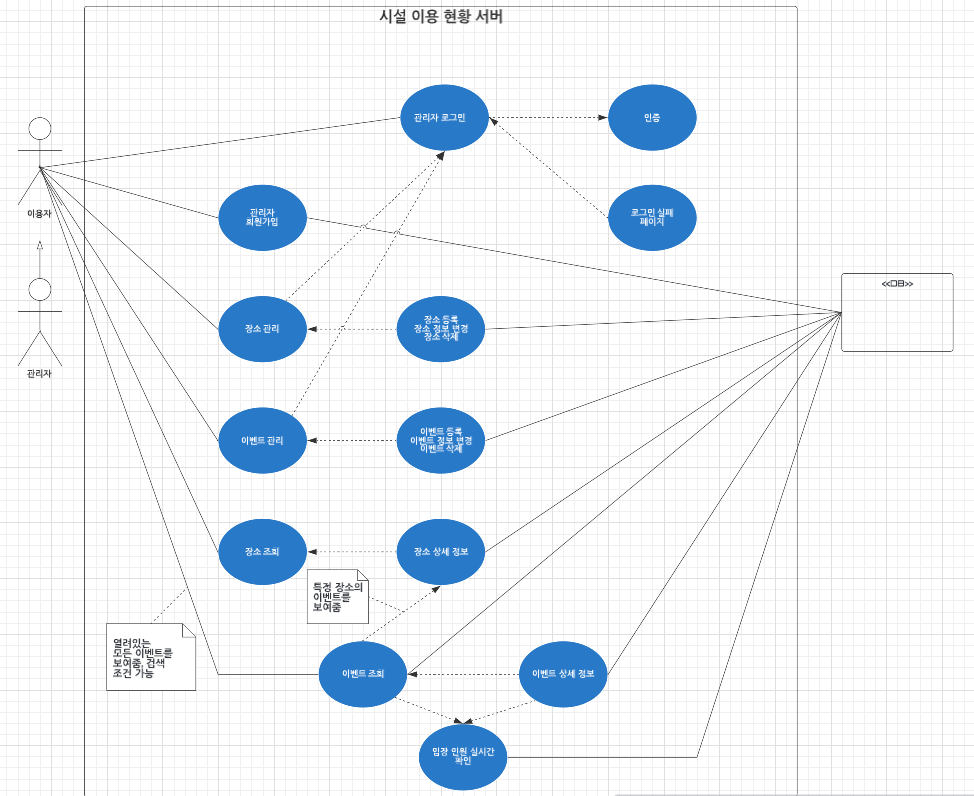

# 시설 이용 현황 프로젝트

## 요구사항

* 서비스 목표 : 온라인으로 실시간 이용 현황 확인하는 프로그램
* 니즈
  * 사업자 : 크지 않음 (의무가 아님)
  * 이용자 : 신뢰할 만한 정보다면 충분
* 사용성
  * 사업자 : 무조건 편해야함
  * 이용자 : 직접 방문하거나 직접 연락하는 기존 방식보다 편하고 신뢰가능해야 함

### 필요한 기능

* 관리자 
  * PC, 모바일로 접근할 수 있어야 한다. - 반응형 웹
  * 관리자는 식별 가능해야 한다. - 로그인 인증 기능
  * 시설 관리 기능이 필요하다. - 담당자 연락처 위치 등...
  * 이용 정보를 알려야 한다. - 어느 시간 동안 이용 가능한지, 입장 정원 몇 명인지 등
  * 실시간 입장 인원을 알려야 한다. - 원 클릭으로 가능한 쉽게
* 이용자
  * 개인 식별 필요 없음
  * 시설 조회 기능이 필요하다. - 어떤 시설을 이용할 수 있고, 
  * 이용 현황 정보 알 수 있어야 한다. - 현재 몇 명 있고, 정원이 몇이고

### 플로우 차트 (루시드)

### 도메인

> 도메인 설계란?
> 프로그래머가 문제 해결을 하려는 대상
> 해결하고자 하는 문제의 영역, 범위를 설계하는 것

* 시설 이용 현황의 문제들은 어떤 도메인들로 구성될까
  * 이용자
  * 이용자 -> 관리자
  * 장소
  * 이벤트

