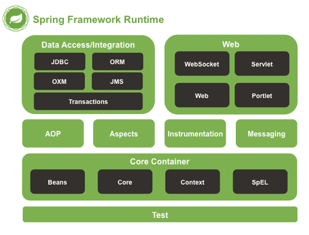
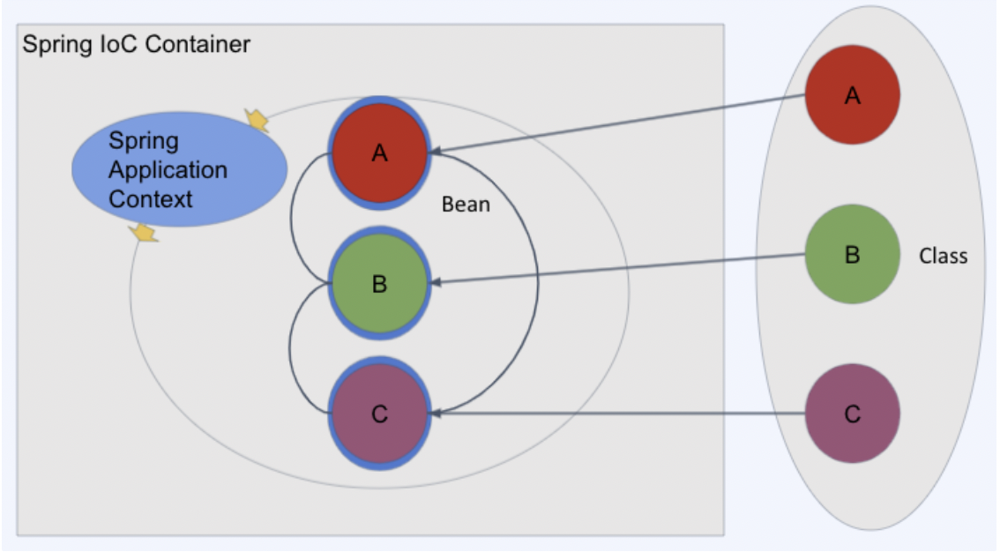
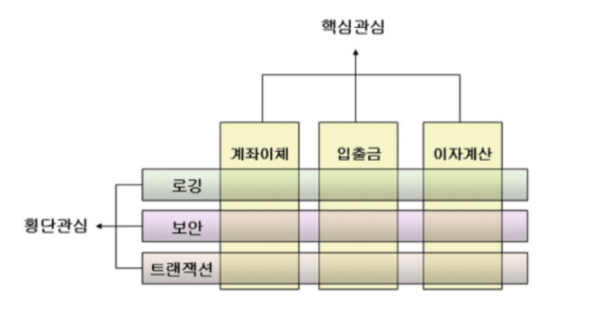
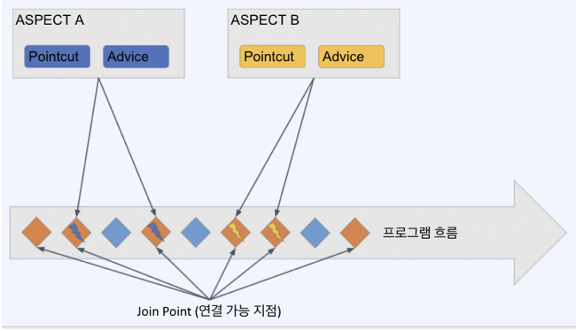

# 자바, 스프링, 스프링부트

Java : 객체지향적 프로그래밍 언어

* JVM이라는 가상 머신에 올라가서 구동이 되기 때문에 여러 os, 기계 등에서 사용되기 쉬워서 쓰임
* 한글만 안다고 책을 쓸 수 없는 것 처럼, 자바만 안다고 프로그램을 만들 수 없음

Spring Framework : 기업용 어플리케이션을 만드는데 사용 가능한 오픈소스 프레임워크

* 자바라는 언어를 이용해서 어플리케이션을 만들기 위해 활용되는 프레임워크

Spring boot : 스프링 기반으로 자주 사용되는 설정으로 손쉽게 개발할 수 있게해주는 상위 프레임워크

* 스프링보다 더 편리한 프레임워크
* 웹 어플리케이션 서버(톰캣 등) 내장
* 자동 설정, 설정 표준화
* 원한다면 모두 마음대로 설정할 수 있음

## Spring Framework가 생긴 이유

* 스프링이 나오기 전

  * 스프링이 나오기 전에는 자바로 엔터프라이즈 어플리케이션을 개발하는 가장 일반적인 방법은 EJB를 사용하는 것이었다.
  * EJB에는 불필요한 메서드를 구현하거나 배포가 불편한 단점들이 있었기 때문에 사용하기 어려웠었다.

* 스프링을 사용하는 이유

  1. 단순화된 단위 테스팅
     * EJB는 단위테스트가 어렵다.
     * 스프링 프레임워크는 의존성 주입(DI)라는 개념을 도입해서 단위 테스트가 간소화 되었다.
  2. 복잡한 코드의 감소
     * 자바로 데이터베이스 연동을 하는 과정을 SQL 마다 작성해야 했었다.
     * 하지만 스프링 프레임워크의 Spring JDBC를 사용하면 단순하게 사용할 수 있다.
     * 모든 메서드에서 예외처리를 구현하는 대신, 중앙 집중식 예외 처리를 수행하고 관점 지향 프로그래밍(AOP)를 사용해 주입할 수 있다고 한다.
  3. 아키텍처의 유연성
     * 사용자가 어떠한 기능을 완성하는데 필요한 모듈을 다양하게 선택할 수 있다.
  4. 변화하는 시대를 선도

  

## 스프링 프레임워크 핵심기술

* 스프링이 동작하는 방법

  * Core(DI, IoC) Dependency Injection / Inversion of Control
    * 스프링의 근간, 내가 만든 클래스를 스프링이 직접 관리하여 어플리케이션을 동작하게 한다.
  * AOP(Aspect Oriented Programming)
    * 공통적인 코드를 프레임워크 레벨에서 지원해주는 방법
  * Validation, Data binding
    * 검증 그리고 외부에서 받은 데이터를 담아내는 방법
  * Resource
    * 스프링 내부에서 설정이 들어있는 파일들에 접근하는 동작 원리
  * SpEL
    * 짧은 표현식을 통해 필요한 데이터나 설정 값을 얻어 올 수 있게 하는 특별한 형태의 표현식에 가까운 간편한 언어
  * Null-Safety
    * 자바 사용할 때 Null 관리하는 것이 가장 어려움

  

* 스프링의 디자인 철학
  * 모든 기능에서 다양한 가능성(다양한 모듈)을 사용 가능, 심지어 외부 모듈을 활용 가능
    * 너무 높은 자유도 때문에 오히려 스프링을 어렵게 하는 요소일 수 있음
  * 유연하게 계속 추가 개발중인 프레임워크이다.
  * 이전 버전과의 호환성이 강력하다.
    * 그러나 너무 많은 레거시(아주 예전부터 쓰이던 레거시들도 호환이 되기 때문에) 코드의 복잡성이 높아진다
  * 스프링은 API 디자인을 섬세하게 노력한다
    * 스프링 코드 자체가 하나의 좋은 참고 소스이기 때문에 스프링 코드를 보면서 배울려 하는 것도 아주 좋다.
  * 높은 코드 품질을 유지하려 함
    * 스프링 프로젝트 깃허브는 아주 좋은 참고 소스이자 PR과 이슈관리도 좋은 프로세스 참고용이다.
  * 한 마디로 높은 자유도를 주고 계속 발전하는 고품질의 다양성이 있는 프로젝트이다.

### javaBean / Bean이란?

* 자바에서의 자바 빈이란?
  * 데이터를 저장하기 위한 구조체로 자바 빈 규약이라는 것을 따르는 단순한 구조체 
  * private 프로퍼티와 getter/setter로만 데이터를 접근한다.
  * 인수(argument)가 없는 기본 생성자가 있다.

~~~java
//예시
public class JavaBean {
  //직접 가져오지 못하게 private으로 설정하고
	private String id;
	private Integer count;

	public JavaBean(){}

  //getter/setter로 프로퍼티를 설정하고 쓸 수 있도록
	public String getId() {
		return id;
	}

	public void setId(String id) {
		this.id = id;
	}

	public Integer getCount() {
		return count;
	}

	public void setCount(Integer count) {
		this.count = count;
	}
}
~~~

### IoC(Inversion of Control), DI(Dependency Injection)

* IoC나 DI는 레고와 같다.
  * 스프링 프레임워크란 바닥에서 원하는 기능을 조립하면 된다.
* IoC는 객체의 제어권을 프레임워크의 컨테이너에게 넘기는 개념을 말한다.
  * 일반적으로 개발자가 각 객체를 생성하고, 제어해야하지만, 스프링에서는 스프링 컨테이너에 Bean으로 등록하기만 하면, 스프링 컨테이너가 컨트롤 해준다.
  * 객체에 대한 제어권이 스프링 컨테이너로 역전이 되기 떄문에 제어의 역전이라고 한다.

* DI는 클래스간 의존성을 클래스 외부에서 주입하는 것을 뜻한다.
  * 객체 B를 사용하는 주체 A가 직접 B를 생성하면 의존성이 높아진다.
    * B 변경시 A에서 변경해야하고... 등등
  * 객체 B를 외부(스프링)에서 생성해서 주체 A에 주입시켜주는 방식이다.
    * 의존성이 줄어들어 코드의 재사용성을 높여주고 코드를 단순화 시켜준다.

* 스프링에서의 Bean이란?

  * 스프링 IoC 컨테이너에 의해 생성되고 관리되는 객체
  * 빈이란 건 처스프링 프레임워크에 올려서 사용할 클래스들을 IoC Container로 가져온 클래스 인스턴스들인데, **Spring Application Context**라는 곳에서 스프링의 설정들을 입혀주고(입혀준 상태가 Bean) 공통된 처리를 한다
  * 어떤 클래스는 빈으로 등록하는 것이 좋고, 어떤 클래스는 빈으로 등록할 필요가 없을 수 있다.

  

  

* Spring Application Context : 스프링 컨테이너의 중요한 역할

  * Class들에 설정을 입히고, 공통된 처리를 함

* 스프링 컨테이너 : ApplicationContext 인터페이스를 통해 제공되는 스프링 컨테이너는 Bean 객체의 생성 및 Bean들의 조립(상호 의존성 관리)을 담당합니다.
  * Bean의 등록
    * 과거에는 xml로 설정을 따로 관리하여 등록(불편)
    * 현재는 annotation 기반으로 Bean 등록
      * @Bean, @Controller, @Service
    * Bean 등록 시 정보
      * Class 경로
      * Bean의 이름
        * 기본적으로는 원 Class 이름에서 첫 문자만 소문자로 변경 => userDAO
      * Scope : **Bean을 생성하는 규칙** / 보통 프로퍼티를 가지고 있는데, 그 값을 변경하지 않는 경우가 대부분이기 때문에 singleton으로 한 번 만들고 건드리지 않는다.
        * singleton : 컨테이너에 단일로 생성 //기본값
        * prototype : 작업 시마다 프로퍼티를 변경하고 싶어서 Bean을 새로 생성하고 싶을 경우
        * request : http 요청마다 프로퍼티를 변경해서 새롭게 Bean을 생성하고 싶은 경우
    * Bean LifeCycle callbak
      * callback : 어떤 이벤트가 발생하는 경우 호출되는 메서드
      * lifecycle callback
        * **Bean을 생성하고 초기화하고 파괴**하는 등 특정 시점에 호출되도록 정의된 함수
      * 주로 많이 사용되는 콜백
        * @PostConstruct : 빈 생성 시점에 필요한 작업을 수행
        * @PreDestroy : 빈 파괴(주로 어플리케이션 종료) 시점에 필요한 작업을 수행

### 관점 지향 프로그래밍 - AOP(Aspect Oriented Programming)

* AOP는 OOP(객체지향 프로그래밍)을 더욱 보완하고 확장한 개념이다. 한 소프트웨어가 OOP로 걸계되었다면, 이것을 각 기능별로 모듈화해서 분리시키는 개념이다.

  * OOP를 통해 객체를 재사용하면서 반복되는 코드들을 줄여왔지만, 필수적으로 반복되는 코드들을 없앨 순 없었다.

  * AOP는 측면에서 바라보면서 트랜잭션, 로깅, 성능 분석 등 필수적으로 반복되는 코드들을 외부로 빼내 하나의 공통 모듈로 만드는 방법이다.

    
    
    * AOP의 핵심은 공통 모듈을 분리시켜 해당 소스 코드들이 다른 클래스에서 존재하는 것이고, 이 것은 '관심의 분리'이다. 

* 특정한 함수 호출 전이나 후에 뭐낙 공통적인 처리가 필요하다면? => AOP

  * 로직
    * 로깅
    * 트랜잭션
    * 인증

* OOP로 처리하기에는 다소 까다로운 부분을 AOP라는 처리 방식을 도입하여 손쉽게 공통 기능을 추가/수정/삭제 할 수 있도록 함

  ~~~java
  class A {
   
      method a() {
          AAAA
   
          method a가 하는 일들
   
          BBBB
      }
   
      method b() {
          AAAA
   
          method b가 하는 일들
   
          BBBB
      }
  }
   
  class B {
      method c() {
          AAAA
   
          method c가 하는 일들
   
          BBBB
      }
  }
  ~~~

  위와 같이 동일한 일을 하는 코드 AAAA와 BBBB가 중복돼서 사용되는 경우, 코드 변경이 필요하면 일일이 다 찾아서 바꿔야 한다.

  이 때 쓰는 것이 AOP!!

  이 중복되는 코드(aspect)는 분리해서 관리하는 것

### AOP의 기본 개념들

* Aspect

  * 여러 클래스에서 기능에 대한 관심ㄱ에, 그것들을 모듈화 한것

  * AOP 중에서 가장 많이 활용되는 부분은 

    @Transactional (트랜잭션 관리) 기능

* Join Point

  * 프로그램이 진행하고 있을 때 클래스를 만들어내기도 하고 그 중 메소드를 불러내기도 하고, 메소드가 리턴되기도 하고... 일련의 프로그램의 흐름에 AOP를 다 심을 수 없다. 그 흐름 중에 AOP를 심을 수 있는 지점을 Join Point라고 한다.

* Pointcut

  * Join Point 중에서도 Aspect... AOP를 심어줄 위치를 뽑는 조건식

* Advice

  * Pointcut에 적용되는 실제 로직
  * 조언, AOP에서 실제로 적용하는 기능(로깅, 트랜잭션, 인증 등)을 뜻함

* Target Object

  * Advice가 적용될 대상 오브젝트

* AOP Proxy

  * 대상 오브젝트에 AOP를 입혀줄 때 덧씌워주는 작업

* Weaving

  * Advice를 비즈니스 로직 코드에 삽입하는 것

### AspectJ 라이브러리

* AspectJ는 AOP를 제대로 사용하기 위해 꼭 필요한 라이브러리
* 기본적으로 제공되는 Spring AOP로는 다양한 기법(Pointcut 등)의 AOP를 사용할 수 없다.

* Aspect의 생성

~~~java
package org.xyz;
import org.aspectj.lang.annotation.Aspect;

@Aspect
@Component //Component는 Aspect를 Bean으로 등록해서 사용하기 위함
public class UsefulAspect {
  
  //Pointcut 선언
  @Pointcut("execution(* transfer(..))")
  private void anyOldTransfer() { }
}
~~~

### Advice 정의

포인트컷들을 활용하여 포인트컷의 전/후/주변에서 실행될 액션을 정의함

* Before Advice
  * dataAccessOperation()이라는 미리 정의된 포인트 컷의 바로 전에 doAccessC
* After Returning Advice
  * dataAccessOperation()라는 미리 정의된 포인트컷에서 return이 발생된 후 실행
* Around Advice
  * businessService()라는 포인트컷의 전/후에 필요한 동작을 추가

### 유효성 검증

* Validation이란?
  * 주로 사용자 또는 서버의 요청(http request) 내용에서 잘못된 내용이 있는지 확인하는 단계를 뜻함
* Validation의 종류
  * 데이터 검증
    * 필수 데이터의 존재 유무
    * 문자열의 길이나 숫자형 데이터의 경우 값의 범위
    * email, 신용카드 번호 등 특정 형식에 맞춘 데이터
  * 비즈니스 검증
    * 서비스에 정책에 따라 데이터를 확인하여 검증
    * 예) 배달앱인 경우 배달 요청을 할 때 해당 주문건이 결제 완료 상태인지 확인
    * 경우에 따라 외부 API를 호출하거나 DB의 데이터까지 조회하여 검증하는 경우도 존재

#### Spring의 Validation

스프링은 웹 레이어에 종속적이지 않은 방법으로 Validation을 하려함. 주로 두가지 방법을 활용

1. Java Bean Validation

   * JavaBean 기반으로 간편하게 개별 데이터를 검증 

     * Java Bean: 데이터를 저장하고 꺼낼 수 있는 getter/setter로 이루어진 아주 간단한 자바 클래스

   * 요즘 가장 많이 활용되는 방법 중 하나이며, 아래 코드처럼 JavaBean 내에 어노테이션으로 검증방법을 명시함

     

     ~~~java
     public class MemberCreationRequest {
       @NotBlank(message="이름을 입력해주세요.")
       @Size(max=64, message="이름의 최대 길이는 64자 입니다.")
       private String name;
       @Min(0, "나이는 0보다 커야합니다.")
       private int age;
       @Email("이메일 형식이 잘못되었습니다.")
       private int email;
     }
     ~~~

   * 물론 어노테이션을 붙인다고 되는 것이 아님

     ~~~java
     @PostMapping(value = "/member")
     public MemeberCreationResponse createMember(
     	@Valid @RequestBody final MemeberCreationRequest memeberCreationRequest) {
     	// member creation logics here...
     }
     ~~~

   * 위 처럼 @Valid 어노테이션을 해당 @RequestBody에 달게되면 Java Bean Validation을 수행한 후 문제가 없을 때만 메서드 내부로 진입이된다.

     * 검증 중 실패가 발생하면? : MethodArgumentNotValidException 발생

2. Spring Validator 인터페이스 구현을 통한 validation

   ~~~java
   public class Person {
   
       private String name;
       private int age;
   
       // the usual getters and setters...
   }
   ~~~

   * Person이라는 javaBean 객체가 있을 때 그 인스턴스에만 활용되는 validator
     * supports : 이 validator가 동작할 조건을 정의
     * validate : 원하는 검증을 진행

   ~~~java
   public class PersonValidator implements Validator {
   
       /**
        * This Validator validates only Person instances
        */
       public boolean supports(Class clazz) {
           return Person.class.equals(clazz);
       }
   
       public void validate(Object obj, Errors e) {
           ValidationUtils.rejectIfEmpty(e, "name", "name.empty");
           Person p = (Person) obj;
           if (p.getAge() < 0) {
               e.rejectValue("age", "negativevalue");
           } else if (p.getAge() > 110) {
               e.rejectValue("age", "too.darn.old");
           }
       }
   }
   ~~~

* Service에서 validation 예시

  ~~~java
  private void validateCreateDeveloperRequest(CreateDeveloper.Request request) {
          // business validation
          DeveloperLevel developerLevel = request.getDeveloperLevel();
          Integer experienceYears = request.getExperienceYears();
  
          if (developerLevel == DeveloperLevel.SENIOR
                  && experienceYears < 10) {
              // 밑과 같은 평범한 예외처리보다는 개발자가 직접 정의한 예외처리가 더 낫다.
              throw new RuntimeException("SENIOR need 10 years experience.");
              
            	// exception을 따로 만들어서 예외처리 하는 모습
              throw new DMakerException(LEVEL_EXPERIENCE_YEARS_NOT_MATCHED);
              // 위에 원래 DMakerErrorCode.LEVEL_ ... 이어야 하는데,
            	// static import 사용해서 간단하게 만들 수 있음
          }
          if (developerLevel == DeveloperLevel.JUNGNIOR
                  && (experienceYears < 4 || experienceYears > 10)) {
              throw new DMakerException(LEVEL_EXPERIENCE_YEARS_NOT_MATCHED);
          }
          if (developerLevel == DeveloperLevel.JUNIOR && experienceYears > 4) {
              throw new DMakerException(LEVEL_EXPERIENCE_YEARS_NOT_MATCHED);
          }
  
          //Optional<Developer> developer = developerRepository.findByMemberId(request.getMemberId());
          //if (developer.isPresent()) throw new DMakerException(DUPLICATED_MEMBER_ID);
  
          // 밑에와 위에 같은것
    			// 밑에는 ifPresent( ( -> {})); 메서드를 써서 간단하게 만듦
  
          developerRepository.findByMemberId(request.getMemberId())
                  .ifPresent( (developer -> {
                      throw new DMakerException(DUPLICATED_MEMBER_ID);
                  }));
      }
  ~~~

  

#### Validation 수행 시 주의사항 및 패턴

* 주의사항
  * validation이 너무 여러 군데에 흩어져있으면 유지보수가 어려움
    * 중복된 검증 : 정책 변경 시에 모든 중복 코드를 수정해야 함
    * 다른 검증 : 여러 군데서 다른 정책을 따르는 검증이 수행될 수 있음
  * 가능한 validation은 로직 초기에 수행 후 실패 시에는 exception을 던지는 편이 처리가 편리함
* 실무 활용 패턴
  * 평범한 사용 패턴
    * 요청 dto에서 Java Bean Validation으로 단순 데이터를 1차 검증
    * 로직 초기에 2차로 비즈니스 검증 수행 후 실패시에는 Custom Exception(ErrorCode, ErrorMessage를 입력)해서 예외를 던지도록 하고 예외처리하여 응답 생성
  * Spring Validator의 장단점
    * 장점 : Java Bean Validation에 비해 조금 더 복잡한 검증이 가능
    * 단점
      * validation을 수행하는 코드를 찾기가 상대적으로 어려움
      * 완전히 데이터만 검증하는 것이 아니기 때문에 비즈니스적인 검증이 들어가는 경우가 있음(비즈니스 검증 로직이 여러 군데로 흩어져 잘못된 검증을 할 가능성이 높아짐)

### Data Binding

사용자나 외부 서버의 요청 데이터를 특정 도메인 객체에 저장해서 우리 프로그램에 Request에 담아주는 것을 뜻한다.

#### Converter<S, T> Interface

S(Source)라는 타입을 받아서 T(Target)이라는 타입으로 변환해서 리턴해주는 인터페이스

~~~java
package org.springframework.core.convert.converter;

public interface Converter<S, T> {

    T convert(S source);
}
~~~

* 예시

  ~~~JAVA
  // Json 값을 요청받아서 XAuthUser.class에 저장하고 싶음
  GET /user-info
  x-auth-user : {"id":123, "name":"Paul"}
  
  // 유저 객체
  public class XAuthUser {
      private int id;
      private String name;
  
      // the usual getters and setters...
  }
  
  @GetMapping("/user-info")
  public UserInfoResponse getUserInfo(
  	@RequestHeader("x-auth-user") XAuthUser xAuthUser){
  
  	// get User Info logic here...
  }
  ~~~

  

  * 밑 Converter를 만들어서 json 내용을 XAuthUser.class로 받아서 리턴해줌

  ~~~java
  @Component
  public class XAuthUserConverter implements Converter<String, XAuthUser> {
  	@Override
  	public XAuthUser convert(String source) {
  		return objectMapper.readValue(source, XAuthUser.class);
  	}
  }
  ~~~

* 동작 원리

  * Converter를 만들어서 Spring Bean으로 등록
  * 스프링 내에 ConversionService라는 내장된 서비스가 Converter를 리스트에 등록
  * 외부 데이터(여기서는 json이라는 String데이터)가 들어오면 Converter에 등록된 형식과 일치시 동작해서 리턴해줌

### Formatter

특정 객체와 String간의 변환을 담당

Converter와 비슷하지만 응답에도 쓰임

Spring Bean으로 등록하면 자동으로 등록시켜 줌

~~~java
package org.springframework.format.datetime;

public final class DateFormatter implements Formatter<Date> {
    public String print(Date date, Locale locale) {
        return getDateFormat(locale).format(date);
    }

    public Date parse(String formatted, Locale locale) throws ParseException {
        return getDateFormat(locale).parse(formatted);
    }
		// getDateFormat 등 일부 구현은 핵심에 집중하기 위해 생략... 
}
~~~

### Spring Resource

* java.net.URL의 한계(classpath 내부 접근이나 상대경로 등)를 넘어서기 위해 스프링에서 추가로 구현

  * 즉 Resource 객체는 java.net.URL을 추상화 인터페이스이다.

    * java.net.URL이란?

      웹 상에 존재하는 자원에 접근할 때 사용하는 라이브러리

      예) 프로토콜, 호스트, 포트번호 등등

    * 추상화 하는 이유는?

      classpath 기준으로 Resource를 가져오는 기능이 java.net.URL 클래스에는 없다

      ServletContext 기준으로 상대 경로를 읽어오는 기능이 없다.

      여러 편의 기능을 위해 Resource 인터페이스를 구현

#### Resource Interface와 그 구현체들

* Resource 인터페이스 내부
  * exists() 메서드를 통해 존재 여부를 알 수 있고, getURL(), getURI() 메서드를 통해 URL이나 URI를 가져올 수 있는 메서드들이 존재한다.

~~~java
public interface Resource extends InputStreamSource {

    boolean exists();

    boolean isReadable();

    boolean isOpen();

    boolean isFile();

    URL getURL() throws IOException;

    URI getURI() throws IOException;

    File getFile() throws IOException;

    ReadableByteChannel readableChannel() throws IOException;

    long contentLength() throws IOException;

    long lastModified() throws IOException;

    Resource createRelative(String relativePath) throws IOException;

    String getFilename();

    String getDescription();
}
~~~

#### Resource 구현체 목록

Spring 내부 Resource 구현체 중 대표적인 몇 가지

* UrlResource
  * URL을 기준으로 리소스를 읽어들임.
  * 다양한 프로토콜(ftp:, file:, http:, 등의 prefix로 접근유형 판단)의 Resource에 접근 가능하지만 기본적으로 http(s)로 원격 접근
* ClassPathResource
  * classpath 기준으로 리소스를 읽어들임
  * classpath(소스코드를 빌드한 결과 (기본적으로는 target/classes 폴더에 저장됨)) 하위의 리소스 접근 시 사용

* FileSystemResource
  * 이름과 같이 File을 다루기 위한 리소스 구현체
* ServletContextResource, InputStreamResource, ByteArrayResource
  * ServletContextResource는 웹 어플리케이션 루트에서 상대 경로로 리소스를 찾는다.
    * 스프링 밖에 있는 servlet위에 접근하기 위한 리소스
  * InputStream, ByteArrayInput 스트림을 읽어오기 위한 리소스

#### Spring ResourceLoader

ApplicationContext 인터페이스의 상위 인터페이스 중에 하나는 ResourceLoader이다.

스프링 프로젝트 내 Resource에 접근할 때 사용하는 기능

* 기본적으로 applicationContext에 구현되어 있음
* 프로젝트 내 파일(주로 classpath 하위파일)에 접근할 일이 있을 경우 활용
* 대부분 사전정의된 파일들은 자동으로 로딩되도록 되어 있으나, 추가로 필요한 파일이 있을 때 이부분 활용 가능

 ~~~java
 @Service
 public class ResourceService {
 	
   @Autowired //applicationContext를 찾아서
 	ApplicationContext ctx;
 
 	public void setResource() {
     //classpath나 file, http등 파일에 접근해서 리소스로 객체를 만들고 사용할 수 있다.
 		Resource myTemplate = 
 			ctx.getResource("classpath:some/resource/path/myTemplate.txt");
 			//ctx.getResource("file:/some/resource/...");
 			//ctx.getResource("http://myhost.com/resource/...");
 		
     //위에는 ApplicationContext 자체
     //아래는 ApplicationContext의 인터페이스인 ResourceLoader, 그래서 굳이 classpath나 file 등 적어주지 않아도 그에 맞는 타입으로 읽어온다. 그러나 명시적으로 적어주는 편이 좋다.
     
     Resource resource = resourceLoader.getResource("myTemplate.txt");
     //Resource resource = resourceLoader.getResource("classpath:myTemplate.txt");
     
     // use myTemplate...
 	}
 }
 ~~~

#### ResourcePatterResolver

스프링 ApplicationContext에서 ResourceLoader를 불러올 때 사용하는 인터페이스

classpath에서 가져오냐 file에서 가져오냐, http에서 가져오냐에 따라 자동으로 Resource Loader 구현체를 선택

~~~java
public interface ApplicationContext extends EnvironmentCapable, 
		ListableBeanFactory, HierarchicalBeanFactory,
		MessageSource, ApplicationEventPublisher, ResourcePatternResolver {
		// Spring ApplicationContext interface
}
~~~

#### Application Contexts & Resource Paths // Resource를 읽어오는 방법

applicationContext을 이루는 설정값을 가져오는 방법들

* ApplicationContext의 타입에 따라 Resource의 타입이 결정된다.
* 특정 위치에 있는 설정 값들을 읽어와서 리소스 로더가 읽어서 applicationContext를 이루어줌

예전에는 xml로 만들었었지만 요즘은 어노테이션(java config)로 이용함

~~~java
// let's create an applicationContext

//아래와 같이 작성하였을 때 appContext.xml 설정파일을 찾아노는데 이 때 appContext.xml이라는 문자열이 Resouce로 변환된다. 이 때 이 파일을 찾을 때 classpath 기준으로 찾는다.
ApplicationContext ctx = new ClassPathXmlApplicationContext("conf/appContext.xml");

ApplicationContext ctx =
    new FileSystemXmlApplicationContext("conf/appContext.xml");

ApplicationContext ctx =
    new FileSystemXmlApplicationContext("classpath:conf/appContext.xml");

// then you can use ctx as a Spring
Bear bear = (Bear) ctx.getBean("bear");
~~~

### SpEL(Spring Expression Language)

Expression Language(표현 언어)는 짧고 간단한 문법을 통해 필요한 데이터나 설정 값을 얻어올 수 있게 하는 특별한 형태의 표현식에 가까운 간편한 언어

SpEL은 스프링 내에서 어디서든 쓸 수 있음

* 주로 @Value("${config.value}")

#### SpEL의 값 평가(evaluation)

* SpelParser는 "" 안에 들어있는 문자열을 평가해서 결과 값을 만들어낸다.
* 밑 코드를 보면 문자열 리터럴이 되고, 자바 메서드들을 호출 할 수 있다.
* new로 String 객체를 생성할 수도 있다.

~~~java
ExpressionParser parser = new SpelExpressionParser();
Expression exp = parser.parseExpression("'Hello World'");

Expression expCon = parser.parseExpression("'Hello World'.concat('!')");
Expression expUp = parser.parseExpression("new String('hello world').toUpperCase()");

String message = (String)exp.getValue(); //getValue() 메서드를 통해서 리턴 받을 수 있음.
//"Hello World"
~~~

* 그러나 위 같은 표현을 쓸 이유가 없음. 그냥 바로 "Hello World" 쓰면 되니까...

#### Bean의 Property를 설정할 때 사용하는 방식 - 실무적으로 쓰는 방법

* 기본적으로 Bean 생성 후 property들을 상수로 설정해두는 것이 아닐 때 사용한다

* #{ <expression string> } 방식으로 property를 설정한다

* application.properties의 값을 가져올 때는 ${ <property name> } 방식으로 가져온다

* **테스트 환경과 운영 환경을 분리해서 무언가 해야할 때** 사용하는 경우가 있다.

  * cpu 성능이 좋으면 쓰레드를 더 생성해서 동작하도록 하거나, cpu 성능이 안좋으면 프로그램 성능을 떨어뜨린다거나 하는 방법

  ~~~java
  @Component
  public class SimpleComponent {
    @Value("#{ 1+1 }")
    int two; // 2
    
    @Value("#{ 2 eq 2 }")
    boolean isTrue; // true
    
    @Value("${ server.hostname }")
    String hostname; // www.server.com
    
    @Value("#{ ${ server.hostname } eq 'www.server.com' }")
    boolean isHostSam // true
  }
  ~~~

  

### Null Safety

* 아래와 같은 코드를 만들지 않는 방법

* 널 체크를  하지 않아서 발생하는 NPE을 방지하는 방법

* 자바가 null 관리가 아주 어려움 또한, 스프링의 경우 null 오류를 잘못 잡아주는 경우가 많아서 정확한 에러 위치를 확인 할 수 있도록 도와줌

  ~~~java
  public void method(String request) {
    if(request == null) return;
    
    //위 코드가 없다면 NPE가 발생하는데, 정확한 위치를 안찝어주는 경우가 많음
    System.out.println(request.toUpperCase());
  }
  ~~~

  

#### @NonNull Annotation

* 해당 값이나 함수 등이 Null이 아님을 나타내는 어노테이션
  * 경고창을 보여줌
* org.springframework.lang.NonNull 사용

~~~java
// 1. 메서드 파라미터에 붙이는 경우
public void method(@NonNull String request) {
  if(request == null) return;
  
  System.out.println(request.toUpperCase());
}

// 2. 프로퍼티에 붙이는 경우
@NonNull
public String request = "REQUEST";

public void method(String request) {
  if(request == null) return;
  
  System.out.println(request.toUpperCase());
}

// 3. 메서드에 붙이는 경우
@NonNull 
public void method(String request) {
  if(request == null) return;
  
  System.out.println(request.toUpperCase());
}
~~~

#### @Nullable Annotation

* @NonNull과 반대로 해당 데이터가 null일 수 있음을 명시함
* 해당 어노테이션이 붙은 값을 사용하는 경우 null check를 항상 수행하도록 경고
