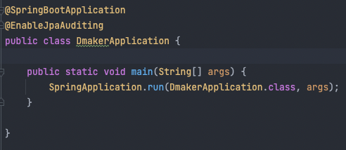

# 테스트


* mybatis에서는 로직이 대부분 쿼리에 있기 때문에 테스트하기가 상당히 까다롭다.
* JPA를 사용하면서, 쿼리가 아닌 자바 코드에 로직이 많이 담기게 되었고, 유지보수성이 좋아졌다.
  * 쿼리로는 다형성이나 디자인패턴 전략 등을 하기 어렵다.
  * 자바코드에 담긴 로직은 쿼리보다 상대적으로 테스트가 편리하다.


## 테스트를 잘 하기 위한 기반

* 클래스나 메서드가 SRP를 잘지키고 크기가 적절히 작아야 함.
  * 그래야 테스트를 집중력 있게 만들 수 있고 한 메서드에 너무 많은 테스트를 수행하지 않아도 됨
  * 이게 테스트를 하는 것의 장점이 되기도 함
* 적절한 Mocking을 통한 격리성 확보
  * 단위테스트가 만능은 아니지만, 위의 SRP처럼 해당 메서드의 역할을 정확히 테스트하려면 주변 조건을 적절히 통제해야 한다.
* 당연히 잘 돌겠지 라는 생각말고 꼼꼼히 테스트를 하고, 너무 과도하게 많은 테스트와 코드량이 생기지 않도록 적절히 끊기
  * 테스트코드도 코드 리뷰시에 적절한 테스트를 하는지 확인 필요
* 테스트 코드 개선을 위한 노력
  * 테스트코드도 리팩토링 필요
  * 테스트코드의 기법들도 지속적인 고민이 필요하다.


## JUnit 5

* 자바의 유닛 테스트를 하기 위한 프레임워크
* 기본적으로 spring starter 디펜던시에 포함되어 있음
* command + shift + t 누르면 테스트를 만들 수 있음.

~~~java
@SpringBootTest
class DMakerServiceTest {
    //스프링에서는 이런 식으로 객체를 만들지 않습니다!
    //private DMakerService dMakerService = new DMakerService(new DeveloperRepository() {    })

    @Autowired
    private DMakerService dMakerService;

    @Test
    public void test() {
        dMakerService.createDeveloper(CreateDeveloper.Request.builder()
                        .developerLevel(DeveloperLevel.SENIOR)
                        .developerSkillType(DeveloperSkillType.FRONT_END)
                        .experienceYears(12)
                        .memberId("memberId")
                        .name("name")
                        .age(32)
                        .build());

        List<DeveloperDto> allEmployedDevelopers = dMakerService.getAllEmployedDevelopers();
        System.out.println("=================");
        System.out.println(allEmployedDevelopers); //[DeveloperDto(developerLevel=SENIOR, developerSkillType=FRONT_END, memberId=memberId)]
        System.out.println("=================");
    }
}
~~~


* @SpringBootTest
  * 테스트시에도 모든 빈을 띄워서 실행환경과 비슷하게 하겠다.
* @Autowired
  * @SpringBootTest로 모든 빈을 가져왔기 때문에 DMakerService의 빈을 @Autowired로 가져올 수 있다.


## Mockito


~~~java
@ExtendWith(MockitoExtension.class)
class DMakerServiceTest {
    @Mock
    private DeveloperRepository developerRepository;

    @Mock
    private RetiredDeveloperRepository retiredDeveloperRepository;
    
    @InjectMocks
    private DMakerService dMakerService;

    @Test
    public void test() {
        dMakerService.createDeveloper(CreateDeveloper.Request.builder()
                        .developerLevel(DeveloperLevel.SENIOR)
                        .developerSkillType(DeveloperSkillType.FRONT_END)
                        .experienceYears(12)
                        .memberId("memberId")
                        .name("name")
                        .age(32)
                        .build());

        List<DeveloperDto> allEmployedDevelopers = dMakerService.getAllEmployedDevelopers();
        System.out.println("=================");
        System.out.println(allEmployedDevelopers); //[DeveloperDto(developerLevel=SENIOR, developerSkillType=FRONT_END, memberId=memberId)]
        System.out.println("=================");
    }
}
~~~


## Controller 테스트


### 테스트 코드 시도중 오류

**JPA metamodel must not be empty!**

* @EnableJpaAuditing

  JPA의 Entity들의 생성 및 수정을 자동적으로 관리해주는 auditing 기능때문에 Application에 썼었음.

  

  application에 추가해서 사용했는데 테스트 환경은 @WebMvcTest()를 붙인 환경임

  그래서 application을 안불러오는 테스트 환경은 아래 방법을 써야됨.

둘 중 편한 방법을 선택하면 된다. 테스트 추가할 때 마다 @MockBean을 붙일 바에 별도의 @Configuration 파일을 하나 만드는게 나은 것 같다.

### 1. @Configuration 분리

> JpaAuditingConfiguration.java

```
@Configuration
@EnableJpaAuditing
public class JpaAuditingConfiguration {  
}
```

별도의 @Configuration을 분리해둔다.

### 2. @MockBean 추가

> WebMvcTest.java

```
@RunWith(SpringRunner.class)
@WebMvcTest(TargetController.java)
@MockBean(JpaMetamodelMappingContext.class)
```

테스트 클래스에 JpaMetamodelMappingContext를 MockBean으로 추가한다.


### hamcrest

hamcrest는 JUnit에 사용되는 Matcher 라이브러리이다.

Match rule을 손쉽게 작성하고 테스트 할 수 있는 라이브러리로 JUnit이나 Mokoto와 연계하여 사용된다.

테스트 표현식을 작성할 때 좀 더 문맥적으로 자연스럽고 우아한 문장을 만들 수 있도록 도와준다.


***Matcher 라이브러리** : 필터나 검색등을 위해 값을 비교할 때 좀 더 편리하게 사용하도록 도와주는 라이브러리


* 예를들어 assertEquals(expected, actual) 이라는 코드보다 assertThat(expected, is(actual)) 라는 코드가 훨씬 보기 쉬울 것이다.

~~~java
//예시

//변경 전 JUnit
assertEquals(expected, actual);

//변경 후
assertThat(expected, equalTo(actual));
assertThat(expected, is(equalTo(actual)));
assertThat(expected, is(actual));
~~~


* Matchers
  * Core
    * anything - 항상 match, 테스트 중인 객체가 무엇인지 신경쓰지 않는 경우
    * describedAs - 사용자 정의로 실패시 설명을 추가하는 메서드
    * is - 가독성 향상을 위한 데코레이터
    
  * Logical
    * allOf - &&
    * anyOf - ||
    * not - 래핑된 매치가 일치하지 않는 경우 일치
    
    ~~~java
    // null을 기대하는데 null이므로 성공
    @Test
    public void nullTest() {
      String str = null;
      assertThat(str, is(nullValue()));
    }
    ~~~
    
  * Objects
    * equalTo - Object.equals를 사용해서 object의 동등성을 테스트
    * hasToString - toString 테스트
    * instanceOf, isCompatibleType - tpye 테스트
    * NotNullValue, nulllValue - null 테스트
    * sameInstance - 객체 identity를 테스트
    
    ~~~java
    // String이 아니라서 실패
    @Test
    public void instanceOfTest() {
      HashMap<String, String> map = new HashMap<String, String>();
      assertThat(map, instanceOf(String.class));
    }
    ~~~
    
  * Numbers
  
    * closeTo - 소수점 값이 주어진 값에 가까운지 테스트
    * greaterThan, greaterThanOrEqualTo, lessThan, lessThanOrEqualTo
  
    ~~~java
    assertThat(2, greaterThan(1));
    ~~~
  
  * Beans
  
    * hasProperty - JavaBeans properties 테스트
      * property에 대한 getter, setter 중 하나만 있으면 성공
  
    ~~~java
    private String myProperty;
    
    public void setMyProperty(String property) {
      this.myProperty = property;
    }
    // myProperty의 setter가 있으므로 성공
    @Test
    public void propertyTest() {
      assertThat(this.myProperty, hasProperty("mtProperty"));
    }
    ~~~


* Matchers vs CoreMatchers
  * Mockito클래스가 Mockito의 클래스를 확장하므로 Matchers 클래스 또는 해당 정적 메서드 간에 충돌이 발생할 수 있다. CoreMatchers를 사용하면 full-qualify(정규화)하지 않고도 JUnit으로 파생된 CoreMatchers를 Mockito와 동일한 클래스에서 사용할 수 있다.


## Service 테스트

1. validation 작동 여부
2. DB 저장 여부
3. 리턴 데이터 여부

* Service Create 메서드

~~~java
@Transactional
public CreateDeveloper.Response createDeveloper(CreateDeveloper.Request request) {
   //1. validation 작동하는지 확인
   validateCreateDeveloperRequest(request);

        Developer developer = Developer.builder()
                .developerLevel(request.getDeveloperLevel())
                .developerSkillType(request.getDeveloperSkillType())
                .experienceYears(request.getExperienceYears())
                .memberId(request.getMemberId())
                .statusCode(StatusCode.EMPLOYED)
                .name(request.getName())
                .age(request.getAge())
                .build();

        //2. db에 저장 하는지 확인
        developerRepository.save(developer);
        //3. 리턴 하는 데이터 확인
        return CreateDeveloper.Response.fromEntity(developer);
}
~~~


* Service Create 메서드 테스트

~~~java
    @Test
    void createDeveloperTest_success() {
        //given
        //목킹 테스트에 활용될 지역변수
        CreateDeveloper.Request request = CreateDeveloper.Request.builder()
                .developerLevel(SENIOR)
                .developerSkillType(FRONT_END)
                .experienceYears(12)
                .memberId("memberId")
                .name("name")
                .age(32)
                .build();

        //서비스가 validateCreateDeveloperRequest(request)로 잘 작동 하는지 확인
        //이 메서드를 확인해보니, developerRepository.findByMemberId(request.getMemberId())
        //가 있더라... 이건 mocking 설정을 해주어야 하므로, 밑 처럼 아무 스트링으로 멤버아이디가 주어지면 리턴해줄것을 적음
        //리턴이 없어야 문제가 없을 것
        given(developerRepository.findByMemberId(anyString()))
                .willReturn(Optional.empty());

        //when
        //테스트하고자 하는 동작, 결과값 받아오기
        dMakerService.createDeveloper(request);

        //then
        //예상한 결과대로 움직이는지

    }
~~~

