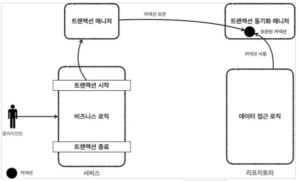

# 스프링이 제공하는 트랜잭션 인터페이스

**구현 기술에 따른 트랜잭션 사용법**

* 트랜잭션은 원자적 단위의 비즈니스 로직을 처리하기 위해 사용한다.
* 구현 기술마다 트랜잭션을 사용하는 방법이 다르다.
  * JDBC : `con.setAutoCommit(false)`
  * JPA : `transaction.begin()`
  * JDBC 기술을 사용하다가 JPA 기술로 변경하게 되면 서비스 계층의 코드도 JPA 기술을 사용하도록 함께 수정해야 한다.

**트랜잭션 추상화**

JDBC, JPA 하이버네이트 등등 사용하는 기술에 따라서 서비스 계층에 작성할 내용들이 달라진다.
기술이 달라져도 서비스 계층의 내용은 일정하게 두고 싶을 때!
트랜잭션에 필요한 기능들을 추상화하면 된다.

**트랜잭션 추상화 인터페이스**

~~~java
public interface TxManager {
  begin();
  commit();
  rollback();
}
~~~

이 처럼 인터페이스를 만들고, 이 인터페이스를 기반으로 각각의 기술에 맞는 구현체를 만들면 된다.

* `JdbcTxManager implements TxManager` : JDBC 트랜잭션 기능을 제공하는 구현체
* `JpaTxManager implements TxManager` : JPA 트랜잭션 기능을 제공하는 구현체

**트랜잭션 추상화와 의존관계**

* 서비스는 특정 트랜잭션 기술에 직접 의존하는 것이 아니라 `TxManager`라는 추상화된 인터페이스에 의존한다. 이제 원하는 구현체를 DI를 통해서 주입하면 된다.
* 클라이언트인 서비스는 인터페이스에 의존하고 DI를 사용한 덕분에 OCP 원칙을 지키게 되었다. 이제 트랜잭션을 사용하는 서비스 코드를 전혀 변경하지 않고, 트랜잭션 기술을 마음껏 변경할 수 있다.

## 스프링의 트랜잭션 추상화

스프링은 이미 이런 고민을 다 해두었다. 우리는 스프링이 제공하는 트랜잭션 추상화 기술을 사용하면 된다. 심지어 데이터 접근 기술에 따른 트랜잭션 구현체도 대부분 만들어두어서 가져다 사용하기만 하면 된다. => OOP의 극대화 AOP

스프링 트랜잭션 추상화의 핵심은 `PlatformTransactionManager` 인터페이스이다.
`org.springframework.transaction.PlatformTransactionManager`

> **참고**
> 스프링 5.3부터 JDBC 트랜잭션을 관리할 때 `DataSourceTransactionManager`를 상속받아 약간의 기능을 확장한 `JdbcTransacktionManager`를 제공한다.
> 둘의 기능 차이는 크지 않으므로 같은 것으로 이해하면 된다.

**PlatformTransactionManager 인터페이스**

~~~java
package org.springframework.transaction;

import org.springframework.lang.Nullable;

public interface PlatformTransactionManager extends TransactionManager {

	TransactionStatus getTransaction(@Nullable TransactionDefinition definition) throws TransactionException;

	void commit(TransactionStatus status) throws TransactionException;

  void rollback(TransactionStatus status) throws TransactionException;

}
~~~

* `getTransaction()` : 트랜잭션을 시작한다.
  * 기존에 이미 진행중인 트랜잭션이 있는 경우 해당 트랜잭션에 참여할 수 있다.
  * 트랜잭션 참여, 전파 관련
* `commit()` : 트랜잭션을 커밋한다.
* `rollback()` : 트랜잭션을 롤백한다.

## 트랜잭션 동기화

스프링이 제공하는 트랜잭션 매니저는 크게 2가지 역할을 한다.

1. 트랜잭션 추상화
2. 리소스 동기화

**1. 트랜잭션 추상화**

`PlatformTransactionManager`로 트랜잭션을 할 때 필요한 기능들을 추상화 하였다.

**2. 리소스 동기화**

트랜잭션을 유지하기 위해 우리는 **같은 커넥션을 이용하려고 파라미터로 커넥션을 전달하는 방법**을 이용했다. 이 방법은 커넥션 파라미터를 가진 메서드와 아닌 메서드를 중복해서 만들어야하고... 파라미터로 커넥션을 전달하면서 코드가 지저분해지는 단점들이 많았다.

**트랜잭션 매니저와 트랜잭션 동기화 매니저**

* 스프링은 **트랜잭션 동기화 매니저**를 제공한다. 이것은 **쓰레드 로컬**을 사용해서 커넥션을 동기화해준다. 트랜잭션 매니저는 내부에서 이 트랜잭션 동기화 매니저를 사용한다.
* 트랜잭션 동기화 매니저는 쓰레드 로컬을 사용하기 때문에 **멀티쓰레드 상황에 안전하게 커넥션을 동기화 할 수 있다**. 따라서 커넥션이 필요하면 트랜잭션 동기화 매니저를 통해 커넥션을 획득하면 된다. 즉, 이전처럼 파라미터로 커넥션을 넘길 필요가 없다.
* 쓰레드 로컬이 동시성을 해결해줌

**동작 방식**

1. 커넥션을 만들고 트랜잭션을 시작한다.

2. 트랜잭션 매니저는 트랜잭션이 시작된 커넥션을 트랜잭션 동기화 매니저에 보관한다.

3. 리포지토리는 트랜잭션 동기화 매니저에 보관된 커넥션을 꺼내서 사용한다. 

   `Connection = DataSourceUtils.getConnection(dataSource)`

4. 트랜잭션이 종료되면 트랜잭션 매니저는 트랜잭션 동기화 매니저에 보관된 커넥션을 통해 트랜잭션을 종료하고 커넥션도 닫는다.

   `DataSourceUtils.releaseConnection(con, dataSource)`

**트랜잭션 동기화 매니저 클래스**

`org.springframework.transaction.support.TransactionSynchronizationManager`

> 쓰레드 로컬을 사용하면 각각의 쓰레드마다 별도의 저장소가 부여된다. 따라서 해당 쓰레드만 해당 데이터에 접근할 수 있다.

## 트랜잭션 문제 해결 - 트랜잭션 매니저1

**MemberRepositoryV3**

~~~java
public class MemberRepositoryV3 {

    private final DataSource dataSource;

    public MemberRepositoryV3(DataSource dataSource) {
        this.dataSource = dataSource;
    }

    public Member save(Member member) throws SQLException {
        String sql = "insert into member(member_id, money) values (?, ?)";

        Connection con = null;
        PreparedStatement pstmt = null;

        try {

            con = getConnection();
            pstmt = con.prepareStatement(sql);
            pstmt.setString(1, member.getMemberId());
            pstmt.setInt(2, member.getMoney());
            pstmt.executeUpdate();
            return member;

        } catch (SQLException e) {
            log.error("db error", e);
            throw e;
        } finally {
            close(con, pstmt, null);
        }

    }

    public Member findById(String memberId) throws SQLException {
        String sql = "select * from member where member_id = ?";

        Connection con = null;
        PreparedStatement pstmt = null;
        ResultSet rs = null;

        try {
            con = getConnection();
            pstmt = con.prepareStatement(sql);
            pstmt.setString(1, memberId);

            rs = pstmt.executeQuery();
            if (rs.next()) {
                Member member = new Member();
                member.setMemberId(rs.getString("member_id"));
                member.setMoney(rs.getInt("money"));
                return member;
            } else {
                throw new NoSuchElementException("member not found memberId=" + memberId);
            }
        } catch (SQLException e) {
            log.error("db error", e);
            throw e;
        } finally {
            close(con, pstmt, rs);
        }
    }

    public void update(String memberId, int money) throws SQLException {
        String sql = "update member set money=? where member_id=?";

        Connection con = null;
        PreparedStatement pstmt = null;

        try {
            con = getConnection();
            pstmt = con.prepareStatement(sql);
            pstmt.setInt(1, money);
            pstmt.setString(2, memberId);
            int resultSize = pstmt.executeUpdate();
            log.info("resultSize={}", resultSize);
        } catch (SQLException e) {
            log.error("db error", e);
            throw e;
        } finally {
            close(con, pstmt, null);
        }
    }

    public void delete(String memberId) throws SQLException {
        String sql = "delete from member where member_id = ?";

        Connection con = null;
        PreparedStatement pstmt = null;

        try {
            con = getConnection();
            pstmt = con.prepareStatement(sql);
            pstmt.setString(1, memberId);
            int resultSize = pstmt.executeUpdate();
            log.info("resultSize={}", resultSize);
        } catch (SQLException e) {
            log.error("db error", e);
            throw e;
        } finally {
            close(con, pstmt, null);
        }
    }

    private void close(Connection con, Statement stmt, ResultSet rs) {
        JdbcUtils.closeResultSet(rs);
        JdbcUtils.closeStatement(stmt);
        //주의! 트랜잭션 동기화를 사용하려면 DataSourceUtils를 통해 connection을 동기화 매니저로 보내야 한다.
        DataSourceUtils.releaseConnection(con, dataSource);
    }

    private Connection getConnection() throws SQLException {
        //주의! 트랜잭션 동기화를 사용하려면 DataSourceUtils를 사용해야 한다.
        Connection con = DataSourceUtils.getConnection(dataSource);
        log.info("get connection={}, class={}", con, con.getClass());
        return con;
    }
}
~~~

**DataSourceUtils.getConnection()**

* 기존에 Connection을 얻기위해 `DataSource`를 받아서 `Connection con = dataSource.getConnection()`를 통해 Connection을 받았다.
* 트랜잭션 동기화를 이용하기 위해 `DataSourceUtils`를 이용한다.
  * `Connection con = DataSourceUtils.getConnection(dataSource)`
  * 리포지토리에서는 트랜잭션 동기화 매니저에 가서 커넥션을 가져온다.
    * **트랜잭션 동기화 매니저가 관리하는 커넥션이 있다면 해당 커넥션을 반환한다.**
    * 트랜잭션 동기화 매니저가 관리하는 커넥션이 없다면 새로운 커넥션을 생성해서 반환한다.

**DataSourceUtils.releaseConnection()**

* 기존에 Connection을 쓰고 닫을 때 `close()메서드를 만들어서 닫을 수 있도록 설정하였다.
* 트랜잭션 동기화를 이용하기 위해 이곳에서 직접 닫지 않고(직접 `con.close()`로 닫아버리면 커넥션이 유지되지 않는다), 트랜잭션 동기화 매니저로 커넥션을 반환한다.
* `DataSourceUtils.releaseConnection(con, dataSource)`를 통해 트랜잭션 동기화 매니저로 커넥션을 보내는데,
  * 이 때, **트랜잭션 동기화 매니저가 관리하는 커넥션이 없는 경우 해당 커넥션을 닫는다.**

**MemberServiceV3**

~~~java
public class MemberServiceV3 {

    private final MemberRepositoryV3 memberRepository;

    //직접 DataSource를 사용하는 것을 막기
    //private final DataSource dataSource;
    private final PlatformTransactionManager transactionManager;

    public void accountTransfer(String fromId, String toId, int money) throws SQLException {
      	//더이상 이곳에서 Connection을 받지 않는다.  
      	//Connection con = dataSource.getConnection();
      
        //트랜잭션 시작
        TransactionStatus status = transactionManager.getTransaction(new DefaultTransactionDefinition());

        try {
            //con.setAutoCommit(false); 트랜잭션 시작은 위로 올라감
            bizLogic(fromId, toId, money);
            //con.commit();
            transactionManager.commit(status);
        } catch (Exception e) {
            //con.rollback();
            transactionManager.rollback(status);
            throw new IllegalStateException(e);
        }
        /* 트랜잭션 매니저가 commit이나 rollback이 되면 알아서 정리해준다.
        finally {
            if (con != null) {
                try {
                    con.setAutoCommit(true);
                    con.close();
                } catch (Exception e) {
                    log.info("error", e);
                }
            }
        }*/

    }

    private void bizLogic(String fromId, String toId, int money) throws SQLException {
        Member fromMember = memberRepository.findById(fromId);
        Member toMember = memberRepository.findById(toId);

        memberRepository.update(fromId, fromMember.getMoney() - money);
        validation(toMember);
        memberRepository.update(toId, toMember.getMoney() + money);
    }

    private void validation(Member toMember) {
        if (toMember.getMemberId().equals("ex")) {
            throw new IllegalStateException("이체중 예외 발생");
        }
    }
}
~~~

* `private final PlatformTransactionManager transactionManager`
  * 트랜잭션 매니저를 주입 받는다. 현재 JDBC 기술을 사용하기 때문에
     `new DataSourceTransactionManager(dataSource)`구현체를 주입 받아야 한다.
  * JPA 경우 `JpaTransactionManager`를 주입 받으면 된다.
* `transactionManager.getTransaction()`
  * 기존엔 `con.setAutoCommit(flase)`를 통해 트랜잭션 시작을 알렸지만, 이제는 
     `TransactionStatus status`를 반환하는 
    `transactionManager.getTransaction(new DefaultTransactionDefinition())`을 작성하면서 트랜잭션 시작을 알린다.
  * `TransactionStatus`는 현재 트랜잭션의 상태 정보가 포함되어 있다.
  * 위 `TransactionStatus`는 이후 커밋과 롤백에 사용되기 때문에 가지고 있어야 한다.
* `new DefaultTransactionDefinition()`
  * 트랜잭션과 관련된 옵션을 지정할 수 있다.
* `transactionManager.commit(status)`
  * 커밋
* `trasactionManager.rollback(status)`
  * 롤백

**MemberServiceV3Test**

~~~java
@BeforeEach
void before() throws SQLException {
  HikariDataSource dataSource = new HikariDataSource();
  dataSource.setJdbcUrl(URL);
  dataSource.setUsername(USERNAME);
  dataSource.setPassword(PASSWORD);
  
  PlatformTransactionManager transactionManager = new DataSourceTransactionManager(dataSource);
  
  memberRepository = new MemberRepositoryV3(dataSource);
  memberService = new MemberServiceV3(memberRepository, transactionManager);
}
~~~

* 기존과 달라진 곳은 초기화 부분이다.
  * `MemberService`와 `MemberRepository`에 DataSource를 설정한 후 주입해주었지만, `MemberService`는 `JDBC`기술을 빼기 위해 추상화된 인터페이스를 넣어준다.
  * `PlatformTransactionManager`는 위에서도 설명하였지만 트랜잭션 기능들을 추상화한 인터페이스이고, 우리가 사용할 `JDBC`는 `DataSourceTransactionManager`가 필요하기 때문에 이 것을 구체화해서 주입해준다.
  * 
  * `DataSourceTransactionManager()`는 우리가 설정한 `DataSource`가 필요하기 때문에 위에서는 HikariCP로 설정한 `dataSource`를 넣어주었다.

