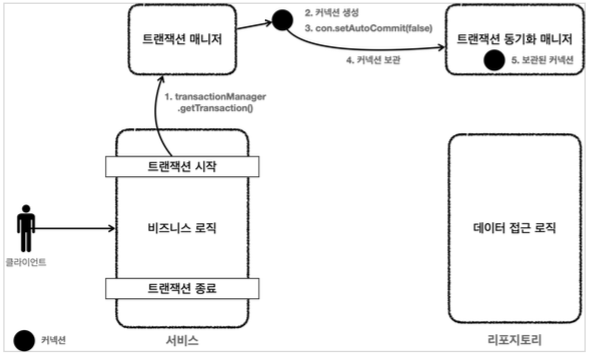
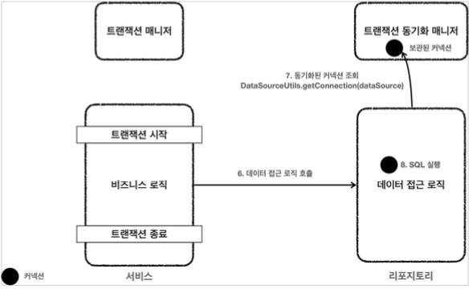
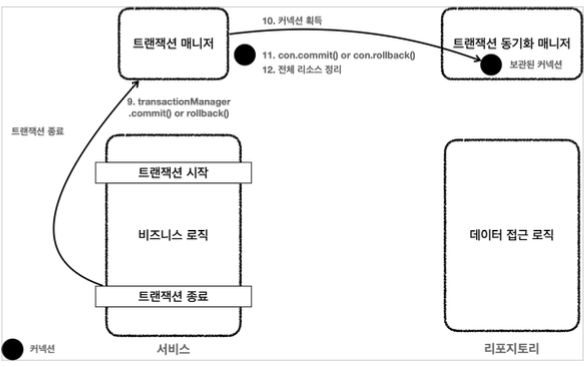

# 트랜잭션 매니저 동작 흐름

**트랜잭션 시작**

클라이언트 요청으로 서비스 로직을 실행한다.

1. 서비스 계층에서 `transactionManager.getTransaction()`을 호출해서 트랜잭션을 시작한다.
2. 트랜잭션을 시작하려면 커넥션이 필요하다. 트랜잭션 매니저는 내부에서 `DataSource`를 사용해서 커넥션을 생성한다.
3. 커넥션을 수동 커밋 모드로 변경해서 실제 데이터베이스 트랜잭션을 시작한다.
4. 커넥션을 트랜잭션 동기화 매니저에 보관한다.
5. 트랜잭션 동기화 매니저는 쓰레드 로컬에 커넥션을 보관한다. 
   * 위로 인해 멀티 쓰레드 환경에 안전하게 커넥션을 보관할 수 있다.

**로직 실행**

6. 서비스는 비즈니스 로직을 실행하면서 리포지토리의 메서드들을 호출한다.
7. 리포지토리 메서드들은 트랜잭션이 시작된 커넥션이 필요하다. 
   리포지토리는 `DataSourceUtils.getConnection()`을 사용해서 트랜잭션 동기화 매니저에 보관된 커넥션을 꺼내서 사용한다.
   보관된 커넥션을 사용하기 때문에 자연스럽게 같은 커넥션을 사용하고, 트랜잭션도 유지된다.
8. 획득한 커넥션을 사용해서 SQL을 데이터베이스에 전달해서 실행한다.

**트랜잭션 종료**

9. 비즈니스 로직이 끝나고 트랜잭션을 종료한다. 트랜잭션은 커밋하거나 롤백하면 종료된다.
10. 트랜잭션을 종료하려면 동기화된 커넥션이 필요하다. 트랜잭션 동기화 매니저를 통해 동기화된 커넥션을 획득한다.
11. 획득한 커넥션을 통해 데이터베이스에 트랜잭션을 커밋하거나 롤백한다.
12. 전체리소스를 정리한다.
    * 트랜잭션 동기화 매니저를 정리한다. 쓰레드 로컬은 사용 후 꼭 정리해야 한다.
    * `con.setAutoCommit(true)`로 되돌린다. 커넥션 풀을 고려해야 한다.
    * `con.close()`를 호출해서 커넥션을 종료한다. 커넥션 풀의 경우 `con.close()`를 호출하면 커넥션 풀에 반환된다.