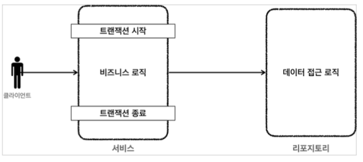
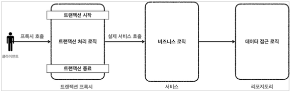

# 트랜잭션 AOP

지금까지 트랜잭션을 편리하게 처리하기 위해 트랜잭션 추상화도 도입하고, 반복 코드 제거를 위해 트랜잭션 템플릿도 도입했었다. 그러나 아직 서비스 계층에 순수한 비즈니스 로직만 남긴다는 목표는 아직 달성하지 못했다.

> 스프링 AOP와 프록시에 대해 자세히 내용은 작성하지 않는다.
> 지금은 단순하게 `@Transactional`을 사용하면 스프링이 AOP를 사용해서 트랜잭션을 편리하게 처리해준다 정도로 이해하자

**프록시 도입전**

**프록시 도입 후**

**트랜잭션 프록시 코드 대략적인 내용**

~~~java
public class TransactionProxy {
  
  private MemberService target;
  
  public void logic() { //트랜잭션 시작
    TransactionStatus status = transactionManager.getTransaction(..);
    try {
	  	//실제 대상 호출 
      target.logic();
	  	transactionManager.commit(status); //성공시 커밋 
    } catch (Exception e) {
	  	transactionManager.rollback(status); //실패시 롤백
      throw new IllegalStateException(e);
    }
	} 
}
~~~

**트랜잭션 프록시 적용 후 서비스 코드 예시**

~~~java
public class Service {
  public void logic() {
    //트랜잭션 관련 코드 제거, 순수 비즈니스 로직만 남음
    bizLogic(fromId, toId, money);
  }
}
~~~

* 프록시 도입전 : 서비스에 비즈니스 로직과 트랜잭션 처리 로직이 함께 섞여있다.
* 프록시 도입후 : 트랜잭션 프록시가 트랜잭션 처리 로직을 모두 가져간다. 그리고 트랜잭션을 시작한 후에 실제 서비스를 대신 호출한다. 그 결과 서비스 계층에는 순수한 비즈니스 로직만 남길 수 있다.

## 스프링이 제공하는 트랜잭션 AOP

* 스프링이 제공하는 AOP 기능을 사용하면 프록시를 매우 편리하게 적용할 수 있다.

  `@Aspect`, `@Advice`, `@Pointcut`을 사용해서 트랜잭션 처리용 AOP를 만들 수 있다.

* 물론 스프링 AOP를 직접 사용해서 트랜잭션을 처리해도 되지만 트랜잭션은 매우 중요한 기능이고, 전세계 누구나 다 사용하는 기능이다. 스프링은 트랜잭션 AOP를 처리하기 위한 모든 기능을 제공한다. 스프링 부트를 사용하면 트랜잭션 AOP를 처리하기 위해 필요한 스프링 빈들도 자동으로 등록해준다.

* 개발자는 트랜잭션 처리가 필요한 곳에 `@Transactional` 애노테이션만 붙여주면 된다. 스프링의 트랜잭션 AOP는 이 애노테이션을 인식해서 트랜잭션 프록시를 적용해준다.

> 스프링 AOP를 적용하려면 어드바이저, 포인트컷, 어드바이스가 필요하다. 스프링 트랜잭션 AOP 처리를 위해 다음 클래스를 제공한다.
> 스프링 부트를 사용하면 해당 빈들은 스프링 컨테이너에 자동으로 등록된다.
>
> 어드바이저 : `BeanFactoryTransactionAttributeSourceAdvisor`
> 포인트컷 : `TransactionAttributeSourcePointcut`
> 어드바이스 : `TransactionInterceptor`

## 트랜잭션 AOP 적용

**MemberServiceV3_3**

~~~java
@RequiredArgsConstructor
public class MemberServiceV3_3 {

    private final MemberRepositoryV3 memberRepository;

    @Transactional
    public void accountTransfer(String fromId, String toId, int money) throws SQLException {
        bizLogic(fromId, toId, money);
    }
}
~~~

* 순수한 비즈니스 로직만 남기고 트랜잭션 관련 코드는 모두 제거
* 트랜잭션 AOP를 적용하기 위해 `@Transactional` 애노테이션 추가
* `@Transactional` 애노테이션은 메서드에 붙여도 되고, 클래스에 붙여도 된다. 클래스에 붙이면 외부에서 호출 가능한 public 메서드가 AOP적용 대상이 된다.

**MemberServiceV3_3Test**

~~~java
@SpringBootTest
class MemberServiceV3_3Test {

    public static final String MEMBER_A = "memberA";
    public static final String MEMBER_B = "memberB";
    public static final String MEMBER_EX = "ex";

    @Autowired
    private MemberRepositoryV3 memberRepository;
    @Autowired
    private MemberServiceV3_3 memberService;

    @TestConfiguration
    static class TestConfig {
        @Bean
        DataSource dataSource() {
            HikariDataSource dataSource = new HikariDataSource();
            dataSource.setJdbcUrl(URL);
            dataSource.setUsername(USERNAME);
            dataSource.setPassword(PASSWORD);
            return dataSource;
        }

        @Bean
        PlatformTransactionManager transactionManager() {
            return new DataSourceTransactionManager(dataSource());
        }

        @Bean
        MemberRepositoryV3 memberRepositoryV3() {
            return new MemberRepositoryV3(dataSource());
        }

        @Bean
        MemberServiceV3_3 memberServiceV3_3() {
            return new MemberServiceV3_3(memberRepositoryV3());
        }
    }
}
~~~

* `@SpringBootTest` : 스프링 AOP를 적용하려면 스프링 컨테이너가 필요하다. 이 애노테이션을 통해 테스트시 스프링 부트를 통해 스프링 컨테이너를 생성한다.
* `@Autowired` : 테스트에서 스프링 컨테이너가 관리하는 빈들 중에서 가져올 것들을 설정한다. 
  * 테스트 할 때, 레포지토리와 서비스가 필요하므로 `@Autowired`로 등록된 빈들을 가져오도록 한다.
* `@TestConfiguration` : 테스트 안에 내부 설정 클래스를 만들고, 이 애노테이션을 붙이면 스프링 부트가 자동으로 만들어주는 빈들 추가로 필요한 스프링 빈들을 등록하고 테스트를 수행할 수 있다.
* `TestConfig`
  * `DataSource` 데이터 소스가 필요한 트랜잭션 매니저와 리포지토리를 위해 설정해두고, 빈으로 등록한다.
  * `DataSourceTransactionManager` 트랜잭션 매니저를 스프링 빈으로 등록한다.
    * 스프링이 제공하는 트랜잭션 AOP는 스프링 빈에 등록된 트랜잭션 매니저를 찾아서 사용하기 때문에 트랜잭션 매니저를 스프링 빈으로 등록해두어야 한다.

**AOP 프록시가 적용되었는지 확인하는 방법**

* 우리가 사용하는 서비스 클래스와 리포지토리의 클래스 명을 가져와보면 원래 가져야 할 클래스 명과 비교해보면 AOP 프록시가 적용되었는지 확인할 수 있다.
* `memberService`의 경우 AOP 트랜잭션을 적용했기 때문에 클래스 명에 추가로 `$EnhancerBySpringCGLIB...`가 붙어있다. 즉, 프록시(CGLIB)가 적용된 것을 확인할 수 있다.
* `memberRepository`의 경우 AOP를 적용하지 않았기 때문에 프록시자 적용되지 않은 것을 확인할 수 있다.