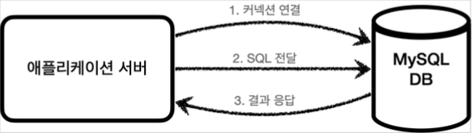
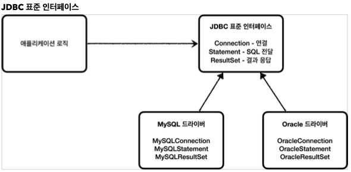

# JDBC

## JDBC 등장 이유

애플리케이션을 개발할 때 중요한 데이터는 대부분 데이터베이스에 보관한다.

## 애플리케이션 서버와 DB (과거)

### 일반적인 사용법

1. 커넥션 연결 : 주로 TCP/IP를 사용해서 커넥션을 연결한다.
2. SQL 전달 : 애플리케이션 서버는 DB가 이해할 수 있는 SQL을 연결된 커넥션을 통해 DB에 전달한다.
3. 결과 응답 : DB는 전달된 SQL을 수행하고 그 결과를 응답한다. 애플리케이션 서버는 응답 결과를 활용한다.

### DB를 변경하게 되는 경우

​	문제는 각각의 데이터베이스마다 커넥션을 연결하는 방법, SQL을 전달하는 방법, 결과를 응답 받는 방법 모두 다르다는 점이다.

​	문제 1. DB를 변경하게 되면, 서버에 개발된 데이터베이스 사용 코드도 함께 변경되어야 한다.
​	문제 2. 개발자가 각각의 데이터베이스마다 커넥션 연결 SQL 전달 그리고 그 결과를 응답받는 방법을 새로 학습해야 한다.

​	=> 이런 문제를 해결하기 위해 JDBC라는 자바 표준이 등장한다.

## JDBC 표준 인터페이스

>JDBC(Java Database Connectivity)는 자바에서 데이터베이스에 접속할 수 있도록 하는 자바 API다. JDBC는 데이터베이스에서 자료를 쿼리하거나 업데이트하는 방법을 제공한다.

​		과거에는 연결, 전달, 결과 응답이 각 DB마다 서로 다 달랐다. 그래서 JDBC에서는 
​		대표적으로 3가지 기능을 표준 인터페이스로 정의해서 제공한다.

* `java.sql.Connection` - 연결

* `java.sql.Statement` - SQL을 담은 내용

* `java.sql.ResultSet` - SQL 요청 응답

  자바는 이렇게 표준 인터페이스를 정의해두었고, 개발자는 이 표준 인터페이스만 사용해서 개발하면 된다.

  각각의 DB 벤더에서 자신의 DB에 맞도록 JDBC 인터페이스를 구현해서 라이브러리로 제공하는데, 이것을 JDBC 드라이버라고 한다. 
  예를들어 MySQL DB에 접근할 수 있는 것은 MySQL JDBC 드라이버라고 한다.

  

  문제 해결 1. JDBC의 등장으로 DB를 변경시 JDBC 구현 라이브러리인 JDBC 드라이버만 변경하면 애플리케이션 서버의 사용 코드를 그대로 유지해서 사용할 수 있게 되었다.

  문제 해결 2. 개발자는 JDBC 표준 인터페이스 사용법만 학습하게 되면 수십개의 데이터베이스에 모두 동일하게 적용할 수 있다.

​			참고 - 표준화의 한계

> JDBC의 등장으로 많은 것이 편리해진 것은 맞다.
> 그러나 각각의 데이터베이스마다 SQL, 데이터 타입 등 일부 사용법이 다르다.
> ANSI SQL이라는 표준이 있기는 하지만, 일부분만 공통화했기 때문에 한계가 있다.
> 결국 데이터베이스를 변경하면 JDBC코드는 변경하기 않다도 되지만 SQL은 해당 데이터베이스에 맞도록 변경해야 한다.
> 참고로 JPA(Java Persistence API)를 사용하면 각각의 데이터베이스마다 다른 SQL을 정의해야 하는 문제도 많은 부분 해결할 수 있다.

## JDBC와 최신 데이터 접근 기술

JDBC는 오래된 기술이고, 사용방법도 복잡하다. 그러나 최근에는 JDBC를 직접 사용하기 보다는 JDBC를 편리하게 사용하는 다양한 기술이 존재한다. 대표적으로 SQL Mapper와 ORM 기술로 나눌 수 있다.

### JDBC 직접 사용

애플리케이션 로직에서 JDBC로 SQL을 전달하면된다.
low level에서 사용하다보니 이 과정이 매우 복잡하다.

### SQL Mapper

​	애플리케이션 로직에서 SQL Mapper(Jdbc Template, MyBatis)로 SQL을 전달하고 SQL Mapper가 JDBC로 SQL을 전달한다.

* SQL Mapper 
  * 장점 : JDBC를 편리하게 사용하도록 도와준다.
    * SQL 응답 결과를 객체로 편리하게 변환해준다.
    * JDBC의 반복 코드를 제거해준다.
  * 단점 : 개발자가 SQL을 직접 작성해야한다.
  * 대표 기술 : 스프링 JdbcTemplate, MyBatis
  * 

### ORM 기술

​	애플리케이션 로직에서 JPA로 객체를 전달한다.
​	JPA 구현체(하이버네이트, 이클립스링크)는 SQL을 JDBC로 전달해준다.

* ORM 기술
  * ORM은 객체를 관계형 데이터베이스 테이블과 매핑해주는 기술이다. 개발자 대신에 QL을 동적으로 만들어 실행해주고, 각각 데이터베이스마다 다른 SQL을 사용하는 문제도 중간에서 해결해준다.
  * 대표 기술 : JPA, 하이버네이트, 이클립스링크
  * JPA는 자바 진영의 ORM 표준 인터페이스이고, 이것을 구현한 것으로 하이버네이트와 이클립스 링크 등의 구현 기술이 있다.

* SQL Mapper vs ORM 기술

  각각 장단점이 있다.

  SQL Mapper의 경우 SQL만 직접 작성하면 나머지 번거로운 일은 SQL Mapper가 대신 해결해준다. SQL만 작성할 줄 알면 금방 배워서 사용할 수 있다.

  ORM 기술은 SQL을 작성하지 않아도 되어서 개발 생산성이 매우 높아진다. 그러나 쉬운 기술이 아니므로 실무에서 사용하려면 깊이있게 학습해야 한다.