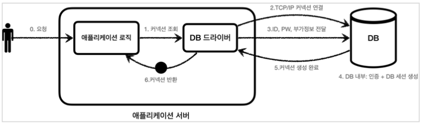
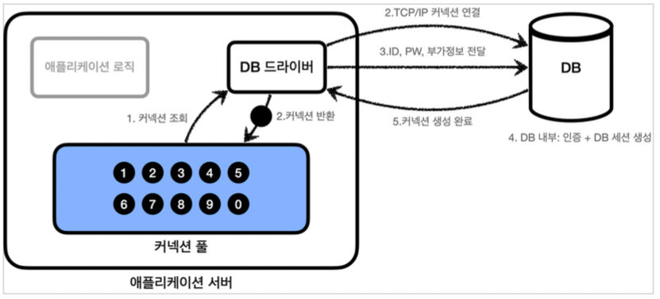
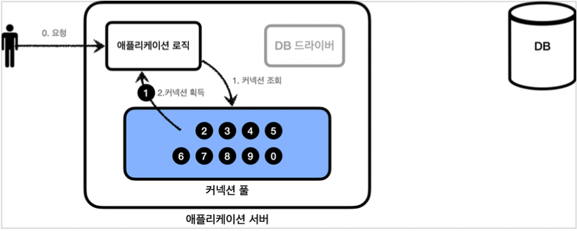
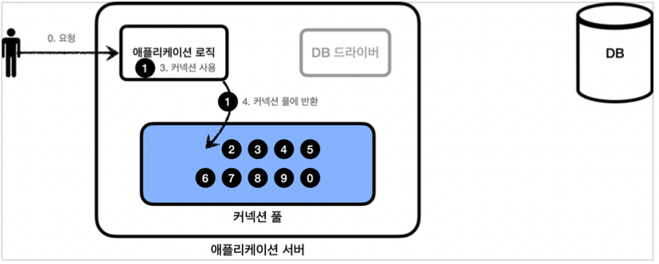
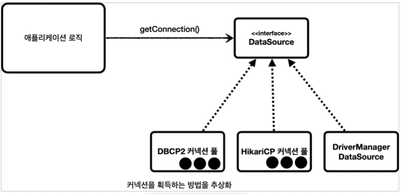

# 커넥션 풀과 데이터소스

## 커넥션

* 우리가 개발한 crud 기능을 가진 애플리케이션 로직은 기능을 수행할 때마다 getConnection()을 통해 매번 커넥션을 획득한다.
* 데이터베이스 커넥션을 획득할 때는 다음과 같은 복잡한 과정을 거친다.
  1. 애플리케이션 로직은 DB 드라이버를 통해 커넥션을 조회한다.
  2. DB 드라이버는 DB와 TCP/IP 커넥션을 연결한다.(TCP/IP 연결을 위한 네트워크 동작이 발생한다.)
  3. DB 드라이버는 TCP/IP 커넥션이 연결되면, ID, PW 등 기타 정보들을 DB에 전달한다.
  4. DB는 정보들을 통해 인증을 완료하고, 내부에 DB 세션을 생성한다.
  5. DB는 커넥션 생성이 완료되었다는 응답을 보낸다.
  6. DB 드라이버는 커넥션 객체를 생성해서 클라이언트에 반환한다.
* 커넥션을 새로 만드는 것은 시간을 많이 잡아먹는 일이다.
  DB는 물론이고 애플리케이션 서버에서도 TCP/IP 커넥션을 새로 생성하기 위한 리소스를 매번 사용해야 한다.
  결과적으로 응답 속도에 영향을 주기 때문에 커넥션을 미리 생성해두고 사용하는 방법을 이용할 것이다.

## 커넥션 풀

* 커넥션 풀 초기화 : 애플리케이션을 시작하는 시점에 커넥션 풀은 필요한 만큼 커넥션을 미리 확보해서 풀에 보관(기본값 10개)

  

* 커넥션 풀 사용 

  1. 애플리케이션 로직은 DB 드라이버를 통해 커넥션을 획득하는 것이 아니라, 이미 생성되어 있는 커넥션을 객체 참조로 가져다 쓰기만 하면 된다.

     

  2. 커넥션 풀에 커넥션을 요청하면 커넥션 풀은 자신이 가지고 있는 커넥션 중에 하나를 반환한다.
   

> 커넥션을 모두 사용하고 나면 이제는 커넥션을 종료하는 것이 아니라, 
> 다음에 다시 사용할 수 있도록 해당 커넥션을 그대로 커넥션 풀에 반환해야 한다.

## 커넥션 풀 오픈소스

스프링 부트 2.0부터는 기본 커넥션 풀 오픈소스로 hikariCP를 제공한다. 성능, 편리함, 안정성 측면에서 이미 검증되어 있다.

## 커넥션 풀 이용

DriverManager로 신규 커넥션을 생성해왔다면, 커넥션 풀을 이용하기 위해 코드를 변경해야 한다.

우리는 getConnection()으로 커넥션을 받아왔는데, 이 구조 자체를 바꿔버린다면 그것도 하나의 문제가 되기 때문에 자바에서는 이걸 해결하기 위해 java.sql.DataSource 인터페이스를 제공한다.

DataSource는 **커넥션을 획득하는 방법을 추상화한 인터페이스이다.**

이 인터페이스의 핵심 기능은 커넥션 조회이다.

*DataSource.interface*

~~~java
public interface DataSource {
  Connection getConnection() throws SQLException;
}
~~~

* 대부분 커넥션 풀은 DataSource 인터페이스를 이미 구현해두었다. 그래서 DataSource 인터페이스에만 의존하도록 애플리케이션 로직을 작성하면 된다.
* 그러나 DriverManager는 DataSource 인터페이스를 사용하지 않는다.
  * 이 문제를 해결하기 위해 스프링은 DriverManager도 DataSource를 통해 사용할 수 있도록 DriverManagerDataSource라는 DataSource를 구현한 클래스를 제공한다.
* 자바는 DataSource를 통해 커넥션을 획득하는 방법을 추상화했다. 즉 DriverManager를 사용하다가 커넥션 풀을 사용하도록 코드를 변경해도 애플리케이션 로직은 변경하지 않아도 된다.

## 커넥션 획득 방법 두 가지

위에서 계속 설명한 것처럼 커넥션을 획득하는 방법은 2가지이다.

1. java.sql.DriverManager에서 제공하는 getConnection() 메서드를 이용해 바로 Connection을 획득하는 방법

2. 커넥션을 획득하는 방법을 추상화한 인터페이스인 DataSource를 이용하는 방법

   * HikariCP, DriverManagerDataSource, DBCP2 등이 있다.

     

1번 방법인 *DriverManager*

~~~java
@Test
void driverManager() throws SQLExcpeiton {
  Connection con1 = DriverManager.getConnection(URL, USERNAME, PASSWORD);
  Connection con2 = DriverManager.getConnection(URL, USERNAME, PASSWORD);
}
~~~

2번 방법인 *DriverManagerDataSource* (스프링에서 제공해줌)

~~~java
@Test
void driverManagerDatasource() throws SQLException {
  DriverManagerDataSource dataSource = new DriverManagerDataSource(URL, USERNAME, PASSWORD);
  Connection con1 = dataSource.getConnection();
  Connection con2 = dataSource.getConnection();
}
~~~

* 위 두 방법은 비슷해보이지만 커넥션을 얻는 방법에선 완전히 다른 모습을 보여주고 있다.
  1. DriverManager는 커넥션을 획득할 때 마다 URL, USERNAME, PASSWORD를 계속 전달하지만,
  2. DataSource는 커넥션을 획득할 때 단순히 dataSource.getConnection()만 호출하면 된다.

### 설정과 사용의 분리

설정 - DataSource를 만들고 필요한 속성들을 사용해서 정보들을 입력하는 것을 말한다.
사용 - 설정은 신경쓰지 않고, DataSource의 getConnection()만 호출해서 아용하면 된다.

~~~java
@Test
void driverManagerDatasource() throws SQLException {
  //설정
  DriverManagerDataSource dataSource = new DriverManagerDataSource(URL, USERNAME, PASSWORD);

  //사용
  useDataSource1(dataSource);
  useDataSource2(dataSource);
}

private void useDataSource1(DataSource dataSource) throws SQLExcpetion {
    Connection con = dataSource.getConnection();
}

private void useDataSource2(DataSource dataSource) throws SQLExcpetion {
    Connection con = dataSource.getConnection();
}
~~~

* 분리가 안된 코드

  * 파라미터로 받지않고 객체로 받기 때문에 의존성이 따라온다.
    그렇기 때문에 의존성을 버릴 수 있는 DataSource가 DriverManager보다 더욱 좋은 방법임을 알 수 있다.

  ~~~java
  
  static Connection driverManagerGetConneciton() throws SQLExcpeiton {
    Connection con = DriverManager.getConnection(URL, USERNAME, PASSWORD);
  
    return con;
  }
  
  private void useDriverManger() throws SQLExcpetion {
      Connection con = driverManagerGetConncetion();
  }
  ~~~

  

## HikariCP 커넥션 풀 사용방법

~~~java
@Test
void dataSourceConnectionPoll() throws SQLException, InterruptedException {
  HikariDataSource dataSource = new HikariDataSource();
  dataSource.setJdbcUrl(ConnectionConst.URL);
  dataSource.setUsername(ConnectionConst.USERNAME);
  dataSource.setPassword(ConnectionConst.PASSWORD);
  dataSource.setMaximumPoolSize(10);
  dataSource.setPoolName("MyPool");
  
  useDataSource(dataSource);
  Thread.sleep(1000); //로그를 확인하기 위한 커넥션 풀에서 커넥션 생성 시간 대기
}
~~~

* 커넥션 풀 오픈소스로 HikariCP를 이용한다.
* HikariDataSource는 DataSource 인터페이스를 구현하고있다.
* 풀 사이즈를 set을 통해 지정할 수 있고, 풀 이름도 지정할 수 있다.
* 커넥션 풀에서 커넥션을 생성하는 작업은 애플리케이션 실행 속도에 영향을 주지 않기 위해 별도의 쓰레드에서 작동한다.
  별도의 쓰레드에서 동작하기 때문에 테스트가 먼저 종료되어 버린다.
  Thread.sleep(1000)을 통해 대기시간을 줌으로써 커넥션이 생성되는 로그를 확인할 수 있다.

### DataSource 의존관계 주입으로 인한 변화

repository 클래스에 DataSource를 주입할 것이다.

~~~java
public class MemberRepositoryV1 {
 
  //의존성 주입
  private final DataSource dataSource;
  public MemberRepositoryV1(DataSource dataSource) {
    this.dataSource = dataSource;
  }
  
  /*
  ... CRUD ...
  */
  
  //JdbcUtils 라이브러리
  private void close(Connection con, Statement stmt, ResultSet rs) {
  JdbcUtils.closeResultSet(rs);
  JdbcUtils.closeStatement(stmt);
  JdbcUtils.closeConnection(con);
	}
  
  //위에서 결정한 DataSource 종류에 따른 커넥션 획득
  //DataSource를 DriverManagerDataSource를 써도 똑같고 HikariDataSource를 써도 똑같다.
  private Conncection getConnection() throws SQLException {
    Connection con = dataSource.getConnection();
    return con;
  }
}
~~~

* 커넥션 받는 방법 변화

  우리는 DBConnectUtil 클래스를 만들어서 커넥션을 받는 getConnection() 메서드를 사용해왔다.

  DataSource의 의존관계를 주입하였기 때문에 테스트를 할 때 직접 만든 DBConnectUtil을 사용하지 않다도 된다.
  dataSource를 만들어서 repository에 설정해주면 된다.

  DriverManagerDataSource에서 HikariDataSource로 바뀌어도 코드 변경이 없다.

  

*  close 메서드 간략화(편의 메서드)

  JdbcUtils 라이브러리를 사용하면 매번 close 사용 없이 간단하게 쓸 수 있다.

~~~java
private void close(Connection con, Statement stmt, ResultSet rs) {
  JdbcUtils.closeResultSet(rs);
  JdbcUtils.closeStatement(stmt);
  JdbcUtils.closeConnection(con);
}
~~~

### CRUD와 커넥션 풀

~~~java
class MemeberRepositoryV1 {
  MemberRepository repository;
  
  @BeforeEach //각 테스트가 실행되기 이전에 실행
  void beforeEach () {
    //스프링에서 제공해주는 DriverManagerDataSource로 커넥션을 획득할 때
    DriverManagerDataSource dataSource = new DriverManagerDataSource(URL, USERNAME, PASSWORD);
    
    //히카리 라이브러리로 커넥션을 획득할 때
    HikariDataSource dataSource = new HikariDataSource();
    dataSource.setJdbcUrl(URL);
    dataSource.setUsernaem(USERNAME);
    dataSource.setPassword(PASSWORD);
    
    repository = new MemberRepositoryV1(dataSource);
  }
  
  @Test
  void crud() throws SQLException {
    //save
    Member member = new Member("memberV0", 10000);
    repository.save(member);

    //findById
    Member findMember = repository.findById(member.getMemberId());
    Assertions.assertThat(findMember).isEqualTo(member);

    //update
    repository.update(member.getMemberId(), 20000);
    Member updateMember = repository.findById(member.getMemberId());
    Assertions.assertThat(updateMember.getMoney()).isEqualTo(20000);

    //delete
    repository.delete(member.getMemberId());
    Assertions.assertThatThrownBy(() -> repository.findById(member.getMemberId()))
      .isInstanceOf(NoSuchElementException.class);
  }
}
~~~

* save할 때, findById할 때 등등... DB를 사용할 때마다 커넥션 획득이 필요하다. 
  그러면 두 DataSource의 커넥션 획득 모습은 어떨까?
  * DriverManagerDataSource를 사용한다면
    * 각 CRUD마다 Connection을 획득해오고, 항상 새로운 커넥션이 생성되어서 사용된다.
  * HikariDataSource를 사용한다면
    * 각 CRUD마다 Connection Pull에서 conn0을 빼서 사용하고 다쓰면 반환하고를 반복한다.
    * 즉 conn0만 사용이 된다.

### DI

~~~java
  @BeforeEach //각 테스트가 실행되기 이전에 실행
  void beforeEach () {
    //기본 DriverManager로 커넥션을 획득할 때
    DriverManagerDataSource dataSource = new DriverManagerDataSource(URL, USERNAME, PASSWORD);
    
    //히카리 라이브러리로 커넥션 풀링
    HikariDataSource dataSource = new HikariDataSource();
    dataSource.setJdbcUrl(URL);
    dataSource.setUsernaem(USERNAME);
    dataSource.setPassword(PASSWORD);
    
    repository = new MemberRepositoryV1(dataSource);
  }
~~~

* DriverManagerDataSource -> HikariDataSource로 변경해도 MemberRepositoryV1의 코드는 전혀 변경하지 않아도 된다.

  MemberRepositoryV1은 DataSource 인터페이스에만 의존하기 때문에 DataSource를 구현한 것만 넣으면 어떤 것을 변경할 필요가 없다는 것이다. -> 표준안이 설정되어 있다!
  이 것이 DataSource를 사용하는 장점(DI + OCP)

