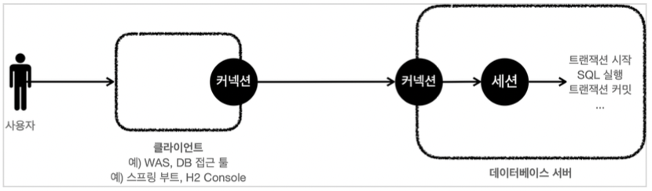
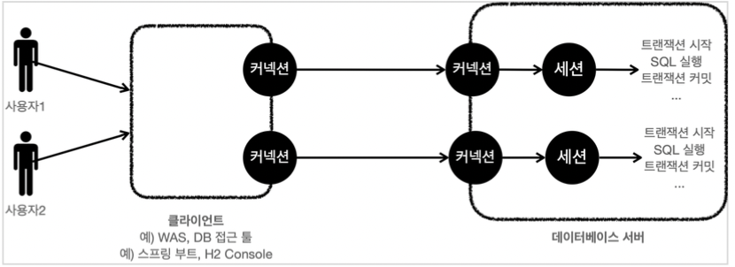

# 데이터베이스 연결 구조와 DB 세션

**데이터베이스 연결 구조1**

1. 사용자는 WAS나 DB 접근 툴 같은 클라이언트를 이용해서 데이터베이스 서버에 접근할 수 있다. 
2. 클라이언트는 데이터베이스 서버에 연결을 요청하고 커넥션을 맺게 된다. 
3. 이 때 데이터베이스 서버는 내부에 세션이라는 것을 만든다. 
4. 해당 커넥션을 통한 모든 요청은 이 세션을 통해서 실행하게 된다.

* 개발자가 클라이언트를 통해 SQL을 전달하면 현재 커넥션에 연결된 세션이 SQL을 실행한다.
* 세션은 트랜잭션을 시작하고, 커밋 또는 롤백을 통해 트랜잭션을 종료한다.
* 사용자가 커넥션을 닫거나, DBA(DB관리자)가 세션을 강제로 종료하면 세션은 종료된다.

**데이터베이스 연결 구조2**

* 커넥션 풀이 10개의 커넥션을 생성하면, 세션도 10개 만들어진다.