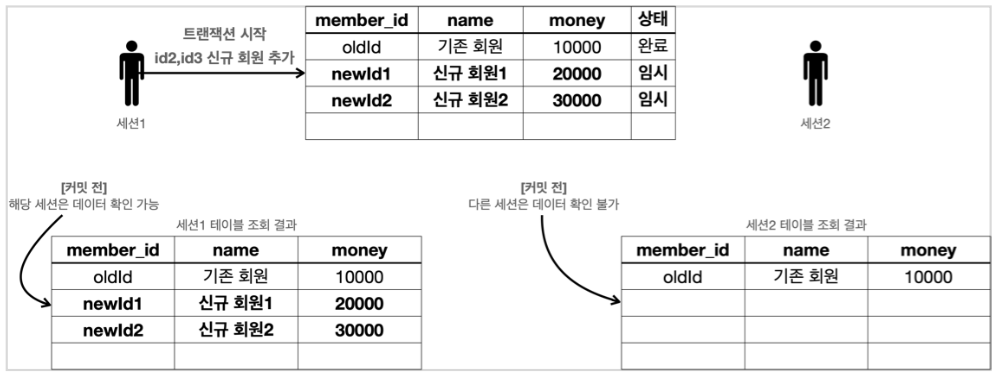

# 트랜잭션 사용법

* 데이터 변경 쿼리를 실행하고 데이터베이스에 그 결과를 반영하려면 커밋 명령어인 commit을 호출하고, 결과를 반영하고 싶지 않으면 롤백 명령어인 rollback을 호출하면 된다.

* 커밋을 호출하기 전까지는 임시로 데이터를 저장 하는 것이다. 따라서 해당 트랜잭션을 시작한 세션(사용자)에게만 데이터가 보이고 다른 세션에게는 변경 데이터가 보이지 않는다.
* 등록, 수정, 삭제 모두 같은 원리로 동작한다. 즉, **변경**이라 부르면 된다.

**기본 DB에 신규 데이터 추가** 

* 세션1은 트랜잭션을 시작하고, 신규회원1, 2를 DB에 추가함. 커밋은 하지 않은 상태

* 새로 추가한 데이터들은 임시 상태로 저장된다.

* 세션1은 select 쿼리를 통해 데이터를 조회할 수 있다.

* 세션2는 select 쿼리를 통해 추가된 데이터를 조회할 수 없다. 세션1에서 커밋을 하지 않았기 때문

  **커밋하지 않은 데이터를 다른 세션에서 조회할 수 있으면?**

* 세션2에서 세션1의 임시 데이터를 조회할 수 있다면, 임시 데이터인데도 어떤 로직을 수행할 수 있다.

* 어떤 로직을 수행하고 세션1에서 롤백을 하게되면 그 데이터는 사라지게 된다.

* 즉, 데이터 정합성에 큰 문제가 발생한다.

  * 보통은 사용되지 않지만... Isolation Level중 가장 낮은 단계 READ UNCOMMITED(커밋되지 않은 읽기) 상태로 조회할 수 있긴 하다.

**세션1 commit을 한다면**

* 임시 데이터가 완료상태로 변경되면서 다른 세션에서도 신규 회원들을 확인할 수 있다.

**세션1 rollback을 한다면**

* 세션1이 데이터베이스에 반영한 모든 데이터가 처음 상태로 복구된다.
* 수정하거나 삭제한 데이터도 rollback을 호출하면 모두 트랜잭션을 시작하기 직전의 상태로 복구된다.

**자동커밋**

자동 커밋으로 설정하면 각각의 쿼리 실행 직후에 자동으로 커밋을 호출한다. 실행할 때 마다 자동으로 커밋이 되어버리기 때문에 우리가 원하는 트랜잭션 기능을 제대로 사용할 수 없다.

~~~sql
set autocommit true; //자동 커밋 모드 설정
insert into member(member_id, money) values ('data1', 10000); //자동커밋
~~~

**수동커밋**

~~~sql
set autocommit false; //수동 커밋 모드 설정
insert into member(member_id, money) valse ('data2', 10000); //수동커밋
commit; //수동 커밋
~~~

보통 자동 커밋 모드가 기본으로 설정된 경우가 많기 때문에, 수동 커밋 모드로 설정하는 것을 트랜잭션을 시작한다고 표현할 수 있다.
수동 커밋 설정을 하면 꼭 commit, rollback을 호출해야한다.
호출을 하지 않게되면, DB에 설정되어 있는 timeout이 되면 자동적으로 rollback이 된다.

## 계좌이체 예제

**기본 데이터 입력**

~~~sql
set autocommit false;
insert into member(member_id, money) values ('memberA', 10000);
insert into member(member_id, money) values ('memberB', 10000);
commit
~~~

**계좌이체 실행 - 성공**

~~~sql
update member set money=10000 - 2000 where member_id = 'memberA';
update member set money=10000 + 2000 where member_id = 'memberB';
~~~

이 상태에서는 두 작업 잘 완수하였으므로 commit을 하면된다.

**계좌이체 실행 - 실패**

~~~sql
update member set money=10000 - 2000 where member_id = 'memberA';
update member set money=10000 + 2000 wher member_id = 'memberB'; //쿼리 예외 발생
~~~

이 상태에서는 한 작업은 성공하고 한 작업은 실패했다. 이 상황에서는 rollback을 해야한다,

**정리**

트랜잭션의 특징 중 Atomic 원자성이 있다. 트랜잭션 내에서 실행한 작업들은 마치 하나의 작업인 것처럼 모두 성공하거나 실패해야 한다. 위 처럼 한 작업이라도 실패했다면 rollback으로 모든 작업을 되돌리면 되고, 모든 작업이 성공했다면 commit으로 DB에 입력하면 된다.

그래서 수동 커밋 모드를 사용해서 수동으로 커밋과 롤백을 할 수 있도록 설정해야 한다.