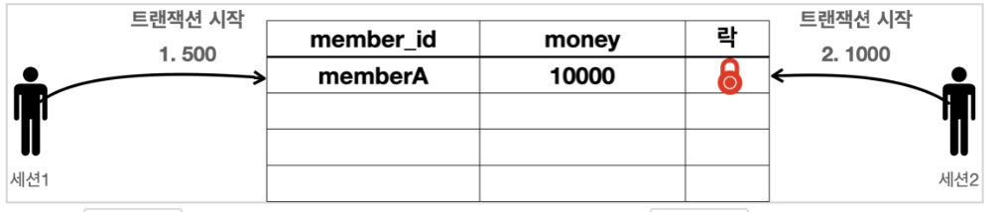
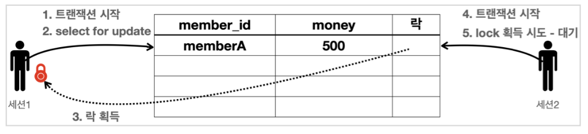

# DB 락

세션1이 트랜잭션을 시작하고 데이터를 수정하는 동안 아직 커밋을 수행하지 않았는데 세션2에서 동시에 같은 데이터를 수정하게 되면 여러가지 문제가 발생한다.
트랜잭션의 원자성이 깨지는 것이다. 여기에 더해서 세션1이 롤백을 하게 되면 세션2는 잘못된 데이터를 수정하는 문제가 발생한다.

이런 문제를 방지하려면, 세션이 트랜잭션을 시작하고 데이터를 수정하는 동안에는 커밋이나 롤백 전까지 다른 세션에서 해당 데이터를 수정할 수 없게 막아야 한다.

**락0 **

* 세션1에서 memberA 금액을 500으로 변경하고 싶고, 세션2는 금액을 1000으로 변경하고 싶다.
* 이런 문제를 해결하기 위해 Lock이라는 개념을 제공한다.

**락1**

* 세션1은 memberA에 대해 트랜잭션을 시작한다.
* 세션1은 memberA의 money를 500으로 변경을 하려한다. 
  * 이 때, 세션1은 해당 로우의 락을 획득한다.
  * 락을 획득했으므로 해당 로우의 update sql을 수행한다.

**락2**

* 세션2는 memberA에 대해 트랜잭션을 시작한다.
* 세션2는 해당 로우의 락이 없기 때문에 락을 획득해야 한다.
  그러나 락이 없으므로 락이 돌아올 때 까지 대기한다.
  * 락을 획득하고 나서, 무한정 대기하는 것이 아닌, 락 대기 시간을 넘어가면 락 타임아웃 오류가 발생한다.

**락3**

* 세션1이 커밋을 수행한다. 커밋으로 트랜잭션이 종료되었으므로 락도 반납한다.

**락4**

* 락을 획득하기 위해 대기하던 세션2가 락을 획득한다.
* 세션2는 update sql을 수행한다.
* 커밋을 수행하면 트랜잭션이 종료되었으므로 락을 반납한다.

## DB 락 예제

**세션1**

~~~sql
set autocommit = false;
update member set money = 500 where member_id = 'memberA';
~~~

* 현재 memberA를 수정하고 commit 아직 안한 상태
* 락을 아직 가지고 있는 상태

**세션2**

~~~sql
set lock_timeout 60000;
set autocommit = false;
update member set money = 1000 where member_id = 'memberA';
~~~

* 현재 memberA를 수정하기 위해 세션2가 트랜잭션 시작하는 순간
* 해당 'memberA'의 로우의 락은 세션1이 가지고 있기 때문에 60초 동안 기다림 (lock timeout 설정)

## DB 락 - 조회 

**일반적인 조회는 락을 사용하지 않는다**

* 보통 데이터를 조회할 때는 락을 획득하지 않아도 조회는 할 수 있다.

**조회와 락**

* 데이터를 조회할 때도 락을 획득하고 싶을 때가 있다. 이럴 때는 'select for update' 구문을 사용하면 된다.
* 이렇게 하면 락을 가져가버리기 때문에 다른 세션에서 데이터를 변경할 수 없다.

**조회 시점에 락이 필요한 경우는 언제?**

* 트랜잭션 종료시점까지 해당 데이터를 다른 곳에서 변경하지 못하도록 강제로 막아야 할 때 사용한다.
* 예를들어 애플리케이션 로직에서 데이터의 정보를 이용해서 어떤 계산을 수행하려 할 때, 계산이 완료될 때 까지 데이터 방해가 없도록 하려하면 조회할 때 락을 획득하면 된다.

**세션1**

~~~sql
set autocommit false;
select * from member where member_id = 'memberA' for update
~~~

**세션2**

~~~sql
set autocommit false;
update member set money = 1000 where member_id = 'memberA';
~~~

세션1에서 조회하면서 for update를 적용해서 락을 가져갔기 때문에 세션1 트랜잭션 종료를 기다린다.

