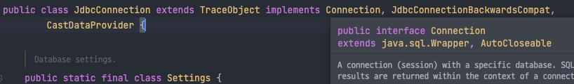
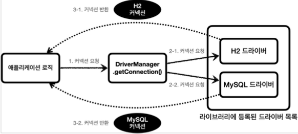

# H2 데이터베이스와 애플리케이션 연결

ConnectionConst

~~~java
public abstract class ConnectionCost {
    public static final String URL = "jdbc:h2:tcp://localhost/~/test";
    public static final String USERNAME = "sa";
    public static final String PASSWORD = "";
}
~~~

H2 데이터베이스 접속에 필요한 URL과 사용자명, 비밀번호를 상수화

DBConnectionUtill

~~~java
@Slf4j
public class DBConnectionUtil {
    public static Connection getConnection() {
        try {
            Connection connection = DriverManager.getConnection(URL, USERNAME, PASSWORD);
            log.info("get connection={}, class={}", connection, connection.getClass());
            return connection;
        } catch (SQLException e) {
            throw new IllegalStateException(e);
        }
    }
}
~~~

데이터베이스 연결을 위해 JDBC가 제공하는 `DriverManager.getConnection()`를 사용
h2 라이브러리에 있는 데이터베이스 드라이버를 찾아서 해당 드라이버가 제공하는 커넥션을 반환해준다.

실행결과

~~~
hello.jdbc.connection.DBConnectionUtil - get connection=conn0: url=jdbc:h2:tcp://localhost/~/test user=SA, class=class org.h2.jdbc.JdbcConnection
~~~

실행결과를 보면 `class=class org.h2.jdbc.JdbcConnection` 이 부분을 확인할 수 있는데, 이것이 바로 H2 데이터베이스 드라이버가 제공하는 H2 전용 커넥션이다. 물론 이 커넥션은 JDBC 표준 커넥션 인터페이스인 `java.sql.Connection`인터페이스를 구현하고 있다.

## DriverManager 커넥션 요청 흐름

JDBC가 제공하는 DriverManager는 라이브러리에 등록된 DB드라이버들을 관리하고, 커넥션을 획득하는 기능을 제공한다.

1. 애플리케이션 로직에서 커넥션이 필요하면 `DriverManager.getConnection()`을 호출한다.
2. DriverManager는 라이브러리에 등록된 드라이버 목록을 자동으로 인식한다.
   이 드라이버들에게 순서대로 다음 정보를 넘겨서 커네션을 획득할 수 있는지 확인한다.
   * URL, USERNAME, PASSWORD 등 접속에 필요한 정보
   * 각각의 드라이버는 URL 정보를 체크해서 본인이 처리할 수 있는 요청인지 확인한다. 
     예를들어 URL이 jdbc:h2로 시작하면 이것은 h2 데이터베이스에 접근하기 위한 규칙이기 때문에 H2 드라이버는 실제 데이터베이스에 연결해서 커넥션을 획득하고 이 커넥션을 클라이언트에 반환한다.
     반면에 jdbc:h2로 시작했는데, MySQL 드라이버가 먼저 실행되면 이 경우 본인이 처리할 수 없다는 결과를 반환하게 되고, 다음 드라이버에게 순서가 넘어간다.
3. 이렇게 찾은 커넥션 구현체가 클라이언트에게 반환된다. 